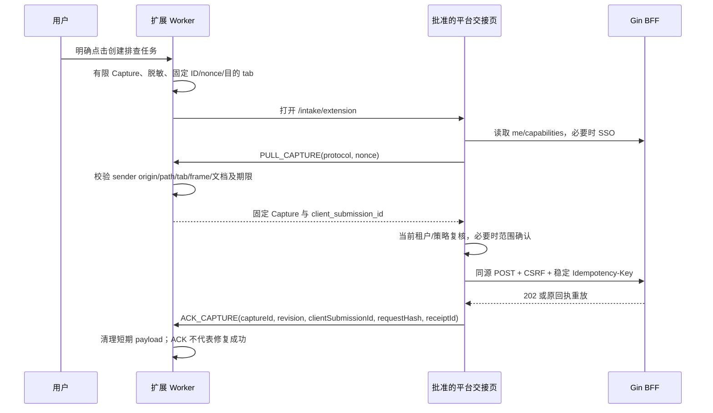

# AI DevOps 平台前端详细设计（匹配主方案 v1.7）

> 企业 Web 控制台与浏览器扩展的完整设计；首发严格限定 L2，后续能力按主方案单一路线装配。

| 文档属性 | 内容 |
| --- | --- |
| 前端设计版本 | **FE-1.3**，匹配主方案 **v1.7**；事故复盘与防复发知识整合 |
| 状态 | 详细设计与待冻结合同；不是已实现或已联调的系统 |
| 修订日期 | 2026-09-16 |
| 范围权威 | 主 v1.7 第 3、19.8/19.9、31 章；L0～L7 与 NOW-01～08 保持唯一 |
| L2浏览器合同 | FE-L2-0.1 / web-l2-v1 / snapshot-sse-v1，原文件不改 |
| 技术基线 | React、TypeScript、Vite、React Router Data Mode、Ant Design、TanStack Query；同源Gin BFF |
| 默认运行档案 | 单API、PostgreSQL、db_snapshot，SSE可关闭并回退有界REST读取 |
| 当前交付边界 | L2仅SSO、GitHub单条Review摘要、一个企业通知、外部操作和最小Web |
| 后续产品边界 | L3 repair/scan 独立；L4 告警；L5 导入；L6 扩展；L7 选定复盘知识增量或其他单项 |
| 本次施工入口 | NOW-01 的 §3.2 build 注册表；NOW-08 先完成 §28.7 的同一 OpenAPI commit + 生成 client |

本版直接修订 FE-1.2，将已并入主 v1.7 的事故复盘、文档发布和知识使用交互整合到既有页面、共享组件、合同与验收中。**不是再附一份独立 PM 产品说明**；历史 PM-0.1 仅作来源，当前领域语义以 [主方案 v1.7](ai-devops-platform-design-v1.7.md) 为准。原主 v1.6、FE-1.2、FE-L2-0.1、L2 注册表和模板文件均不改写。

**首发仍是原 L2 子集：** 五项对象动作（rerun、retry-publication、reconcile、retry-request、cancel）及退出；组织入口绑定单租户；无 `X-Tenant-ID` 必做改造，无创建 Review/测试评论/配置写入、复盘菜单或知识检索。§3.2 L2 build 表与 §28.7 NOW-08 门禁保持原样，不因本文件新增章节而增加施工范围。

**复盘只在 L7 选定增量启用：** 既有 PG11 Incident 增加复盘 Tab，PG13 增加文档发布 Kind，PG14/PG15 展示实际知识使用清单，PG17 复用外部效果。不新增一级知识门户或 PG 编号；各子区域须进入该 build 的显式注册清单，并先完成 D17 与实际使用的原 D 子集的同一 OpenAPI/client/后端实装门禁。没有合同/实现就不显示动作，不用假 Descriptor。

**B02 不变：** `web-l2-v1`、`snapshot-sse-v1` 的三种 event、capabilities 样例、六项动作与会话模型不被悄悄扩展。D17 是后续独立 Schema 子合同；若改变 B02 既有语义，必须按原规则升版并双方签署。没有新 FE-L2-0.2、L8、NOW-09 或平行路线。

文档继续保留 36 个主章节、31 个 PG 身份；原 D01～16 和 FE-AC-001～160 保留，新增 **D17、FE-AC-161～180**。第 19.7～19.14、21.7、28.8 是新增复盘交互主入口；其余章节同步规定状态、构建、安全、证据与验收边界。

## 目录

1. [文档基线、首发范围与约束](#fe01)
2. [用户角色、权限与关键旅程](#fe02)
3. [信息架构、路由与模块装配](#fe03)
4. [视觉规范、布局与响应式](#fe04)
5. [技术栈与前端工程边界](#fe05)
6. [启动、SSO 与租户会话](#fe06)
7. [数据契约、缓存与状态归属](#fe07)
8. [请求、幂等与并发交互](#fe08)
9. [实时同步分档：L2 快照与 L7 HA Feed](#fe09)
10. [通用状态、反馈与交互组件](#fe10)
11. [工作台与分切片待办](#fe11)
12. [项目、仓库与服务目录](#fe12)
13. [L2 PR Review 工作台与后续行级增强](#fe13)
14. [\[L3 扫描准入后\] 定时扫描计划与扫描报告](#fe14)
15. [\[L3 自动 Issue 准入后\] 改进 Issue 与分支负责人](#fe15)
16. [\[L5\] 观测问题导入与一键任务](#fe16)
17. [\[L6\] 浏览器扩展详细设计](#fe17)
18. [\[L5\] 人工报告与来源映射](#fe18)
19. [\[L4；复盘 L7\] Incident、诊断、证据与复盘](#fe19)
20. [\[L2 有界报告；完整阅读器 L3+\] 证据阅读器与代码差异](#fe20)
21. [\[L3 repair\] 统一审批与授权变化](#fe21)
22. [\[L3 单 CLI；其他 L7\] Agent 目录与运行详情](#fe22)
23. [\[L3/L4/L7 分档\] PR 评审、部署与恢复闭环](#fe23)
24. [通用外部操作中心](#fe24)
25. [\[L2 单通道只读；其他 L7\] 通知渠道、订阅与投递](#fe25)
26. [\[L2 只读设置；管理写入后续\] 身份、策略、预算与插件设置](#fe26)
27. [\[已装配范围只读；管理后续\] 模块生命周期与系统运维](#fe27)
28. [API 对照、分切片合同与联调清单](#fe28)
29. [核心 TypeScript 契约与组件 API](#fe29)
30. [安全、隐私与内容处理](#fe30)
31. [可访问性、国际化与性能](#fe31)
32. [测试矩阵与验收用例](#fe32)
33. [构建、发布、私有化与兼容](#fe33)
34. [依附主路线的交付映射与责任](#fe34)
35. [需求追踪与前端 ADR](#fe35)
36. [基线来源、变更校验与未完成项](#fe36)

---

<a id="fe01"></a>
## 1. 文档基线、首发范围与约束

### 1.1 来源与权威边界

本文 FE-1.3 的业务基线是主 v1.7，视觉/工程与既有验收来源是 FE-1.2；PM-0.1 的功能已在主文档正式设计化，本文件不再允许从独立 PM 补充中另选一套 owner、发布 API 或路线。来源摘要见第 36 章。

| 标记 | 权威与用途 | 冲突处理 |
| --- | --- | --- |
| B01 | 主 v1.7：范围、领域事实、复盘 §18.8～18.19、API §24.8、唯一 L0～L7 | 前端不能批准根因、改资格或产生私有对账 |
| B02 | FE-L2-0.1：原 web-l2-v1、三种 snapshot SSE 和 L2 最小范围 | 本文样例与字段不改；待签 D 子集不得冒充原合同 |
| B03 | FE-1.0：历史 PG/D/FE-AC 身份来源 | 不使用其全量首发/默认 durable Feed 路线 |
| B04 | FE-1.2：本次直接前端修订输入 | L2 注册与动作不扩大；原 160 条验收逐字保留 |
| B05 | PM-0.1：已整合到主设计的功能来源 | 不再是平行的当前 API、状态或排期权威 |
| B06 | postmortem-template.md：待填模板 | draft/not_admitted，不是实际事故或发布凭证 |
| F / D / T | 本文设计、待冻结合同、待执行验收 | 区分设计与实装；不伪造合同签署、后端能力或测试通过 |

文档版本、HTTP `/v1`、浏览器协议、各领域/扩展 Schema、知识文档版本与 release-scope 分别管理。B02 仍保留 v1.5 历史表头，主 v1.6 和 v1.7 均继续复用。D17 的新字段不能混入 B02 示例或变成 L2 必填；部署支持复盘不代表浏览器能默认处理未知 Kind。原 L2 注册表保留 v1.6/FE-1.2 来源摘要，属于同一历史草案；实际 NOW-01/NOW-08 采用新主基线时更新同一工程清单的来源与签署记录，不增加页面/动作、不创建第二张有效清单。

### 1.2 L2 首发与完整蓝图的区别

**L2 仅交付：一个企业 OIDC、GitHub PR Review 的一条讨论区摘要、一个企业通知通道、统一外部操作视图和最小 Web。** 单 API/单 Worker，PostgreSQL 默认；无 scan/repair/incident/intake/扩展/Feed/多 Provider。未实现目录不得以灰卡、禁用下拉项或“即将上线”链接进入产品界面。[B01：§1.2、§24.5.1；B02：§1]

| 能力 | L2 实际页面/动作 | 后续首次可开放 |
| --- | --- | --- |
| 身份、项目、GitHub | 单组织入口绑定单租户会话、SSO、授权项目/仓库及只读配置状态 | 多租户选择/管理写入及其他 Provider 须后续 scope + D02/D03/D09 准入 |
| Review | 固定 SHA、覆盖、Findings、**单条 `scm.review.summary`**、重新审查/申请回写/取消 | 行级及 GitHub Review 容器 L7；只读源码定位不等于发布行级评论 |
| 通知 | 一个实际通道的状态和投递 | L7 逐项；WhatsApp 单独合规增量 |
| 外部操作 | 已启用类型的 Operation、Attempt、查证与重试申请 | 各后续域仍复用一套组件 |
| repair | 不装配 | L3 第一工作包：长等待、控制台同意、一个 CLI、fixture 修复；不依赖扫描，不新增任意手工任务产品 |
| scan | 不装配；有权 scope 摘要可说明 DEFERRED | L3 第二工作包：REPORT_ONLY 仅报告；GO 才自动 Issue；不由 L3 字样自动开放 |
| 告警/恢复 | 不装配 | L4 一个后端/告警，缺少部署证据时调查工作台；自动恢复计划 L7 |
| 复盘/知识 | L2 不安装、不建 Tab、不调用接口 | L7 选定增量，PG11/13/14/15/17 的受控子区域；依赖 Incident/共享发布而非 HA |
| Intake / 扩展 | 不注册路由、不预加载解析器、不探测源平台 | L5 URL/JSON 导入；L6 扩展渐进增强；无需一次具备五平台 DOM 捕获 |
| 实时 | REST 权威快照 + 可选三种 SSE 提示，**不使用持久游标** | L7 HA 才使用 durable Feed，多副本准入不要求 NATS |
| 管理配置 | 嵌入默认值及管理员已登记覆盖的**只读**来源/有效值；无保存/测试/轮换按钮 | 管理写入另经 D03/D09 与 scope；完整继承树/插件不进 L2 |

详细章节描述的是**启用该功能时的完整交互**，不是全部前端同时开工的清单。章节门槛、页面注册表、API 缺口和验收映射必须同时满足；里程碑号本身不是能力证明。

### 1.3 不可破坏的前端约束

| 约束 | 强制行为 |
| --- | --- |
| 单一事实源 | 只有服务端权威快照更新业务；Mutation/SSE/退出码不决定成功 |
| 类型与权限不同 | 浏览器 SessionView 不等于后端 AuthContext；客户端不构造 roles/grant 给写接口授权 |
| 无乐观高风险结果 | 批准、取消、重试、关闭、发布只显示“请求已受理”，随后读权威状态 |
| 两种未知分开 | HTTP `request_unconfirmed` 与账本 `unknown` 分类型；不能盲目换键或自动再发 |
| 固定输入 | SHA、证据版本、绝对时间、请求正文、ETag/审批摘要都不能在重试时偷偷更新 |
| 当前权限优先 | 撤权清理对应字段/对象/缓存/Blob；拒绝旧上下文的迟到返回 |
| 已安装不等于可执行 | release 范围、模块装配、功能模式、后端动作权和当前对象版本共同约束 |
| 修复只实现一次 | Case/Incident 提供 source 与 closure policy；共同调用 repair 的审批/修订/PRLink UI |
| 模块独立 | L2 不依赖 repair/scan；repair 不依赖 scan/Case；scan reporting 不依赖 repair；Intake 不反向进入核心 |
| 无第二张路线图 | 本文第 34 章只映射主文档 Lx/NOW；D/PG/FE-AC 不是新阶段 |

### 1.4 页面设计完成标准

每页注明首次切片、进入权限、API/DTO、字段与默认值、排序/分页、主动作、失败/未知/过期/部分/缺权、资源回收、键盘行为和关联验收。页面有设计不代表后端接口已部署；Mock 只验证交互，不能当联调结果。源文档 v1.6 的 186 项 AC 不与 FE-AC 混编号，历史 FE-AC-001～140 保留场景身份，新增场景从 141 开始。

<a id="fe02"></a>
## 2. 用户角色、权限与关键旅程

### 2.1 角色与资源关系

沿用 Tenant Admin、Project Maintainer、Developer、SRE/Incident Responder、Auditor/Viewer；“分支创建者/指定负责人”“任务提交人”“审批人”是资源关系，不是绕过 RBAC 的额外超级角色。Service Identity 不进入交互式控制台。以下为完整角色旅程；L2 只开放其 Review/操作/单通道/基础身份部分，审批从 L3、观测从 L4/L5 开始。[B01：§3、§4]

| 使用者 | 默认工作区 | 主要动作 | 不能据此推断的权限 |
| --- | --- | --- | --- |
| Developer | 我的 Review、关联 Issue、我的报告 | 阅读发现、提交线索、处理获授权审批 | 不能因自己提交报告而获得生产日志或批准修复权限 |
| Maintainer | 仓库、扫描计划、改进问题 | 设置计划、确认负责人、评审补丁 | 不冒充创建者签署同意 |
| SRE | Incident、证据、恢复验证 | 分诊、核实版本、授权调查/修复、记录处置 | 无默认生产写权限 |
| Tenant Admin | 集成、身份、模块、预算 | 管理租户配置、连接与成员 | 管理配置不自动意味着可读取所有敏感证据 |
| Auditor/Viewer | 时间线与审计 | 查看授权历史与证据 | 不提供重试、批准、重开或导出未授权内容的入口 |

### 2.2 四层交互权限

导航入口、页面读取、字段读取、资源动作分别判断。采用服务端返回的模块能力、对象级 `allowed_actions` 及字段可见性描述；字段名称与 Schema 见 D02/D03。

**行为规则：** 用户永远不可能获准的管理入口隐藏；有读权限但当前状态不允许的动作显示禁用及原因；无权查看的对象不展示名称/数量/存在提示；权限尚未加载时先显示骨架屏，不能短暂出现管理员按钮。前端判断仅用于 UX，所有请求仍由后端重新鉴权。

禁止以 `role === 'admin'` 直接放行全部动作。后端拒绝优先于本地能力缓存；普通用户不展示“强制重试 unknown”之类并不存在的越权逃生按钮。

### 2.3 关键用户旅程与退出条件

| 旅程 | 起点 → 关键过程 → 可验证终点 |
| --- | --- |
| Review | PR 链接 → 快照/覆盖/发现 → 对应评论的操作回执；不是“AI 通过即合并” |
| 扫描改进 | 新建计划 → 分支预览 → Scan → Issue/负责人 → 明确同意 → PR 合并核验 → Issue 关闭证据 |
| 人工观测 | 扩展/粘贴 → 脱敏与固定窗口 → 受理回执 → Report/Incident → 审批与修复 → 部署恢复核验 |
| 自动告警 | Incident → 证据/版本/诊断 → 所选 Agent → 测试/PR → 独立恢复状态 |
| 异常运维 | 业务页“结果未知” → 同一 ExternalOperation 详情 → 只读查证/有门禁的重试申请 → 权威回执 |
| 权限或模块变化 | 页面正在操作 → 撤权/停用通知 → 冻结不再合法的动作 → 保留合法历史/安全取消 |
| 事故复盘（L7） | 严重 episode → 固定事实/原因/效果 → 内容评审 → 脱敏文档批准 → PR/文件核验 → 后续任务知识清单/独立回归 |

复盘作者、内容评审者、向仓库披露的批准人、SCM 合并者和后续知识使用者是资源关系，可以同人但须分别具备权限。获准使用 repository-safe 文档的人不必可读内部事故；前端只展示获准导出内容，不通过关联链接补取受限 Incident。

### 2.4 跨角色交接

通知链接落到稳定资源详情，而不是一个点击即生效的 API。未登录先 SSO；登录后不匹配租户/权限时不给出目标名称。审批人变更、Agent 更换或输入版本变化时，旧页面显示“此请求已不再适用”，提供读取新请求的入口；不复制旧决定到新请求。

<a id="fe03"></a>
## 3. 信息架构、路由与模块装配

### 3.1 L2 唯一导航

```text
工作台  /
代码审查  /reviews
项目与仓库  /projects、/repositories
外部操作  /operations
通知  /notifications
基础设置  /settings
账户菜单：当前身份、当前授权租户、退出
```

登录为 `/login`。根路径采用 B02 白名单，不再使用 FE-1.0 的 `/app/t/:tenantId/overview` 作为默认路由，不保留两个可写入口。部署在子路径时统一加受信 `app_base`，业务相对路由不变。`/operations` 是前端名称，后端仍为 `/api/v1/external-operations`。后续模块也使用相同根布局，避免以后再次改所有深链。[B02：§1]

顶部只有当前租户、当前页允许的项目筛选、状态新鲜度和账户菜单；无全局语义搜索 API 时仅提供当前列表筛选或安全 ID 定位。L2 不显示空的审批、Agent、扫描或故障卡片；不是以占位符提醒用户购买完整平台。

### 3.2 NOW-01 的唯一 L2 build 页面注册表

**本表是 NOW-01 必须逐行确认的施工清单，不是自动从完整蓝图生成的菜单。** 沿用 PG01～PG31 的规格身份：`in_build=true` 仅表示本次计划编译的路由或嵌入子集，**不表示已实现、已联调或获准发布**；NOW-08 合同门禁未完成时只允许隔离组件/fixture 开发。普通生产 build 不得夹带测试 Mock。

| Page ID | 进本 L2 build | 形态/唯一挂载位置 | 必须冻结的 D 子集 | 明确施工边界 |
| --- | --- | --- | --- | --- |
| PG01 | 是 | /login；/session-expired | D02、D16 | SSO 与会话外壳；不加载任何业务页 |
| PG02 | 是 | / | D02、D04、D10、D16 | 只组合 Review/操作/通知的授权列表，无跨域聚合服务 |
| PG03 | 否 | — | —（不作为 L2 前置） | L3+ 本人待办；D05 未进首发 |
| PG04 | 是 | /reviews；/reviews/:id | D01、D02、D03、D04、D16 | 列表/详情、单条摘要；仅 rerun/retry-publication/cancel，关联查证复用 PG17 |
| PG05 | 否 | — | —（不作为 L2 前置） | L3 scan.reporting；无 scan-schedules 路由/代码/请求 |
| PG06 | 否 | — | —（不作为 L2 前置） | L3 scan.reporting；无扫描报告模块 |
| PG07 | 否 | — | —（不作为 L2 前置） | L3 scan.auto_issues；无 Case 模块 |
| PG08 | 否 | — | —（不作为 L2 前置） | L5 人工导入 |
| PG09 | 否 | — | —（不作为 L2 前置） | L5 ObservationReport |
| PG10 | 否 | — | —（不作为 L2 前置） | L5 原生交接/L6 扩展；仅核心兜底处理未交付深链 |
| PG11 | 否 | — | —（不作为 L2 前置） | L4 Incident |
| PG12 | 否 | — | —（不作为 L2 前置） | L4 人工恢复/L7 自动验证 |
| PG13 | 否 | — | —（不作为 L2 前置） | L3 repair 审批；无待办/批准按钮 |
| PG14 | 否 | — | —（不作为 L2 前置） | L3 repair 共享修复详情 |
| PG15 | 否 | — | —（不作为 L2 前置） | L3 repair AgentRun |
| PG16 | 否 | — | —（不作为 L2 前置） | L3 独立工作流页；L2 只在 PG04/17 读当前短步骤 |
| PG17 | 是 | /operations；/operations/:id | D01、D02、D03、D04、D16 | 统一操作/Attempt/证据；仅查证和安全重试申请 |
| PG18 | 是 | /notifications | D02、D04、D10、D16 | 单通道列表；详情在本页展开已有 DTO，独立 /:id 不默认注册 |
| PG19 | 是 | /projects | D02、D04、D16 | 已授权列表/行内摘要；无新建、保存、独立详情 API 假设 |
| PG20 | 是 | /repositories | D02、D04、D09、D16 | 已登记 GitHub 列表/行内只读状态；无行级开关、登记/测试写入 |
| PG21 | 否 | — | —（不作为 L2 前置） | L4 服务/部署目录 |
| PG22 | 是 | /settings | D02、D09、D16 | GitHub/IdP/唯一通知状态及 scope 摘要；无通用配置编辑器 |
| PG23 | 否 | — | —（不作为 L2 前置） | L3 单 CLI Profile；pending 产品始终不注册 |
| PG24 | 否 | — | —（不作为 L2 前置） | L5 来源映射 |
| PG25 | 是 | PG22 的单通道状态 Tab | D02、D09、D10、D16 | 只读；不注册 /settings/notifications，不创建通道/测试消息 |
| PG26 | 是 | 账户菜单 + PG22 的 OIDC 状态 | D02、D09、D16 | 当前身份/租户和退出；不注册成员、绑定或 IdP 管理页 |
| PG27 | 否 | — | —（不作为 L2 前置） | 策略/预算管理后续；L2 有效限制仅作为 PG22 只读字段 |
| PG28 | 否 | — | —（不作为 L2 前置） | 模块安装/定义管理后续；L2 无 Wait/Feed/迁移管理入口 |
| PG29 | 否 | — | —（不作为 L2 前置） | L7 插件 |
| PG30 | 是 | PG04/PG17 的授权历史区域 | D02、D04、D16 | 仅已有资源 DTO/明细的历史；不注册 /audit 或 /system/health 聚合 |
| PG31 | 是 | /not-found；/access-unavailable；/upgrade-required | D16 | 静态安全兜底；不探测未交付模块 |

“进 build”与“可执行”是不同阶段：**本表纳入 → 所需合同在同一 commit 冻结并由后端实现 → build 与 Schema/生成 client 一致 → 运行期能力及当前授权通过**。未具备必需读合同的页面不得进入真实联调；未具备动作合同的业务按钮完全不渲染。已冻结且返回 `enabled=false` 的既有动作，才显示禁用原因，不制造假 Descriptor。

D07 是所有当前业务页共用的 kernel 实时/有界轮询依赖，作为全局联调门禁统一冻结，不因表内未逐行重复就可省略；静态安全兜底页不建立流。D01 在 L2 只需确定“已知资源读取 + 允许时原请求重放”的策略，不要求新回执服务；D09/D10 仅覆盖已登记配置/单通道必要读取，不包含设置写入。公共导航与客户端不会从本表外的章节推导菜单。新页面/新动作须修改同一注册表及 scope，不能通过加一个路由文件自动上线。

同步的机器可读交付件为 `frontend-build-L2-registry.yaml`，建议纳入工程 `architecture/`。它逐行记录上述 Page ID、`in_build`、挂载方式与 D 子集，并保存 B01/B02 摘要、当前 OpenAPI commit/签署证据槽位。**本次提供待确认清单，commit/签署仍为空；不是另一份协议、配置服务或路线图。** NOW-01 冻结选择，NOW-08 在同一清单补充合同证据；生产构建以此拒绝未纳入路由、额外 POST、缺失 D 依赖和 Mock 导入。

31 个 PG 是完整规格的索引，本次仅选择其中的 L2 子集；嵌入条目不是额外一级页面。PG05～16、PG21/23/24/27～29 详细规格保留在后续章节，当前不进入 sprint。旧 FE 路径只在实际已有部署且受审映射时兼容，不能建立两个可写入口。

### 3.3 三类独立开关与未知能力

```text
受审前端构建清单（本 build 有哪些页面/控件）
  ∩ 后端 release-scope + installed/enabled + 已交付功能模式
  ∩ 当前 principal/tenant/项目/数据域/对象的读取与动作权限
  → 当前可装配路由、读取字段和动作
```

`installed=true, enabled=false` 不等于历史不可读，历史策略需 D02 的明确字段；未返回此合同不得猜测历史权。`milestone=L3` 不是同时装 repair 和 scan 的指令，GO 决定也不是普通页面的执行许可证。客户端配置中只有固定 route ID，不接收服务器传来的 arbitrary URL 或组件脚本。

| 组合 | 页面结果 | 禁止隐式依赖 |
| --- | --- | --- |
| L2 / 无 repair、scan | 仅首发白名单 | 不请求审批/Agent/Scan/Feed，也不加载它们的 chunk |
| repair 已准入，scan 未安装 | Approval/Remediation/PRLink 共享视图；fixture 来源标“验收样本” | 不查 Case/branch lifecycle，不制造“创建任意修复”产品 |
| scan reporting 已准入，无 repair | 计划/报告、覆盖、只读下载与通知 | 不查审批/Agent/Case，不显示 Issue/修复设置 |
| scan auto_issues 已准入 | 报告、Case 与共享 repair 视图 | 不复制审批、修订、PRLink 状态机 |
| 历史 scan 停用 | 按后端历史读权保留报告/Case；新建禁用 | 不因 feature flag 删除既有 repair 或未知 Operation |

### 3.4 深链、筛选和离开页面

所有资源 ID、Tab 和排序键来自静态 allowlist。source URL、SQL/日志、客户标识、Secret 和批准 challenge 不写 URL/标题/分析日志。L2 租户固定由组织入口与服务端会话绑定，不提供 Query/Header 切租户。未来多租户选择另行冻结 D02，也不能由选择值取得额外权限。未交付路由显示“本发行版不提供此功能”，不探测该模块 API；未授权对象统一不可访问，已知授权删除对象才可解释“已删除”。

表单离开提示“继续编辑/放弃未提交输入”；已有写请求时明确“离开页面不取消服务端操作”。请求未确认不自动重试、换键或返回上一页即取消。重返页面只读安全回执/当前资源；缺正文不得假装能跨刷新重放原输入。

### 3.5 L7 复盘子区域注册，不修改 L2 build 表

下表是选定 `postmortem-knowledge` 增量时原 Page ID 的扩展位置，不是已签署的另一份 L2 registry。该增量开工时将选定行加入**同一工程 build 清单的对应发行 scope**；它不新增 PG32 或独立路线。当前 L2 文件原字节保持不变，以下所有子区域在 L2 均不装配。

| 原 Page ID / 子区域 | 同一 build 的必要依赖 | 读取与动作合同 | L2 |
| --- | --- | --- | --- |
| PG11.postmortem | 已交付 Incident + postmortem.records + 明确读取权 | D17 内容/revision；编辑用 D03/D08 的已签子集 | 排除 |
| PG11.postmortem.export | records+publishing、当前仓库受众权限 | D17 导出包/核验、D03 文档动作、D13 受控 Markdown | 排除 |
| PG13.postmortem_publication | 既有 Approval 框架 + 发布 Kind 注册 + D17 实装 | D03/D17 的第三 Kind，不复用 task_start/patch 表单 | 排除 |
| PG14/PG15.knowledge_use | 现有已交付任务/Agent + 本次知识能力 | D17 只读使用清单；无全库检索/重新执行按钮 | 排除 |
| PG17.documentation | 共享操作页 + 本次操作类型白名单 | D03/D04 既有查证/重试；D17 只增加有权关联 | 不注册文档类型 |
| PG18/PG25.postmortem_events | 已交付通道、本次安全模板/收件权限 | D10/D17 事件语义，不增加第二个消息通道 | 不注册复盘事件 |

建议深链保留在既有 Incident 页面：`/incidents/:id?tab=postmortem&pm=:pmId&revision=:revision`，导出预览可再用白名单 export ID。以上 UI 子路由是 D17 待冻结值，不是已上线 API；正文、源 URL、客户标识和签署令牌不得进入 URL。无 Incident 读权但有导出版读权的任务，从 PG14/PG15 的获准文档 Reader 读取，不强跳 PG11 或泄漏内部 PM 标题。

“模块已安装”不等于 `knowledge eligible`。records-only 只读写内部复盘；publishing 未装不渲染导出按钮；retrieval 未启用不请求使用清单。停用新生成/导出后按历史读权显示，PG17 保留已发操作的未知效果；隐藏 Tab 不能代表撤销 Git 内容。

<a id="fe04"></a>
## 4. 视觉规范、布局与响应式

### 4.1 视觉方向与布局尺寸

采用信息密集但层级清晰的企业操作台；默认浅色，支持深色和跟随系统。色彩只表达语义，不用大面积绿色暗示 AI 可靠性。页面标题、资源身份、版本与主要动作优先于图表装饰。

| Token | 初始设计值 | 使用规则 |
| --- | --- | --- |
| 顶栏高度 | 56 px | 固定顶部；小屏保留租户与菜单 |
| 侧栏宽度 | 展开 224 px / 收起 64 px | 大屏固定，小屏 Drawer |
| 内容边距 | 桌面 24 px / 中屏 16 px / 小屏 12 px | 详情宽屏可铺满；普通设置表单最大 960 px |
| 间距 | 4 / 8 / 12 / 16 / 24 / 32 px | 不在业务页任意新增间距尺度 |
| 字体 | 正文 14/22 px，辅助 12/20 px，H1 24/32 px | 关键审批说明不降为辅助文字 |
| 表单控件高度 | 36 px，触屏主要动作 44 px | 紧凑表格仍保证可达点击区域 |
| 表格行高 | 默认 44 px / 紧凑 36 px | 两行摘要不强行挤入固定高度 |
| 圆角 | 控件 6 px / 卡片 8 px | 避免每个状态嵌套一层卡片 |
| 层级 | sticky 10、dropdown 100、drawer 200、modal 300、toast 400 | 一个 Overlay Manager，避免相互遮挡 |
| 等宽内容 | 系统等宽字体栈，13/20 px | SHA/路径/代码；不要求公网字体加载 |

### 4.2 色彩与状态 Token

建议浅色正文 `#17202A`、次要文字 `#475467`、画布 `#F5F7FA`、内容面 `#FFFFFF`、主操作 `#175CD3`；深色画布 `#101828`、内容面 `#1D2939`、正文 `#F2F4F7`。这些是设计初值，不表示组件全部已通过对比度验收。

状态采用“图标 + 明确文本 + 辅助色”：成功表示指定事实已确认，错误表示明确失败，警告表示风险/等待干预，未知采用问号与琥珀色轮廓，取消/过时采用灰色。`unknown + cancel_requested` 仍保留未知警告，不只显示灰色取消标签。

Token 在唯一主题包维护并映射到 Ant Design ConfigProvider；主题机制沿用其 Design Token 接口，不以覆盖深层 DOM class 为主方案。[F04] 深色差异高亮、图表和禁用按钮分别做可访问性测试。

### 4.3 响应式与任务适配

| 视口 | 导航/布局 | 代码与审批行为 |
| --- | --- | --- |
| ≥1440 px | 完整侧栏；三栏工作台 | 文件树/代码/发现或证据并列 |
| 1024–1439 px | 可收起侧栏；双栏 | 发现/证据放可调宽 Drawer |
| 768–1023 px | 抽屉导航；单栏详情 | Diff 默认 unified，列表减少非关键列 |
| <768 px | 顶部菜单；卡片化列表 | 支持阅读/审批摘要；必须可打开完整 Diff 或可访问文本，不因小屏绕过核验 |

320 CSS px 下主内容不出现页面级横向滚动；代码、表格可在标注的独立容器内横向滚动。宽表不能仅靠缩小字号解决。小屏不展示依赖 hover 的唯一操作；屏幕窄不会赋予“跳过证据即可批准”的快捷方式。

### 4.4 通用详情骨架

```text
[面包屑]                         [刷新状态：10:42:18] [动作菜单]
标题 / 内部 ID / Provider / 项目   [业务状态] [数据完整度] [是否过时]
不可忽略提示：权限变化 / 已取消但效果未知 / 当前不是最新 SHA
概览卡：负责人、输入版本、目标、开始时间、预算/耗时
Tabs：概览 | 证据/变更 | 流程 | 外部操作 | 审计
主内容区                                              关联资源区
底部：分页/加载范围；需要时固定审批操作栏（不得遮住焦点）
```

不在每个区块各放一个“成功”大勾；一页只有一个主操作区，业务状态与提示不因滚动离开而无法辨认。

### 4.5 视觉规范的分档加载

L2 首屏仅打包基础 tokens、表格、状态标签、确认框与安全文本；三栏 Diff、Trace/指标图和复杂设置是按其页面切片加载的后续形态。尺寸/色彩不作为强制加功能理由；组件禁用状态仍须显示原因，未交付模块则不出现组件占位。

<a id="fe05"></a>
## 5. 技术栈与前端工程边界

### 5.1 固定选择

| 领域 | 选择 | 本项目约束 |
| --- | --- | --- |
| 语言与视图 | TypeScript strict + React | 不使用 `any`/类型断言绕过网络响应验证 |
| 构建 | Vite，静态 SPA | Gin 为 BFF；首版不增加 SSR/Node 运行服务。[F01][F02] |
| 路由 | React Router Data Mode | loader 只协调认证/缓存读取，业务写统一 Action Service。[F03] |
| 服务端状态 | TanStack Query | 唯一服务端缓存；无 Redux/Zustand 平行复制业务对象 |
| 本地交互 | React state/reducer/context | 用于展开、选区、表单和提交交互，不运行后端状态机 |
| UI/表单 | Ant Design + 自有语义组件 | 每个表单字段一个状态所有者；不叠加第二套 Form 框架 |
| API 类型 | 从评审后的 OpenAPI/JSON Schema 生成 | 固定生成器和 Schema hash；生成代码不手改 |
| 运行时验证 | 构建期生成 JSON Schema standalone validator | Ajv 可生成独立验证代码；浏览器不动态编译/下载 Schema。[F09] |
| 样式 | Design Token + CSS Modules | 全局样式仅 reset、Token 和基础布局 |
| 代码阅读 | Monaco 按需加载 + 纯文本回退 | 只读 Diff/JSON；不作为首屏依赖，不执行代码 |
| 指标图表 | Apache ECharts 受控封装 | 只传批准数据结构，禁自定义脚本 formatter；配数据表 |
| 测试 | Vitest、Testing Library、MSW、Playwright、axe | 确切版本在实现锁定；扩展使用独立持久化上下文测试。[F13] |
| 包管理 | pnpm workspace + lockfile | 固定 Node/pnpm/依赖版本，CI 使用冻结锁文件 |

版本在实施初始化时选择相互兼容的受维护组合，并锁定镜像/锁文件。本文不把在线文档中的“latest”写成可复现构建条件。Ant Design 的按需 CSS、图表和编辑器在 CSP/离线环境下的实际兼容性列入验收。

### 5.2 与主工程匹配的目录

```text
ai-devops-platform/
├── web/
│   ├── src/
│   │   ├── app/                    # 启动、路由注册、QueryClient、全局边界
│   │   ├── features/
│   │   │   ├── review/             # pages/components/model/public.ts
│   │   │   ├── scan/               # reporting/{plans,reports} 与 auto-issues/{cases,owners}
│   │   │   ├── repair/              # approval/remediation/agent/prlink 的唯一共享实现
│   │   │   ├── incident/           # 不导入 intake
│   │   │   ├── recovery/           # 不导入 intake
│   │   │   ├── external-operations/
│   │   │   ├── notification/
│   │   │   ├── resources/
│   │   │   ├── administration/
│   │   │   └── intake/             # 可选入口/报告/交接/来源映射
│   │   ├── kernel/                 # auth/scope/api/query/realtime/actions
│   │   └── shared/                 # 纯 UI/格式化/不含领域用例
│   ├── tests/{unit,component,contract,e2e,accessibility}/
│   └── vite.config.ts
├── browser-extension/
│   ├── src/{popup,options,worker,capture,adapters,handoff}/
│   ├── manifests/
│   └── tests/{fixtures,protocol,e2e}/
├── frontend-packages/
│   ├── contracts/{core,repair,scan-reporting,scan-issues,incident,intake,feed}/     # 来自主方案 API/Schema 的生成物
│   ├── design-tokens/
│   └── test-fixtures/              # 合成数据，禁止生产日志
├── architecture/frontend-modules.yaml
└── api/{openapi.yaml,schemas/}
```

`app → features/public + kernel + shared`；feature 只能导入自身、kernel、shared、批准的 contracts。跨 feature 的页面拼装由 app 的已批准组合入口完成，公共关联资源使用稳定资源引用和路由解析端口，而非深层组件导入。kernel/shared 不反向导入 feature；扩展不导入 Web app/kernel 或 API Cookie 客户端。

Intake 契约单独入口导出，core contracts 不从根 barrel 转导出 intake；核心构建需能在移除 intake 包时完成。后端的 Gin/GORM 规则继续由主方案的 Go 门禁治理，前端不另建同名业务服务。[B01：§6]

### 5.3 强制工具门禁

ESLint `no-restricted-imports` 约束非法静态导入，dependency-cruiser 检查别名、重导出、循环及跨模块依赖；补充 AST 检查动态 `import()`、直接 `fetch/XMLHttpRequest/WebSocket/EventSource` 的使用位置。两类工具均须用违反规则的 fixture 证明在 CI 真正失败。[F14][F15]

| 门禁 | 必须拒绝的示例 |
| --- | --- |
| 唯一目录归属 | `src/pages/review` 与 `features/review/pages` 双实现 |
| 数据访问边界 | 页面直接请求 GitHub/O2 或绕过 kernel/api |
| 可选模块边界 | Review/Scan、shared barrel 间接 import intake |
| 发布与审批边界 | 单个业务页自建写请求重试器或乐观设置 approved |
| 凭证边界 | feature 使用 localStorage 保存 Token、整个 Query Cache |
| 供应链边界 | 用远程 URL import 插件 UI/Schema/脚本 |

例外记录 owner、理由、允许边、到期时间和复评；禁止 blanket disable 文件夹。路径别名与 package exports 不是安全隔离，需要检测真实依赖图。

### 5.4 repair 与 scan 的双向独立构建

repair 模块只有一套 ApprovalReview、RemediationDetail、PRLinkPanel、RevisionRequest。输入 `SourceSummary`（kind/id/revision/受控标题/可见证据/closure policy），来源渲染通过 app 注册的受限 slot；缺来源权限显示不可访问，不动态 import scan 来补数据。scan.auto-issues 和 incident 的页面经 app 组合共享 repair，不各自实现 `submitAgent` Hook。

scan.reporting 仅依赖 core、已交付仓库/读制品合同。scan.auto-issues 才依赖 scan.reporting 与 repair 的公开组合契约。源码修复不能依赖 ScanRun/Case 为必填；scan reporting 不能因默认 Agent 表单 import 整个 repair。扩展不属于 L2/L3 build 产物。

CI 必须分别构建并检查产物/启动请求：`L2 无 repair/scan`、`L3 repair-only 无 scan`、`L3 scan-report-only 无 repair`、`L3 scan-auto + repair`。未选特性的 lazy import 也不能从共享 barrel 被引入。依赖反例应含 repair→scan 和 reporting→repair，不能只检查 Intake。测试这些档案沿用主方案 PG-G12/AC-129 的前端部分，不新增后端迁移器。

L2 选择固定 React/TS/Vite/Ant Design/TanStack 组合即可；Monaco、ECharts、无损导入 Worker、HA SSE 和扩展依赖不强迫首发安装或运行。运行时 schema validator 来自受审构建输出，schema 默认值不是权限默认放行。[F03][F04][F05]

### 5.5 复盘子模块与共享组件（L7）

唯一新增目录为 `web/src/features/postmortem/`，持有结构化编辑、效果只读展示、导出预览与 D17 ViewModel；纯类型/生成 client 放在独立 contracts/postmortem 入口。app 在已选 build 中将其 public slot 装入 PG11/PG13/PG14/PG15；incident、repair、review、scan、kernel 和 shared 不反向 import postmortem 实现或从根 barrel 强制导出。

Approval 外壳通过受审注册表选择 `PostmortemPublicationPanel`，OperationSummary/PRLinkPanel/MarkdownReader 使用原公共契约，不复制提交 Controller、SSE、retry timer 或 Provider 客户端。记录数为零和模块未安装不是同一状态，未安装不能靠失败 API 请求探测。新增 lint/依赖反例纳入 FE-AC-161/178，构建 L2/repair-only/report-only 时不加载新增 chunk。

<a id="fe06"></a>
## 6. 启动、SSO 与租户会话

### 6.1 L2 启动顺序

```text
静态最小壳 + 受信组织入口/同源非敏感部署配置
 → GET /api/v1/me
 → 未登录：最小 SSO 页面；已登录：读取会话绑定的唯一租户
 → 校验组织入口与会话租户一致；不从 URL/Header 选择其他租户
 → GET /api/v1/capabilities（同源会话，不携带 X-Tenant-ID）
 → 检查本 build 注册表、已冻结合同和当前能力
 → 读取当前页面 REST 快照 → 开启可选 snapshot SSE 或有界轮询
```

不得在身份/合同确认前并行预取仓库、操作或后续模块数据。生产启动必须已有 NOW-08 的同一 OpenAPI/client 证据；没有 D02 时只允许隔离的设计预览，不以猜测的 `/me` 字段接线。capabilities 读取失败或版本不兼容时关闭变更动作，保留安全错误壳；已证实兼容的只读接口可按明确策略使用。

### 6.2 SSO 页面与回调

登录页显示组织入口、可用 Provider 名称、企业帮助链接和会话提示，不展示 issuer Secret、完整租户目录或内部错误堆栈。开始登录调用主方案 `POST /auth/{provider_id}/start`，由服务端建立 state/nonce/PKCE；浏览器只导航至经过协议校验的服务端跳转结果，不自己交换 Token。[B01：§4]

IdP 回调完全由 Gin 处理。前端收到的只是本平台会话；URL 中的 `code/state/error` 不进入日志/埋点。成功后恢复批准的本地路径；不得接受 `returnUrl=https://...`、协议相对 URL 或双重编码跳转。

SSO 错误需区分用户取消、Provider 不可用、账号未准入、状态过期和会话失效。用户取消不反复自动打开 IdP；权限不足不建议换邮箱“试一试”。仅展示受控错误码和 request ID。

### 6.3 L2：组织入口绑定单租户会话

**L2 采用“受信组织入口确定租户 → SSO → 服务端会话绑定该租户”的最小模式。** `/me` 回显实际 principal、绑定租户和会话/授权版本；浏览器不通过 Cookie、`X-Tenant-ID`、路由参数或 Query 改变会话租户。不显示租户切换下拉框。项目筛选只是已授权租户内的读取过滤，不是权限授予。

同一 origin 的标签页复用同一租户会话。退出、重新登录、账号变化或新会话替代旧会话时，所有仍活动的页面应通过会话失效提示/重新 GET 发现变化，立即关闭流、取消待取请求、增加本地 `scope_epoch`、清除 Query Cache/Blob/未提交敏感输入，然后重新 bootstrap。BroadcastChannel 只能传“需要重新核验”的控制提示，不传 Token、CSRF、正文或授权结论；收到提示必须回查服务器。后台标签页恢复可见或 bfcache 返回时先遮盖并核验，不把旧页面缓存当继续访问依据。

L2 SDK 不发 `X-Tenant-ID`；Gin/BFF 不得因用户手工附加该头而切到其他租户。具体拒绝或忽略非合同头的规则由同一 D02/OpenAPI 冻结，任何分支都只使用会话绑定租户。这里不新增 current-tenant Cookie，也不要求改 Cookie/CSRF 模型来完成多标签页切换。

请求缓存仍绑定 `origin + principal + tenant + scope_revision + authz_revision + session_epoch + scope_epoch`，因为同一页面会经历重新认证和撤权；多维缓存隔离不等于已经实现多租户选择。原键、回执与迟到响应不能跨会话/主体复用。

#### 6.3.1 后续 D02 多租户提案，不是 L2 前置

“同一 origin 同一用户在不同标签页选择不同租户”、`X-Tenant-ID`、相关 SSE Header 和选择器全部留在后续明确 scope（默认 L7）的 D02 提案。启用前由后端确认身份/Cookie/CSRF/撤权模型，升级受影响浏览器合同并签署；不得以 FE-AC-003 为由提前实施。该场景身份继续保留，但不作为 postgres-minimal 的退出条件。

### 6.4 过期、退出与再认证

| 事件 | 必须执行的 UI 行为 |
| --- | --- |
| API 401 / 明确会话撤销 | 立即隐藏敏感面板、清缓存/流/对象 URL，打开会话恢复外壳 |
| API 403 / ACL 变化 | 清理对应资源及相关详情缓存；不能继续保留最后一次敏感内容 |
| 主动退出 | POST logout；本地立即清理，即使网络失败也不保留内容 |
| logout 网络失败 | 明确“本地已退出，服务端会话撤销未确认”，提示恢复连接后重试；不宣称全局登出成功 |
| 高风险 step-up | 保存非敏感动作引用，完成最近认证后重新获取对象/能力，再由人提交 |
| 浏览器后退恢复 bfcache | `pageshow` 恢复时先遮罩敏感内容并重新校验会话；缓存头不是唯一防护 |

重新登录不自动重放写请求、同意决定或恢复持久化 Mutation。敏感草稿默认丢弃；非敏感资源定位信息可在短期 sessionStorage 中保存，但不得包含审批正文、日志或 Token。当前权限失效时，服务器仍须禁止任务续写，UI 不能单独保证安全。

### 6.5 AuthContext 与浏览器 SessionView 的边界

B01 §23 的 `AuthContext` 仅由可信后端构造。L2 浏览器只消费 D02 待冻结的最小 SessionView：`principal_id/principal_kind`、会话绑定的 `tenant_id`、不透明 `authz_revision`、不透明 `session_epoch`、服务端时间及明确的 CSRF 获取/更新方式。它不是完整 RBAC/grant 的序列化，不允许客户端把 roles/resource scope/grant 作为写请求身份。L2 没有租户选择头；将来增加选择值也不能提升权限。

**统一候选命名为 `authz_revision`，本地映射为 `authzRevision`。** FE-1.1 使用过的 `authz_version` 不再作为并行 wire 字段；实际名称/空值/失效语义由 NOW-08 同一 OpenAPI 冻结，而不是容忍两个名字并猜优先级。`session_epoch` 仅作失效/缓存绑定标识，不是可使用的会话凭证。CSRF Token 只在会话模块内存使用，不进入通用 Query Cache、持久缓存、日志或遥测，与 IdP Token 分开。

这些字段 **不写入 B02 的 capabilities 样例，也不声称 B02 已定义它们**。必要字段和真实权限响应缺失时不得给 §13/§24 的业务按钮编造 Descriptor；对应 D 合同未实现则阻断接线/发布。服务器恢复旧备份后的会话/challenge 作废仍由后端实现，前端在拒绝后清缓存，不以文档字段代替 DR 验收。

### 6.6 防止短期授权过期后“同版本旧权限”继续显示

授权变化不一定改变资源 state_version。每次 GET 都重新检查 ACL；有权但字段被收窄的同版本响应必须在新的可见性 epoch 下替换视图，不能因业务版本相等而保留旧字段。无法区分时清除该资源后重新读取；正文不得在 API 403/字段撤权后通过 staleTime 继续显示。后台用户重新激活页面先核验身份和能力，再恢复轮询与动作。

<a id="fe07"></a>
## 7. 数据契约、缓存与状态归属

### 7.1 四种状态严格分开

| 状态 | 所有者 | 示例 |
| --- | --- | --- |
| 业务事实 | 后端领域对象 | approved、PR merged、Recovery passed |
| 外部效果事实 | 后端 ExternalOperation | sending、unknown、confirmed |
| 服务端资源缓存 | TanStack Query | 当前已验证快照、updated_at、ETag |
| 交互临时状态 | feature reducer / kernel Action Controller | 编辑中、正在提交、未收到 HTTP 回执、Drawer 展开 |

不存在“本地根据 Timeline 推算 Agent 一定成功”的状态 reducer。临时 `request_unconfirmed` 与服务端 `ExternalOperation.unknown` 是不同类型，前者甚至还不知道后端是否受理。

### 7.2 DTO、ViewModel 和未知状态

网络响应先按固定 Schema 校验，再映射成只含当前 UI 所需信息的 ViewModel。拟定传输 DTO 将 UUID、Provider ID、commit SHA、游标、纳秒时间及 bigint 版本用字符串表示（D02/D04）；基线已有数字版本仅在明确为安全整数时无损规范化，否则拒绝，不自动改后端 Schema。内部 ViewModel 统一使用字符串；epoch 不先经 JS Number 舍入。权限不可见字段不应由服务器发送，前端遮罩不是字段脱敏。

未知 enum 显示“当前前端不识别此状态”，保留可读历史但禁止相应写动作；未知高风险 Schema/version 显示升级要求，不以 `as SomeType` 或默认 `success` 降级。可选展示字段采用已评审的向前兼容策略，不能与严格命令 Schema 混用。

### 7.3 查询键、时效与清理

建议查询键形状：`[origin, principalId, tenantId, scopeRevision, authzRevision, sessionEpoch, resourceKind, resourceId, view, filterKey]`。正文/SQL 不进入缓存键；必要的敏感筛选用已批准的服务器查询 handle。仅存浏览器内存，首版不启用 Query Cache 的 localStorage/IndexedDB 持久化。

| 资源 | 建议初始策略 | 必须例外 |
| --- | --- | --- |
| 活动列表/详情 | staleTime 5 秒，SSE 触发失效；前台轮询兜底 | 到期不等于任务停止 |
| 配置目录 | staleTime 30 秒，保存后定向刷新 | 敏感变更生效由服务器判断 |
| 审批详情 | 打开即读取，提交前强制新核验 | 编辑中的输入快照不被后台刷新静默替换 |
| 证据/固定 SHA 制品 | 按版本只读缓存，离开后短时回收 | 撤权/过期立即清空；不可“不可变所以永不过期” |
| 外部操作 unknown | 短时刷新元数据，不自动执行 reconcile | 只读查证需显式命令或服务端策略 |

GET 仅对临时网络/限流有界重试；401/403/Schema 错误不重试。Mutation 全局 `retry:false`、不持久化、不自动离线排队；TanStack 的自动重试/离线恢复能力需显式约束，不能直接沿用业务无关示例。[F05]

### 7.4 列表一致性

列表统一 cursor 分页、稳定排序，默认 25 条，可选 50/100 但不超过服务器上限。没有 total 时显示“已加载 N 条”，不能以当前页长度冒充总数。排序/筛选变化清空旧 cursor；返回列表恢复同作用域、同筛选的滚动位置。

SSE 仅提示失效；重新读取发现新记录后，不立即插到正在阅读/选择的列表中，显示“有新结果，刷新查看”；既有行的状态可按版本更新，但不能自动换序或丢失焦点。首版批量写操作只允许后端明确支持的安全子集，不做全选所有权限范围对象的客户端循环 POST。

### 7.5 时间与格式

显示用户 IANA 时区及可复制 UTC 原文；绝对时间 Tooltip 展示时区偏移和来源精度。“3 分钟前”仅辅助。服务端提供 `server_time`/日期头用于 UX 倒计时，授权有效期以服务器判定；断线或系统时间跳变时显示“需重新确认有效期”。指标 null、缺样本、NaN、Inf 均不格式化成 0。

### 7.6 L2 刷新并发与版本保护

L2 每个可见页面最多两个读取请求并发，SSE 不占这两个 REST 槽。列表/详情的普通刷新、轮询和 Query focus 触发统一进入 ReadScheduler 去重，不让组件额外设置各自定时器。隐藏页面暂停普通轮询；重新可见先 bootstrap/快照，SSE 正常也保留低频兜底。

业务版本仅排序同资源的业务内容，不能排序 ETag、IdP grant、capability scope revision 或 Provider opaque revision。旧权限环境回包不接受；字段可见性变化即使 business version 相等也要替换/清空。列表无统一版本时用请求 epoch/filter 与 cursor 快照约定，不使用整个数据库的 `MAX(updated_at)`。

<a id="fe08"></a>
## 8. 请求、幂等与并发交互

### 8.1 Action Controller 的职责

所有写操作由 kernel/actions 管理：固定 API operation → 校验当前作用域/能力 → 固化请求正文 → 生成幂等键 → 发出一次请求 → 保存受理回执或明确错误 → 刷新权威对象。feature 只声明动作描述及表单，不能自建网络重试循环。

采用以下**交互状态**，不写回任何业务状态：

```text
editing → confirming → submitting
                     ├─ receipt_received → refresh_authoritative_resource
                     ├─ rejected → show_field_or_policy_error
                     └─ request_unconfirmed → inspect_current_resource / replay_same_request
```

同一按钮重复点击本地合并，但不将其当服务端幂等保证。命令只从明确用户事件发出，不在组件 mount/effect、路由 loader、SSE 回调或 React Strict Mode 重挂载中发送。

### 8.2 请求固定与重放

`client_submission_id/Idempotency-Key` 在一次明确提交意图创建时生成，`method + operationId + tenant + principal + frozen body` 在该意图内不变。正文先序列化成不可变字符串，不在重试时读取仍在变化的表单或重新解析 `now-15m`。审批请求同时携带实际 ETag/输入摘要与版本；这些 token 是不透明服务端值，不由前端重新计算授权摘要。

| 情况 | UI 操作 | 后端请求规则 |
| --- | --- | --- |
| 双击/相同交接重传 | 保持原 pending/回执 | 同 key、同正文 |
| 请求中断但可能已受理 | “请求结果未确认”，优先查原资源/回执 | 不自动换 key；原请求仍可安全重放时需用户确认 |
| 409 同 key 不同 body | 展示不可覆盖冲突 | 固化原意图；修改后新 revision/新 key |
| ETag/输入版本变化（409/412） | 展示旧/新范围差异，再次确认 | 不自动把 If-Match 更新为最新后重发 |
| 过期 key / tombstone | 停止自动重放，查找已受理记录 | 新提交需明确操作，仍受业务去重 |
| 重新审查/重新诊断 | 展示成本和新 generation | 新意图，不能叫“仅重试回写” |
| HTTP Abort/关页 | 提示仅停止等待响应 | 不推断服务端取消，取消需要独立 API |

主方案未给通用提交回执查找 API，本文将其作为 D01；未实现时按已有资源 GET 或相同 key 重放查证，无法确认就保留不确定状态，不能造一个 `/receipts` 接口直接上线。

### 8.3 网络错误与自动恢复边界

不把所有 fetch 异常译为“创建失败”。收到非 JSON 网关页、连接重置、超时、204 但需要回执、响应 Schema 不可解析时，对写请求保持可能已受理的保守状态。明确定义的 4xx 可展示拒绝，但业务错误码仍需判定。

离线时可编辑内存表单，默认不发出/排队审批、重试外部写入或修复命令。网络恢复后只自动刷新读取；任何待写意图需要当前身份、版本和用户确认。即使使用 `networkMode:'always'` 避免库自动暂停，Action Controller 仍需按动作策略控制是否发起；`navigator.onLine` 只是提示，不是连通性证明。

### 8.4 全局错误矩阵

| 类别 | 可见反馈 | 允许动作 |
| --- | --- | --- |
| 400 / Schema | 精确到字段路径/行号，不回显未脱敏 payload | 修正；不可自动重试 |
| 401 | 会话失效遮罩 | 登录后重新核验，不自动执行 |
| 403/404 | 安全不可访问提示 | 返回有权列表/联系管理员 |
| 409 | 区分幂等冲突、对象变化、原决定已存在 | 查看当前事实/显式新修订 |
| 413 | 显示当前与允许字节/样本数 | 缩小输入，不能悄悄截断后当完整提交 |
| 422 | 输入语义错误，例如时间或来源歧义 | 补充正确字段 |
| 429 | 限流原因与受控重试时间 | 读请求有界退避；写请求保留原意图 |
| 5xx/网络 | 页面级或块级失败，写请求可能未确认 | 定向刷新/查证，不“重试全部” |
| FEATURE_DISABLED | 入口停用原因和历史可读状态 | 返回历史/核心功能；不循环请求 |
| UNKNOWN_SCHEMA | 兼容性提示 | 安全读取/升级；不能提交高风险操作 |

Toast 用于短暂受理提示；重要失败、未知效果、权限变化必须有持续 Banner/页面状态，不在数秒后自动消失。

### 8.5 L2 固定六项动作与无正文恢复

L2 业务/退出 Action Registry 只包含第 28.4 节的六项：`review.rerun`、`review.retry_publication`、`operation.reconcile`、`operation.retry_request`、`workflow.cancel`、`auth.logout`。前五项必须有当前对象的真实 D03 动作描述，退出按 D02 的会话/CSRF 合同，不伪造资源 ETag。

登录的 `POST /auth/{provider_id}/start` 和后端 callback 仅为必需认证流程，不是新增业务动作。除此之外，默认没有 Review 新建、项目/仓库保存、通知/评论测试、Secret 轮换、成员管理或批量执行。只读刷新/安全下载是 GET 行为，不借按钮名称绕开写动作白名单。未来任何新增写动作都须独立 action ID、D03/所需 D 子集、release-scope 和真实后端实现同时准入；后端存在一个宽泛 POST 路径不代表本 build 可调用。

没有已冻结/已实现的动作合同，按钮不渲染；有合法 Descriptor 但 `enabled=false` 才显示禁用和原因。不能用角色、状态枚举或 Mock 生成 `enabled:true`。Action Registry/网络边界测试拒绝来自组件 effect、SSE 或页面定时器的写请求。

取得回执后可以清掉冻结正文，仅按策略保留非敏感定位。刷新后正文丢失不能重建相似请求复用旧 key；D01 未提供独立回执服务时，只读已知资源，或在相同会话范围和重放期限内经用户确认重放仍完整保存的原请求。缺信息继续 `request_unconfirmed`，不造 `/receipts?key=...`。鉴权先于幂等查找；无权时不暴露旧任务是否存在。

<a id="fe09"></a>
## 9. 实时同步分档：L2 快照与 L7 HA Feed

### 9.1 协议选择由 capabilities 决定

本章以 B02 `web-l2-v1` 为 L2 权威，不再默认持久 Feed。浏览器从不连接数据库/NATS，不决定 Operation/Workflow 的下一次执行。[B01：§24.4；B02：§2～3]

| 模式 | 当前实现门槛 | UI 行为 | 禁止假设 |
| --- | --- | --- | --- |
| `db_snapshot` | L2；`resume_supported=false` | REST 快照，SSE 只做失效/重新读取提示 | 不保存/发送 Last-Event-ID，不逐条重放遗漏状态，不宣称 HA |
| `durable_feed` | L7 声明 HA，并冻结 D07-HA | 有权持久游标/重放与 resync，资源版本仍防回退 | 不将 Broker ACK 当用户已见，不把普通 Queue consumer 当广播 |
| 未识别/矛盾组合 | 兼容错误 | 停变更动作；只在已确认兼容时读 REST | 不猜 default=true 或照旧订阅旧模式 |

L2 即使安装包含后续类型声明，也不能打开 Feed endpoint 分支。后端从 snapshot 改成 durable 时必须重新协商，旧客户端只做受支持的 REST 回退；不必提前实现 HA parser/游标状态来发布 Review。

### 9.2 L2 的三种消息与心跳

| event | data 合同 | 唯一允许前端动作 |
| --- | --- | --- |
| `snapshot_required` | `protocol_version="snapshot-sse-v1"`、受控 `reason` | 合并刷新当前有权资源/列表；首次、重连、过滤变化均刷新 |
| `resource_invalidated` | 注册 `resource_kind/resource_id`，可有业务版本提示 | 缓存标过时并 GET；事件不含可直接应用的完整新业务状态 |
| `scope_changed` | 受控 `reason`，不得有无权资源详情 | 立即封锁动作/遮盖敏感区、终止旧流与读取、清缓存、重取 me/capabilities |
| 注释心跳 | 无业务对象 | 只更新连接活性，不修改任务状态 |

```text
event: snapshot_required
data: {"protocol_version":"snapshot-sse-v1","reason":"connected"}

event: resource_invalidated
data: {"resource_kind":"review","resource_id":"20000000-0000-4000-8000-000000000001"}

```

**L2 帧没有 `id:`，请求也不发送 Last-Event-ID。** 收到意外 `id:` 作为协议不匹配处理：不保存、不重放，记录安全错误并关闭流，转当前快照；不把该值当业务版本。未知 event 不执行命令；协议不兼容时重新协商，不能假装实时正常。

### 9.3 连接实现与资源边界

L2 由 `kernel/realtime` 封装同源 SSE；继续选择 fetch + ReadableStream 以集中处理 HTTP 拒绝、缓冲上限和清理，但**不因它支持自定义头就增加租户协议**。请求只用 BFF 会话、固定同源 `/api/v1/events/stream`、`credentials: same-origin`，不发送 `X-Tenant-ID`、Bearer 或 Last-Event-ID，不跟随到 IdP/任意远端重定向。SSE 格式仍遵循原 F06/B02 约定；这是客户端实现选择，不是要求后端实现多租户头。

每个活动标签页最多一条当前作用域连接，页面组件只订阅本地 Hub；没有多个 widget 各建流。SSE parser 必须处理 UTF-8 跨 chunk、CRLF/LF/CR、BOM、注释、多行 data、空行、有限 retry 值和 EOF 未完成帧，不用 `split('\n\n')` 代替。建议单事件最大 64KiB、累计缓冲有界，正文限制再由 Schema 收紧。此处是实现验收要求，不宣称本次已实现/测试 parser。

HTTP 200 且非 text/event-stream、HTML 登录页或格式损坏进入断线/兼容错误，不能注入页面。关闭、退出、换 scope 时 Abort stream，清 reader/listener/timer；API 禁用 SSE 后只轮询，不不断重连已停用端点。

### 9.4 快照读取时序与限流

L2 启动先读 me/capabilities/当前页面快照，再按能力建流；连接的 snapshot_required 再触发有界合并刷新。允许错过中间 UI 状态，因为权威 REST 和业务审计可恢复最终事实；不要求一个全库一致的 Feed 游标。

SSE 可选版本提示只提高 `required_version`，不是已缓存版本。旧请求 v11 在 v12 后返回不得覆盖；只有 v10 时可以保留合法 v10 并显示同步中。相同业务版本但 ACL/可见字段改变时遵从第 6.6 节，不以版本相等保留敏感字段。

读取策略沿 B02；`poll_interval_ms` 的 Schema/允许区间必须在 NOW-08 的 D07-L2 冻结后才能开启自动刷新。§28.3.1 给出统一的待签署安全档案，不将新上限写回 B02 原样例。后台不可见暂停普通轮询，恢复前台先核验身份再读快照；全页最多两个读取并发，同资源合并。正常 SSE 保留低频快照兜底。API 429/Retry-After 优先于建议周期，不能把长 Retry-After 截短到轮询上限；所有页面共用 ReadScheduler，禁止各自解释缺失值。

### 9.5 展示状态、撤权与离线

| 状态 | 推荐文案 | 处理 |
| --- | --- | --- |
| connecting | 正在连接状态更新 | REST 仍可读，不造假进度 |
| live | 状态更新已连接 | 显示最后成功快照时间，而非仅心跳时间 |
| reconnecting | 连接中断，状态可能过时 | 不改变任务终态，重新认证/快照 |
| polling | 实时连接不可用，定时刷新中 | 只轮询当前页，避免全历史拉取 |
| scope_changed/401 | 身份或权限需要重新确认 | 即时遮盖/清理并 bootstrap，不自动恢复写意图 |
| protocol_mismatch | 当前版本无法确认实时协议 | 停止流和危险动作，只允许已证实兼容的 REST |

断流、关闭页面、浏览器休眠、卸载扩展都不是取消后端任务。网恢复只自动恢复读，不恢复 Mutations。客户端无法承诺瞬时知晓全部撤权，因此任何实际读取/写入由后端再鉴权；浏览器可见时刷新是缩小 UI 滞后，不是完整权限实现。

### 9.6 L7 HA Feed 增量，非 L2 前置

保留后端 durable Feed 的设计：各 API 实例独立扇出，opaque cursor 绑定主体/租户/过滤与有效期，客户端资源版本防回退。HA D07 必须独立冻结浏览器 event 名称、版本、重放窗口、resync、快照竞态和代理超时；不得将 FE-1.0 拟议的 `resource.changed` 等名字当作 B02 已签署协议。

HA 使用先订阅缓冲、再授权快照/补读的顺序；游标只在相同授权上下文内存中保存，不解析/比较。超期/签名错误/过滤变化/缓冲溢出时丢游标重取快照，不能偷偷从新序号声称无损恢复。PG 与 JetStream 由后端选择，UI 不要求安装 NATS。HA 多副本、Slow Consumer、ACL/游标恢复仅在声明该能力的发布执行。

<a id="fe10"></a>
## 10. 通用状态、反馈与交互组件

### 10.1 显示多个状态轴

对象详情使用 `StateSummary`，至少容纳业务阶段、执行状态、外部效果、证据完整度、数据新鲜度。只有实际有关的轴显示，不为空字段补“正常”。[B01：§19、§26]

| 原始状态/事实 | 推荐文案 | 禁止的等价替换 |
| --- | --- | --- |
| Report accepted | 报告已受理 | 已开始修复 |
| Report linked | 已进入问题处理流程 | 缺陷已解决 |
| Review outcome=partial | 审查部分完成 | 无高危问题、审查通过 |
| Workflow waiting | 等待下一条件 | 执行卡死 |
| Agent completed/退出正常 | Agent 本次运行结束 | 修复验证通过 |
| Operation confirmed | 本次外部操作效果已确认 | 消息已读、PR 已合并 |
| PR approved但未合并 | 评审已批准，等待合并 | Issue 可直接关闭 |
| Recovery inconclusive | 恢复证据不足 | 恢复成功或失败 |
| external Issue closed且未核验 | 外部已关闭，平台尚未核验 | 自动修复成功 |
| unknown且cancel_requested | 已请求停止继续执行；此前效果仍待查证 | 已取消且未发生任何变更 |
| 文档已合并，文件核验未完成 | 合并已确认，导出内容待核验 | 知识可用或防复发成功 |

### 10.2 页面通用状态

每页定义 `initial_loading / ready / empty / filtered_empty / partial / refresh_failed / unavailable / unsupported / permission_changed`。这些是 UI 容器状态，不加入后端枚举。

初始加载用保留结构的 skeleton；空数据给出与当前权限相符的下一步；筛选无结果提供清除筛选；部分查询失败只影响对应卡片并显示缺失，不能让整个详情空白。后台刷新失败保留合法快照并注明时间，撤权则立即清空，不能套用“保留旧数据”通用策略。

### 10.3 通用组件目录

| 组件 | 必需输入 | 交互与限制 |
| --- | --- | --- |
| `PageHeader` | 标题、稳定 ID、资源作用域、动作 | 复制 ID 不复制凭证；标题不放敏感日志 |
| `StateSummary` | 分轴状态、as_of、版本 | 未知 enum 安全降级 |
| `AuthorizedAction` | action descriptor、资源版本、当前 scope | 统一 Action Controller；不能只隐藏 DOM 当鉴权 |
| `ActionReason` | 安全 reason_code | 键盘可聚焦读取，不能只有禁用 Tooltip |
| `CursorTable` | page/cursor/filter、rowKey | 稳定排序；不根据当前页伪造 total |
| `ScopeBar` | 租户、项目、环境、来源 | 切换触发缓存隔离与输入确认 |
| `ImmutableRef` | SHA/版本/hash 类型与值 | 完整值可复制，短显仅视觉处理 |
| `GateChecklist` | 权威 gate 列表及证据引用 | pass/fail/pending/unknown/not_applicable 分开 |
| `UnknownEffectBanner` | operation_id、查证状态、允许动作 | persistent；不得自动换成成功 |
| `OperationSummary` | operation receipt + business projection | 五类业务共用；不再内置 Provider 重试器 |
| `InputDriftPanel` | 已审批输入与当前输入差异 | 修改项目/Agent/范围显著强调 |
| `EvidenceLink` | 授权 artifact/resource ref | 实时检查读取；不反射任意 URL |
| `SafeMarkdown` | 清洗后允许的 AST | 禁 HTML/远程图片/脚本/任意协议 |
| `CodeDiffViewer` | 固定 base/head、范围和覆盖 | 只读；支持 unified、键盘和文本回退 |
| `EvidenceViewer` | signal/provenance/coverage | 不足/采样/过期始终可见 |
| `FixedTimeRangeField` | RFC3339 范围、时区、解析来源 | 重试不重新按 now 计算 |
| `SafeJsonImport` | 原始文本/格式上限/Schema | Worker 有界、重复 key/精度检查 |
| `RecipientPicker` | 已授权目标及 channel capability | 不向一般用户枚举所有群/手机号 |
| `SensitiveField` | secret_ref 状态/允许变更动作 | 已存密钥不回显；新值不缓存 |
| `ConnectionBanner` | 实时与会话状态 | 断流与任务终态分开 |
| `ReadOnlyWorkflow` | 固定定义、Run/Step/Wait 引用 | 无拖拽编辑/任意重放 |
| `AuditTimeline` | 权限过滤后的事实 | 不以接收时间覆盖业务事件时间 |
| `ArtifactDownload` | 授权制品、到期/分类 | 下载前重新鉴权，不持久化下载 URL |
| `FeatureBoundary` | installed/enabled/history/actions | 不加载未安装模块；历史与新建分开 |

### 10.4 弹窗、抽屉和确认

侧栏 Drawer 用于轻量详情、筛选与证据定位；涉及完整修复范围和 Diff 的审批使用可深链全页，Drawer 只能是同组件的预览。所有 Modal 有标题、焦点陷阱、ESC 策略和关闭后焦点恢复；不能三层确认嵌套。

安全写操作使用明确主按钮，例如“同意本次范围并启动修复”“申请重试此操作”，不使用泛化“确定”。禁止默认勾选同意、不设置倒计时自动批准、不以滚动到底作为理解内容的证明。破坏性配置需要输入资源名称可作为防误触，但不能替代服务端权限。

<a id="fe11"></a>
## 11. 工作台与分切片待办

### 11.1 L2 工作台 PG02

工作台只回答“我的 Review 是否完成、哪条发布仍待确认”。默认最近 24 小时，按有权项目/仓库筛选。数据源使用既有 Review/外部操作/单通道投递列表；没有聚合 API 时显示各区块已加载记录数，**不从当前页计算租户总量、成功率或全站故障数**。[B02：§1]

```text
AI DevOps                         [当前租户] [账户] [最后同步…]
工作台 | Review | 项目/仓库 | 外部操作 | 通知 | 基础设置
最近 Review：仓库/PR/SHA | 执行 | 结论 | 覆盖 | 摘要效果
待查证操作：来源 | 已在途/unknown | 已持续 | 下次服务端动作
通知异常：本次企业通道 | 受理/投递能力 | 原操作链接
```

Review 与 Operation 独立加载，一块失败不清空另一块；无权区块不请求。初次空态提示“登记已授权 GitHub 仓库后，由 PR Webhook 触发审查”，不展示“创建 Agent”或需要尚不存在 API 的一键演示按钮。**L2 默认是 Webhook 驱动，不注册 `review.create` 或“手动发起 Review”入口。** 真正需要手动创建时，必须单列 D03 命令合同并批准新的 scope/协议影响，再进入后续明确增量；不是给当前按钮加条件即可开放。

### 11.2 后续待办 PG03

L3 repair 接入后，可用 Approval 权威列表展示“我的待审批”与等待评审；L4 才增加 Incident，L5 才增加本人 Report。聚合/已读 API D05 尚未冻结时，用相应域独立列表，不先建立第二个全局任务服务。

待办区分“需要决定、需要补充、仅通知”，每条显示相关对象、版本、到期时间和明确操作。站内标已读不改变 Approval 或通知送达事实。通知失效、拒绝、过期不导致默认同意；旧审批被取代时只保留历史关联。

### 11.3 偏好与数量的授权

允许本机非敏感偏好：主题、密度、列宽、导航折叠、显示时区。不保存资源标题、生产正文或跨主体 Query Cache。过滤后的空数据与真正空系统分开文案；无权关联不露总计、姓名或“另有一项机密故障”。全局语义搜索、任意 Dashboard Builder、跨设备收藏均留 D05/D06 对应增量。

<a id="fe12"></a>
## 12. 项目、仓库与服务目录

> **首次准入与范围：** 项目/仓库的 L2 最小读取与配置状态先交付；服务/部署目录 L4，完整接入/策略向导按已批准后续增量。 [B01：§3、§31]

### 12.1 L2 项目/仓库只读状态 PG19/PG20

L2 只展示已登记的 GitHub 项目/仓库，不提供新建、绑定、保存、停用、测试或密钥编辑动作。管理员通过既有受控配置接入，首发 Web 不为这些后台能力补造表单。D04/D09 必须先冻结需要的读取字段，再接当前列表/行内明细。

| L2 字段 | 显示/校验 | 不得出现的控件 |
| --- | --- | --- |
| 项目/Repository | 当前授权稳定 ID、显示名、已登记关系 | 新建、输入任意 clone URL、跨租户选择 |
| GitHub Integration | 本次获准实例、配置/核查状态；不回显 Token | GitLab/Gitea 品牌卡或切换下拉框 |
| Review 触发 | 当前受审 Webhook 策略、固定版本和限额的只读值 | 未冻结的策略编辑/保存 |
| 发布能力 | **一项 `scm.review.summary`，PR 讨论区普通 Issue Comment** | 行级评论、Review 容器、PR/Issue 创建、状态写入开关 |
| 范围与覆盖配置 | 路径过滤、排除策略及模型/规则版本 | 静默扩大范围或忽略排除的按钮 |
| 读取/发布/查证身份 | 权限/凭据角色的安全状态，不展示秘密 | 通用“用管理员 Token 测试”入口 |
| 负责人/可见关系 | 已登记身份；未知如实呈现 | 以最后 commit author 自动认领 |

**默认无测试评论。** 测试环境中的 Provider 契约实验由相应任务承担，不转成产品按钮。后续确需真实写测试，须单独 action ID + D03/D09 + scope/审批、固定测试仓库与目标，并由独立 `ExternalOperation` 登记和执行；不能复用现有摘要 key、混入正式 ReviewRun 或从浏览器直连 SCM。该增量未冻结则不编译入口。

#### 12.1.1 后续接入表单（非 L2 施工项）

已批准后续版本可设计“选择授权 SCM → 登记仓库 → 核验读取/写入 → 策略确认”的向导。只显示该版本实际交付的操作类型；行级参数直到 L7 对应 Provider 的契约通过才加入。读连接测试也需明确 D09 范围和预算，不能因称为“测试”便让浏览器任意访问第三方地址。所有源码 OAuth/安装流程由后端受信入口承载，浏览器不持有 SCM Token。

### 12.2 仓库详情

顶部展示稳定身份、Provider、当前能力、最近核查、读取/发布身份分离状态；L2 Tab 为概览、Review、有效配置摘要、相关操作/审计；scan 启用后再加入扫描，auto_issues 后再加入改进问题/负责人。后续 Tab 不是对模块表的预先探测。最近运行摘要不复制全部运行数据；跨页跳转复用原资源 ID。

后续获准提供仓库停用动作时显示范围（L2 只读，不提供该按钮）：“停止新触发；是否取消当前任务另行决定；已创建 PR/Issue 不自动删除”。不提供一键删除所有机器人评论。仓库访问被撤回后清理缓存及下载入口，历史元数据也按当前权限返回。

### 12.3 服务目录 PG21

| 区域 | 核心字段 | 关键约束 |
| --- | --- | --- |
| 服务身份 | namespace/name、环境、集群/区域、服务负责人 | 环境是必选安全上下文，不仅颜色标签 |
| 源码 | 仓库、子目录、构建上下文、允许目标分支 | mono-repo 不默认为仓库根 |
| 观测绑定 | logs/traces/metrics SourceBinding | 三种信号可来自不同后端 |
| 部署历史 | 起止时间、构建 SHA、镜像 digest、rollout、流量选择条件 | 灰度可并存多个版本，不只显示 latest |
| 诊断/修复 | 模式、批准 Agent、门禁、测试 Profile | 低层配置不能放宽租户安全下限 |
| 恢复规则 | 环境、症状特征、窗口、流量/完整度 | 规则变更版本化 |

版本映射歧义的人工选择使用专门权限、候选证据、理由和版本确认（D08）；不可在源码面板用一个下拉框无审计改成 main。部署记录由授权 CI/CD 上报；前端详情没有“部署到生产”动作。

### 12.4 部署证据缺失时的产品提示

L4 服务目录固定显示“部署映射能力：已验证 / 需人工补充 / 不可用”。没有 CI/CD SHA/digest 或其他经核验的实际构建证据时，产品说明为“调查工作台：可采集和分析，自动修复暂不可用”；不能把最近 `main` 作为生产版本。人工选版本必须有核验来源、理由和权限，不只是点一个 commit 即升级为 verified。是否允许后续修复由后端门禁决定。[B01：§15、§31]

部署记录由外部 CI/CD 或获权流程登记，前端无“部署到生产”按钮。修复版本和诊断版本不同并列展示；灰度/回滚需实例范围，不把最近部署等同故障部署。

<a id="fe13"></a>
## 13. L2 PR Review 工作台与后续行级增强

### 13.1 L2 列表 PG04

路由 `/reviews`。列为：仓库/PR 标题与编号、固定 head 短 SHA、触发方式、执行状态、审查结论、覆盖、摘要操作、开始时间/耗时。默认创建时间倒序和稳定 ID 次排序，支持本 scope 的项目/仓库/状态/时间筛选；L2 Provider 固定 GitHub，不显示尚未交付的多 SCM 下拉项。

分页默认 25 条、可选 50/100 且不超过服务器上限；无 total 不造总数。零结果分为空系统/过滤无结果/不可访问；刷新失败保留当前合法快照并显示时间。列表按钮不批量“重跑全部”。首次路径只需清楚显示已配置仓库与 Webhook 驱动入口，不因后续扫描未实验而阻塞 Review。

### 13.2 详情布局与数据轴

```text
PR #42 / payment-api    head 111111…  [历史/当前快照] [在 GitHub 打开]
执行：已结束     结论：发现问题    覆盖：已审6/变更8，排除2
PR讨论区摘要：效果待查证    本次Run summary_operation=op-…
[概览] [发现与覆盖] [摘要] [执行步骤] [外部操作/审计]
```

概览提供 PR/仓库稳定身份、head/target/merge-base、Provider diff 版本（若适用）、规则/模型/CLI 版本、固定输入时间、开始结束与费用已知/估算状态。执行、审查结论和外部摘要分别取权威 DTO；可以显示“报告已产生，发布未确认”，不能据进程退出码推断无缺陷。

L2 默认 Findings 列表和安全文本片段即可；固定 SHA 的只读 Diff 可作为获准阅读增强，但不强制建设完整三栏 Monaco。没有 D13 分块契约时提供有界安全报告/源码位置，不直接浏览器 fetch GitHub raw 内容。

### 13.3 一项摘要操作，不是 GitHub 原生审批

**一次 ReviewRun 的全部 Finding 对应一项 `scm.review.summary`，原生是 PR 讨论区普通 Issue Comment，不是 Create Review 容器，也不是 N 条行级评论。** 页面写“PR 讨论区摘要（固定 SHA）”，显示正文版本、授权链接与唯一操作回执；所有 Finding 从同一摘要跳回原报告。[B01：§9.6、§10.5；B02：§4]

摘要长度由可信后端模板控制，超长时缩为说明/覆盖/报告链接；前端不拆 N 个请求、不自动编辑共享旧评论、不为未确认回执重新生成 OCR Run。新提交或明确重新审查产生新 Run，旧摘要保留对应 SHA，当前性由业务 relevance 表示。

`confirmed` 表示该条外部效果确认，不能显示“Review 审批已通过”“所有人已读”或“生产恢复”。`sending` 的租约到期恢复由服务端 Coordinator 处理；UI 仅刷新账本及下一动作，绝不自己设定时器重发。曾在途但已过时/取消的摘要仍保留 unknown/confirmed 实际事实。[B01：§20.4、§22.2.1]

### 13.4 Finding 与覆盖面板

每条展示严重度、类别/规则、固定文件/side/行范围、问题、建议和证据。L2 路径/行号仅用于定位，不暗示行级 API 已发布。无法定位显示“位置不可核验，仅报告说明”，禁止随意挪到附近一行。删除/重命名同时保留 old/new 路径。

覆盖采用后端 counts 和 per-file reason：changed/reviewed/excluded/failed/truncated、策略范围内是否完整。已审 6/8 且 2 个策略排除，不只显示成功绿勾；只有部分扫描无 Finding 不能显示“全部安全”。二进制/LFS/submodule/超大文件明确占位。反馈误报等需 D08；没有接口只读，不在内存勾选后冒充服务器已记录。

### 13.5 L2 动作与异常反馈

| 动作 | 固定 API | 前置与确认 | 返回后的表现 |
| --- | --- | --- | --- |
| 刷新 | Review/Operation GET | 当前读权 | 读取而不执行模型 |
| 重新审查 | `POST /reviews/{id}/reruns` | 当前 action/ETag、预算确认；新 Run 与费用 | 受理后打开权威新 Run，不改旧报告 |
| 申请重试已有回写 | `POST /reviews/{id}/retry-publication` | 已有报告；unknown 先查证 | 只处理原结果/原效果，不先显示发布成功 |
| 查证摘要 | `POST /external-operations/{id}/reconcile` | 当前查证动作权 | “已安排查证”，随后 GET |
| 取消尚可取消流程 | `POST /workflows/{id}/cancel` | 展示影响及可能在途效果 | 显示取消请求，等待权威状态，unknown 不抹除 |
| 在 SCM 打开 | 服务端批准的链接 | 独立对象读权 | noopener/noreferrer；只导航，不 approve/merge |

本表只在 NOW-08 合同门禁完成后接线。D03/读取 DTO 缺失或未实现时业务按钮不渲染，不用假 Descriptor 占位；合法动作被当前状态禁止时才显示禁用原因。没有 `review.create`。表中路径省略同源 `/api/v1`。按钮先冻结正文、If-Match 和 Idempotency-Key；409/412 必须重新核对，不自动换最新 ETag。PR 更新到新 SHA 时用持续提示“新快照可用”，不突然替换用户正在读的旧代码。资料/操作响应不同步可显示同步中，不本地修补后端状态。

### 13.6 L7 行级/Review 容器增强

仅当该发布明确包含行级能力才装载行级发布视图。GitHub 原生 Review 容器按 Provider 注册的实际原子边界显示，不从 Finding 数量推导操作数量；容器整体未确认时不伪造 N 条部分成功。GitLab/Gitea 的 diff refs/讨论模型也各自采用冻结契约。L2 没有“批准 PR”“请求修改”或逐行提交编辑器。

<a id="fe14"></a>
## 14. [L3 扫描准入后] 定时扫描计划与扫描报告

### 14.1 计划表单 PG05

仅当 scan.reporting 已准入才装配 PG05/PG06；auto_issues 与 repair 是另外的明确能力。采用分组全页表单，不把大量安全配置藏在单个 JSON 文本框。新建先保存未启用配置；首次启用前展示完整读取范围、模型外发与预算影响；报告模式隐藏 Issue/负责人/同意/修复/关闭配置分组，不只是灰掉按钮，也不请求相关选项。保存草稿能力若后端未提供，使用“创建为 disabled”而不是发明独立草稿状态。[B01：§11]

| 分组 | 字段 | 校验/依赖 |
| --- | --- | --- |
| 基础 | 名称、项目、仓库、enabled | 名称长度按 Schema；仓库必须可管理 |
| 分支 | exact refs 或批准的匹配模式、max_matches | full ref 由服务端核实；禁任意 rev/shell 表达式 |
| 时间 | 五字段 Cron、IANA 时区、min_interval_seconds | 默认/最低 86400；取平台/租户/计划最大值，必须调用 preview；不由浏览器自算事实 |
| 补偿 | misfire、overlap、catchup 上限 | 从能力枚举选择；描述错过任务的处理 |
| 扫描 | 原生 scan Profile、路径、排除、规则/模型版本 | REPORT_ONLY 仅安全人工报告；GO 才开放自动 Findings/Issue，不混用 |
| Issue | 最低严重度、每日/每次新 Issue 上限、聚合 | 限额只限制发布，不隐藏发现 |
| 负责人 | 优先可信创建者、未知时明确指定 | 禁“最后提交者自动为创建者”选项 |
| 同意 | 每 Issue 必需、有效期、提醒上限 | required_per_issue 不能由普通项目关闭 |
| 修复 | 批准 Agent、target=scanned_branch、迭代/变更预算 | 新建独立修复分支，不直接覆盖扫描分支 |
| 关闭 | merge_verified及必要 gates | 不因 Scan 未再发现而无合并关闭 |

### 14.2 计划预览

可见摘要显示下 5 次名义计划时刻（计划时区 + UTC）、jitter 执行窗口、DST 跳过/重复规则、匹配分支清单、范围估算、受控成本估计；仅auto_issues显示已确认/未知负责人。后台准入仍按主方案有界枚举未来 400 天/实际启动防绕过，前端不得以五次预览作为永久频率证明。预览过期或影响运行身份的字段改变后，启用前要求重新预览；服务器保存时重新计算，不信任前端预览结果。

配额估算无数据时显示“暂无法估算”，不是 ¥0。后台版本权限不足或匹配数量超限时明确阻断；大仓库与未知输出能力不能依靠用户点击“忽略警告”强开。

### 14.3 启停与手动运行

停用 Modal 明确“停止后续计划，不自动取消运行中任务”；只有auto_issues/已存在且有权的历史Issue才补充“不关闭已有Issue”。手动运行是新的 occurrence/generation，显示目标分支、有效最短间隔、next_allowed_at 及成本；仍受同计划与仓库/分支准入，不能借重建计划、改规则、改模型或新 Attempt 绕开。读取/发布已产报告不算重开 OCR。冲突、重叠跳过与 reused 都展示原因，不计为新完整扫描。

### 14.4 扫描报告 PG06

顶部显示计划版本、实际 scheduled/started 时间、branch lifecycle、scan SHA、CLI/规则/模型 Profile、覆盖和执行 outcome。REPORT_ONLY 的 Tab 仅有人工报告、范围与覆盖、运行、相关操作；GO 且 auto_issues 已准入时再出现 Findings、Case/Issue 发布。报告模式不得请求隐藏 Tab 的数据。

| 结果 | 显示重点 | 可用处理 |
| --- | --- | --- |
| completed | 报告可读性与完整度；仅GO显示Finding/Issue数 | 报告模式只读报告；GO才可查看Case |
| partial | 已处理/失败/排除文件及原因 | 有界重跑原范围或新 Run，按后端能力 |
| reused | 原 Run、产出时间、相同 hash 范围 | 显示复用，不算新 AI 分析 |
| failed | CLI/Schema/资源失败分类 | 先修配置；不发布空“无问题”报告 |
| Issue 部分发布 | 每条 finding/case 的 operation | 只处理失败外部效果，不重扫仓库 |

不同分支的同类问题可以关联显示，但修复目标、负责人和关闭证据各自保持。分支删除/重建出现新的 lifecycle，不沿用旧同意；页面展示“原分支生命周期已结束”，保留旧历史。

### 14.5 五种 Scan 决定与三种产品表面

| 后端已核验决定 | 产品表面 | UI 必须做什么 |
| --- | --- | --- |
| GO 且已装 reporting/auto_issues/repair、scope 允许 | 自动扫描 → Findings/Case → 共享同意/修复 | 开放对应字段/Tab，不由前端根据 GO 自行装配 |
| REPORT_ONLY 且安全报告契约通过，仅 reporting | 计划/人工报告/覆盖/下载/批准通知 | 不归一化 Findings、不自动建 Issue、不打开修复与审批；新报告档案无 repair |
| DEFERRED 已签署 | 不开放扫描 | 仅有权设置摘要显示“已排除/延后”；不显示失败或“待点击启用” |
| BLOCKED | 不开放扫描 | 安全原因摘要，不提供忽略门禁 |
| NOT_RUN | 未完成实验，未获扫描许可 | 不当 GO，不冒充已签署 DEFERRED；L0 范围决定由实施者处理 |

后端用于 UI 的功能模式/历史读权细化见 D02-L3，L2 不增加这组必填字段。修复-only 可以完全没有 Scan 相关响应；DEFERRED 不能阻塞 L2 或 repair 第一工作包。已有 scan 的停用不自动删除历史、取消共享 repair 或抹掉未知操作。[B01：§11.3.1、§22.13、§25.1.1]

### 14.6 频率错误、DST 与原验收场景

`SCAN_INTERVAL_TOO_SHORT` 定位 Cron/间隔字段，显示服务器有效下限及拒绝理由。默认不能低于 24h 的 UTC 经过时间，不按“跨自然日”判断；DST 每天当地同一时间可能小于24h，预览明确冲突/跳过/合并。时间、Cron 或 interval 修改后丢弃旧 preview，重新核验；运行中权限变化按后端报错阻断，不加维护者“忽略配额”按钮。

部分扫描、查询失败或新一轮未发现既有 Finding，都不让 UI把 Case 标已解决或自动关闭 Issue；这是主 AC-47 的原语义，不被频率测试替换。无法证明创建者时进入指定负责人，不能从 commit author/email 推断，这是主 AC-48。频率与 misfire 防绕过映射到新增主 AC-185/186，四组场景全部保留。[B01：§30.2、§30.10]

<a id="fe15"></a>
## 15. [L3 自动 Issue 准入后] 改进 Issue 与分支负责人

> **首次准入与范围：** L3 scan auto_issues/GO；repair-only 只用共享修复视图，不加载 Case/分支负责人；REPORT_ONLY 不注册本页。 [B01：§3、§31]

### 15.1 Case 详情 PG07

页面以内部 ImprovementCase 为主，分别链接 SCM Issue、Scan Finding、Remediation、AgentRun 与 PR，不能把 Multica 内部 Issue 当成研发 Issue。

修复区通过 app 注入同一 repair 公开组件，不从 scan 内复制 Approval/Revision/PRLink。区块顺序：问题与影响 → 固定版本证据/覆盖 → 分支及负责人 → 当前同意请求 → 修复/PR 门禁 → 关闭/处置 → 时间线。用户可一眼区分“等待负责人”“等待同意”“AI 正在修复”“等待评审”“合并待核验”。

### 15.2 负责人确认

| 来源 | 标签 | 操作要求 |
| --- | --- | --- |
| 已验证创建事件/审计 | 原始创建者（证据已验证） | 展示来源事件时间和稳定 SCM 身份 |
| 本人声明且审核 | 归属已确认 | 显示声明/审核人，不伪造原始创建记录 |
| Maintainer 指定 | 指定负责人 | 必须有效身份与仓库授权、原因及生效时间 |
| 无来源/离职/机器人 | 待指定负责人 | 可创建问题和通知，不可启动 Agent |

分支 owner Drawer 编辑的是关系，不修改代码作者信息。指定新负责人时展示受影响的待审批/旧授权，并由服务器决定失效；不自动代签同意。原创建者已无权限时不显示其可审批链接。

### 15.3 Issue 生命周期与动作

| 场景 | 页面状态 | 允许的下一步 |
| --- | --- | --- |
| owner_unresolved | 等待明确负责人 | 有权维护者指定 |
| awaiting_consent | 等待逐 Issue 同意 | 打开准确范围审批 |
| 用户拒绝/审批到期 | 问题仍开放 | 人工处理或明确新申请；提醒有上限 |
| PR 未合并 | 修复待评审/修订 | 查看检查、现有授权范围内修订 |
| 超迭代/预算 | 等待人工 | 新授权或人工接续，不无限重试 |
| PR 关闭未合并 | 修复尚未完成 | 保持 Issue 开放，选择人工处置 |
| 多个必要 PR | 部分研发完成 | 列出每个必要 PR，不用任一合并提前关闭 |
| 外部 Issue 提前关闭 | 外部已关闭，尚未核验 | 查看差异；获准重开走统一操作 |
| verified + close confirmed | 已核验关闭 | 展示合并/覆盖证据和关闭 operation |

处置类型 `wont_fix/accepted_risk/manual` 不能用“标记成功”替代。此类写操作及撤销同意在主方案未完整冻结 API 的部分进入 D08；界面可先展示历史，不能客户端直写状态。

### 15.4 “关闭条件”固定区

固定展示目标分支、必要 PR、最终提交对应检查、Finding 覆盖、关闭策略和外部关闭回执。每个 gate 有 pass/pending/fail/unknown/not_applicable 及证据链接。通过规则从后端获得，不让前端从绿色 CI 图标自行推断全部条件成立。

“重新对账”只安排读取最新 SCM 事实；“重开 Issue”是新的获授权 ExternalOperation。既有 Issue 已经关闭不代表前端可以删掉原问题、审批或错误历史。

### 15.5 证据不足不是关闭条件

后续 ScanRun 部分失败或未再发现同一问题，只更新本轮覆盖/出现记录；Case 关闭仍读完整合并门禁与外部关闭证据。无需再次命中 Finding 才保留开放 Issue，也不得以一轮模型遗漏自动显示“已解决”。创建者未知、机器人、离职或最后提交者不同都显示 owner_unresolved/明确指定关系，原创建事实不被界面改写。[B01：AC-47、AC-48]

<a id="fe16"></a>
## 16. [L5] 观测问题导入与一键任务

> **首次准入与范围：** L5 标准 URL/JSON/JSONL/文本导入；扩展交接 L6；L2/L3 不注册本章入口。 [B01：§3、§31]

### 16.1 入口 PG08/PG10 与页面流程

沿用 Observability Intake，不为 O2、ELK、Grafana、VictoriaLogs、VictoriaMetrics 分别建立修复界面。输入方式不同只影响捕获和解析；受理后全部进入 ObservationReport。首次使用默认走四步：“选择输入 → 解析与范围 → 脱敏/权限预览 → 创建排查任务”。已批准的快捷范围可以省略重复输入，但不跳过服务端检查。[B01：§12]

```text
输入：URL | JSON/JSONL | 文本/异常栈 | 浏览器扩展交接〔L6〕
 → 来源、信号、固定时间及样本预览
 → 服务/环境、补查范围、数据外发策略、诊断偏好
 → 冻结本次输入并 POST
 → 回执：报告已受理 / 未收到确认 / 请求被拒绝
```

### 16.2 输入字段与默认值

| 字段 | 必填/默认 | 前端处理 |
| --- | --- | --- |
| 标题 | 必填，建议最多 200 字符 | 初值来自脱敏线索，可编辑；不作模型根因结论 |
| 现象与期望 | 可选但建议填写 | 分开“观察到”和“期望”；不能自动补确定根因 |
| 输入模式 | 单选；扩展入口固定来源 | 切换输入源需确认丢弃旧解析结果 |
| UI Provider | 识别候选或用户选择 | 源标题/自报 Provider 不是权威认证 |
| UI Integration/数据域 | 可未解析 | 多候选明确选择；未知可受理为 needs_input |
| Signal | logs/traces/metrics/text | 指标不强制 Trace ID |
| 时间范围 | 能固定时必填 | 标注 ui_absolute/estimated_from_capture/manual；相对历史 URL 需确认 |
| 服务/环境 | 建议选择已授权 ServiceBinding | 未知允许待补充；不能默认为 production/main |
| 记录/Span/查询锚点 | 至少一条有意义线索 | 每条展示 source/provenance、选中范围及精度 |
| 查询补充权限 | 展示服务器允许范围 | 勾选只能提出授权意图，不扩大实际数据权限 |
| diagnosis_mode | 项目默认或允许选项 | platform_diagnose/agent_diagnose 均需安全门禁 |
| Agent 偏好 | 可选批准 Profile | 选择不等于修复同意；不可选未核验 Profile |
| Issue 策略 | 默认 create_after_triage | 非代码问题可不建代码 Issue |

所有长度/配额以上游 Schema 和租户能力返回为准。表单禁止用户编辑 `tenant_id/actor_id/approved/credential_ref/HTTP headers/Agent command` 等控制字段。

### 16.3 五平台差异界面

| 平台 | 预览必须展示 | 不足时的用户动作 |
| --- | --- | --- |
| O2/OpenObserve | 组织/stream、Trace/Span 或日志时间、固定查询窗口 | 补充 stream/时间或粘贴记录 JSON |
| ELK/Kibana | Space、Data View、索引/文档 ID（若有）、查询语言 | session-only/locator 状态不可还原时使用导出 JSON；不读取页面认证存储 |
| Grafana | org、pane、datasource UID/type、refId、变量与时间 | 多 pane/refId 分别选择；变量/宏不全阻断重放，不执行全部 query |
| VictoriaLogs | LogsQL、命名空间提示、_time/_msg/可用流标识 | _stream_id 不是唯一日志 ID；补充时间/样本 |
| VictoriaMetrics | MetricsQL/PromQL、标签、step、单位、异常点 | 没有原始样本时保留 query/window；不从 Canvas 推数值 |

Grafana datasource 可能指向 Victoria 系列或其他后端；页面来源与查询后端两列显示。VictoriaMetrics 查询调试 trace 不自动标成业务分布式链路。以上差异继承基线兼容矩阵，不代表本次已重新联调各页面版本。

### 16.4 URL 预览

本地只做有界语法提示，服务器 `POST /observation-inputs/parse` 做无网络解析；解析结果显示“已解析/引用不完整/需受控解析/无映射”。URL 不作为浏览器或服务器 fetch 的目标。源页面链接只经允许的重构/跳转策略打开。

解析 Rison/JSON/Base64 等时显示经过脱敏的字段预览，原始 URL 默认不回显在标题/地址栏/埋点。短链接或保存对象需要批准的后端读取，显示“需后台解析引用”；不将客户端无法解析解释为凭证失效，也不要求用户粘贴 Cookie。

### 16.5 JSON/JSONL/文本解析

文本入口、拖拽和文件选择共用同一个有界导入器。初始采用基线上限：URL 32 KiB、单条文本/JSON 256 KiB、单次 HTTP 解压后 2 MiB、最多 50 锚点/200 样本、JSON 深度 32；租户可进一步收紧。实际请求经 JSON 转义后也计算 UTF-8 字节，不能只用 `string.length`。[B01：§12.7]

解析在 Web Worker 中进行，设超时和取消；先做保精度 token 扫描、重复 key/深度/危险对象键检查，再映射结构，不能先 `JSON.parse` 丢失重复 key 和大整数后再声称严格验证。表单传递原始文本或经批准的无损标准 DTO，所有服务端复检仍必需。原始无引号 NaN/Infinity 是非法 JSON，Provider 合法的字符串 `"NaN"/"+Inf"` 保留。

预览逐行标注成功、失败、截断、缺字段；默认任一严重解析错误阻止整体提交。允许“仅导入明确选择的合法行”时需用户确认并记录被排除数量/理由，不能静默丢坏行。HAR、压缩包、脚本和 OTLP protobuf 不在首版范围。

### 16.6 脱敏与提交

预览区显示将发送的字段、记录数、字段分类、已移除敏感字段数量、目标实例/租户/项目、后台补查及可能的模型外发。客户端脱敏失败或策略不可用时不直接发送原文；服务器再次执行独立脱敏。

“创建排查任务”按钮在输入有效、当前 tenant/capability 可用、语义范围已确认且没有敏感阻断时启用。收到 202 显示报告 ID、Workflow ID、receipt、replayed、replay_until，随后读取报告；receipt 到达不表示诊断/修复已经成功。

两个入口提交同一问题时，前端只展示服务器返回的有权关联；禁止通过“存在 1 个无权 Incident”提示泄露机密对象。报告可以被后台受限关联，但当前用户仍只看到自己的合法内容。

### 16.7 import-ready、capture-ready、query-ready 分开

L5 的产品验收是五平台各至少一个真实来源 URL 或 JSON 样本能够进入标准 Report；某页面 URL 的当前编码不支持时引导导出 JSON，不能声称该 URL 已支持。L6/L7 再按页面给已核验结构化捕获徽标，后端 Query 与自动 Recovery 也是独立徽标。可导入不等于可补查，不要求五个平台全部 DOM/后端同时就绪。[B01：§3、§12.16、§31]

前端默认只显示本次实际 import profiles。五平台是 L5 的标准化验收范围，不从 DOM selector 列表推导；没有已批准补查范围时可受理为 needs_input/awaiting_authorization，不能伪造后台已查询。

<a id="fe17"></a>
## 17. [L6] 浏览器扩展详细设计

> **首次准入与范围：** L6 扩展渐进增强，首次只验收通用交接和选定结构化页面；不作为 L2/L5 前置。 [B01：§3、§31]

### 17.1 发行、界面与职责

扩展首个发行使用 Chromium MV3，Chrome/Edge 独立验收；不宣称同一个包已经支持 Firefox。Popup 建议 400×560 px、系统字体、单滚动区域；复杂多记录预览转到扩展自己的全页视图，不嵌在不可信源站 DOM 中。Side Panel 可后续增强，不作为默认权限。[B01：§12.3]

| 上下文 | 职责 | 禁止事项 |
| --- | --- | --- |
| Popup/扩展页 | 用户确认、目标显示、脱敏预览 | 无平台/IdP Token；不从源页 HTML 生成按钮权限 |
| Service Worker | Capture 生命周期、消息校验、交接目标登记 | 不执行任意网络 URL/脚本，不代为批准修复 |
| Content Script | 用户手势后读取有限可见选区/详情 | 不读 cookies/localStorage/网络头/隐藏密码/其他标签页 |
| AI DevOps 交接页 | SSO、当前租户、服务器能力、同源提交 | 不信任扩展自报身份/approved/权限 |

默认权限仅 activeTab、scripting、storage。activeTab 是用户调用后针对当前标签的临时权限；不据此扩大为任意网站/iframe 授权。扩展通信与存储细节按 Chrome API 实现并单独验收。[F07][F08][F10]

### 17.2 Popup 状态与操作

| 状态 | 展示 | 主动作 |
| --- | --- | --- |
| 首次使用 | 企业批准目的实例、采集范围说明 | 配置/确认实例，不允许任意远程脚本配置 |
| source_supported | 实例、页面类型、选中范围 | 创建排查任务/预览 |
| no_selection | 未选择记录或只有页面查询 | 选择范围，或明确使用 URL-only |
| unsupported_page | 不支持当前页面/版本 | 复制安全 URL/手工文本；不申请 all_urls |
| capturing | 采集进度与来源固定信息 | 取消本地采集 |
| partial_capture | 可见 N 条、未取得的字段、原因 | 确认有限范围或导出 JSON |
| capture_changed | 采集中页面/范围变化 | 重新采集，不组合两页数据 |
| awaiting_login | 正在平台页面完成登录 | 打开已登记交接页；原 nonce 过期需明确续开 |
| transferring | 同一 Capture 已发送至交接页 | 等待回执，不重复创建 Capture |
| request_unconfirmed | 页面可能已提交但未收到 ACK | 打开原交接/查询回执；保持原 key |
| submitted | report/workflow/receipt 的已知结果 | 在平台查看；本地可清理 payload |
| expired/cancelled | 本地交接终止 | 重新明确采集；不声称远端任务停止 |

“request_unconfirmed”等 Popup 视图是本地交互投影，不新增服务端状态枚举。

### 17.3 安全交接时序



交接 origin 来自企业发行配置；URL 只含高熵、短期 nonce，不含日志、query、Trace ID 或 Token。`externally_connectable.matches` 使用明确平台 origin，运行时还检查允许路径和顶层目标 tab。外部消息字段提供的 URL/tab ID 不是可信 sender，必须使用浏览器给出的 sender 元数据；目标浏览器无法提供 profile 所要求的文档身份验证时阻断快捷交接，不能静默降级。[F07][F11]

### 17.4 消息协议与最小授权

协议版本、最大字节、nonce 生命周期、Capture hash 算法和 ACK 语义作为 D14 固定；构建共享 TS union/JSON Schema，源码页面不注册任何外部调用权限。只允许 `PULL_CAPTURE`、`ACK_CAPTURE`、有限的状态检查；不存在通用 `FETCH_URL/EVAL/SEND_TO_AGENT` 消息。

消息中只有数据或引用，不允许传入 callback 脚本、HTML、Header 或可执行 path。校验 origin 使用 URL 解析后的精确比较，不能 `endsWith('example.com')`；检查 frame、tab 和当前路径时拒绝跨域导航后的旧交接。

payload 必须在签出到平台页面前固定。若页面编辑标题/范围，生成新的提交 revision/key，并显式与原 Capture 关联；ACK 同时绑定实际已提交 revision，不拿原 hash 清掉其他未提交版本。摘要只用于绑定数据，不作为真实性/授权证明。

### 17.5 SSO、nonce 与目标变化

首次打开页面若需 SSO，先保留**仅用于本地恢复的 nonce**于当前页面 sessionStorage，清除地址 fragment，SSO return path 只包含批准的本地路由，不把 Capture/完整目标 URL 传入 IdP state。登录回来仍在登记的目标 tab 才可拉取；新开标签、浏览器丢失 session、5 分钟建议期限已过时由用户在扩展明确续开。续开可以生成新 handoff nonce，但同一冻结提交继续复用 Capture/key，不重新生成业务意图。

nonce 不是服务端凭证；SSO 成功后再次核对目的租户和项目。登录成另一人、切换租户、项目映射改变、脱敏策略变化时停止快捷提交，让用户重新确认；不能让 A 用户 Capture 自动作为 B 用户报告受理。

### 17.6 崩溃恢复与本地存储

敏感 payload 仅在 `chrome.storage.session` 或可信扩展内存中短期保存，禁止 storage.sync/local/浏览器历史。session 存储需要仅允许可信扩展上下文；不得将访问级别放宽给 Content Script。Service Worker 可能停止，不能仅用全局变量保存 pending Capture。[F08][F19]

建议并存最多 5 个 Capture、总计 5 MiB、各自 5 分钟交接期限；这些是产品初始资源策略，实际需按浏览器和租户上限收紧。设置保留非敏感 origin/Profile IDs，不保存查询/记录内容。Worker 恢复时重新加载冻结状态及期限，过期清理；浏览器重启/扩展升级导致草稿丢失只提示重采，不承诺离线耐久队列。

ACK 丢失后允许向原 tab 重传相同数据。网络恢复不自行提交等待队列；平台已受理但无 ACK 时通过稳定 key/receipt 查证。卸载扩展只影响本地入口，不发送伪造远端 Cancel。

### 17.7 捕获一致性与 Adapter 维护

捕获前后记录 top-level document、URL/SPA 路由、选区摘要、Query/pane/refId、时间和 adapter version。虚拟列表仅捕获选中/已渲染范围，隐藏列或折叠栈不自动展开。Canvas 没有可读数据时只取 query/window 或人工 JSON，不使用默认截图/OCR。

对每个 Provider 保留目标版本 fixture、已支持页面、字段来源、URL 编码、变更检测、降级理由和脱敏样本。选择器更新跟随受审签名发行包，不远程下发 JS。只复制 URL 不算该平台“结构化页面捕获”通过，但已验证 URL/JSON 导入可满足 L5 import-ready；未加结构化徽标的平台不阻塞其他已声明页面的 L6 发布。

### 17.8 扩展专项验收

必须覆盖 Popup 被关闭、Worker 重启、认证往返、目标 tab 导航、跨 frame/伪造 origin、nonce 重放、ACK 错配、多 Capture 并发、API 回执丢失、服务器 Intake drain/pause、目的实例修改、权限撤销与版本禁用。自动化可采用 Playwright 的 Chromium persistent context；真实 Chrome/Edge 企业包安装和升级行为仍需额外验收，不能以普通网页 E2E 代替扩展测试。[F13]

### 17.9 扩展发行与服务端功能关闭

商店通用包不能为了适配任意自托管实例开放全部 HTTPS `externally_connectable`。企业包按精确平台 origin/路径、受信扩展 ID 和固定消息合同构建并独立验收；不同 ID 的测试包不能代替生产企业包。新增 origin 必须受审发布，用户不能用源页面参数修改目的地址。[F11；B01：§12]

平台无 Intake/停止接收新任务时，交接页检查 capability 后停止 PULL/提交或安全清理已取 Capture；不去登录源平台补 Token。暂停/排空时已有服务器任务的状态仍由核心流程处理。扩展本地取消/卸载不发送伪造远端 Cancel，也不隐藏 request_unconfirmed。

<a id="fe18"></a>
## 18. [L5] 人工报告与来源映射

> **首次准入与范围：** L5 Intake 已安装；后端查询徽标按实际 Adapter，关闭 Intake 后仅按明确历史读权保留。 [B01：§3、§31]

### 18.1 报告列表/详情 PG09

列表按当前人可读 Report 排序，列为标题、来源 Provider、signal、服务/环境（若授权可见）、报告状态、输入版本、采集完整度、受理时间。默认最近受理倒序；“我的报告”只过滤提交人，不自动获得对应 Incident 全部权限。

详情首屏包含：受理回执、输入快照、来源可信度、用户选中范围与后端实际采集范围、诊断意图和下一动作。Tab 分为输入、采集与证据、关联问题、流程、审计。URL-only、user_supplied、backend_observed 使用不同徽标；backend_observed 不是“根因已验证”。

### 18.2 状态与动作

| Report 状态 | 页面主说明 | 允许操作 |
| --- | --- | --- |
| accepted/normalizing | 已受理，准备解析 | 查看回执/取消自身采集 |
| needs_input | 缺失字段清单与允许补充项 | 新 revision，不覆盖原输入 |
| awaiting_authorization | 缺哪个数据访问/任务权限 | 有权主体授权/管理员映射；不要求粘贴 Token |
| collecting | 实际 QueryPlan 范围、开始/截止、预算 | 查看有限进展/取消报告自身工作 |
| linked | 已进入授权范围内的问题处理 | 有权则打开 Incident；无权只保留自己的合法回执 |
| rejected | 可公开的拒绝理由 | 修正后新提交，不伪造成功 |
| cancelled | 本报告步骤已取消/等待确认 | 不暗示共享 Incident 修复被取消 |

“重试采集”复用原窗口/范围；“补充新输入”产生 revision 并提示对旧授权的影响；“关联已有问题”只显示当前人本来能看的候选。源数据过期时保留已固化证据与过期说明，不悄悄查询最新时间代替原错误。

### 18.3 来源映射 PG24

表单按 UI Integration → 数据域 → 查询 Integration → ACL Profile → ServiceBinding → 兼容性测试分步。显示 UI origin/path、O2 org/stream、Kibana Space/Data View、Grafana datasource UID/type 或 Victoria namespace 的类型化字段，不提供任意 Request Headers 编辑器。

| 检查结果 | UI 解释 |
| --- | --- |
| connected | 网络/身份可达，不代表权限等价 |
| namespace_verified | 目标数据域已确认 |
| acl_equivalent | 当前调查主体的行/字段权限可安全保留 |
| query_verified | 指定信号/语言和范围查询通过 |
| recovery_verified | 该恢复规则 Profile 已通过契约验证 |
| partial/unsupported | 列出未通过能力，不用一个绿色“连接成功”覆盖 |

DLS/FLS 或命名空间映射不等价时，禁后台补查但可保留经授权的用户线索；不允许“管理员服务账号能读，所以忽略权限错误”。测试操作显示只读范围、查询预算和测试数据，所有凭据只引用服务端 Secret。

<a id="fe19"></a>
## 19. [L4；复盘 L7] Incident、诊断、证据与复盘

> **首次准入与范围：** L4 一个告警入口/后端，L5 才展示人工 Report 来源；未接部署证据时只提供调查工作台。 [B01：§3、§31]

### 19.1 Incident 工作台 PG11

列表显示严重度、服务/环境、问题摘要、活动告警/人工来源的授权统计、负责人、业务状态、研发阶段、恢复阶段、最近出现时间。告警恢复不默认折叠或删除待评审 PR。相同 Incident 的来源数量只显示可授权统计，不能通过隐藏标题但保留总数泄漏受限来源。

详情采用“事实 → 解释 → 决定 → 执行”的阅读顺序。首屏固定服务/环境、部署版本状态、当前责任人、两阶段进度及主要阻塞，不以 AI 长篇摘要挤掉关键证据。

### 19.2 页面区块

| Tab/区块 | 内容 | 交互 |
| --- | --- | --- |
| 概览 | 影响、严重度、责任、当前下一动作 | 权限允许的分诊/修复请求 |
| 来源 | AlertOccurrence/Report 及可见证据 | 区分发生时间/接收时间；重复来源不新建修复 |
| 证据 | bundle/query/item 版本、范围/采样/缺失 | 固定版本阅读与受控新采集 |
| 诊断 | 事实、假设、支持/反证、缺失、源码位置 | 证据链接；切换版本不覆盖审批输入 |
| 修复 | Remediation、Agent、补丁、验证、PR | 进入共用详情，不内嵌第二套状态机 |
| 恢复 | 部署与 RecoveryCheckPlan/Run | 观察窗口/流量/完整度/阈值 |
| 时间线 | 授权/运行/发布/处置 | 按明确来源排序，可回看原事实 |
| 外部操作 | 相关 operation_id 列表 | 共用操作组件 |

### 19.3 两种诊断模式的交互

`platform_diagnose` 提示“平台形成诊断后交给 Agent 验证并修复”；`agent_diagnose` 提示“跳过平台诊断，Agent 基于批准证据定位”。界面明确两者都执行数据脱敏、版本定位、权限/预算与独立验证。

模式只影响新运行；运行中更改需要服务端新 Run/取消策略，不能把 dropdown 直接映射到正在执行的对象。数据外发 Provider 变化属于新同意输入，不在加载失败时静默换模型/Agent。

### 19.4 诊断可信度

事实条目与假设条目分区；事实须有已授权证据引用。模型自评置信度如显示，标签为“模型自评，未校准”，不作为绿色通过门槛。`non_code_issue` 显示非代码建议与人工处置，不提供强行“生成修复 PR”主按钮。

代码位置采用 diagnosis_sha，并同时展示 fix_base_sha 是否不同。位置不存在、证据 ID 不合法或引用不可访问时给出明确状态，不能点击后在当前分支另找相似代码冒充原证据。

### 19.5 分诊与处置

确认负责人、改变严重度、误报/重复/accepted risk、版本人工选择等属于 D08 管理命令；需要理由、对象版本和审计。没有已冻结 API 时不提供伪编辑功能。取消某一 Report 不能取消整个共享 Incident；取消 Remediation 必须使用相应权威 Workflow/任务命令。

### 19.6 无部署集成、共享修复与拒绝泄漏

缺少可验证 SHA/digest 时持续提示“当前提供调查与证据分析；自动代码修复尚不可用”，主动作变为补充版本证据/人工调查。后台收集有限日志成功不使修复按钮可用；人工选择未经验证的 commit 不显示 verified。[B01：§15]

Incident 与 Case 的修复区使用同一 `RemediationDetail/ApprovalReview/PRLinkPanel`，来源仅提供 SourceSummary 与 closure_policy；不得在 incident feature 中另写提交 Agent、继续最近会话或合并后关闭的 reducer。Webhook/Signal 只唤醒后端核验，前端永远等 PRLink 的权威 GET。

无权查看已有重复问题时，受理报告的响应和页面与正常新报告受理不可区分：不显示 duplicate=true、旧 issue 链接、隐含计数或负责人。涉及隐含存在性的差异不得藏在 Tooltip/埋点中。服务账号与用户权限交集由后端查询计划执行，UI 不拼接租户字符串过滤。

### 19.7 事故复盘 Tab 的范围与首屏（L7）

复盘数据的权威是 B01 §18.8～18.18 与 §24.8。首个界面使用 PG11 的可选 Tab，不要求新的全站复盘列表。从 D17 扩展的 IncidentView 取得可选有权 postmortem_ref，进入 Tab 才请求正文，默认取当前有权版本；没有可见引用显示安全空态，不用创建 POST 查询存在；重复事件返回相同 episode 记录，不让用户因“又一次告警”点击创建重复总结。

```text
Incident <安全标题> / <环境>          运行恢复：已核验 / 仍待核验
复盘 PM-… / episode-… / revision 3   内容：待评审   事实截至：…
[概要] [成因与证据] [处理与效果] [防复发与整改] [仓库导出] [历史]
常驻提示：原因未完全确认 / 仅验证止损 / 未完成整改 / 文档效果未知
[补充并保存新版] [生成待审核草稿] [请求内容评审]   （仅合法 Descriptor 才渲染）
```

恢复、内容审查、文档发布/文件核验、知识资格、整改进度分别展示。生成器失败只影响复盘区，不把 Incident 状态改为 failed；已恢复但原因不明仍可保存、审核并明确局限。未生成草稿显示空态与当前可用动作，无模型时允许已交付的人工填写流程，不制造“必须买 Agent”障碍。[B01：§18.8～18.11]

### 19.8 字段规格与事实校验

| 分组 | 字段和呈现 | 校验/空值规则 |
| --- | --- | --- |
| 标识与范围 | PM/episode、服务/环境、文档 revision、事实截止、作者/评审角色 | 稳定 ID 来自服务器；不把严重度标签当新授权 |
| 影响 | 用户可见现象、窗口、规模、来源、估算/未知、数据完整性 | 未知不填 0；不要求 AI 推断客户数、损失金额或人员责任 |
| 时间线 | occurrence_time、recorded_at、主体、操作/证据引用 | 时区与高精度原值保留；排序不补出缺失事件 |
| 成因 | trigger/mechanism/amplifier/detection_gap，逐项状态、支持/反证 | verified/hypothesis/refuted/unknown 独立；“AI 高置信度”不变 verified |
| 处理 | mitigation/permanent_fix、人工/Agent、失败尝试、取舍 | 操作与部署分开，历史 shell 仅安全文本，不出现“执行此命令” |
| 代码与部署 | failure/diagnosis/fix SHA、PR、独立验证、部署范围 | 不存在就标缺失；无部署不能勾选永久修复已生效 |
| 效果 | 前后窗口、分子/分母、单位、样本、版本/负载/step、采样和归因 | 数值按后端固定口径，不在前端重算无依据的改善百分比 |
| Lesson | ID、适用路径/符号/版本、不变量、反模式、安全做法、例外、回归与复查时间 | 保存为建议不等于硬策略；空泛“以后注意”需补充可验收条件 |
| 整改 | 稳定条目 ID、owner、期限、Issue/PR、完成标准/证据 | 无 owner/验收标准显示“尚未安排”；外部 Issue 已关不等于措施有效 |

原因字段的编辑只能提出候选/更正，内容评审决定与状态由服务器保存。受限证据仅返回授权摘要或合法不可用理由，不把全量原文放隐藏 textarea/DOM。字段限制由 D17 Schema 冻结，不能用前端无限字符串或通用 JSON 编辑器绕过。生成结果每段显示源引用和截止版本；找不到引用不能偷偷移到当前 main 的相似代码。

### 19.9 保存、生成和版本冲突

“保存新版”提交结构化内容/明确变更，不自动推 Git；草稿只在页面内存，离开提醒并说明未保存内容会丢失。存在既有已发请求时离页不取消服务端生成/导出。新 revision 的预期 head、ETag、原输入 hash 与幂等键固定，409/412 后展示服务器当前版与本地变更，不把 If-Match 自动换成最新后重试。

“生成待审核草稿”先展示读取的事实截止、证据/代码范围、批准模型与估算预算，实际调用同一个 revisions 接口的 generate 模式。不能从 mount、SSE 或状态刷新自动重复生成。结果受理与 revision 生成完成分开；取消只调用获准 Workflow 意图，不宣称外部模型已忘记输入。

比较版本同时显示结构化字段变更和渲染 Markdown 差异。新反证使旧导出可能不再适用时，提供独立“限制后续使用”的获权动作，不能等待下一份长文生成完才处理危险知识。历史内容可读性仍实时检查；更高 revision 号不自动抹去旧评审和发布事实。

### 19.10 内容评审与导出授权分开

内容评审页面展示原因是否核实、反证、效果局限、未完成整改和准确 revision。`postmortem.review.request` 只创建评审待办；`postmortem.review.decide` 由本域保存接受/退回事实，不映射到 task_start 或启动 Agent。拒绝原因必填；“原因尚不确定但记录完整”可由获权评审者接受为带局限复盘，不得因此提升其中假设为通用定律。

发布是第二种意图。先“准备仓库导出版”，后端完成实际脱敏包并返回 export/approval 引用，再进入 PG13 的 `postmortem_publication` 面板。两步分别解释“内容准确性”和“哪些字节向哪些读者披露”；初版不提供前端串两个 POST 冒充原子的一键批准。未来合并交互必须有后端原子合同，用户须同时具备两类权限。[B01：§18.14、24.8]

### 19.11 仓库导出预览与文件核验

导出面板依次选择**已登记且有权的仓库、受限目标 ref、允许文档根和导出档案**。路径由服务端生成，不能粘贴任意 git URL 或填写 `../AGENTS.md`。首个范围默认一个目标、不含全仓库索引同步。提交导出请求会物化包/申请许可，不等于直接 push。

| 必看字段 | 展示要求 |
| --- | --- |
| 输入 | PM/revision、内容审核证据、原内容 hash、模板/脱敏策略版本 |
| 受众 | 当前仓库可见性/获准读者档案、披露审批范围；未知受众阻断 |
| 目标 | 仓库稳定 ID、target ref、base SHA、专用 docs 分支和允许文件清单 |
| 实际内容 | 服务器渲染的脱敏 Markdown 原文与安全预览、精确字节数/package hash |
| 检查 | Secret/PII/路径/非文档变更/受众 gate 的 pass/pending/fail/unknown，带有权证据 |
| 后续事实 | commit Operation、documentation PRLink、最终 merge/tree/blob 核验、当前资格 |

原文/导出对照只在用户分别有权时显示，不能为了 diff 下发受限原文。未知 blob/hash、未物化正文或缺 gate 时不渲染批准动作；不能拿本地编辑器重新格式化后的字节替代批准包。受理后固定包禁止原地编辑，范围/正文变化新 export generation/批准，原 unknown 留账本查证。

PR 已合并但最终文件 hash 不匹配显示“文档内容漂移，尚不可作为可信知识”；提供查看有权 diff/新修订入口，不提供强推恢复原文。正常 rebase/squash 不由前端比较 SHA 猜失败，读取后端实际 tree/blob 核验。文档不是事故修复 PR，合并不触发 Incident 关闭或整改完成。[B01：§18.15]

### 19.12 知识资格、使用与撤回

文档资格只采用服务器的 `eligibility` 投影及依据，不能由 front matter 的 approved/active、PR merged 或全绿检查拼成 eligible。候选条目展示适用/不适用路径/版本、last_review/review_after、来源 hash、限制原因；无权时不显示隐藏 lesson 数量或内部事故标题。

“撤回后续使用”确认框必须说明：**阻止平台后续交接，不删除 Git 历史、不保证收回远端模型/clone 已读字节、不把已发布效果变成未发生。** 提交 restrictions 的固定 withdraw/require_review 意图、原因、证据、ETag；收到成功后重取资格，原发布 Operation confirmed 继续显示。恢复不能靠一个开关，须按新评审/批准/文件核验合同处理。

PG14/PG15 的“知识使用”子区只读：code_base_sha 与 knowledge_snapshot_sha、实际 lesson/path/blob/revision、适用性、省略/截断、输入交接时间、Agent 采用自报、独立验证各一列。已发送上下文和模型理解不等价；当前无使用清单显示“未提供/该能力未启用”，不是“没有历史事故”。资料不可用与在获准集合中无适用命中分别说明；不提供全库搜索或“把所有复盘加入 Prompt”。[B01：§17.13、18.17]

### 19.13 整改追踪、复查与复发

整改条目沿用现有 Issue/PR/Remediation 读模型，不在复盘页创建自动派 Agent 的旁路。首个增量允许在新 revision 中关联已存在的获权 Issue 并指定完成标准；要创建代码修复仍进入既有授权流程，不能沿用文档批准。状态来源区分“条目已提出”“Issue 已建立”“代码已合并”“措施证据已核验”。

复盘已批准时未完成整改保持可见，期限以服务器时间/时区显示；前端倒计时不自动标逾期终态或升级权限。后续复发关联新 episode，历史观察窗口、处理和因果结论原样保存；新证据可能要求旧规则复查，但不自动宣称旧根因已被证伪。只能在有实际服务端聚合接口时展示知识效果统计，无接口不从当前页计算事故减少率。

### 19.14 异常、空态与可访问性验收

| 场景 | 页面行为 | 不允许的快捷处理 |
| --- | --- | --- |
| 事故已恢复、草稿生成失败 | 恢复保持原事实；复盘区错误、原输入和有界重试 | 整页显示故障未恢复 |
| 只有止损有效/无部署记录 | 分别显示止损结果与永久修复待核验 | 将 AI 补丁写成已生效 |
| 无流量/采集断流/因果不足 | 效果 inconclusive/局限常驻，允许有局限复盘 | 画零错误率或保证根因 |
| 内容已评审、无披露权限 | 内容可读，导出动作不渲染或已知 gate 禁用 | 用仓库私有替代受众许可 |
| 导出仍物化/回执未知 | 明确 generating/request_unconfirmed，原键查证 | 自动换键生成第二个 PR |
| 文档 PR 关闭未合并 | 平台复盘保留，知识未准入 | 将事故恢复改失败/重开故障 |
| 文件漂移/知识被撤回 | 历史已发布与当前不可用并列 | 清掉 confirmed/自动覆盖人工修改 |
| 撤权或模块停新执行 | 清敏感字段；合法历史/未知效果仍可读 | 以隐藏页面冒充取消远端操作 |

表单按概要→原因→处理→效果→lesson/整改→导出顺序提供可键盘导航的标题和错误汇总；保存失败聚焦首个问题。Markdown 预览禁远程资源/HTML/MDX，宽 diff 在局部滚动并有纯文本回退。小屏单列保留目标受众/版本/不可忽略警告，不能只看 AI 摘要就批准；提交确认栏不得遮挡键盘焦点。平时刷新不抢焦点，只有内容/权限变化以有节制的 aria-live 提示并冻结旧决定。

<a id="fe20"></a>
## 20. [L2 有界报告；完整阅读器 L3+] 证据阅读器与代码差异

> **首次准入与范围：** L2 只需有界安全 Review 报告/文本；repair Diff 随 L3；日志/Trace/指标随 L4/L5 实际数据能力；不前置重型阅读器。 [B01：§3、§31]

### 20.1 授权制品读取

通过本平台 `GET /api/v1/artifacts/{id}/content` 或评审后的分块读契约 D13 获取；不以来源 URL 直接请求第三方。制品返回类型、长度、内容 hash、provenance、敏感分类、保留期和范围；大制品限块读取/下载，首版不在浏览器无限拼接。

403 清空相关缓存/Blob；404/410 根据已知授权上下文显示不存在/已过期；网络失败保留当前合法视图但不能使用尚未加载的证据批准高风险变更。下载地址短期、重新鉴权，不放入日志/analytics/history；Blob 使用后 revoke。

### 20.2 日志阅读器

列包含高精度事件时间、severity、服务/环境、脱敏 message、trace/span 标识；可展开原始字段树，但隐藏字段显示“按权限/策略未提供”，不能让用户以导出绕过。高亮搜索仅针对当前已载入范围，标题写明范围，不冒充全部后端搜索。

允许复制当前获准的脱敏行/字段；复制成功提示是否截断。ANSI 控制序列、不可见控制字符、双向文本控制符和异常超长行做可视化/转义。JSON 树折叠深度受限；禁止根据某字段是 URL 就后台预取。

### 20.3 Trace 阅读器

展示已授权 Span 树/瀑布、关键 span 属性、异常 event、links 与父子关系；可按服务/错误过滤。孤立 span、缺父 span、采样不全和迟到明确标注。selected span 固定 ID，图表缩放不改变证据时间窗口。

绝对纳秒时间以字符串保存；相对偏移先在整数精度域求差，再转换为有界展示值。跨服务时钟偏差、负偏移或异常时长不改成零，标明数据异常。错误 Span 只表示观测错误，不能自动加“根因”徽章。

### 20.4 指标阅读器

展示表达式语言、原始/面板变换后的区分、labels、step、单位、窗口与查询来源。percent/ratio、字节与速率不得自动猜测转换；分母为零/无请求/缺样本显示空缺或不足，不能画成零错误率。未知单位原样展示并警告。

图表始终配可访问数据表、采样/降采样说明和最后更新时间；选择区域是探索视图，若创建新验证/补查必须生成新固定范围并确认。服务器端下采样后的曲线不声称保留全部异常尖峰。

### 20.5 Diff/源码阅读器

用于 Review、审批和验证的同一个只读组件，输入为明确 base/head SHA、路径/old_path/side 和文件覆盖。支持 unified/split、长文件虚拟渲染、重命名/删除/二进制占位、按 Finding 定位、行范围复制和键盘行号导航。

不加载项目扩展、语言服务网络、MCP 或仓库推荐插件。编辑器/Worker 资源自托管，发生 CSP/加载失败时回退纯文本；回退不等于验证省略。文本过大需用户显式加载更多或下载授权制品，且审批门禁知道证据是否能完整检查。

### 20.6 阅读状态不构成授权证据

前端可记录本次会话已打开哪些 Tab 作为 UX 提示，但不能把“看过 Diff/滚动到底”写成代码安全证明。服务端权限和审批签署范围是唯一授权依据；屏幕上的模型摘要不可替代完整变更与测试证据。

### 20.7 复盘与仓库导出两类 Reader（L7）

沿用同一 SafeMarkdown/ArtifactDownload，但 origin/type 明确为 internal_revision 或 repository_export；读取权限不可互换。包内包含的链接/代码命令不被预取或执行，下载只含用户本次获权的实际导出字节。Markdown 原文、预览和差异必须绑定相同 package/revision；客户端不“美化”后当成批准 hash 对应内容。主模板见 B01 §18.19，不把其空占位下载称为已归档事故。

<a id="fe21"></a>
## 21. [L3 repair] 统一审批与授权变化

> **首次准入与范围：** L3 repair；组件、查询契约和空态不得依赖 scan/Case，fixture 来源只在批准测试 scope 中可见。 [B01：§3、§31]

### 21.1 审批中心 PG13

一个页面处理 `task_start` 和 `patch_publication`，通知链接、扫描 Issue、人工观测和 Incident 均进入同一组件。默认禁止批量批准。审批列表先按本人有效权限过滤，显示类型、来源、申请人、允许审批关系、到期、当前版本和阻塞原因；待处理数量以授权聚合为准。

### 21.2 必须逐项显示的审批合同

| 信息 | task_start | patch_publication |
| --- | --- | --- |
| 来源/目标 | 通用 source(kind/id/revision)、仓库和目标分支；仅来源确有分支生命周期时展示 | 同左 + 对应 Remediation/PR 意图 |
| 输入版本 | 通用输入revision/hash与fix base；按来源提供Finding/证据/诊断和实际存在的SHA，不要求fixture有scan/deployment | 最终 patch hash/head SHA、测试覆盖提交 |
| 执行方 | Agent Profile、Transport、允许模型/数据驻留 | 发布方 platform/agent，实际写入身份类型 |
| 范围 | 允许路径、变更类型、禁止操作 | 实际 diff、文件/行数、敏感改动 |
| 预算 | 时长、成本/Token、总迭代上限、已用量 | 本次发布及后续修订是否仍在授权内 |
| 检查 | 版本映射、证据完整度、角色/负责人、策略 | 独立测试、扫描、回归、最终提交一致性 |
| 时效 | expires_at、策略 hash、当前实时权限 | 同左，不继承永久批准 |

下方Case #128布局仅是已启用auto_issues时的一个来源示例；repair-only使用获准fixture的SourceSummary，不查询Case。初次 task_start 尚无补丁，显示“补丁尚未生成”，不要求虚构 patch hash。缺少任一必需授权范围、权威版本或必要证据时主按钮禁用，具体原因可访问。

### 21.3 布局与明确文案

```text
审批：启动 AI 修复 / Case #128       [有效至…] [输入版本 v3]
申请者 ≠ 审批者；负责人来源：维护者明确指定
仓库 payment / 目标 release/1.x / fix base 444444…
Agent Claude Code〔已核验 Profile〕/ 发布方：平台
允许路径、禁止变更、数据范围、预算、次数、有效期
[证据] [诊断] [规则与风险] [diff/测试（发布审批时）]
输入变化/权限警告（如有）
[拒绝并记录原因] [稍后处理] [同意本次范围并启动修复]
```

“同意本次范围并启动修复”与“同意发布此补丁 PR”不能共用模糊按钮。无自动合并/生产操作选项；复核后批准只是进入受控队列，等待执行仍可显示资源/预算阻塞。

### 21.4 提交、防重放与竞态

打开页面读取最新审批对象；用户准备提交时再次取得当前版本/可操作性，但不能静默替换其已经阅读的合同。发现 input_hash/ETag/Agent/目标/证据变化即锁定确认区，展示差异并要求重新阅读确认。请求包含固定决定、理由、input hash、对象版本/If-Match 和稳定幂等键，服务器重新核验。[B01：§18.3、§24]

同一请求多次提交返回原决定；另一浏览器先批准/拒绝时当前页显示已存在决定，不在 409 后自动覆盖。审批期限倒计时仅辅助；服务端过期拒绝保持事实。审批请求响应丢失时不乐观显示 approved，读取当前审批/原回执后再决定。

### 21.5 撤销、升级与通知交互

撤销同意是新的有权操作，列入 D08；弹窗解释“阻止后续写入并请求取消，已发生/未知外部效果仍需对账”。高风险再认证后重新读合同，不自动执行原点击。聊天卡片只能进入相同 Approval Service，无法可靠绑定消息身份时跳转 SSO 页面。

资源可读不代表可批准；某证据对当前审批人不可读而策略要求其核验时，阻止该人批准并由有权限主体接手，不通过扩大证据权限临时解决。

### 21.6 两种 Kind 的 DTO、表单和 CAS 不混用

共享页面使用区分联合类型，不是一张含任意可选字段的大表单。`task_start` 必须展示固定输入/Agent/允许路径/预算/期限；`patch_publication` 再要求实际 patch_hash、patch_head_sha、target_repository/branch、verification_id/版本和发布方。类型与对象不一致立即禁用，缺 patch 不能回退为 task_start。[B01：§18.3、§22.7]

命令字段由 D03/D08 冻结：审批 ID、Kind、决定、原输入 hash、期望版本/ETag，publication 的真实补丁/目标绑定；操作人从会话取得，不允许编辑 actor/grant。输入刷新触发原勾选/确认失效，不能帮用户填最新 patch_hash 后自动重发。主方案教学函数仅 task_start 的限制也适用于前端生成客户端调用选择。

L3 repair-only 的 Approval 列表在没有 scan 迁移时必须可打开、确认 fixture、查看批准范围、等待 PRLink；无 `case_id` 不等于接口错误。REPORT_ONLY 纯报告档案反而不能装配这些路由和数据请求。

### 21.7 文档发布审批 Kind（L7 D17）

L3 的两种修复审批保持原合同。只有本次 publishing 能力已注册才在 PG13 允许 `postmortem_publication`；使用独立 Panel 和判别 DTO，未认识 Kind 的旧客户端只读安全提示，不回退 task_start。退出/重新认证后也不自动重放批准。

| 必须绑定并显示 | 文档专用规则 |
| --- | --- |
| PM / revision / export | 原内容评审证据和准确输入摘要，不接受当前最新版自动替换 |
| package/file manifest | 真实 Markdown 字节/hash、路径/类型/大小、完整且可读的预览 |
| target repository/ref/base | 稳定身份、批准基线、专用分支；不沿用修复 PR 目标假设 |
| audience/redaction policy | 仓库读者范围、脱敏策略 revision、披露 gate；原证据可读不等于可导出 |
| expiry/ETag/version | 当前主体与期望审批版本，越期/撤权/包变化重新确认 |

主按钮为“同意向该仓库提交这份文档 PR”，不是“启动修复”“文档已合并”或“知识已生效”。批准后任何包/目标/受众/基线影响变化，都让原确认失效；不能只把 Kind 字符串替换后复用 patch hash 的表单/后端 SQL。原 task_start 专用示例仍拒绝本 Kind。[B01：§18.14、23.3、24.8]

<a id="fe22"></a>
## 22. [L3 单 CLI；其他 L7] Agent 目录与运行详情

> **首次准入与范围：** L3 repair 一个实际 CLI；运行业务状态只来自 Gateway；L7 才扩展其他已验证 Provider。 [B01：§3、§31]

### 22.1 Profile 目录 PG23

L2 不注册 Agent 页面，也不请求 Agent 列表。L3 只展示一个本 release 已实现、目标契约通过且当前可见的实际 CLI Profile；其他 Provider 逐项 L7 交付。Multica、Codex、Cursor、Grok、Qcoder、Trae、ZCode 等未进入本次 scope 的名称只存在研发文档 Backlog，**不作为灰卡、下拉禁用项或可点击“即将上线”出现**。[B01：§17、§24.5.1、§31.5]

| Profile 字段 | UI 要求 |
| --- | --- |
| Provider/发行物 | 明确产品身份；Qcoder 身份未确认不静默替换为 Qoder |
| Transport | remote_api/sandbox_cli/sdk_bridge/acp_bridge/manual_handoff |
| 身份/运行模板 | 只显示 Secret 引用状态和批准模板，不显示凭据 |
| 模型/数据策略 | 模型白名单、驻留/外发、工具/路径/网络范围 |
| 能力 | declared/observed/verified 分列，显示核查时间与版本 |
| 发布责任 | platform 或 agent，单一责任；不能双选 |
| 预算 | 最大并发、时长、费用可见/估算/未知 |
| 可用状态 | ready/degraded/blocked/configured_unverified 等及原因 |

未实现/身份未确认的 Provider 完全不返回普通目录；不能用 identity_unconfirmed 灰项充数。已交付但当前实际实例 configured_unverified/degraded/blocked 可在获权设置里只读显示原因，不进入可运行下拉框。只有明确交付人工交接能力时才允许 handoff_only。MCP 支持不作为可提交/取消任务的证明。选择另一 Provider 需要重新确认数据外发和已有授权影响，禁止静默 fallback。

### 22.2 修复任务与 AgentRun PG14/PG15

修复任务聚合输入、有效授权、所有 AgentRun/Attempt、独立验证、PR 与当前 gate；AgentRun 详情显示 Provider Task/Issue/Run/Session/Runner Job 的独立引用，不要求每个 Agent 都有 Issue ID。

时间线分“业务运行事件”和“外部操作证据”。来源标明 Gateway、Runner 或 Provider；AgentRun 业务状态只采用 Gateway 投影，不能因 Runner Job exit=0 就在浏览器更新 completed/verified。原始 Provider 事件只作为技术证据附录。[B01：§17.10]

### 22.3 运行界面与操作

| 区块 | 内容 | 禁止行为 |
| --- | --- | --- |
| 输入 | 固定问题、证据/源码引用、Agent Profile | 编辑运行中 Prompt 改范围 |
| 活动摘要 | 已脱敏工具类别/阶段、最近进展 | 原始 token/任意终端直通、Secret 回显 |
| 制品 | patch、测试日志、成本报告 | Agent 自报测试成功代替独立验证 |
| 预算 | 已知/估算费用、预留、剩余、外部未结算 | 未知费用显示 0 |
| 取消 | 取消请求/对应 operation/远端确认 | 点击后直接变“已停止” |
| 接续/修订 | 已批准范围内的新 attempt，或申请新同意 | 使用全局“继续最近会话”，跨任务借会话 |

用户更换 Agent 时旧运行先被后端冻结/终止并查证，再转新授权/新 Attempt；前端显示阻塞原因，不提供强行并发写同一修复分支按钮。

### 22.4 手工交接

仅当明确启用 `manual_handoff` 才显示交接说明、可获准下载的上下文及人工结果关联入口（D08）。状态为等待人工，不计为自动运行成功。用户上传补丁/PR 仍需后端核验目标、SHA、范围与测试，不接受一个任意 PR URL 就结束任务。

### 22.5 Agent 知识清单与自报/验证分层（L7）

PG14/PG15 按 D17 提供的有权 Manifest 只读展示实际知识输入。固定两个 SHA、lesson/revision/blob、采用理由与省略原因，不假设所有 Profile 能自动遍历仓库。平台外 Agent 的 AGENTS.md/CLAUDE.md 导航由维护者独立审核；本页不能从历史日志自动修改指令或下载未知插件。

三个结果分别展示“资料已交接”“Agent 自报采用/不适用”“独立回归结果”，不合成一个已学习百分比。新资料/撤回发生后只读取 Gateway/策略决定的等待或取消状态，不用前端 setInterval 重新提交同任务。

<a id="fe23"></a>
## 23. [L3/L4/L7 分档] PR 评审、部署与恢复闭环

> **首次准入与范围：** L3 共享 PRLink/合并核验；L4 人工恢复；L7 受审自动 Recovery，禁止以页面存在暗增自动部署。 [B01：§3、§31]

### 23.1 同一修复的三条展示线

1. **代码变更线：** 补丁生成 → 独立验证 → PR 创建 → 评审/CI → 合并核验。
2. **生产恢复线：** 目标版本部署 → 固定观察窗口 → 有效流量/完整度 → 恢复证据。
3. **外部效果线：** 创建/更新 PR、Issue 关闭、通知等对应的 ExternalOperation 回执。

三者显示在同一修复详情，但不合并成一个百分比。PR 100% 完成不等于生产恢复；等待部署不保持 Agent 运行。原定时扫描采用 merge_verified，人工生产问题默认 deployment_verified；继承主方案关闭策略。[B01：§12.14、§18.7]

### 23.2 PR 区块

显示 SCM 稳定身份、目标仓库/分支、最终 head/merge 标识、草稿状态、必要检查、评审意见、合并状态和最近对账。检查和评审分别展示；人工评论来自不可信外部输入，不能自动授予修改 CI/权限模块的新范围。

“在 SCM 评审”是默认合并交接；本平台不显示“自动合并”按钮。要求修改/CI 失败时显示当前修订预算和已批准范围，提供申请受控修订（D08）。每个新提交使旧测试/发布审批过时，页面顶部说明旧检查适用哪个 SHA。

关联人工 PR 使用服务端 API 校验仓库/目标/实际变更，UI 的粘贴链接只是线索。squash/rebase 的合并证据由 SCM Adapter 判定，前端不能用 head SHA 是否出现在历史列表判断失败。

### 23.3 恢复工作台 PG12

| 分组 | 字段/证据 | 操作限制 |
| --- | --- | --- |
| 修复部署 | 环境、区域/实例、构建 SHA/digest、rollout 时间 | 读取外部部署，不发部署命令 |
| 验证计划 | plan ID/version、原异常特征、基线、阈值 | 不允许随意降低阈值令其通过 |
| 时间与流量 | 观察窗口、摄取等待、最小请求量、实际有效样本 | 无流量/采集故障不算恢复 |
| 完整度 | 日志/Trace/指标采样、缺失、过期、查询错误 | 缺失必须可见 |
| 结果 | passed/failed/inconclusive、独立证据和计算口径 | passed 属具体 Run，不自动等于 Issue 关闭 |
| 关闭门禁 | 所有必要 PR/环境/审批/关闭回执 | 权威 gate 清单，UI 不自判 |

L7 自动验证准入后，主操作“安排一次恢复验证”才创建固定 Plan/窗口的 Run；L4 默认仅人工核验/外部部署证据展示。“刷新”只读；“补充人工处置”需理由/证据/类型/版本。后台执行中的验证不能通过刷新页面重新从零计时。`inconclusive` 页面引导补查/等待/人工确认，而非红色“失败后重试直到成功”。

### 23.4 处置、复发与关闭

manual_resolution、operational_resolution、accepted_risk 与自动恢复证据分开展示；人工恢复可以早于 AI PR 合并，不因此将该 AI PR 标成已修复。多环境部分恢复显示逐环境状态；回滚/复发显示新 episode/generation 及与历史修复关联。

外部 Issue 被原生规则提前关闭时持续显示 unverified，并指向统一 Operation/Watch 事实；获准重开是新操作。最终通知“问题已解决”只基于后端确认的关闭/处置结论，不由 UI 在看到一张绿色指标卡后发送。

### 23.5 等待机制在 UI 中的唯一解释

| 场景 | 权威读取 | UI 展示 / 禁止动作 |
| --- | --- | --- |
| 等同意 | Approval 及后端 Wait 的期限/原因 | 不轮询聊天已读；不发 Signal；超时不批准 |
| 等 PR 合并 | PRLink 经 Watch/Observation 核验的本地事实 | 展示已收到外部事件但核验未完成；不因回调字段直接关 Case |
| 等 Agent 停止 | cancel Operation 与 Gateway Run 的终态核验分别读 | 请求已受理不等于已停止；新 Agent 接管由后端允许 |

普通页面刷新是读取本平台快照，不登记新的 Watch/Operation/Timer；用户明确“只读查证”才调用相应固定 API。关闭策略留在来源域，通用 PRLink 不因为一个 PR merged 就关闭所有 Incident。[B01：§19.8]

### 23.6 文档 PR 与修复 PR 不共用完成含义（L7）

PRLinkPanel 仍只显示后端核验事实，但 documentation 变体不加载修复必需 PR/部署完成进度。文档分支提交 confirmed、PR merged、文件 verified 与知识 admissible 分别显示；不是所有资料都因合并立即 eligible。Incident 的恢复关闭和整改任务的完成来自原 owner，不由文档 PR 改写。

<a id="fe24"></a>
## 24. 通用外部操作中心

> **首次准入与范围：** L2 只包含 Review/Runner/首通知通道的真实操作；其他类型随业务切片，始终复用同一中心。 [B01：§3、§31]

### 24.1 一个 UI 服务所有发布场景

PG17（`/operations`）是唯一的机械回执/对账中心。Review、Issue、通知、Agent、恢复结果页面嵌入相同 `OperationSummary`，点击后进入同一详情；旧“重试评论/重试通知”文案可保留，但 Action Registry 路由到统一外部操作 API。[B01：§20.4]

不得由各 feature 复制 sending/unknown/retry 定时器。ExternalWatch 的下一次检查、Operation 的 next_action、Workflow 的 next_run_at 是不同对象字段，UI 可并列展示但不自行驱动。

### 24.2 列表与详情

列表列：operation type、Provider/Integration、授权目标摘要、关联业务对象、机械状态、业务相关性、最早未确认时刻、下一动作/时间、最后错误分类。默认 unknown 优先，内部再按未确认年龄；用户可切换创建时间排序。无权限目标不显示名字/hash/关联计数。

详情结构：

```text
Operation op-… / issue.close / provider
[机械状态：unknown] [业务状态：合并已核验，关闭仍未确认]
提示：请求可能已经生效；当前禁止再次写入
固定目标/请求版本/授权 generation/策略/确认条件（安全摘要）
Attempts：execute / lookup / inspect（开始、结束、epoch、错误/证据）
Observations：肯定/否定/歧义，查找范围、分页/一致性、迟到可能性
Watch：目的、领域 owner、下次检查、期限、业务观察结果
[只读对账] [申请安全重试（条件未满足时禁用）] [查看相关业务]
```

request hash 和 Provider 原始返回制品按敏感级别授权，不默认对普通用户展示完整 HTTP 内容/密钥/命名空间。Attempt 封存后不可编辑；迟到观察显示追加记录，不覆盖旧执行历史。

### 24.3 操作状态与动作门禁

**先有合同，再显示按钮。** 本章查证/重试申请仅在 D01/D02/D03/D04 的本次子集已冻结且真实后端可用后呈现。没有动作描述不显示禁用假按钮；合法 Descriptor 的 `enabled=false` 才给出可访问原因。

| 状态 | 前端可提供的动作 | 明确禁止 |
| --- | --- | --- |
| prepared | 查看等待/阻塞；权限允许时从业务端取消意图 | 前端定时到点直接 Execute |
| sending | 查看执行中、等待回执 | 点击再次发送/当作失败 |
| unknown | 只读 Lookup/Inspect 请求；查看证据/人工升级 | 仅因为 404/空结果/过期/取消就直接重发 |
| confirmed | 查看已确认效果及业务投影 | 把后续送达/合并/恢复推定成功 |
| failed | 查看明确否定原因；获准申请重试 | 变更 payload 复用原 operation key |
| superseded | 查看原意图与取代关系 | 重新激活旧授权 generation |

安全重试资格必须由后端提供包含当前授权、否定证据/原生幂等保证、request hash、effect generation 和过期状态的 descriptor；前端只展示。`unknown` 也可允许“申请评估是否可重试”，但该请求本身不能强制 Execute；成功回执显示“申请已受理”，不是“已重发”。

**状态文案不替代效果证据。** `superseded` 的显示标签为“意图已过时”，不追加“什么都没有发生”；结果是否存在仍读取对应 Operation/Attempt/Observation。B01 对进入该终态的后端约束保持不变，前端既不放宽它，也不依据过时文案生成否定证据。`confirmed + business_relevance=stale` 必须并列显示“本次效果已确认 / 当前已过时”，保留旧 SHA 上的真实评论；`unknown + cancel_requested` 仍待查证，不能灰化为未发生。`failed` 文案“操作失败且效果未发生”只适用于已冻结合同保证有可靠否定证据的后端状态；证据/版本矛盾时显示兼容错误并阻断动作，不由 UI 修正账本。

### 24.4 两种不确定性的文案

**网络层：** “本次请求未收到受理确认，服务端可能已处理。请查阅当前状态或使用同一请求重放。”

**外部账本：** “服务端已登记操作，但远端效果尚未确认。已暂停进一步写入，等待只读查证。”

两者可同时存在，例如“提交对账请求的 HTTP 回执未确认 + 原操作 unknown”。UI 不用一个 status 混装；对应 request/operation ID 分开展示。

### 24.5 Watch、入站回执和统一 Runbook

Agent/PR/消息的长期观察显示 ExternalWatch；恢复外部回执属于已验证入站观察，本地读取观测形成 Recovery 事实，不提供“重发恢复回执”按钮。只有真正向外部发布恢复结果的操作才显示在外部操作中心。

Runbook 链接按同一个故障分类注册：请求可能已生效、读权限失效、否定证据不足、重复/乱序观察、陈旧 epoch、业务投影滞后。Provider 差异作为附录；UI 不新增五套“强制修复”开关。

### 24.6 sending 租约过期与权限分区的可见性

`lease_expires_at` 只作为技术证据显示；到期后仍以服务器返回状态为准，不在前端强制 unknown/failed。服务器的 recover_expired_sending 路径应将其转 unknown，再同键 Lookup/Inspect；页面展示原 Attempt、追加恢复事实、当前 next_action 与阻塞原因。[B01：§22.2.1]

查证权限与发送权限分开：用户获准申请只读对账不意味着可用 write Secret，反之读身份撤销时不得提示“用发布凭据再试”。UI 只提交 operation ID 和版本，Secret Broker role、lease epoch、否定证据均由服务端控制。没有网络事件时有界快照轮询仍可看到恢复结果，UI 不把 MQ 提示作为唯一可见更新来源。

### 24.7 复盘操作只扩类型，不扩重试器（L7）

文档的 `scm.docs.commit`、documentation `scm.pr.create` 及通知仍用同一 PG17/ActionController。显示 export、固定目标/包和有权核验摘要；sending 过期后等服务端恢复，不能浏览器到点切 unknown 或 Execute。未知写入的“重新生成复盘”不是修复办法，两动作分开。

已发布文档后来 stale/withdrawn 时，Operation confirmed 原样保存；新资格限制只显示在文档业务投影。查询者仅有操作元数据权限时不给出原事故标题/正文。文档查证仍用原获权 reconcile/retry-request，没有新的强制发布按钮。

<a id="fe25"></a>
## 25. [L2 单通道只读；其他 L7] 通知渠道、订阅与投递

> **首次准入与范围：** L2 仅一个选定企业通道；五类是完整维护方向，其他渠道/互动/WhatsApp 在 L7 独立增量。 [B01：§3、§31]

### 25.1 L2 唯一通道只读状态；L7 渠道目录

L2 的 PG25 仅嵌在基础设置中：读取**唯一已验收通道**的配置状态、最后核查、回执能力与脱敏目标，不含创建/修改/测试/发送/模板编辑动作。投递从 PG18 读取，查证或重试申请只进入 PG17 的既有 D03 动作。

**下表是 L7 后续 Provider 规格索引，不是 NOW-01/08 的通道注册表。** 完整维护方向保留五类，但本 build 只装配实际单通道；未交付品牌不渲染灰卡、表单或预加载模块。名称“官方适配器”不代表第三方认证。[B01：§21]

| Provider | 配置界面重点 | 审批交互 |
| --- | --- | --- |
| 钉钉机器人 | Secret 引用、目标群引用、安全设置状态 | 默认链接到 SSO 控制台 |
| 飞书 | 自定义机器人/应用模式分开，渠道能力 | 仅已验证的应用交互可直接调用统一审批 |
| 企业微信机器人 | Secret/群目标、受支持格式 | 默认控制台链接，不假定可信用户回调 |
| Telegram | 机器人身份、目标、入站校验状态 | 可信回调 + 已绑定用户 + 同一 Approval Service |
| WhatsApp | 企业发送身份、模板、收件人许可、发送窗口/策略 | 消息 opt-in 与修复同意分开 |

WhatsApp 可发送内容由服务器策略决定，前端不自行假设任何系统告警均可自由发送；显示批准模板、语言、策略阻塞和替代通道。即使前端显示窗口倒计时，也必须以发送时服务器判定为准，不硬编码长期不变的平台额度/价格。

### 25.2 后续准入的渠道测试与 Secret 编辑（L2 不提供）

测试前显示真实收件目标、测试文案、安全分类与可能产生费用；一次明确点击生成幂等意图。测试成功只表示所验证的能力，发送受理不自动显示已送达。密钥保存后仅显示“已配置/更新时间/轮换状态”，不将掩码字符串当新密钥回写。

读取/新增/替换/删除密钥引用分别定义动作，控制台不提供一键复制历史明文。添加/修改 Provider 凭据的 endpoint 需 D09；没有契约时使用管理员已创建的 Secret 引用选择，不发明浏览器直连 Vault。

### 25.3 L2 只读路由；后续订阅、模板和预览

L2 采用管理员已登记的嵌入模板/唯一目标及覆盖，只读有效值和来源，无 Web 保存/预览发送动作。后续订阅字段包括项目/事件类型/严重度、本人或批准项目群、静默时段、聚合/去重窗口、升级链、备用通道、提醒上限和模板版本。显示有效路由来源及继承关系；用户只能缩小允许范围，不能自行订阅别的项目敏感事件。

模板采用服务器发布的安全变量集合，不允许任意表达式、脚本、HTML 或外部图片。前端用合成样本预览各 Provider 渲染/长度/降级；预览结果不是实际发送承诺。真实内容预览需授权和脱敏，并由模板 API D10 提供固定 Schema。

### 25.4 投递列表/详情 PG18

列：事件、模板版本、Provider、脱敏目标、业务状态、operation 状态、受理/送达/已读时间（仅能力存在时）、阻塞原因。详情把 Delivery 业务字段与统一操作组件组合，不另有通知重试倒计时。

“不支持已读回执”是能力说明，不显示 read=false 或失败。accepted、delivered、read、policy_blocked、suppressed 分开；点击已读不批准修复。外部发送 unknown 时只查证，用户有权的重试申请走统一 API；通知故障不重启 Agent 或回滚已创建 Issue。

### 25.5 复盘通知内容（L7，复用当前已交付通道）

选定复盘增量只增加需复盘、待审、披露受阻、文档 PR、文件核验、知识限制和整改提醒的安全模板。接收范围和链接只取本次有权目标；不贴原始日志/完整事故或签名下载 URL。文案“已核验入库”不写“已彻底解决”；送达/已读不推进内容评审或文档审批。L2 不因为模板在设计中存在而新增测试发送或第二个通道。

<a id="fe26"></a>
## 26. [L2 只读设置；管理写入后续] 身份、策略、预算与插件设置

> **首次准入与范围：** L2 仅当前身份、连接状态与已登记有效配置的只读显示；退出按 D02。所有设置写入、身份/成员管理、策略继承、预算聚合和插件均须后续明确增量，不能从本章自动生成首发按钮。 [B01：§3、§31]

### 26.1 身份提供方与成员 PG26

L2 只显示当前已配置且已验证的 OIDC 信息；不默认开放删除最后登录路径或多品牌添加。后续受审 SSO 表单将 `protocol=oidc/oauth2` 与 `security_profile=oauth2_compatible/oauth21` 分为两个维度。OAuth-only 显示具体身份 Adapter，未实现不可启用；oauth21 显示服务器固定的规范 revision/兼容性证据，不宣称本前端确认了新的最终规范状态。[B01：§4]

字段包含 issuer/固定端点、client_id、Secret 引用、redirect URI、scopes、PKCE/state/nonce 下限、准入规则和组映射。安全下限为只读说明；普通项目管理员不能取消验证。测试分连通性、协议、身份 claim、角色映射、登录往返，各自显示结果。

防锁死流程：先保存未启用配置 → 用独立会话测试 → 显示影响成员与回退入口 → 有权者启用；不能删除最后可用身份路径而无明确恢复策略。此类预检/启停细化属 D09，测试成功不授予自己更高角色。

成员表不展示密码/IdP Token。邀请、停用、角色变化要展示范围和对既有授权的影响；当前用户移除自己权限时提交成功立即收窄界面。身份关联通过受信验证流程，不能仅填 SCM 用户 ID 或邮箱就绑定。

### 26.2 后续策略管理 PG27；L2 仅 PG22 的有效值摘要

L2 不提供任意 YAML 编辑器或全继承树；只展示 embedded-defaults 版本、允许的少量 tenant override 与服务端有效值。L2 不提供保存动作；已登记默认/覆盖的状态按固定字段只读，不能凭 UI 增加配置命名空间。L7 有实际需求并完成契约后，策略才按全局/租户/项目/服务/规则展示继承链、不可放宽的安全下限和最终生效值。支持结构化编辑、版本 diff、Schema 错误定位、影响预览与创建新版本；不覆盖已运行任务的冻结策略。

模型/Agent 外发、修复路径、依赖/数据库/CI 改动、预算、审批、关闭策略分别分组。高风险范围扩大必须明确说明，并由后端执行权限/审批；文本编辑器不是任意 YAML/Go 模板执行器。

### 26.3 预算与费用

用量页区分实际、估算、未知、预留和未结算；按当前权限的项目/任务/Provider 展示币种、计价版本与统计时间。没有统一币种转换契约时不在客户端简单相加不同币种。月界线、预算周期和时区从服务器获取。

预算耗尽页显示暂停的是新执行还是具体 Run、现有成本是否仍可能增加、合法的管理员处理入口。外部 Agent 不可及时计价/停止时显式提示限制；进度条不能保证实际费用绝不超额。API 缺口见 D11。

### 26.4 插件管理 PG29

仅显示经过审核的插件 manifest、版本、签名、类型、能力、Secret/网络权限、测试与启用状态。生产前端不从插件端点加载 React bundle、iframe 或远程脚本；可配置字段来自发布包内白名单 Schema/控件注册表。

新增通知/Agent Provider 可以复用通用表单；定制 UI 需要随平台受审发行物发布。插件启用/升级属于配置治理（D09），不是用户在日志里写一个 URL 就安装。回滚只改变后续启用 Profile，历史任务保留原版本证据。

<a id="fe27"></a>
## 27. [已装配范围只读；管理后续] 模块生命周期与系统运维

### 27.1 L5 Intake 模块控制 PG28

管理页面分别显示安装、接受新任务、执行组件状态、shutdown 模式和历史读取；不能只用一个 bool 解释全部状态。`PATCH /api/v1/modules/intake` 只表达基线允许的启停/排空/暂停，不提供 UI 自动执行安装迁移/删表。[B01：§12.17]

| 状态 | 导航/页面 | 可执行动作 |
| --- | --- | --- |
| installed=false | 不注册 Intake 新建/列表模块；深链最小不可用壳 | 核心 Review/Scan 正常，不发 Intake API |
| installed=true/enabled=true | 完整观测入口 | 当前权限允许的提交/读取/修订 |
| enabled=false/drain | 隐藏或禁用新建；历史按策略保留 | 已受理任务排空；不新建 Capture 授权 |
| enabled=false/pause | 新建不可用，详情提示暂停 | 停止新步骤；保留合法历史/取消/审计 |
| 执行组件已停 | 历史可读；依赖任务显示等待模块 | 不将等待解释为取消或恢复 |
| historical_read=false | 普通入口不可读 | 运维/保全操作单独授权；不表示数据已删 |

关闭表单显示预计影响：新入口、未完成 Report、当前查询授权、已关联核心 Incident/修复、不确定外部效果。核心 Agent/ExternalOperation 的必要维护不因关闭 Intake 一并停止。恢复启用后重新读取能力和权限，不从本地持久化草稿自动补交。

### 27.2 只读工作流 PG16/PG28

L2 仅在 Review/操作内展示固定 Go Pipeline 版本、短步骤和 Job/Operation 引用，不请求 Wait/Timer/完整定义目录。L3 的独立只读页面才展示 definition_id/version/hash、handler 版本、executor_kind/owner epoch、Run/Step/Wait/Signal/Timer 及已知外部操作引用。图以只读流程/时间线为主，可点击步骤查看输入/结果 Schema、开始/等待原因、下一检查时间和 Attempt。

长期等待显示“等待同意/评审/部署”和期限来源，不展示假进度 99%。`waiting + compatible_executor_required` 显示“需要兼容执行器”，不能尝试用最新定义恢复。首版无拖拽 DAG、任意重置步骤、直接发 Signal、修改租约或手工 Execute 按钮。

### 27.3 机制健康与运行模式 PG30

仅按已准入运维读模型显示 Queue backend、Outbox/delivery 延迟、ExternalOperation unknown 年龄、必要 Job Watch 积压、限流/Schema 错误。Feed 投影/多副本 SSE 和拆分维护进程只在 L7 相应增量显示；缺 D12 聚合接口时只给相关对象状态/Runbook，不前端扫库凑指标。仅拥有运维权限可见，敏感对象必须再鉴权。

PostgreSQL 默认模式展示正常工作档案，不出现“需要 NATS 才能上线”。JetStream 不可用但业务已受理时区分调度延迟和任务失败。传输/执行器切换是运维协议，首版页面只读配置与进度，不提供一个下拉框即时双写两套传输。

### 27.4 紧急停止与运行手册

全局/租户 emergency stop 的写 API 在主方案未完全冻结，列 D12；冻结前不放可点击假开关。实现后必须明确阻止的新执行/外部写入范围、保留的告警接收/只读查证/审计、取消仍待确认的运行，以及恢复时权限重验。

主 Runbook 按机械故障分类链接，前端保留 request/correlation ID 和经脱敏诊断包入口；不把原始日志、SQL 或 Token 加入一键“复制诊断信息”。诊断包导出需要 D12 及独立授权。

### 27.5 repair/scan 独立功能与历史状态

本章所有 installed 字段均是服务端已装配事实，不是 UI 的“安装/删表”按钮。L3 repair-only 不从状态面板探测扫描表；REPORT_ONLY 新档案没有 repair 页面/数据源；GO 才能呈现 scan.auto_issues 与同一 repair 的关系。扫描 reporting 与 auto_issues 是同模块不同子清单，不是第二个扫描产品状态机。[B01：§22.13]

已有装配关闭新执行后，历史读权、持续查证和必要取消仍从服务器获取；不能把 modules.scan.enabled=false 转成关闭所有 repair 或把 unknown 卡片移除。管理页最多展示批准的依赖状态与操作影响，真实迁移由受控部署完成，不能从前端发送任意 migration group 或 SQL。

### 27.6 Postmortem records/publishing 与读取开关（L7）

在既有模块只读视图显示 records、publishing、new_generation_allowed、new_export_allowed、history_read 与 knowledge retrieval 的已核验能力，字段名/组合由 D17 冻结。安装不是一个前端即时开关；默认不提供通用 modules/postmortem 写接口，避免超出主设计实际路径。

未安装不请求 PM 表/端点；仅 records 可以人工记录/内容审核但不出导出批准；publishing 停新执行仍须保留原 docs Operation/PRLink 的有权查证。retrieval 关闭不意味着已经发送到模型的资料被收回。L2、repair-only、scan-report-only 的路由/代码/启动测试均不依赖复盘，PG11 也不能因为没有复盘表导致 Incident 打不开。

<a id="fe28"></a>
## 28. API 对照、分切片合同与联调清单

### 28.1 D 子集是 NOW-08 联调门禁，不是文档附录

B01 提供路径/业务蓝图，B02 提供 `web-l2-v1` 和 `snapshot-sse-v1` 的最低浏览器合同；**二者未给出的 `/me`、资源 DTO、分页、动作和 CSRF 字段不能由前端猜测。** NOW-08 内第一张工作卡的名称固定为“同一 OpenAPI commit + 生成 client”。它完成前，允许使用明确标识的合成 fixture 做组件验证，但不允许真实页面接线、生产 Action Descriptor 或对外可写演示。

最低集合为 **D02/D03/D04/D07/D09/D16 + D01 的原请求重放/查证策略 + D10 的单通道最小读取**。同一 Git commit 固定 OpenAPI、被引用 JSON Schema、生成器/锁文件、生成 client/standalone validator、B02 兼容性报告、正反 fixture 和前后端批准记录；不拆成每页各持一份 DTO。不要求实现 D01 通用回执服务、全量 D09 配置系统、D10 多通道服务、D14/D15 或 HA。

本文给出的新字段/预算仍标为待签署提案。合同冻结与后端实现分别有证据：Schema 已批准但 API 未实现，仍不能展示对应业务动作；已实现但当前用户被拒绝，按真实 Descriptor/ACL 处理。**生产构建缺少所选页面必需 D 子集即失败；运行期缺失字段不得通过 Mock、`as`、默认值或 fake Descriptor 变成可用。** FE-AC-134 覆盖两层阻断，§28.7 是具体 Done。

### 28.2 L2 capabilities：保持 web-l2-v1 原字段

下面样例逐字段沿用 B02，未把后续 scan gate 或 HA 字段设成 L2 必填。实际返回由 release-scope 和当前可见能力生成，不能通过编辑样例签署 GO 或注册 Provider。

```json
{
  "contract_version": "web-l2-v1",
  "release": {
    "profile": "postgres-minimal",
    "milestone": "L2",
    "scope_revision": "L2-scope-revision-1"
  },
  "modules": {
    "review": {"installed": true, "enabled": true},
    "notification": {"installed": true, "enabled": true},
    "scan": {"installed": false, "enabled": false},
    "repair": {"installed": false, "enabled": false},
    "incident": {"installed": false, "enabled": false},
    "intake": {"installed": false, "enabled": false},
    "feed": {"installed": false, "enabled": false}
  },
  "review": {"summary": true, "inline": false},
  "providers": {"scm": ["github"], "notifications": ["feishu"], "agents": []},
  "realtime": {
    "mode": "db_snapshot",
    "sse_enabled": true,
    "resume_supported": false,
    "protocol_version": "snapshot-sse-v1",
    "poll_interval_ms": 3000
  }
}
```

`providers.notifications` 中的 `feishu` 是短合同示例；L0 实际选择钉钉时只替换为获准的 `dingtalk_bot`。同一 L2 发布只有一个实际企业通道类型。`providers` 描述已交付种类，不是所有 Integration 或资源权限；对象动作另行授权。

capabilities 完整校验包括已识别 `contract_version`、L2 profile/milestone、非空 scope_revision、各必需模块布尔状态、review.summary/inline、Provider 白名单及 realtime 组合。禁止关键字段缺失后自动填 true；L2 遇到 repair/scan/Feed 被宣称启用、inline=true、resume_supported=true 或未知 Provider 都视为范围/兼容错误，停止变更，不通过更新导航“自动兼容”。后续 L3 使用独立注册并评审的合同扩展，而非改写 `web-l2-v1` 的 L2含义。

### 28.3 L2 D 子集字段冻结表

下表是**写入同一 OpenAPI 的最小提案**，不是 B02 已定义的字段或后端已实现声明。字段名、required/null、枚举、版本及错误必须在 NOW-08 的第一张卡中消除歧义；路径存在不算完成。

| D / 接口或对象 | 必须冻结的字段与语义 | 缺失的阻断 |
| --- | --- | --- |
| D02 / `/me` | `principal_id`、`principal_kind`（交互会话仅 human）、会话绑定 `tenant_id`、`authz_revision`、`session_epoch`、`server_time`；当前会话有效性及 CSRF 读取/轮换/失效方式 | 不进行页面数据预取/写接线；不生成租户头或自选 tenant |
| D02 / `/capabilities` | 仅 B02 原字段/组合：`contract_version/release/scope_revision/modules/review/providers/realtime` | 不猜默认模块、不扩导航；不把 `/me` 的新字段塞进该样例 |
| D03 / 当前可操作资源 | 单个读响应中的资源 ID、`state_version`、HTTP `ETag`、**`allowed_actions`**：固定 action_id、enabled、安全 reason、确认类别和动作所绑定版本；无权项可省略，空数组表示无业务动作 | 没有合同或真实描述符就不渲染业务按钮；合法 disabled 动作才显示禁用；无任意 execute_url |
| D04 / Review 列表 | `items/next_cursor`（末页明确 null）、固定 sort/filter/limit；每项 id、仓库/PR/固定 SHA、执行状态、outcome、coverage、可空 `summary_operation_id`、时间 | 无分页合同不接列表，不从当前页计算总量；没有 operation ID 不造关联 |
| D04 / Review 详情 | `workflow_id`、固定比较 SHA、模型/规则/CLI、coverage 分母及排除/失败/截断原因、有界 Findings/报告引用、唯一 `summary_operation_id`、版本及 D03 动作 | 无真实覆盖/回执不显示“审查通过”或回写按钮 |
| D04 / Operation 列表 | `items/next_cursor`、稳定排序、授权 type/provider/target 摘要、status、business_relevance、version、next_action/时间 | 不从 Review 记录推算账本状态；禁止按任意表名/列名查询 |
| D04 / Operation 详情 | 不可变 Attempt/Observation 引用、status/version、business_relevance、效果证据、blocked_reason、D03 的 ETag/allowed_actions；技术细节按字段 ACL | 不能由 404、过时或超时生成“未发生/可重发”结论 |
| D04 / 项目与仓库列表 | 各自 `items/next_cursor`、ID/显示名/授权关系、GitHub Integration 与配置状态；列表内嵌明细的字段范围 | 无单资源 GET 合同时仅展开已返回安全字段，不猜 `GET /{id}`；无登记/保存动作 |
| D09 / PG22 等只读状态 | 实际 GitHub/IdP/唯一通知配置状态、核查时间、scope 与管理员已登记有效默认/覆盖；使用现有或共同冻结的最小读路径 | 不建设 CRUD/Secret/通道测试/策略服务；未提供的字段如实缺失 |
| D10 / 单通道投递读取 | `items/next_cursor`、脱敏目标、event/template、业务受理状态、`operation_id`、可用回执种类及受理时间 | 不造送达/已读、不新增测试消息或独立通知重试 API |
| D01 / 写回执与重放 | 各命令的 `202/4xx`、资源/Workflow/Operation 引用、幂等键范围/期限、同请求定义和已知资源 GET；本次不实现新回执服务亦须明确不可查证处理 | 断线保留未确认；不自动换键、新建 Run 或臆造 receipt endpoint |
| D07 / snapshot SSE | 三种原名 event 及 Schema、资源 kind 白名单、无 `id:`、scope_changed 的清理语义、poll_interval_ms 允许区间、并发/退避和缺省处理 | 未冻结时只允许已知安全的手动 GET；不自定超短轮询或旧游标 |
| D16 / 公开部署配置 | 固定同源 app/api base、build/合同与生成 Schema 标识、静态资源/CSP/缓存约定 | 不接受 URL Query 改 API origin；配置无秘密或可执行代码 |

**本地映射不冒充 wire：** `allowed_actions` 是本次 D03 候选的唯一字段名；客户端 ViewModel 可用 camelCase，但不能同时接受 `actions/permissions/can_retry` 猜含义。`authz_revision/session_epoch` 是 `/me` 的 D02 提案，TS helper 用 `authzRevision/sessionEpoch`；它们不属于 B02 capabilities。HTTP ETag 原样保留，不能从 state_version 合成；命令携带读取时的 ETag/必要期望版本，执行前后端仍重新鉴权/CAS。

CSRF 在 D02 中必须选定**一个**同源获取机制并实现；本次候选为 `/me` 的最小 `csrf_token`，发送时固定 `X-CSRF-Token`，仅内存、no-store、不得记录正文。若后端采用其他既有机制，需在同一 commit 明确替换并双签，前端不并行猜多个 token/header 名。IdP access token、tenant 提示或 CORS 不是 CSRF。登录 start/callback 的协议保护另按主方案实现，退出依会话 CSRF 合同，不伪造资源 Descriptor。

#### 28.3.1 D07-L2 有界读取档案（待 NOW-08 签署）

保留 B02 样例 `poll_interval_ms=3000` 与三种事件名。以下是统一 ReadScheduler 的**拟议安全参数**，不是本次修改 B02 的固定值。前后端需归档接受区间、非法值行为及兼容性判断；如果改变了 B02 允许的 wire 语义，必须升级浏览器合同版本后再实现，不能仍声称原 `web-l2-v1` 未变。

| 项目 | L2 拟议值 / 规则 | 可证伪检查 |
| --- | --- | --- |
| 普通前台轮询建议 | 整数 `2000 <= poll_interval_ms <= 30000`；3000 是沿用样例而非自动补缺 | 0/负数/小数/字符串/低于下限/超上限均不建立自动循环；显示兼容提示并保留手动刷新 |
| 有 SSE 时的快照兜底 | 30000ms 初值；限于当前可见列表页/详情，和其他刷新合并 | 不为每个卡片开 interval；失效风暴仍最多两个并发读取 |
| 隐藏页/重新可见 | 暂停普通轮询，恢复时先校验会话/能力再取快照 | 后台定时器不作为授权/任务超时依据 |
| 限流/断网 | 采用退避/jitter；等待时间不得早于有效 Retry-After | Retry-After=120 秒不能被 30000ms 上限截短；写请求不加入自动重放 |
| 缺失/未知协议 | 缺少字段、事件合同或签署记录时不自动刷新/执行动作 | 无 fake interval、无 Last-Event-ID、无无限重连 |

对 `/me`/对象的新字段、D07 拟议限制和客户端实现分别记录提案、已冻结、已实现、已联调。它们不因出现在同一文档而自动从提案变成兼容承诺。

### 28.4 L2 动作注册与权威结果

| action_id（客户端固定枚举） | 主方案 API | 请求重点 | 受理后的读取 |
| --- | --- | --- | --- |
| review.rerun | `POST /api/v1/reviews/{id}/reruns` | 原对象版本、明确新 Run/费用确认、稳定意图键 | 新 Review/Workflow |
| review.retry_publication | `POST /api/v1/reviews/{id}/retry-publication` | 只使用已有结果，原操作引用；unknown 不授权重复 Create | 原 summary Operation |
| workflow.cancel | `POST /api/v1/workflows/{id}/cancel` | 当前可取消性、理由（契约规定时）、幂等/CAS | Workflow 和已在途 Operation |
| operation.reconcile | `POST /api/v1/external-operations/{id}/reconcile` | 只读查证申请、对象身份/版本 | 同一 Operation/新增查证证据 |
| operation.retry_request | `POST /api/v1/external-operations/{id}/retry-requests` | 受审重试申请；后端核当前权/否定证据/原键保证 | 同一 Operation，不乐观置 prepared/confirmed |
| auth.logout | `POST /auth/logout` | CSRF/同源会话；不属于 Provider 操作 | 本地清理；远端撤销未知单独提示 |

**这是 L2 完整的六项动作白名单，不得再附加“已批准基础配置动作”。** `review.create`、仓库/配置保存、评论/通知测试、Secret 轮换、成员与身份管理均不在其中；任何新增项另行批准 scope 和 D03，不能从主方案路径目录自动注册。必要登录 start/callback 是认证流程，不在对象业务动作集合内。

Action Descriptor D03 只能给固定 `action_id`、enabled/reason、当前版本/ETag/输入摘要以及受控确认类别；method/path 由编译的 Registry 生成，**不能下发任意 URL、Headers、脚本、操作类型或要执行的 Prompt**。下拉状态、按钮是否启用、角色名不替代服务器授权。

前五类对象命令保持相同 method/path/对象/冻结正文/Idempotency-Key；适用的 If-Match 原样保留，不自动改到最新。退出独立遵守 D02 会话/CSRF 与其明确的响应规则，不为了复用组件给 logout 虚造资源 ETag 或 Provider Operation。409（版本/幂等/决定冲突）与契约支持的412都要求重新读取和显式确认；401/403 清除相应身份/资源。网络/Schema/网关响应未知保持 request_unconfirmed；202 仅受理，不能显示外部已发生。暂缺 D01 通用回执查询时，只查已知资源或在重放范围内显式使用原请求，原正文丢失则不能臆造重放。

### 28.5 后续接口按业务切片注册

| 首次准入 | 主方案接口组 | 前端落点 / 禁止隐式调用 |
| --- | --- | --- |
| L3 repair | approvals 列表与 decision、workflows/{id}/cancel、agent-profiles、共享修复/Agent/PRLink 补充读模型 | 统一 Approval/Remediation 组件；不需要 Case/扫描输入才能读 |
| L3 scan.reporting | scan-schedules、preview、runs、scan-runs/{id} | 仅计划/报告；REPORT_ONLY 不加载 auto_issues/repair 相关字段和接口 |
| L3 scan.auto_issues | improvement-cases/{id}、consent-requests、pr-links、branches/{id}/ownership | GO + reporting + repair + 当前权限；拒绝新增私有 submit_agent |
| L4 incident | incidents、diagnoses、remediations、service-bindings、部署读取补充、resolution-decisions | 一个后端及调查工作台；缺部署证据不显示自动可修复 |
| L5 intake | observation-inputs/parse、observation-reports/revisions/retry-collection/cancel、source-bindings | 无网络 parse/只读有界补查，报告受理不等于修复 |
| L6 extension | /intake/extension + 固定扩展消息，复用 Report API | 无源站 Cookie/直连 Provider，不新增专用“扩展修复 API” |
| L7 对应增量 | recovery-checks 自动运行、workflow-definitions 目录、多 Provider/插件/HA 等 | 各自 capability 与合同通过才启用，不能由文档全表注册 |
| L7 postmortem-knowledge | B01 §24.8 的 PM/revisions/review/exports/restrictions 与既有 Approval/Operation | D17、既有 D 子集，只在 PG 子区域显式注册；不静默变更 B02 |

表中简写在 API 路径使用 `/api/v1/`；浏览器页面路径另在第3章。主方案没有给出的 approval 单对象读、agent-runs/remediations 列表/详情等明确属于 D04，不能从名字自行猜并上线。主方案存在宽接口不表示本次 release-scope 注册了它。

### 28.6 D01–D17：原编号保留，复盘只在 L7 冻结

| ID | 保留的语义 | 首次必需子集 / 后续部分 | 无合同的安全降级 |
| --- | --- | --- | --- |
| D01 | 通用提交回执查找 | L2 已知资源/原请求查证策略必须明确；新通用查询服务非首发前置 | 保持未确认，不换键、不臆造接口 |
| D02 | me、会话/租户、CSRF、capabilities | **L2 必需**单租户会话和 B02字段；多租户头/选择器仅后续签署；L3/L5/L7按实际能力扩展 | 身份/能力不明不发写；未安装模块不加载 |
| D03 | 对象动作 Descriptor/Gate | **L2 必需**五类对象动作；退出归 D02；review.create 不在 L2 | 未冻结/未实现隐藏动作；真实 disabled 描述才显示禁用 |
| D04 | 列表、详情、只读聚合缺口 | **L2** Review/Operation/项目/仓库/单通道必要读模型；其余逐切片 | 使用已有有权明细，不猜路径、不N+1扫全库 |
| D05 | 工作台、待办、已读 | 非L2前置；L3后有聚合需求再定 | L2独立资源列表，无伪总量 |
| D06 | 搜索与个人偏好 | L2仅当前页/资源定位及本机非敏感偏好；跨设备/全局搜索后续 | 无全局搜索假入口 |
| D07 | 浏览器实时协议 | **L2 必需**snapshot-sse-v1或明确SSE关闭的REST方案；**HA子集仅L7** | 无游标快照；未知协议禁猜 |
| D08 | 分诊、归属、撤销、修订、版本选择、人工处置 | L3共享修复/Case；L4 Incident；L5来源关联 | 只读/明确人工SCM交接；不客户端改成功 |
| D09 | 设置CRUD、Secret、变更预检 | L2仅连接状态/已登记覆盖的读取；写入须后续明确 scope | 管理员已登记配置，不在浏览器直连Vault |
| D10 | 模板、收件人、订阅、投递明细 | L2单通道必要视图；跨渠道互动/WhatsApp等L7 | 嵌入模板和批准目标；不伪送达/互动 |
| D11 | 预算、周期、币种、用量 | L2仅运行已知/估算/未知成本；预算聚合后续 | 不凑总费用，不把未知作0 |
| D12 | 运维、紧急停止、诊断导出 | L2已启用对象状态/Runbook；写开关须额外明确合同 | 不提供伪开关/SQL/强制Execute |
| D13 | 大制品/Diff分块、权限/到期/范围 | L2有界安全报告可用；L3补丁审批需要可核对完整变更；大数据增强后续 | 有界文本/授权下载，不迫使盲批 |
| D14 | 扩展消息、发行ID/origin、nonce/ACK | **L6**首个扩展发行；不是NOW-08前置 | 回退平台URL/JSON，不放宽origin |
| D15 | 严格导入/无损解析/revision | **L5**标准输入；L6复用 | 明确拒绝/补充，不执行任意URL/JSON |
| D16 | 公共运行时配置、资产、CSP兼容 | **L2 必需**同源base/build/合同；extension字段仅L6 | 固定同源，不从query改API origin |
| D17 | 复盘内容/导出/文档 Kind/资格及知识使用 | **L7 选定复盘增量**；复用 D02/03/04/08/09/10/13 的所需子集，不进入 NOW-08 | 未有同 commit/client/后端实装就不注册子区域或渲染动作 |

D02 的后续只读能力视图建议区分 `scan.reporting`、`scan.auto_issues`、`repair`、`history_read`、`new_execution_allowed`；这些是**待冻结的展示字段**，不是增加业务状态机或允许网页安装迁移。`scan.gate_status` 仅在获权设置展示，GO 之外的所有执行能力由服务器计算。门禁签署并非前端勾选框。

### 28.7 NOW-08 第一张工作卡：同一 OpenAPI commit + 生成 client

本节是 **NOW-08 内的前置工作卡和 Done 清单**，不是新的阶段或编号。NOW-07 可做类型无关布局/隔离 fixture，真实页面请求与业务按钮接线必须在本卡之后。范围沿 §3.2 的 NOW-01 注册表；不得把后续 D/页面顺便加入。

| 卡片内容 | 必须提交的证据 | Done 判定 |
| --- | --- | --- |
| 输入范围 | B01/B02 文件摘要、NOW-01 的 Page ID/build 注册表、L2 六项动作、单租户会话决定、实际一个通知通道 | 无未入 scope 的路由、POST、Provider 或租户头 |
| 同一合同提交 | 一个 Git commit 对应 `api/openapi.yaml`、引用的固定 Schema、D02/03/04/07/09/16 + D01策略/D10最小读、错误/并发/CSRF合同 | 每个启用页面/动作都能定位该 commit 的 operationId/Schema；required/null/版本/枚举不留二义 |
| B02 兼容性与签署 | capabilities 原样例和三种 event 的机器对照、D增补与B02变更分类、前后端批准记录 | 无静默增加字段/租户头；涉及 B02 语义变化先升级浏览器合同版本、双方签署；不能仅改文档/代码自认兼容 |
| 生成 client/validator | 固定生成器/锁文件/Schema hash；生成的调用代码与校验器在同一提交或可追溯到同一源 commit 的产物 | 再生成零差异；不手改生成 DTO，不从不同分支拼包，不导入 Mock Descriptor |
| 后端读取/动作实现 | 测试实例真实 `/me`/capabilities/当前列表与详情/退出/五项业务动作的返回，正确 ETag/allowed_actions/覆盖与回执 | 合同冻结但后端未实现不能继续业务按钮接线；负例验证401/403/缺字段/未知状态/409和响应丢失 |
| UI 联调解锁 | build 注册表中的 contract_commit、前后端批准引用、所需 D 实现状态与匹配 client hash | FE-AC-134：任一依赖缺失阻断本页联调；按钮不得 fake；生产构建缺失必要合同失败 |

本卡完成后，NOW-08 才继续“L2 页面接线 → 当前 scope 真实闭环与发布报告”。不建立 FE-L2-0.2，不另列 FE 里程碑；B02 修改若被需要，就在既有协议版本治理下处理，并保留原文件历史。**当前签署槽位为空，本次只交付可执行的清单与设计，不宣称前后端已经确认。**

不属于当前接口的 D 字段不能由前端塞入 capabilities/请求头自行验证。仅编译通过的 client 也不证明后端具备动作；必须用测试实例返回校验。只读兼容降级允许排除非必需增强，不允许把首发必需字段未实现伪装成发布通过。

### 28.8 D17 是 L7 增量的联调门禁，不是 B02 新版

本节引用 B01 §24.8，不再建立第二套 /pm/fix 或 /knowledge/execute API。D17 不追加到 §3.2 的 L2 所需 D 集，不产生 FE-L2-0.2；NOW-08 的原合同卡不变。被选定的 L7 增量在同一原工程的 OpenAPI commit 中冻结下表、生成 client/validator、验证真实后端返回，再解锁对应 PG 子区域。

| 子合同 | 必需字段/动作 | 与原合同的隔离 |
| --- | --- | --- |
| 能力/装配 | 本增量是否交付、records/publishing、历史读、新生成/导出/检索、合同 revision | 单独已签 capabilities 子视图；不加为 web-l2-v1 必填；不由 milestone 推断 |
| PMView / RevisionView | IncidentView 的可选有权 postmortem_ref；id/episode/revision、内容/输入 hash、fact cutoff、原因项/效果口径、整改 refs、ETag/as_of、字段可见性/allowed_actions | 版本和原始高精度值保字符串；不要暴露无权原文或不可见重复项数量 |
| 内容命令 | POST PM/revisions/review-requests/review-decisions；原输入、模式/理由、expected version、幂等 | 内容评审是本域事实，不是 task_start 或写仓库授权 |
| ExportView / ExportRequest | export id、revision、rendered artifact/package hash、受众/脱敏 policy、repo/ref/base、文件清单、approval/operation/prlink refs | 物化完准确字节才有批准动作；新输入新意图，不在前端现场重算批准包 |
| 文档批准 | 既有 decision 路由的 `postmortem_publication` oneOf；文档绑定、expiry、ETag、当前 gate | 扩展后端注册 Kind 与受控前端 Panel；不改变 L3 两类请求或 L2 六项动作 |
| 文件核验/限制 | merge/tree/blob、核验时间、当前资格/revision、withdraw/require_review reason | eligibility 为服务端只读结论；限制命令不得传任意 status/URL |
| KnowledgeUseView | task/run、code/doc SHA、lesson/blob/revision、selection/交接、采用自报、独立验证、省略/不可用原因 | 只返回当前有权清单；缺数据不冒充无历史问题或自动学习 |
| 消息/错误/制品 | 复用实时失效事件、原 safe artifact、当前通道；PM_INPUT_STALE / EXPORT_CONTENT_DRIFT 等待冻结安全错误 | 不新建 SSE 事件系统；没有 D17 消息细化时仅有权 REST 刷新 |

主设计现有路径详见 B01 §24.8：`incidents/{id}/postmortems`、`postmortems/{id}` 及 revisions/review-requests/review-decisions/exports、`postmortem-exports/{id}` 及 restrictions；常规前缀 `/api/v1`。历史版本读取包含 `/postmortems/{id}/revisions/{revision}`。路径存在于设计不代表实装；所有方法/operationId/错误/required/null 与下游 artifact 必须进入同一提交。

**Done 证据：** 选定 L7 build 的原 Page ID 子区域清单、固定主/前端/B02 摘要、D17/所需 D 子集 Schema、同一 OpenAPI commit、再生成零差异的 client/validator、后端真实权限/ETag/包/Kind 返回、双方签署、FE-AC-161～180 与主 AC-187～206 的对应报告。未完成只允许隔离合成 fixture，不把假 Descriptor、空 hash 或 Mock 当生产可用。本文不代填任何这些证据。

<a id="fe29"></a>
## 29. 核心 TypeScript 契约与组件 API

### 29.1 契约定位与生成规则

OpenAPI/JSON Schema 是传输合同；类型生成只减少编程错误，**不替代运行时校验、当前权限检查、服务端 CAS 和外部操作账本**。以下是纯 TypeScript 的机械层参考片段，不是完整 SDK、HTTP 客户端、SSO 实现或 React 应用。真实 DTO 应由第 28 章冻结合同生成，不逐页手写同名类型。

`Id`、十进制版本、时间、opaque cursor 和 SHA 都保留字符串。版本比较只适用于明确约定的非负整数版本；不能用于 ETag、Provider revision、Feed opaque cursor 或 Git SHA。业务版本缺失时应拒绝自动推进并重新取权威快照，不把缺失当成零。

```typescript
// file: frontend-contracts.ts
export type DecimalVersion = string;

export interface ScopeIdentity {
  readonly origin: string;
  readonly scopeRevision: string;
  readonly principalId: string;
  readonly tenantId: string;
  readonly authzRevision: string;
  readonly sessionEpoch: string;
  // 客户端上下文世代；不是服务端授权凭证。
  readonly scopeEpoch: number;
}

export function sameScope(a: ScopeIdentity, b: ScopeIdentity): boolean {
  return a.origin === b.origin && a.scopeRevision === b.scopeRevision &&
    a.principalId === b.principalId && a.tenantId === b.tenantId &&
    a.authzRevision === b.authzRevision && a.sessionEpoch === b.sessionEpoch &&
    a.scopeEpoch === b.scopeEpoch;
}

export function compareVersion(a: DecimalVersion, b: DecimalVersion): -1 | 0 | 1 {
  const valid = (v: string): boolean => /^(0|[1-9][0-9]{0,39})$/.test(v);
  if (!valid(a) || !valid(b)) throw new Error('INVALID_DECIMAL_VERSION');
  const left = BigInt(a);
  const right = BigInt(b);
  return left < right ? -1 : left > right ? 1 : 0;
}

export interface ResourceSnapshot<T> {
  readonly kind: string;
  readonly id: string;
  readonly scope: ScopeIdentity;
  readonly version: DecimalVersion;
  readonly data: T;
}

// 纯函数：响应已通过 Schema 校验后再调用；不执行 API、鉴权或状态转移。
export function acceptSnapshot<T>(
  currentScope: ScopeIdentity,
  expected: Readonly<{ kind: string; id: string }>,
  cached: ResourceSnapshot<T> | undefined,
  incoming: ResourceSnapshot<T>,
): ResourceSnapshot<T> | undefined {
  const keep = cached && sameScope(cached.scope, currentScope) &&
    cached.kind === expected.kind && cached.id === expected.id ? cached : undefined;
  if (!sameScope(incoming.scope, currentScope) || incoming.kind !== expected.kind ||
      incoming.id !== expected.id) return keep;
  compareVersion(incoming.version, incoming.version); // 验证输入，即使尚无缓存。
  if (keep && compareVersion(incoming.version, keep.version) < 0) return keep;
  // 同版本的已授权完整快照也替换，不能因业务版本相等保留已撤权字段。
  return incoming;
}

// SSE requiredVersion 是“应当补读到”的版本，不是已经获得的数据版本。
export function needsRefetch(
  cachedVersion: DecimalVersion | undefined,
  requiredVersion: DecimalVersion,
): boolean {
  compareVersion(requiredVersion, requiredVersion);
  return cachedVersion === undefined || compareVersion(cachedVersion, requiredVersion) < 0;
}

export type OperationState =
  'prepared' | 'sending' | 'unknown' | 'confirmed' | 'failed' | 'superseded';

export interface OperationStateView {
  readonly text: string;
  readonly tone: 'neutral' | 'info' | 'warning' | 'positive' | 'negative';
  readonly understood: boolean;
}

export function operationStateView(raw: string): OperationStateView {
  switch (raw) {
    case 'prepared': return { text: '等待执行', tone: 'neutral', understood: true };
    case 'sending': return { text: '正在发出', tone: 'info', understood: true };
    case 'unknown': return { text: '效果待查证', tone: 'warning', understood: true };
    case 'confirmed': return { text: '本次操作效果已确认', tone: 'positive', understood: true };
    case 'failed': return { text: '操作失败且效果未发生', tone: 'negative', understood: true };
    case 'superseded': return { text: '意图已过时', tone: 'neutral', understood: true };
    default: return { text: '状态版本暂不支持', tone: 'neutral', understood: false };
  }
}

// D03：动作描述补充合同示例，不是浏览器可执行的权限语言。
// 只有构建合同已冻结、对应后端实现已准入且读响应验证通过，才进入动作组件。
// 此函数仅是渲染门禁的机械部分；contractIntegrated 由受审本地构建/兼容状态装配，
// 不能接受远端 DTO 自报一个 true 来授予权限。
export function canRenderOperationAction(
  contractIntegrated: boolean,
  descriptor: OperationActionDescriptor | undefined,
): boolean {
  return contractIntegrated && descriptor !== undefined;
}

// AuthorizedAction 先调用渲染门禁：false 返回空组件，不画 disabled 假按钮；
// true 后再调用 operationActionAvailability 校验当前作用域/版本/真实 enabled。

export type OperationActionId = 'operation.reconcile' | 'operation.retry_request';
export interface OperationActionDescriptor {
  readonly actionId: OperationActionId;
  readonly operationId: string;
  readonly scope: ScopeIdentity;
  readonly expectedVersion: DecimalVersion;
  readonly etag: string;
  readonly enabled: boolean;
  readonly disabledReason: string | null;
}

export type ActionAvailability =
  Readonly<{ enabled: true }> |
  Readonly<{ enabled: false; reason: string }>;

export function operationActionAvailability(
  scope: ScopeIdentity,
  resource: Readonly<{ id: string; version: DecimalVersion; understood: boolean }>,
  descriptor: OperationActionDescriptor | undefined,
  expectedAction: OperationActionId,
  writesSuspended: boolean,
): ActionAvailability {
  if (writesSuspended) return { enabled: false, reason: '当前连接或身份状态不允许提交' };
  if (!resource.understood) return { enabled: false, reason: '请先更新兼容客户端' };
  if (!descriptor || !sameScope(scope, descriptor.scope) ||
      descriptor.operationId !== resource.id || descriptor.actionId !== expectedAction) {
    return { enabled: false, reason: '动作上下文缺失或已改变' };
  }
  if (compareVersion(descriptor.expectedVersion, resource.version) !== 0) {
    return { enabled: false, reason: '资源已变化，请重新核对' };
  }
  if (!descriptor.etag) return { enabled: false, reason: '缺少当前动作版本凭据' };
  if (!descriptor.enabled) return { enabled: false, reason: descriptor.disabledReason ?? '当前不可执行' };
  return { enabled: true };
}

export interface FrozenSubmission {
  readonly scope: ScopeIdentity;
  readonly operationId: string; // 已注册的 OpenAPI operationId，不是任意 HTTP URL。
  readonly idempotencyKey: string;
  readonly serializedBody: string; // 验证后冻结的相同字节；重试不重新生成时间或参数。
  readonly capturedAt: string;
}

export interface SubmissionReceipt {
  readonly resourceId: string;
  readonly workflowId: string | null;
  readonly receiptId: string;
  readonly replayed: boolean;
  readonly replayUntil: string | null;
}

export type SubmissionUIState =
  Readonly<{ kind: 'editing' }> |
  Readonly<{ kind: 'confirming' }> |
  Readonly<{ kind: 'submitting'; frozen: FrozenSubmission }> |
  Readonly<{ kind: 'request_unconfirmed'; frozen: FrozenSubmission; requestId: string | null }> |
  Readonly<{ kind: 'receipt_received'; receipt: SubmissionReceipt }> |
  Readonly<{ kind: 'rejected'; code: string; requestId: string | null }>;

// D14：这只是固定消息的形状；sender/tab/frame/document/origin/TTL 验证见第 17 章。
export type HandoffRequest =
  Readonly<{ protocol: 'aidevops.handoff.v1'; type: 'PULL_CAPTURE'; nonce: string }> |
  Readonly<{
    protocol: 'aidevops.handoff.v1'; type: 'ACK_CAPTURE'; nonce: string;
    captureId: string; revision: string; clientSubmissionId: string;
    requestHash: string; receiptId: string;
  }>;
```

`operationStateView` 只是文案映射：`superseded` 固定显示“意图已过时”；effect 事实/业务当前性分别取账本和 `business_relevance`，不可由该函数生成 `not_applied`。`failed` 的原文案仅在后端已冻结的否定证据不变量成立时使用；缺失/矛盾时由外层安全降级。`confirmed + stale` 仍是已经存在的旧效果，不更改状态。

`operation.retry_request` 只是提交重试评估请求，不表示直接 Execute；即使描述符允许点击，服务端仍需重新执行否定证据、授权和状态门禁。前端不会因 `unknown` 变成另一个 UI 状态就生成新的操作键。`writesSuspended` 是客户端暂停发送的保护，不是远端任务停止信号，也不能通过 `navigator.onLine=true` 单独清除。

`readonly` 仅有编译约束；生产模型仍需不可变更新、固定序列化输入及受控保存。上述辅助函数不包含完整输入验证或授权证明；消费任意 JSON 前先使用生成的运行时校验器。校验失败不得“as 类型”后继续执行。

### 29.2 组件输入和职责示例

| 组件 | 输入合同 | 输出/回调 | 明确禁止 |
| --- | --- | --- | --- |
| `AuthorizedAction` | 固定 action ID、经校验的 Descriptor、scope、对象版本、确认摘要 | `onRequest(actionId)` 交给 ActionController | 接收任意 URL/JS；组件内部实现业务重试 |
| `ApprovalReview` | 不可变审批 DTO、输入摘要、类型、目标与 GateChecklist | 提交当前已阅读版本的决定意图 | 新输入到来时悄悄替换再提交 |
| `OperationSummary` | Operation 与业务投影的分离 ViewModel | 打开明细/只读对账 | 根据业务名称自己推导 confirmed |
| `EvidenceViewer` | 有权限的 manifest、分块读取端口、可信格式枚举 | 改变阅读范围、主动复制/下载 | 任意路径读取、全文预加载、把原文放全局 store |
| `WorkflowView` | 已部署定义版本、步骤快照、等待事实、只读权限 | 选择某步骤查看证据 | 编辑转移表/改变执行器 owner/直接唤醒 Signal |
| `ProviderForm` | 本地注册 UI 描述、能力矩阵、无秘密配置 DTO | 受类型约束的配置变更 | 服务器下发 React/HTML/函数自动执行 |
| `SourceCapturePreview` | 固定 Capture、字段来源、脱敏摘要、缺失/截断、目的地 | 请求修订、确认提交或取消 | 默认全量展开原始敏感输入 |

面向页面的 ViewModel 可以含本地格式化文案和有限枚举；原始协议 DTO 不应一路直接穿透到任意展示组件。数据变更路径是组件发出意图 → Feature 用例 Hook → Kernel ActionController → 注册 API → 新快照；组件不互相操作另一领域的 Query cache。

### 29.3 DTO 示例的新增字段边界

下面是 **D03 待冻结的资源动作响应示例**，不属于 B02 capabilities，也不是后端已实现返回。`allowed_actions` 与资源版本必须来自当前授权读取；HTTP ETag 为实际并发条件，正文如镜像 etag 字段必须与 Header 一致。未完成 NOW-08 的同 commit 冻结/实现，不得把此样例作为生产 fake Descriptor。

```json
{
  "schema_version": "operation_actions.v1",
  "resource_id": "20000000-0000-4000-8000-000000000001",
  "resource_version": "17",
  "etag": "\"operation-v17\"",
  "allowed_actions": [
    {
      "action_id": "operation.reconcile",
      "enabled": true,
      "disabled_reason": null,
      "confirmation": "read_only_inspection"
    },
    {
      "action_id": "operation.retry_request",
      "enabled": false,
      "disabled_reason": "NEGATIVE_EVIDENCE_INSUFFICIENT",
      "confirmation": "review_retry_scope"
    }
  ]
}
```

响应不包含通用 `execute_url`、HTTP Header、Secret、要运行的 shell 或把用户发言转成命令的自由文本。对于一个客户端不认识的 `action_id`，显示“当前客户端不支持此操作”，不尝试动态渲染可点击入口。

### 29.4 快照 helper 的并发前提

`ScopeIdentity` 是请求发起时由本地 bootstrap 绑定的 ViewModel，不接受服务端任意JSON自报此结构来证明权限。`acceptSnapshot` 只处理同作用域、同资源的完整快照；返回新值时替换对象，不 merge 旧字段。相等业务版本也用新的当前授权完整快照替换；旧authz/session/scopeRevision/本地scopeEpoch回包被丢弃。

调用层还须保证**同 query key 单飞**；必须并发的刷新附本地 read_generation，只允许最新 generation 结果进入helper。每次可见权限变化先增加scopeEpoch/清空，而不是只递增业务version。没有这些前提，单靠版本比较无法判断同版本不同可见字段哪个更晚。列表/分页独立按filter/cursor处理，不能把单对象helper当全库排序器。

### 29.5 L2 能力组合检查示例（Schema 校验之后）

以下仅检查范围组合与安全降级，不是认证器，也不是完整JSON Schema校验器。API原文先用固定注册Schema严格验证；新增字段/后续协议要单独适配，不 `as CapabilitiesL2` 绕过。

```typescript
// file: l2-capabilities.ts
export interface ModuleState {
  readonly installed: boolean;
  readonly enabled: boolean;
}
export type L2Module = 'review' | 'notification' | 'scan' | 'repair' |
  'incident' | 'intake' | 'feed';
export interface CapabilitiesL2 {
  readonly contract_version: string;
  readonly release: {
    readonly profile: string;
    readonly milestone: string;
    readonly scope_revision: string;
  };
  readonly modules: Readonly<Record<L2Module, ModuleState>>;
  readonly review: { readonly summary: boolean; readonly inline: boolean };
  readonly providers: {
    readonly scm: readonly string[];
    readonly notifications: readonly string[];
    readonly agents: readonly string[];
  };
  readonly realtime: {
    readonly mode: string;
    readonly sse_enabled: boolean;
    readonly resume_supported: boolean;
    readonly protocol_version: string;
    readonly poll_interval_ms: number;
  };
}
export type L2Compatibility =
  Readonly<{ compatible: true }> |
  Readonly<{ compatible: false; reason: string }>;

export function checkL2Combination(c: CapabilitiesL2): L2Compatibility {
  const bad = (reason: string): L2Compatibility => ({ compatible: false, reason });
  if (c.contract_version !== 'web-l2-v1' || c.release.profile !== 'postgres-minimal' ||
      c.release.milestone !== 'L2' || c.release.scope_revision.trim() === '') {
    return bad('INCOMPATIBLE_RELEASE_CONTRACT');
  }
  for (const m of Object.values(c.modules)) {
    if (m.enabled && !m.installed) return bad('ENABLED_MODULE_NOT_INSTALLED');
  }
  if (!c.modules.review.installed || !c.modules.notification.installed) {
    return bad('MISSING_L2_MODULE');
  }
  for (const name of ['scan', 'repair', 'incident', 'intake', 'feed'] as const) {
    if (c.modules[name].installed || c.modules[name].enabled) {
      return bad('MODULE_OUTSIDE_L2_RELEASE');
    }
  }
  if (!c.review.summary || c.review.inline) return bad('REVIEW_SCOPE_MISMATCH');
  if (c.providers.scm.length > 1 || c.providers.scm.some(p => p !== 'github') ||
      c.providers.agents.length !== 0) return bad('PROVIDER_OUTSIDE_L2_RELEASE');
  const channels = c.providers.notifications;
  if (channels.length > 1 ||
      channels.some(p => p !== 'feishu' && p !== 'dingtalk_bot')) {
    return bad('NOTIFICATION_SCOPE_MISMATCH');
  }
  if (c.realtime.mode !== 'db_snapshot' || c.realtime.resume_supported ||
      c.realtime.protocol_version !== 'snapshot-sse-v1') {
    return bad('REALTIME_SCOPE_MISMATCH');
  }
  if (!Number.isSafeInteger(c.realtime.poll_interval_ms) ||
      c.realtime.poll_interval_ms <= 0) return bad('INVALID_POLL_HINT');
  return { compatible: true };
}

// 仅表达已校验能力的界面投影，不取代当前对象动作权。
// maintenance 停用 enabled 时可保留已授权历史读取，不能因此把模块当未安装。
export function l2ReviewCanRequest(c: CapabilitiesL2): boolean {
  return checkL2Combination(c).compatible && c.modules.review.enabled &&
    c.providers.scm.includes('github');
}
```

通知类型必须再与部署冻结的scope签名清单一致；函数允许两个候选不表示同一部署可以随意替换。数组允许为空仅用于D02明确的当前用户不可见分支，不能用此函数验收空Provider的L2产品；发行范围检查仍要求真实一个GitHub/一个企业通道。无可见SCM时不呈现新Review动作；对象操作还需D03。`sse_enabled=false` 合法且继续REST；已安装Review临时enabled=false可展示历史但不请求新执行。本函数仅核对 B02 字段形状/组合，不增加 B02 的 poll 上下限；通过该函数**不意味着自动轮询合同已签署**。ReadScheduler 必须另通过 §28.3.1 的已签署 D07-L2 档案检查后才建立循环；未签署只手动读取，Retry-After 不被普通轮询上限截短。

### 29.6 两种审批请求的判别联合（L3 D03/D08）

```typescript
// file: approval-intent.ts
export type ApprovalIntent =
  Readonly<{
    kind: 'task_start'; approvalId: string; inputHash: string;
    expectedVersion: string; etag: string;
  }> |
  Readonly<{
    kind: 'patch_publication'; approvalId: string; inputHash: string;
    expectedVersion: string; etag: string;
    patchHash: string; patchHeadSha: string; targetRepositoryId: string;
    targetBranch: string; verificationManifestId: string;
  }>;
```

请求字段仍需D03/D08冻结到真实DTO；该union仅阻止在客户端把发布审批当成没有补丁的启动审批。服务器CAS、权限、类型、输入哈希/最终提交门禁独立执行；不得把主方案task_start示例当通用发布批准函数。L2构建不引入该业务界面。

### 29.7 文档审批与知识展示的独立类型（L7 D17）

以下纯 TypeScript 片段只示范第三 Kind 和只读状态文案，不是 generated client 或服务器授权。单独编译在 postmortem contracts 入口；L2 与 L3-only build 不从根 barrel 引入。实际 oneOf 在 D17 冻结，unknown 状态不猜为成功。文案 helper 只渲染服务器投影，不计算知识准入。

```typescript
// file: postmortem-contracts.ts
export interface PostmortemPublicationIntent {
  readonly kind: 'postmortem_publication';
  readonly approvalId: string;
  readonly expectedVersion: string;
  readonly etag: string;
  readonly inputHash: string;
  readonly postmortemId: string;
  readonly revision: string;
  readonly exportId: string;
  readonly contentReviewArtifactId: string;
  readonly packageHash: string;
  readonly fileManifestArtifactId: string;
  readonly targetRepositoryId: string;
  readonly targetRef: string;
  readonly baseSha: string;
  readonly audiencePolicyRevision: string;
  readonly redactionPolicyRevision: string;
  readonly expiresAt: string;
}

export interface PostmortemLabel {
  readonly text: string;
  readonly tone: 'neutral' | 'warning' | 'positive';
  readonly understood: boolean;
}

export function knowledgeEligibilityLabel(status: string): PostmortemLabel {
  switch (status) {
    case 'eligible': return { text: '可作为本次获准知识候选', tone: 'positive', understood: true };
    case 'not_admitted': return { text: '尚未准入知识', tone: 'neutral', understood: true };
    case 'requires_review': return { text: '需要复查，暂停推荐', tone: 'warning', understood: true };
    case 'withdrawn': return { text: '已限制后续使用；历史发布仍保留', tone: 'warning', understood: true };
    case 'unavailable': return { text: '当前无法核验知识资格', tone: 'warning', understood: true };
    default: return { text: '资格状态不受当前客户端支持', tone: 'warning', understood: false };
  }
}

// Only local rendering readiness. Server must independently check ACL, scope and CAS.
export function mayRenderPostmortemActions(readiness: Readonly<{
  includedInBuild: boolean;
  capabilityUnderstood: boolean;
  contractFrozen: boolean;
  generatedClientMatches: boolean;
  backendImplemented: boolean;
  objectReadable: boolean;
}>): boolean {
  return readiness.includedInBuild && readiness.capabilityUnderstood &&
    readiness.contractFrozen && readiness.generatedClientMatches &&
    readiness.backendImplemented && readiness.objectReadable;
}
```

返回 true 也不允许任意动作；随后仍逐项检查 D03/D17 的真实 Descriptor、当前状态/ETag/主体与已读包，只有固定注册 action 才能进入 Controller。文本里的 eligible 不代表整个事故 resolved、文档所有后续版本可信或 Agent 一定遵循。

<a id="fe30"></a>
## 30. 安全、隐私与内容处理

> **首次准入与范围：** L2 启用能力的安全规则全部适用；导入/扩展/审批的负面测试在对应切片启用时强制，不要求首发实现未交付模块。 [B01：§3、§31]

### 30.1 浏览器安全边界

| 威胁面 | 前端强制控制 | 服务端/运维配合 |
| --- | --- | --- |
| 会话与租户混淆 | 单一 ScopeContext；切换即清缓存/关闭连接/中止旧请求；数据落地检查 epoch | 当前 principal/tenant/对象 ACL；服务端不信任客户端 scope |
| CSRF、点击劫持 | 同源 BFF；写操作 CSRF 与受控 Origin；业务页不允许嵌入 | Cookie 策略、精确 Origin 校验、`frame-ancestors 'none'` |
| XSS、恶意 Markdown | 默认纯文本；HTML 关闭或经过固定白名单清洗；URL 协议验证；禁止任意组件/formatter 执行 | 输出安全错误、受控内容类型、CSP 与制品下载隔离 |
| 日志/代码 Prompt Injection | 内容显示为证据，不生成工具、审批、网络配置权限 | 查询/Agent/发布确定性门禁；模型不能修改权限 |
| URL 泄密 | 查询/日志不放 query、标题、分析埋点；敏感来源使用最小展示与受控链接 | 网关和 APM 同步过滤 request URL/body，不能只清浏览器 console |
| 第三方资源跟踪 | 图标、字体、代码 Worker 本地打包；不自动载远程图片/favicon | 私有化资源镜像与出站策略 |
| 制品逃逸与下载 | MIME/文件名受控；HTML/SVG/可执行内容不内联；下载显式操作 | 当前 ACL、短期下载授权、Content-Disposition、保留期限 |
| 扩展权限滥用 | 主动选区、固定消息、精确 origin/tab、有限会话存储、无认证窃取 | 发行审核、版本撤销、后台最小查询权限 |
| 权限撤销后旧快照 | 切换/撤权/bfcache 恢复覆盖并重验，撤销 Blob URL | SSE 撤权信号、每次 GET/下载/写操作鉴权 |
| 客户端命令重放 | 冻结请求/固定键/明确回执未知；不离线自动提交 | 幂等 receipt、过期墓碑、状态 CAS、统一外部操作账本 |

前端防护不能取代服务端。浏览器用户可以修改脚本、请求体和本地时钟，因此 UI 禁用、TypeScript 类型、前端 ACL 和 nonce 都不能成为修复许可的唯一依据。[B01：§27]

### 30.2 Web CSP、Worker 与样式策略

Web 控制台与扩展具有不同 CSP 和通信需求，不复制同一字符串套用。Web 生产目标为：脚本仅来自自有打包资源和需要时由服务端产生的一次性 nonce；不允许 `unsafe-eval`、远端模块、任意动态脚本或从配置执行代码；固定 Schema 校验器使用构建时生成形式。[F09][F16]

策略逐项审查：`default-src 'self'`、`object-src 'none'`、`base-uri 'self'`、`frame-ancestors 'none'`、`connect-src` 仅同源及明确批准的非敏感遥测目标、`form-action` 与真实登录方式一致。Monaco/JSON 解析 Worker 从同源固定资产加载；如特定发行物需要 `blob:` Worker，作为受审例外限制到 `worker-src`，不能顺手开放脚本执行源。

Ant Design、Monaco、图表组件可能动态产生样式元素或 style 属性。项目需分别验证 **style 元素的 nonce 注入**与**style 属性的兼容性**；不能只写“严格 CSP”就假定所有组件直接工作。默认尽量使用受控本地样式，确需 `style-src-attr` 的有限兼容例外时明确记录，不能由样式兼容扩大 `script-src`。灰度先收集经过脱敏的 CSP 报告，再切换 enforce；脚本策略不因测试环境方便而进入生产 `unsafe-eval`。完整 CSP 以发行构建和测试结果为准，不把本段当作可直接复制的最终 Header。[F04][F16][F17]

扩展继续采用第 17 章的 MV3 策略；不通过远程下载 JS 修复页面适配器。第三方 Provider 返回的 Markdown、错误、Schema 描述、模板和 HTML 都不是受信构建资源。

### 30.3 敏感数据、草稿和日志

所有数据按 public metadata、project internal、production redacted、restricted raw 四档处理；字段级权限高于页面可见性。原始生产日志、SQL、客户信息、令牌及完整仓库代码不进入持久化 Query cache、localStorage、storage.sync、分析平台或录屏回放。

常规表单可在内存保留草稿；需要跨刷新草稿时优先设计有权限、有版本、有期限的服务端草稿合同，而不是默认把完整输入写 IndexedDB。首版未获得该合同的页面刷新会丢失尚未提交正文，需离页提醒；已发出请求仍可凭非敏感 receipt/intent 引用恢复查证。浏览器存储清理不代表远端任务取消。

审计和客户端错误只允许资源类别、安全 reason code、build/contract version、阶段、request ID 等必要字段。禁止自动上报完整 location、XHR body、DOM、键盘输入、源码片段或生产截图。request ID 和用户/任务标识即使可审计，也不应成为公开遥测标签。由管理员选择的自托管错误收集系统同样采用字段 allowlist。

用户主动复制仅复制当前可见且有权的选区；不添加隐藏 Token、不自动复制完整源响应。下载明确指出制品敏感级别和本地保存责任；退出后平台不能撤回用户已经复制/下载的内容，文案不得承诺浏览器侧绝对“防泄漏”。

### 30.4 导出、链接与显示内容

所有外链通过固定协议和来源策略验证，打开新窗口附 `noopener/noreferrer` 或等效隔离；详情页面使用 `Referrer-Policy: no-referrer`，避免受控页面路径/对象信息泄漏给外部站点。Markdown 不加载远程图片，不允许 `javascript:`、任意 data URL 或不可见按钮替换真实审批入口。

受支持的 CSV 导出需将单元格按安全文本输出，防止 `= + - @` 等公式触发；保留原值和导出转义说明，不修改存储的证据事实。首版没有经过后端授权的导出合同，相关按钮不出现；不能遍历列表分页拼接越权“大导出”。

Token 输入框不回填星号当真实值。编辑 Secret 使用明确的“保持不变/替换/清除”语义，避免把 `********` 误存；明文不进入 Redux、全局 Query cache、持久化日志或异常上下文。所有 `VITE_*`/静态 JSON 配置都视为公开信息，不放 client_secret、SCM、观测、Agent 或机器人凭据。

### 30.5 安全审查的交付条件

每次增加新的源平台、组件、插件 UI、外链入口、下载格式、跨 origin 访问或存储方式，必须更新威胁模型和负面 fixture。依赖漏洞扫描与锁文件审查是最低要求，不将“扫描无告警”当作权限/幂等正确性的证明。关键安全例外有 owner、原因、到期、测试和撤销路径；普通项目配置不能下调平台安全下限。

### 30.6 复盘内容、披露与知识注入的安全补充（L7）

内部复盘/受限证据与 repository-safe 导出版分权限请求、分缓存；普通仓库读者不通过导出版看到隐藏 Incident 的名称/关系。脱敏预览、Markdown 渲染和下载绑定固定包，生成模型与恶意源码不能修改 UI action、发布目标、Agent 指令文件、CI 或验证命令。

知识资格取当前后端投影，front matter 自报 approved 不作可信证据；受审 PR 增加的规则不用于自我评审。撤回立即阻止新交接，但不能承诺撤回已复制/clone/送模型的字节。取证/纠正产生新 revision，已有 confirmed 操作保留；UI 隐藏或 session 清理不代表远端已取消。安全负例明确映射 FE-AC-166～179 与主 AC-192～205。

<a id="fe31"></a>
## 31. 可访问性、国际化与性能

### 31.1 可访问性目标

以 **WCAG 2.2 AA** 为设计与人工验收目标，不能仅凭使用 Ant Design 或自动化扫描就声称已符合标准。普通文本目标对比度至少 4.5:1，大文本至少 3:1，必要的非文本控件/状态边界至少 3:1；目标尺寸与焦点规则按适用成功准则检查。产品主要触控按钮采用 44px 的建议高度，是可用性选择而非声称 AA 对所有按钮一律要求 44px。[F12]

| 交互 | 强制可访问性要求 |
| --- | --- |
| 全局导航 | 跳到主内容、可识别当前页、菜单全键盘、折叠菜单保留名称；切换租户读出新上下文 |
| 表单与审批 | 显式 label/说明/错误关联，提交失败聚焦首个错误；关键信息不只在 Tooltip |
| 对话框/Drawer | 开启后管理焦点，关闭恢复到原按钮；Escape 规则明确，危险提交中的关闭不等于取消 |
| 表格与虚拟列表 | 表头/排序语义、固定选择范围；提供分页/无虚拟化的有限可访问视图，不靠屏幕外 DOM 假装全部可读 |
| 状态变化 | 图标 + 文本，不只红绿；普通刷新使用有限 `aria-live=polite`，避免每个 SSE 消息打断阅读 |
| Code/Diff/JSON | 键盘可进入与退出；行范围可读；纯文本及统一 diff 替代；不要求只能拖拽滑块 |
| Trace/指标图 | 图例、单位、完整度、缺失说明；提供同范围表格/文本摘要；图形自身 ARIA 功能仅辅助 |
| 进度与长等待 | `aria-busy` 只覆盖实际加载区；等待同意/评审不是永不结束的加载骨架 |
| 时间与文件 | 不只用颜色区分过去/未来、重命名/删除；可复制高精度值，缩写提供可读说明 |

应支持 320 CSS px 宽度和浏览器缩放的适用重排场景，允许本质二维的代码/表格在自己的容器内横向滚动，不让整页产生不可操作横向内容。Sticky 工具栏不能遮挡键盘焦点；减少动态效果设置时停用不必要动画。拖拽式排序/选择必须有非拖拽替代；不能把快捷键作为唯一入口。[F12]

ECharts 的 ARIA、辅助图案等能力可启用，但数据摘要、键盘访问和表格仍由产品实现与测试，不能自动产生已经证明的根因或无障碍合规结论。[F18]

### 31.2 国际化与本地化

L2 中文为默认语言，文案使用 message key 和参数，不在组件中拼接跨语言句子；预留英文目录并由真实翻译校对，不能因 key 存在就声称支持所有语言。库自带文本、日期控件、验证信息、无障碍标签和导出标题纳入同一切换范围。

服务端时间原值保持 RFC 3339/高精度字符串，显示时按用户选定的 IANA 时区转换，同时保留 UTC/原值复制入口。Cron 时区独立于用户界面时区；浏览器语言切换不能改变计划实际执行时间或幂等冻结窗口。使用 `Intl` 做格式化时不得将纳秒原值转换后再回写；小数精度、币种、千分位与百分比单位必须一致。

仓库/分支、Provider ID、SHA、Trace ID、查询语法和用户输入不自动翻译。用户输入被翻译生成摘要时标记为机器摘要并保留有权原文。RTL 不是首版验收承诺；新增时需重测布局、代码块方向、键盘和导航顺序。

### 31.3 性能预算与大数据限制

以下为**初始工程预算，不是已经测得的性能**。测量固定客户端档案：4 核/8GB 测试机、当前支持浏览器、10Mbps/100ms RTT 网络模拟；冷启动与热导航分开统计。服务器、代理和第三方等待另分阶段，不用平均首屏时间掩盖权限加载或慢查询。

| 项目 | 初始预算/行为 | 超限处理 |
| --- | --- | --- |
| 启动 JS | 登录/主壳必需脚本 gzip 总量建议不超过 350KiB；依赖按实际产物计数 | CI 报差异与审批；不得把核心权限代码延迟到数据展示以后 |
| 普通业务路由首载 | 含共享已下载部分的新增 route chunk 建议不超过 250KiB gzip | 拆重型阅读器；不是拆更多 HTTP 小文件就算优化 |
| 重型阅读器 | Monaco/ECharts/大 JSON Worker 独立懒加载 | 加载失败有纯文本/表格替代，不阻断其他业务页 |
| 首个可操作页面 | 在上述档案、批准的后端响应预算内 P95 目标 3 秒 | 拆分网络、脚本、渲染与数据等待，不作为 SLA 既成事实 |
| 普通点击反馈 | 按钮本地忙状态/确认反馈目标 100ms 内 | 主线程重活移出；“有反馈”不代表服务端完成 |
| 大列表 | 后端游标分页；每页最多 100，按行高使用虚拟化或分页 | 禁止一次把所有 Issue/日志拉入内存 |
| 证据/导入解析 | 固定字节/深度/条数，严格 tokenizer 在 Worker | 可取消、显示错误/截断；不能用无限正则阻塞主线程 |
| SSE 暴增 | 以资源去重合并 invalidation、有界缓冲与批量刷新 | resync 并展示滞后；不逐 token 或逐条日志动画追加 |
| 连续使用内存 | 以关闭阅读器/切换租户后回落为验收点，固定样本集对照 | 清理对象 URL、Monaco model、事件 listener、Worker 和缓存 |

设计预算允许根据真实体量调整，但需保存变更理由与基线。首屏不加载全部 Agent 图标、所有 Provider 表单、Intake 全量解析器或全站图表库。核心 L2 档案在 repair/scan/Intake/Feed 未安装时均不得请求其大 chunk，也不因模块缺失引起循环重试。

### 31.4 并发、资源回收和可观测性

搜索/筛选采用有界 debounce，前一查询可以 Abort，但仍依赖 scope/版本检查防止迟到写回；不对审批进行 debounce 后自动提交。读取并发按页面限定，详情大量 Tab 延迟加载；在同一对象的重复请求中复用 Query promise。

每个性能指标含 build、路由模板、设备档案和有限结果枚举，不含 URL 原文、资源 ID 或生产错误文本。只记录经授权的聚合遥测；私有化可完全关闭前端遥测，不影响本地错误提示和服务端审计。

主动清理 Modal/Drawer 中的 Secret 字段、离开页面的代码 model、文件解析 Worker、断开的 SSE、下载 Blob URL 和过期 Capture；组件卸载清理需要 Strict Mode 和反复进出测试。后台标签页降低读取频率，但不能把浏览器计时器当作审批过期或任务超时的权威时钟。

### 31.5 分档性能与验收，不以视觉设计扩大首发

L2首屏不加载图表库、Monaco、审批全文、导入Worker、扩展适配器或未交付Provider表单；纯文本报告与语义HTML表格即能完成首发阅读。L3补丁核验需要完整可读diff/测试证据后才启用阅读增强；不得因“不装编辑器”削减审批所需事实。

L2 的请求合并/最大两个REST并发/页面隐藏暂停应在真实浏览器测量；L7才要求持久Feed多副本吞吐。表内数值是初始预算，未执行压测前不能进入服务承诺。低端设备、CSP阻断、字体缺失和网络不稳定均有可用的文本/当前授权快照回退；无权限不是性能回退场景。

<a id="fe32"></a>
## 32. 测试矩阵与验收用例

### 32.1 分层验证

测试以合成仓库、合成日志、固定 Provider fixtures 和可控时钟为默认，不复制生产证据到 Storybook、截图快照或公开 CI。Mock 数据必须显著标识；通过 Mock 页面只证明 UI 行为，不证明真实 SCM、SSO、通知或 Agent 兼容。

| 层次 | 覆盖内容 | 通过后能证明什么 |
| --- | --- | --- |
| 类型/Schema/架构 | 生成合同差异、tsc strict、静态边界及故意违规 fixture | 本次构建满足检查范围，不证明服务端授权 |
| 纯函数/协议 | 版本、scope、请求冻结、SSE parser、无损输入、handoff 消息 | 指定正反样本的确定性行为 |
| 组件/交互 | 通用状态、禁用原因、焦点、输入漂移、错误反馈 | 合成条件下交互符合页面规范 |
| 前后端契约 | OpenAPI、DTO、状态、权限字段、幂等/CAS/错误 | 固定版本兼容；Mock 合同不能代替真实返回 |
| 浏览器 E2E | 登录、Review/Scan/Case、审批、Intake、外部操作及恢复 | 测试环境完整链路，不证明生产容量 |
| 扩展真实环境 | 已发行 ID、精确 origin、MV3 生命周期、Chrome/Edge、SSO | 指定发行包与浏览器兼容；Firefox 另测 |
| 安全/无障碍/性能 | XSS/CSRF/泄漏/撤权、键盘/读屏/重排、固定负载 | 仅对应检查和样本范围；不得写笼统“绝对安全” |

Playwright 扩展测试采用其支持的 Chromium persistent context 路径；企业 Chrome/Edge 的真实签名包、策略安装、SSO 和权限更新仍需独立验收。[F13]

### 32.2 页面状态覆盖矩阵

当前release-scope内的页面组需关联正常、首次加载、空数据、筛选无结果、部分失败、刷新失败、无权限、未知版本、过期引用、模块不可用中实际适用的状态。不做机械的笛卡尔积截图；对共用组件测试机制，对各页面测试具体字段、动作门禁和 API 接线。

所有高风险写操作至少覆盖：正常受理、重复点击、回执丢失、状态漂移、主体/权限漂移、离线恢复、取消请求未确认。各种 Provider 可以共享机制测试，但本次宣称的观测导入/页面增强、SCM、消息和实际 Agent Profile 仍分别需真实兼容性 fixture；import-ready 不等于 capture/query 已交付。

### 32.3 前端验收清单

下面保留 **FE-AC-001～140 的场景身份**，新增141～160单列。它们是按启用能力执行的验收设计，不是本次已通过数量，也不是全局P0池。授权、泄漏、重复副作用和假成功门禁在对应功能启用时强制；未启用功能不得以not_run冒充通过，也不要求为了测试它而先实现。每项记录release-scope、前后端/Schema版本、浏览器、fixture、实际结果与证据。

同一场景可因权威合同升级收紧预期（例如Qcoder不再显示占位、SSE按模式分档），但不能用无关场景覆盖旧ID。主方案AC-47/48、AC-185/186是独立编号体系；本文末尾明确对应关系。

#### 32.3.1 身份、租户与撤权（对应第 6、7、30 章）

| 编号 | 场景 | 必须观察到的结果 | 验证方式 | 首次准入 / 适用范围 |
| --- | --- | --- | --- | --- |
| FE-AC-001 | 首次未登录进入审批深链 | 先 SSO；认证前不出现 Issue 标题、证据或批准按钮 | E2E | L3 审批；L2仅未交付深链拒绝 |
| FE-AC-002 | SSO 返回不同于交接目标的租户 | 停止快捷提交并要求确认，不能自动把 Capture 送到新租户 | E2E | L6 |
| FE-AC-003 | 相同浏览器两个标签页分别访问两个租户 | 后续 D02 明确各请求租户/会话/CSRF 后互不影响；不为此改造 L2 Cookie 或提前发租户头 | 集成 | 后续多租户 scope（默认 L7）且新合同已签署；非 L2 必测 |
| FE-AC-004 | 会话/主体变化及后续租户切换时旧 GET 迟到返回 | L2 同租户多标签重新认证/撤权清旧 epoch，迟到响应不回写；后续真实切租户保留原场景 | 单元/集成 | L2 会话隔离；租户选择仅后续 D02 scope |
| FE-AC-005 | 审批页收到成员撤权 | 移除证据、冻结动作、重新认证/返回安全页面 | E2E | L3；L2同类资源撤权复验 |
| FE-AC-006 | API logout 请求断网 | 清本地数据但提示远端撤销未确认，不显示所有会话均已撤销 | 集成 | L2 |
| FE-AC-007 | 登录过期后再次认证 | 重新读取权威资源，不自动重放旧批准或修复请求 | E2E | L2 |
| FE-AC-008 | 浏览器 bfcache 恢复含生产证据页面 | 先遮盖并验证当前会话/ACL，失效则清空 | 真实浏览器 | L2 |
| FE-AC-009 | 消息链接由非指定审批人打开 | 允许的只读信息和动作分离，不能通过链接 possession 批准 | E2E | L3 |
| FE-AC-010 | 用同邮箱不同 IdP 身份登录 | 前端不自动合并绑定，遵从后端权威身份结果 | 契约 | L2 单IdP身份；第二IdP L7 |

#### 32.3.2 缓存、版本与字段权限（对应第 7、29 章）

| 编号 | 场景 | 必须观察到的结果 | 验证方式 | 首次准入 / 适用范围 |
| --- | --- | --- | --- | --- |
| FE-AC-011 | state_version 从 9 升到 10 | 按整数语义比较，不按字典序回退 | 单元 | L2 |
| FE-AC-012 | 版本超过 JavaScript 安全整数 | 保留字符串并精确比较，不发生舍入 | 单元 | L2 |
| FE-AC-013 | opaque cursor/ETag 被误送版本比较器 | 类型边界/测试阻断，不按字符串强行排序 | 静态/单元 | L2 |
| FE-AC-014 | 后台刷新短暂失败但原授权未变化 | 保留合法快照并显示最后成功时间/刷新失败 | 组件 | L2 |
| FE-AC-015 | 字段被单独撤权但页面仍可读 | 敏感字段从缓存与视图移除，不能通过展开旧对象读取 | 集成 | L2 |
| FE-AC-016 | 未知状态枚举或 Schema | 显示兼容性问题并禁用写动作，不渲染为绿色成功 | 契约/组件 | L2 |
| FE-AC-017 | 游标分页仅返回部分记录 | 不伪造全量数量；筛选和排序按服务端游标契约 | 组件/契约 | L2 |
| FE-AC-018 | 连续打开关闭多个 Diff 和 JSON 阅读器 | model、Worker、Blob URL 和 listener 释放，无持续增长 | 性能 | L2有限报告；L3重型Reader |
| FE-AC-019 | 首屏权限与能力尚在加载 | 显示结构骨架，不出现一次管理员操作闪烁 | 组件 | L2 |
| FE-AC-020 | 同 ID 资源位于不同租户/主体权限版本 | Query key 不冲突，旧请求不能写入新 QueryClient | 单元/集成 | L2 |

#### 32.3.3 提交幂等与请求不确定性（对应第 8、28、29 章）

| 编号 | 场景 | 必须观察到的结果 | 验证方式 | 首次准入 / 适用范围 |
| --- | --- | --- | --- | --- |
| FE-AC-021 | L2 双击 rerun / retry-publication；后续双击创建 Review/Report | 同一意图使用同一键/冻结正文；rerun 至多一个新 Run，retry-publication 不新建 OCR；原创建场景留在其功能准入后 | 集成 | L2 两个已允许动作；手动 review.create 须独立 D03/scope；L5 Report |
| FE-AC-022 | 202 响应在网络中丢失 | 进入 request_unconfirmed；只查原回执或复用原请求，不生成新键 | 故障注入 | L2 |
| FE-AC-023 | 相同 key 但编辑了描述/时间/Agent | 阻止原键提交，409 时保留冲突说明，显式新 revision | 契约/组件 | L2请求语义；L3/L5字段增量 |
| FE-AC-024 | 提交后点击浏览器停止/离页 | 提示服务端可能继续，不显示任务 cancelled | E2E | L2 |
| FE-AC-025 | 对象版本变化触发 409/412 | 保留原审核上下文，显示差异并要求重新确认 | 集成 | L2 |
| FE-AC-026 | 幂等 replay_until 已过期 | 停止自动重试，查证/显式新提交；不重算当前时间复用旧键 | 单元/契约 | L2 |
| FE-AC-027 | 受理后用户已被撤权再重试 | 服务端拒绝后前端清相关结果，不读取原敏感回执正文 | 契约 | L2 |
| FE-AC-028 | 离线期间点击批准后恢复网络 | 不创建可自动恢复的 mutation 队列，用户需要重新核对 | E2E | L3批准；L2普通写断网子例 |
| FE-AC-029 | 重试已有评论发布 | 调用原 operation 路径，不新建 OCR Run 或消耗新模型预算 | 契约 | L2 |
| FE-AC-030 | React Strict Mode/重挂载/重连 | 组件 effect 不产生业务写入，只有明确用户意图触发 mutation | 静态/集成 | L2 |

#### 32.3.4 SSE 与多副本读同步（对应第 9 章）

| 编号 | 场景 | 必须观察到的结果 | 验证方式 | 首次准入 / 适用范围 |
| --- | --- | --- | --- | --- |
| FE-AC-031 | SSE UTF-8 字符跨多个网络 chunk | 正确拼接且不损坏中文/多行 data | 协议单元 | L2 |
| FE-AC-032 | CRLF、BOM、注释、空行和 retry 字段 | 按标准分帧；超限 retry 受客户端策略限制 | 协议单元 | L2 |
| FE-AC-033 | SSE v12 提示后旧 GET v11 返回 | 不覆盖已缓存v12；提示本身不等于已获得v12，需有界GET；相等业务版本仍按可见性上下文处理 | 单元/集成 | L2 |
| FE-AC-034 | 同一资源重复和乱序提示 | 幂等合并 required_version，避免重复 toast/GET 风暴 | 单元 | L2 |
| FE-AC-035 | 从 API 副本 A 断线后连接到 B | 携带原作用域游标或重取快照，资源状态不丢失回退 | 联调 | L7 HA |
| FE-AC-036 | Feed 游标过期/签名失效/过滤变化 | 处理 resync_required 并重新取授权快照 | 契约/集成 | L7 durable |
| FE-AC-037 | 仅 PostgreSQL 且 NATS 未部署 | 浏览器同步正常；不因缺 NATS 报功能不可用 | 联调 | L2 |
| FE-AC-038 | SSE 缓冲溢出/客户端变慢 | 有界内存并进入重同步，不无限积累对象 | 故障/性能 | L2 |
| FE-AC-039 | 连接断开但后台 Agent 继续 | 仅更新连接 Banner，不修改 Run/Workflow 终态 | 组件 | L2连接/Workflow；L3 Agent |
| FE-AC-040 | 关闭标签页或退出当前租户 | 终止 stream、轮询和 hub 订阅，无隐蔽旧连接 | 真实浏览器 | L2 |

#### 32.3.5 Review 与定时扫描（对应第 13、14 章）

| 编号 | 场景 | 必须观察到的结果 | 验证方式 | 首次准入 / 适用范围 |
| --- | --- | --- | --- | --- |
| FE-AC-041 | PR 的头提交在审查中变化 | 固定旧 SHA 的结果标记过时，不显示为最新提交结论 | E2E | L2 |
| FE-AC-042 | Review 6/8 文件完成、2 个按策略排除 | 覆盖与执行成功分开，显示排除原因 | 组件 | L2 |
| FE-AC-043 | Finding 不能映射到有效 diff 行 | 保留摘要/固定源码位置，不强挂近邻行 | 契约/组件 | L2固定源码展示；L7行级发布 |
| FE-AC-044 | CLI 输出解析失败或为空 | 显示失败/结论不足，不显示无问题 | 组件 | L2 |
| FE-AC-045 | 摘要发布确认但某行评论 unknown | 明细展示对应 operation，不提供重新审查来解决回执问题 | E2E | L7行级 |
| FE-AC-046 | 原生 scan 的结构化输出能力未验证 | 计划不能启用无人值守，清楚显示缺少哪项能力 | 契约 | L3自动扫描门禁 |
| FE-AC-047 | Cron 五字段、时区与 DST 场景 | 使用服务器预览，展示名义时刻与实际窗口，不在浏览器猜执行时间 | 契约/E2E | L3 scan.reporting |
| FE-AC-048 | 扫描分支删除后同名重建 | 展示新生命周期/负责人待确认，不沿用旧授权 | E2E | L3 scan.auto_issues |
| FE-AC-049 | 禁用计划时仍有扫描和开放 Issue | 明确只停新触发；已有任务/Issue 按选择和政策继续 | E2E | L3 scan；repair独立按scope |
| FE-AC-050 | 复用扫描结果和真正新扫描 | 显示 reused/from Run/原时间；不冒充新模型检查 | 组件 | L3 scan.reporting |

#### 32.3.6 Case、负责人和审批（对应第 15、21 章）

| 编号 | 场景 | 必须观察到的结果 | 验证方式 | 首次准入 / 适用范围 |
| --- | --- | --- | --- | --- |
| FE-AC-051 | 无法证明分支创建者 | 显示 owner_unresolved 和指定负责人流程，不以末次提交作者替代 | 组件/E2E | L3 scan.auto_issues |
| FE-AC-052 | 指定负责人没有当前项目权限 | 无法批准；不因归属关系自动授予权限 | 契约 | L3 |
| FE-AC-053 | task_start 审批尚无补丁 | 展示路径/基线/预算/Agent 等范围，不虚构 patch hash | 组件 | L3 |
| FE-AC-054 | patch_publication 审批 | 显示真实最终 SHA/diff/验证证据，未完成门禁禁止提交 | E2E | L3 |
| FE-AC-055 | 阅读审批过程中证据或 Agent 变化 | 显著提示原请求失效，不能悄悄刷新后沿用勾选 | 集成 | L3 |
| FE-AC-056 | 通知已读/未回复/点赞 | Case 仍等待明确同意，不自动排 Agent | E2E | L3；已读交互能力L7 |
| FE-AC-057 | 另一审批人已提交相反决定 | CAS 冲突后显示权威决定，不提示两人都批准成功 | 契约/组件 | L3 |
| FE-AC-058 | 拒绝 AI/同意过期/撤销同意 | Issue 保留且状态有审计，远端停机未确认则继续未知提示 | E2E | L3 |
| FE-AC-059 | PR approved且CI通过但未合并 | Issue 不关闭，合并条件保持未满足 | 组件 | L3 |
| FE-AC-060 | 关闭 Issue 的 HTTP/远端效果未知 | 显示 closing/operation unknown，不能先发问题已解决文案 | E2E | L3 |

#### 32.3.7 五平台输入和数据精度（对应第 16、18、20 章）

| 编号 | 场景 | 必须观察到的结果 | 验证方式 | 首次准入 / 适用范围 |
| --- | --- | --- | --- | --- |
| FE-AC-061 | O2 URL-only 捕获 | 来源等级明确，缺失 stream/时间可补充，不伪装已有完整证据 | 契约 | L5 URL导入；L6 capture |
| FE-AC-062 | Kibana session-local locator 无法还原 | 提示 reference_incomplete，不自动请求 HTML/读取认证存储 | 契约/E2E | L5 |
| FE-AC-063 | Grafana Explore 多 pane/refId/source | 要求明确选择，不能把整页所有查询送到后端 | 组件/E2E | L5导入；L6获准页面 |
| FE-AC-064 | VictoriaLogs 仅有 _stream_id | 不作为唯一日志事件 ID，保留弱定位和出现次数 | 契约 | L5 |
| FE-AC-065 | VictoriaMetrics 指标记录没有 trace_id | 可以提交，显示单位/labels/step，不填假 Trace | 组件 | L5 |
| FE-AC-066 | JSON 中有重复 key/过深/非法编码 | 严格拒绝并定位错误，不让 JSON.parse 吞重复键 | 协议单元 | L5 |
| FE-AC-067 | 纳秒 epoch/大整数 ID/NaN/+Inf | 保留无损字符串与缺失语义，不改为舍入值或零 | 单元/契约 | L5；L2版本精度用12 |
| FE-AC-068 | JSONL 第三行非法或样本超额 | 明确行号/超限，不能静默丢掉行后声称完整导入 | 组件 | L5 |
| FE-AC-069 | 粘贴历史 now-15m URL | 要求确认对应时刻并冻结窗口，重试不随 now 漂移 | 组件/E2E | L5 |
| FE-AC-070 | 原始 JSON 含 approved/tenant_id/headers/URL | 仅隔离为证据字段，不改鉴权/凭据/执行目标 | 安全契约 | L5 |

#### 32.3.8 浏览器扩展与交接（对应第 17 章）

| 编号 | 场景 | 必须观察到的结果 | 验证方式 | 首次准入 / 适用范围 |
| --- | --- | --- | --- | --- |
| FE-AC-071 | 用户未主动调用扩展 | 无后台采集、无其他标签页扫描、无网络认证拦截 | 权限审查/浏览器 | L6 |
| FE-AC-072 | 捕获期间 SPA 路由或 Trace 变化 | 返回 capture_changed，不混合两个页面的数据 | 浏览器 | L6 |
| FE-AC-073 | 页面虚拟列表只渲染部分记录 | 准确 selected/visible/truncated，不能声称全量选中 | 浏览器 | L6 |
| FE-AC-074 | 恶意源页面请求 PULL_CAPTURE | origin/path/tab/frame/nonce 校验拒绝，不返回其他 Capture | 安全浏览器 | L6 |
| FE-AC-075 | 合法交接页在 SSO 往返后恢复 | 只恢复原本地交接标识；校验相同目的与用户确认，不泄露 payload 到 URL | 浏览器 | L6 |
| FE-AC-076 | 交接 nonce 到期但提交尚未确认 | 明确重新交接/查证；原提交键不因 nonce 更新而改变 | 集成 | L6 |
| FE-AC-077 | ACK 丢失或重复发送 | 复用同 Capture/revision/submission，得到同回执，不创建重复 Report | 故障注入 | L6 |
| FE-AC-078 | ACK 对应另一 capture 或已编辑 revision | 不删除当前 payload，不将错误对象标成提交完成 | 协议单元 | L6 |
| FE-AC-079 | MV3 Worker 休眠/重启 | 可信 storage.session 可恢复状态；不依赖全局变量假存活 | 浏览器 | L6 |
| FE-AC-080 | 浏览器重启或扩展更新导致未提交 Capture 丢失 | 提示重新采集，不承诺持久草稿或自动补发 | 真实浏览器 | L6 |

#### 32.3.9 Report、Incident 和证据（对应第 18、19、20 章）

| 编号 | 场景 | 必须观察到的结果 | 验证方式 | 首次准入 / 适用范围 |
| --- | --- | --- | --- | --- |
| FE-AC-081 | 提交人无权看到已关联的既有 Incident | 不泄露其标题/URL/存在提示；本人的受限 Report 仍可显示安全状态 | 安全契约 | L5 |
| FE-AC-082 | 撤销一个 Report 而共享修复仍有其他来源 | 只取消本报告步骤，不自动取消全 Incident Agent | E2E | L5 |
| FE-AC-083 | 部署时段存在灰度多个 SHA | 显示歧义并阻断自动修复，不选最近默认分支 | 组件/E2E | L4 |
| FE-AC-084 | platform_diagnose 与 agent_diagnose 切换 | 明确职责和调用范围；不能移除脱敏/版本/授权门禁 | 契约 | L4 |
| FE-AC-085 | 证据查询只有采样日志没有指标 | 标注每信号完整度与失败原因，不以空值推断正常 | 组件 | L4 |
| FE-AC-086 | 日志包含 ANSI/HTML/恶意 Markdown | 安全文本显示，不执行脚本或隐藏安全警告 | 安全组件 | L2安全文本；L4日志 |
| FE-AC-087 | Trace 缺父 Span/时钟偏移 | 显示不完整/时间差，不自动确认根因 | 组件 | L4有Trace读取时 |
| FE-AC-088 | 图表缺数据或分母为零 | 缺口/不足说明与表格一致，不连接成零错误率 | 组件 | L4有指标读取时 |
| FE-AC-089 | 证据制品过期或权限失效 | 显示对应原因，停止本地读取/下载；不返回以前缓存全文 | 契约/E2E | L2报告；L4观测 |
| FE-AC-090 | 仅搜索已加载证据片段 | 提示搜索范围，不声称整个日志/仓库没有命中 | 组件 | L2有界报告；后续证据 |

#### 32.3.10 Agent、PR 与恢复（对应第 22、23 章）

| 编号 | 场景 | 必须观察到的结果 | 验证方式 | 首次准入 / 适用范围 |
| --- | --- | --- | --- | --- |
| FE-AC-091 | 选择 declared但未verified Agent Profile | 未交付Provider不出目录；已交付实际实例未核验时仅获权管理页显示缺口，任务选择器不能运行 | 契约 | L3 |
| FE-AC-092 | Qcoder 身份未确认 | 普通目录/选择器/灰卡均不出现；仅研发Backlog保留原名，不能静默换Qoder | 组件 | L2目录负例；L3/L7复验 |
| FE-AC-093 | Runner 正常退出但 Gateway 未验证结果 | 不更新为修复成功，显示业务与进程事实分离 | 组件 | L3 |
| FE-AC-094 | 旧 Agent 取消尚未确认时切换 Provider | 新 Agent 无法接管同一修复分支 | E2E | L3 |
| FE-AC-095 | Agent 返回其他仓库 PR | 经服务器核验拒绝关联，前端不信任孤立 URL | 契约 | L3 |
| FE-AC-096 | 评审要求超出原路径/预算或更改 CI | 要求新授权，不自动继续修订 | E2E | L3 |
| FE-AC-097 | 修复 PR squash/rebase 合并 | 采用 Provider 核验事实，不在前端按祖先关系推断失败 | 契约 | L3 |
| FE-AC-098 | PR 合并但修复尚未部署到受影响环境 | 研发完成与等待部署并列，生产问题不关闭 | E2E | L4 |
| FE-AC-099 | 恢复窗口无流量/采集停止 | 显示 inconclusive，不宣称未查到 ERROR 即恢复 | 组件/E2E | L7自动恢复；L4不得伪通过 |
| FE-AC-100 | 人工处置/accepted risk 或回滚复发 | 独立处置类别和新 episode 保留历史，不计为原 AI 自动修复成功 | E2E | L4人工；L7自动增量 |

#### 32.3.11 统一操作账本和通知（对应第 24、25 章）

| 编号 | 场景 | 必须观察到的结果 | 验证方式 | 首次准入 / 适用范围 |
| --- | --- | --- | --- | --- |
| FE-AC-101 | 五类外部操作从各业务页打开 | 都进入相同组件/账本/动作接口，不存在第二套 retry 时钟 | 静态/集成 | L2已启用类型；后续逐类 |
| FE-AC-102 | unknown 收到取消/审批过期 | 仍保留 unknown；显示禁止新执行和只读查证状态 | 组件 | L2取消；L3审批 |
| FE-AC-103 | Lookup 返回 404或分页不完整 | 无安全重发按钮；只能查证/申请评估 | 契约 | L2 |
| FE-AC-104 | retry_request 受理返回202 | 显示申请受理，不显示远端已重发 | 组件 | L2 |
| FE-AC-105 | 已 confirmed 的旧 SHA 评论失去业务相关性 | confirmed 与 stale 并列，不改为未发生；superseded 仅“意图已过时”，不从文案推断无效果 | 组件 | L2 |
| FE-AC-106 | Watch 长期观察 PR/Agent | 与提交 Operation 分开，不每轮生成新写操作 | 契约 | L2 Job；L3 PR/Agent |
| FE-AC-107 | 钉钉/企业微信群简单机器人 | 使用 SSO 链接，不渲染伪造可信交互批准按钮 | 组件 | L2实际通道；其他L7 |
| FE-AC-108 | Telegram/飞书交互身份未绑定 | 通知能力存在也不能直接批准任务 | 契约/E2E | L7交互通道 |
| FE-AC-109 | WhatsApp 无 opt-in/模板窗口不满足 | 显示 policy_blocked/替代路径，不伪自由消息成功 | 契约 | L7 WhatsApp |
| FE-AC-110 | 通知已受理但 Provider 不支持送达/已读 | 能力缺失明确，不显示虚假 delivered/read；失败不重启修复 | 组件 | L2 |

#### 32.3.12 模块、定义与运维（对应第 27 章）

| 编号 | 场景 | 必须观察到的结果 | 验证方式 | 首次准入 / 适用范围 |
| --- | --- | --- | --- | --- |
| FE-AC-111 | 核心部署 Intake 从未安装 | 无Intake路由/chunk/表探测依赖；L2 Review独立可用，L3仅在scan准入后复验扫描 | 构建/联调 | L2；L3条件复验 |
| FE-AC-112 | Intake 已安装但 enabled=false | 新入口禁用，历史按权限读取；扩展收到明确能力状态 | E2E | L5 |
| FE-AC-113 | 管理员选择 drain | 展示新提交停止、已接受采集排空，共享 Incident 不被取消 | E2E | L5 |
| FE-AC-114 | 管理员选择 pause | 任务显示等待模块，不能显示取消/恢复成功 | E2E | L5 |
| FE-AC-115 | Intake 停用时有 unknown 外部效果 | 通用操作中心仍可读取/查证，不能隐藏未知状态 | 联调 | L5 |
| FE-AC-116 | 页面尝试通过开关卸载数据 | 无 DROP/卸载隐式动作；显式迁移独立处理 | 组件 | L2无安装入口；L5模块管理 |
| FE-AC-117 | 查看旧 WorkflowDefinition 版本 | 只读准确版本/Handler，缺执行器显示等待兼容环境 | 契约/组件 | L2 Pipeline只读；L3定义 |
| FE-AC-118 | wait_consent 超过天级 | 显示到期/等待原因，不靠浏览器 timer 自动批准 | E2E | L3 |
| FE-AC-119 | 队列从 JetStream 切到 PostgreSQL | Web使用已协商的同一API/实时档案；队列切换不擅自改snapshot/durable，不为未确认意图换键 | 联调 | L7 Queue切换 |
| FE-AC-120 | 紧急停止只读与执行权限不同 | 无通用payload/SQL执行入口；真实停止未确认前不显示全部停止 | 安全E2E | L2无假开关；实际管理命令准入时 |

#### 32.3.13 浏览器安全与可访问性（对应第 30、31 章）

| 编号 | 场景 | 必须观察到的结果 | 验证方式 | 首次准入 / 适用范围 |
| --- | --- | --- | --- | --- |
| FE-AC-121 | Markdown/错误消息/文件名含脚本或恶意协议 | 不得执行或加载外部资源，保留安全提示 | 安全组件 | L2 |
| FE-AC-122 | 构建资源或环境变量包含 Secret | CI阻断；静态公开配置只允许非秘密字段 | 静态/安全 | L2 |
| FE-AC-123 | 表单/错误遥测携带生产输入 | allowlist过滤后无原文/完整URL/DOM；无会话回放默认启用 | 安全 | L2 |
| FE-AC-124 | 跨站 POST/恶意window消息 | 服务端CSRF及扩展sender双边拒绝，CORS不当认证 | 安全联调 | L2 CSRF；L6扩展消息 |
| FE-AC-125 | 键盘完成筛选、详情、审批与对话框 | 顺序可预测、焦点可见、关闭回到入口，无键盘陷阱 | 人工无障碍 | L2已交付页面；L3审批增量 |
| FE-AC-126 | 屏幕阅读器读表单错误和状态更新 | 错误关联明确，SSE不逐条打断阅读 | 人工无障碍 | L2 |
| FE-AC-127 | 320 CSS px/400%缩放和Sticky栏 | 主体可重排，焦点不被遮挡，二维内容限制局部滚动 | 人工/视觉 | L2 |
| FE-AC-128 | 深浅主题高危/unknown/disabled状态 | 图标+文案且对比度通过；不只靠颜色 | 无障碍/视觉 | L2 |
| FE-AC-129 | 图表或Monaco无法加载/不可访问 | 同范围表格/纯文本可完成证据核对，不迫使盲批 | 组件 | L2文本；L3/L4重型组件 |
| FE-AC-130 | 关闭阅读器、退出、撤权后检查存储 | 无生产payload持久化；Blob/model清理，不能通过旧按钮继续下载 | 安全浏览器 | L2及已启用Reader |

#### 32.3.14 构建、兼容与发布（对应第 5、31、33 章）

| 编号 | 场景 | 必须观察到的结果 | 验证方式 | 首次准入 / 适用范围 |
| --- | --- | --- | --- | --- |
| FE-AC-131 | Feature 深层跨模块导入或核心 import Intake | 架构CI反例必须失败，例外需可追踪到期 | 静态 | L2 |
| FE-AC-132 | Feature直接调用fetch/ProviderSDK/远程脚本 | 网络边界门禁阻断，不靠评审记忆 | 静态 | L2 |
| FE-AC-133 | 旧前端遇到新动作/Schema | 只读兼容降级或升级提示，不猜测默认含义 | 契约 | L2及后续协议 |
| FE-AC-134 | 新前端缺 D 子集合约、生成 client 不同 commit 或后端尚未实现 | NOW-08 第一卡阻断页面联调；未冻结/未实现的业务按钮不渲染，不造 Descriptor；已冻结且真实 disabled 才显示原因，Mock 不进入生产 | 契约/E2E | L2及对应D子集 |
| FE-AC-135 | 滚动发布后旧 chunk 无法加载 | 最多受控刷新且无写重放，未确认提交保留查证入口 | 故障浏览器 | L2资产更替；HA滚动L7 |
| FE-AC-136 | API 404、auth callback与SPA深链 | API不返回index.html，auth由Gin处理，合法深链正常加载 | 部署联调 | L2 |
| FE-AC-137 | 私有化子路径/HTTPS反向代理 | 资产、API、SSO、扩展origin/path及SSE都按固定配置工作 | 部署联调 | L2获准部署路径；扩展L6 |
| FE-AC-138 | 离线/受限网络运行已部署静态前端 | 无外部字体/CDN/Schema请求，网络失败不自动提交 | 部署联调 | L2 |
| FE-AC-139 | 大表/大证据/SSE风暴性能档案 | 满足经批准预算或阻断/可解释降级，不无限内存 | 性能 | L2当前数据；后续性能增量 |
| FE-AC-140 | Chrome/Edge 企业扩展发行包与测试包不同ID | 分别验收精确origin/ID/SSO交接/撤销；不以单次Playwright替代 | 真实浏览器 | L6 |

**本轮新增的是既有场景的门禁子用例，不覆写其他 FE-AC：** FE-AC-134 验证“仅有路径无字段 / client 生成自另一 commit / API 未实现 / fake Descriptor 导入”；FE-AC-141 验证 build 注册表未签署、排除路由/额外写动作；FE-AC-105 验证 superseded 与 confirmed+stale 文案；FE-AC-004/020 验证单租户会话重建和迟到响应；FE-AC-146 验证已签署轮询档案及 Retry-After。FE-AC-003 保留原多租户场景、仅后移适用范围；FE-AC-021 保留后续创建场景并为 L2 使用已有 rerun/retry-publication。无需新增 FE-AC 或主方案 AC。

### 32.4 v1.6 对齐的新增前端验收（新增编号，不覆盖旧场景）

| 编号 | 场景 | 必须观察到的结果 | 验证方式 | 首次准入 / 适用范围 |
| --- | --- | --- | --- | --- |
| FE-AC-141 | L2 按全章目录或未确认注册表生成页面/预取 | 以 NOW-01 的 Page ID/in_build/D 子集注册表核验路由与产物；排除页无 chunk/API，默认无 review.create/配置写入/测试评论，深链安全拒绝 | 构建/浏览器 | L2 |
| FE-AC-142 | 一个ReviewRun含多个Finding | 全部只关联一个scm.review.summary，界面写PR讨论区摘要，不按Finding数创建写意图 | 契约/E2E | L2；主AC-07/149 |
| FE-AC-143 | db_snapshot收到重连、意外id或旧持久cursor | 三种固定event；不保存/发送Last-Event-ID；异常协议安全回退快照，不假重放 | 协议/浏览器 | L2；主AC-178/180 |
| FE-AC-144 | capabilities关键字段缺失、L2却启用inline/Feed | 兼容错误、停止变更，不自动扩菜单或填true；REST仅已确认兼容时继续 | 契约 | L2 |
| FE-AC-145 | scope_revision变化、Provider退役或pending目录混入 | 重新bootstrap/清旧上下文；未交付Provider完全不出普通目录，不留灰色占位 | 契约/组件 | L2；主AC-153 |
| FE-AC-146 | SSE/轮询/focus 风暴与未签署或非法 poll_interval_ms | 已签署 D07 档案才启动自动循环；边界正反例/缺失/120秒Retry-After不截短；统一Scheduler、最多2个并发、后台暂停与最终快照 | 故障/性能 | L2 |
| FE-AC-147 | L3第一包repair安装、scan完全未安装 | 同意/fixture修复/PRLink可运行，未读取Case/扫描表接口或加载scan代码 | 构建/E2E | L3 repair；主AC-129 |
| FE-AC-148 | 全新REPORT_ONLY只装scan.reporting | 只见计划/报告/覆盖；不出现Case/负责人同意/Agent入口，无repair查询 | 构建/E2E | L3报告；主AC-162 |
| FE-AC-149 | scan GO但auto_issues或repair未准入/用户无权限 | GO不是执行许可；只呈现已装能力，不能点自动Issue/修复；后端仍拒绝 | 契约/组件 | L3自动扫描 |
| FE-AC-150 | Scan DEFERRED/BLOCKED/NOT_RUN | 不生成扫描导航/实验API调用；DEFERRED仅有权scope摘要，L2与repair fixture不受阻 | 联调 | L2/L3；主AC-161/163 |
| FE-AC-151 | 计划最短间隔小于86400/租户下限，Cron每分钟 | 前端提示并以后端preview/save拒绝为准；不能隐藏error或提供忽略门禁 | 契约/E2E | L3扫描；主AC-185 |
| FE-AC-152 | DST、misfire、手动重跑、多计划/重建导致间隔限制 | 展示UTC名义时间、next_allowed_at及受限原因；新Run仍过准入，不绕开预算 | 契约/E2E | L3扫描；主AC-186 |
| FE-AC-153 | 部分扫描失败或再次未发现已有问题 | 覆盖不足/本次未检出与Case关闭分开，无自动解决/关闭按钮；原问题保留 | 组件/E2E | L3；主AC-47 |
| FE-AC-154 | task_start与patch_publication命令或组件错接 | 判别union和服务端kind/CAS双检；发布必须真实patch/head/target/验证，不能抄启动请求 | 类型/契约 | L3；主AC-64 |
| FE-AC-155 | 曾装scan/repair后切换模式或停新执行 | 依据当前历史读权展示，不自动删表/取消共享修复/隐藏unknown；新建动作分离 | 联调 | L3及升级 |
| FE-AC-156 | PR合并/Agent停止通知先到、乱序或仅取消受理 | UI只读取PRLink/Gateway核验事实；不发Signal或自己关Case；cancel_pending明确 | 契约/E2E | L3；主AC-166～168 |
| FE-AC-157 | 没有可验证部署SHA/digest | 页面说明调查工作台，版本选择有证据与权限；不默认main/启用自动修复 | 组件/E2E | L4 |
| FE-AC-158 | 更改文档或测试目录覆盖旧FE-AC身份 | ID唯一/连续，原场景稳定；重命名/退役需显式历史映射，新增从新编号起 | 静态/评审 | 各切片 |
| FE-AC-159 | sending过期仍未确认，用户只有查证权 | 显示服务端恢复过程，不前端改unknown/触发Execute，不复用写权限承诺可查证 | 契约/E2E | L2；主AC-112 |
| FE-AC-160 | 五平台导入可用但只有一个扩展结构化页面 | import/capture/query/recovery分能力显示；未增强平台仍可导入，不挡L5或冒充全结构化 | 契约/发行 | L5/L6；主AC-173/174 |

原负责人场景继续用 **FE-AC-051/052 → 主AC-48**，不是将它移成频率测试。主AC-47由FE-AC-153显式补齐；主AC-185/186对应151/152。FE-AC-047原本是Cron/DST显示，FE-AC-048原本是分支生命周期，编号与含义均保留，不与主AC同号混淆。

### 32.5 按切片选择 15～25 个代表性交互，不建立第二张路线

本表是**测试选择索引**，不是额外实施路线。每行20个代表性场景帮助签署当前验收；它们不取代已交付功能的安全/组件/契约回归。继承核心回归由能力/变更路径自动选取，不靠人工固定只跑20条来排除重要失败。最终必测清单写入同一个release-scope，未装能力的“不能调用”负例仍在L2执行。[B01：§30.8、§31]

| 主文档切片 / profile | 20个代表性 FE-AC（前缀统一FE-AC-） | 额外说明 |
| --- | --- | --- |
| L2 postgres-minimal | 004,006,011,015,021,022,025,029,030,041,042,044,102,105,110,134,141,143,144,146 | 配套当前SSO/CSRF/静态资产安全基础套件；无扩展/全量Provider前置 |
| L3 repair 第一工作包（非新里程碑） | 001,005,007,009,024,028,053,054,055,057,060,093,094,095,096,097,118,147,154,156 | fixture只验证批准样本，不能注册任意手工Agent任务产品；不装scan |
| L3 scan.reporting / REPORT_ONLY | 017,018,019,022,024,027,042,044,046,047,049,050,089,121,129,130,148,150,151,152 | 针对报告能力参数化；042/044以报告覆盖/执行失败呈现复用；修复场景不适用 |
| L3 scan.auto_issues / GO | 023,025,046,047,048,049,050,051,052,056,058,059,060,097,102,149,151,152,153,155 | 叠加repair核心已通过回归；partial未检出和创建者证据不能省略 |
| L4 postgres-incident | 014,015,019,027,053,054,055,083,084,085,086,087,088,089,090,098,099,100,156,157 | 087/088/099按实交信号/人工验证参数化；自动Recovery未交付不测成通过 |
| L5 postgres-intake | 021,022,023,026,061,062,063,064,065,066,067,068,069,070,081,082,089,112,113,160 | 五平台各至少一组实际来源URL或JSON；扩展未发不用跑MV3 |
| L6 浏览器扩展增量 | 002,024,071,072,073,074,075,076,077,078,079,080,112,114,123,124,137,140,145,160 | 声明增强的平台才做相应DOM漂移；商店/企业实际发行分别验 |
| L7 HA实时增量 | 003,004,011,012,013,015,020,031,032,033,034,035,036,037,038,040,119,133,135,139 | PG或JetStream按声明档案；019等既有权限门禁仍作为核心回归 |
| L7 postmortem-knowledge 增量 | 161,162,163,164,165,166,167,168,169,170,171,172,173,174,175,176,177,178,179,180 | 对应主 AC-187～206；已有安全/操作回归继承，L2 不做复盘 |

L7其他Provider/WhatsApp/自动恢复每次只选当前增量，再从原清单组合15～25个代表例和该Provider真实契约；没有选择的L7能力不成为其他发布前置。上表中的复用场景需参数化固定对象，不修改原ID的业务目的。

### 32.6 CI 必需门禁与证据报告

构建锁/供应链 → 生成合同与diff → TypeScript strict → 模块/网络边界正反例 → 当前scope单元/协议/组件 → CSP/资产预算 → 当前scope真实浏览器/前后端E2E → 人工键盘/读屏/缩放 → 发行报告。L2无repair/scan/Intake/Feed构建是必需；L3加入repair-only、report-only、auto-issues相应档案；L5/L6才加入导入/扩展，不串成“所有功能测试跑完才能首发”。

每项输出 `passed / failed / not_run / not_applicable`，后者须引用当前scope未交付原因；未冻结DTO/未部署接口不能写passed。新增能力不能靠隐藏测试失败同时保留按钮上线。主方案206项AC与FE-AC180项分别追踪，本文件不修改后端验收编号或伪造PG/Provider通过证据。

前端的无权并案检查必须验证状态码、文案、链接、数量、时序提示均不暴露已存在机密对象；后端还需测试响应体/时延统计等更广的存在性侧信道，UI不能独自证明不存在。复用数据层/Provider测试不省略真实浏览器里的输入精度、字段撤权和误导状态文案。

### 32.7 复盘增量验收（追加 161～180，不覆盖原 160 项）

下表在选中 L7 复盘增量时执行；其中“未安装不依赖”是已有核心隔离套件的参数化负例，不要求 L2 实现复盘。原 FE-AC-001～160 每行/身份保持不变；PM 主验收已在 B01 §30.11 正式追加 AC-187～206。本节不新建全球 P0 池，也不把预留字段或文档示例当作已通过。

| 编号 | 场景 | 必须观察到的结果 | 验证方式 | 适用 / 主 AC |
| --- | --- | --- | --- | --- |
| FE-AC-161 | L2/repair-only/report-only 或 Incident 未装复盘 | 无复盘 Tab/chunk/API/知识必填；原 build 与六项动作不变 | 构建/联调 | L7 选定复盘增量；主 AC-204 |
| FE-AC-162 | 同 episode 重复告警、人工提交及严重度升降 | 读取/引用同一 PM；不新增重复草稿/PR；降级不删除待办 | 契约/E2E | L7 选定复盘增量；主 AC-187 |
| FE-AC-163 | 只有 resolved 告警或 Agent/PR 完成 | 阶段性草稿、恢复仍待核验；不显示原因/修复已确定 | 组件/E2E | L7 选定复盘增量；主 AC-188 |
| FE-AC-164 | 原因缺证据或出现反证/无完整复现 | 区分 hypothesis/refuted/unknown；内容接受不将假设升为 verified | 组件/契约 | L7 选定复盘增量；主 AC-189 |
| FE-AC-165 | 无流量/采集断流/口径改变与仅回滚恢复 | 效果不足、止损/永久修复/整改分开，不画零错误率或虚假改善 | 组件/数据契约 | L7 选定复盘增量；主 AC-190/191 |
| FE-AC-166 | 可读事故但无目标受众披露权 | 不显示有效导出动作；不下发无权原文/隐藏计数/预签名链接 | 安全契约 | L7 选定复盘增量；主 AC-192 |
| FE-AC-167 | 生成内容含秘密、恶意 Markdown/命令或外链 | 拒绝/脱敏和安全展示，不执行/预取，不生成新工具许可 | 安全组件 | L7 选定复盘增量；主 AC-193 |
| FE-AC-168 | 文档批准误用 task_start/patch Kind 或包目标改变 | 独立判别 DTO/表单，冲突重新阅读，不能沿用旧批准 | 类型/契约/E2E | L7 选定复盘增量；主 AC-194 |
| FE-AC-169 | 保存/导出回执丢失或 sending 过期 | 显示两层未知，原键查证；不重生成正文/重复 PR | 故障/E2E | L7 选定复盘增量；主 AC-195 |
| FE-AC-170 | base 前进、人工编辑文档或分支冲突 | 保持原 hash/diff，需新 revision/批准；无强推覆盖按钮 | 契约/E2E | L7 选定复盘增量；主 AC-196 |
| FE-AC-171 | 文档 PR 合并但错误分支/blob 不符/手改 approved | 合并与文件核验/知识资格分离，不显示可用或事故已解决 | 组件/契约 | L7 选定复盘增量；主 AC-197 |
| FE-AC-172 | 代码基线旧 release，知识来自较新获准 SHA | 双 SHA 与适用性明确，不把知识 main 代码并入当前修复 | 组件/契约 | L7 选定复盘增量；主 AC-198 |
| FE-AC-173 | 知识候选超限/权限收窄/读取不可用 | 有权清单、省略/截断与不可用分开；无全库数量或隐式数据外发 | 安全/组件 | L7 选定复盘增量；主 AC-199 |
| FE-AC-174 | 文档要求自动改 AGENTS.md/CLAUDE.md 或关闭检查 | 只作为不可信建议显示，实际导出允许路径与验证门禁不放宽 | 安全联调 | L7 选定复盘增量；主 AC-200/201 |
| FE-AC-175 | 文档 PR 触发 Review/重复通知或新整改建议 | 不自动再派同事故 Agent/生成复盘；复用原授权/通知/操作 | 契约/E2E | L7 选定复盘增量；主 AC-202 |
| FE-AC-176 | 内容已评审但整改未完成，或复发产生新 episode | 未完成项和历史保留，新 episode 可追溯，文档评审不关闭整改 | 组件/E2E | L7 选定复盘增量；主 AC-191/203 |
| FE-AC-177 | 撤回知识后原文档曾 confirmed/已被任务读取 | 当前限制与历史发布并列；不承诺撤回远端字节，原 Manifest 保留 | 安全/E2E | L7 选定复盘增量；主 AC-203 |
| FE-AC-178 | D17 未签署、client 不同 commit、后端缺字段/假 Descriptor | 不渲染动作、不进真实联调；不改变 B02 三事件/必填/会话 | 静态/契约 | L7 选定复盘增量；主 AC-205 |
| FE-AC-179 | 窄屏/键盘读屏、编辑冲突或证据撤权 | 关键目标受众/版本可读，焦点不遮挡，失权清内容，重载不自动批准 | 无障碍/安全浏览器 | L7 选定复盘增量；主 AC-192/194/205 |
| FE-AC-180 | 真实复盘到文档合并并被后续任务使用 | 显示实际包/PR/blob、Manifest 交接、Agent 自报与独立回归各自事实 | 真实端到端 | L7 选定复盘增量；主 AC-206 |

该增量的代表集正是 161～180 这 20 项，并继承当前已交付的会话/权限/幂等/CSP/框架回归；无需新增另一张实施路线。每份结果保留前后端 build、同一 OpenAPI/Schema commit、合成/实际授权样本、浏览器/Agent/SCM 版本及 passed/failed/not_run/not_applicable。

<a id="fe33"></a>
## 33. 构建、发布、私有化与兼容

### 33.1 产物与运行时边界

Web 产物为静态 SPA，生产由 Gin 或同源静态资源代理提供，不额外要求 Node SSR 服务。Node/pnpm/Vite 仅用于受控构建。扩展独立打包、签名和发布；两个入口复用经过审核的合同与合成 fixtures，不共享运行中的认证令牌或业务缓存。[F01][F02]

构建锁定 Node、包管理器、依赖、生成器、Schema 和浏览器测试版本。发布清单保存 build ID、Git SHA、lockfile hash、OpenAPI/Schema hash、模块档案、CSP 档案、支持的后端合同范围和扩展协议范围。不要把“安装 latest”作为可复现构建步骤。

### 33.2 Gin 路由与静态资源

```text
/auth/*、/api/*、/webhooks/*、健康端点 → Gin 的真实 Handler
静态 hashed assets                         → 受控静态文件
允许的 SPA 页面 GET                        → index.html
未知 API、非法方法、越权制品                → 正常 JSON/安全错误，不回退 index.html
```

服务器不能把所有 404 改成 `index.html`，否则错误 API 会被当作成功 HTML，SSO callback 和制品类型也会混乱。`/intake/extension`、`/intake/observability` 即使返回 SPA 壳，也必须由 bootstrap 检查模块和身份；GET 页面加载不创建业务任务。

资产使用内容 hash 和长期 immutable 缓存；`index.html`、公共运行时配置按发布策略不长期缓存。认证 API、敏感页面数据和证据响应采用不被共享缓存复用的策略，敏感内容默认 `Cache-Control: no-store`。公开静态脚本可缓存不等于用户资源可以被 CDN 跨主体缓存。

Web 首版不启用 PWA Service Worker、离线 API 缓存或后台 Mutation Sync。MV3 Extension Service Worker 是不同机制，不能被当作 Web 离线补发系统。

### 33.3 公共运行时配置与子路径部署

D16 允许服务端提供最小公开配置，例如：`app_base`、固定同源 `api_base`、build/contract 标识、允许的扩展 ID、必要的安全展示参数。客户端不得从任意页面 query、来源 URL 或导入 JSON 切换 API origin。模块实际启用、权限、动作能力仍由认证后的 capabilities 返回，不靠静态文件授予功能。

支持子路径部署时，资产引用、Router basename、SSO 固定 redirect URI、SSE 端点、制品链接、扩展允许路径和深链均使用同一个受控公开基址。`__Host-` Cookie 的适用约束必须保持，不为了子路径修改而误配其 Path/Domain；Cookie 和身份配置由 Gin 管理。测试根路径和批准的子路径，不能只测开发服务器 `/`。

私有化不从公网动态载入字体、图标、Monaco Worker、代码语言服务、Schema 或图表组件。运行时没有公网不应使已部署的当前scope核心UI失效（L2只有Review，Scan须另行准入）；SCM/模型/Agent 网络是否可用由对应后端能力单独呈现。

### 33.4 滚动升级、回滚与多版本

旧页面可能持有旧 chunk 和合同。发布阶段保留仍受支持的旧资产，避免 index/hashed chunk 不一致；资产加载失败可提示更新，并最多做一次受控重载。**重载不能重新提交已发出的写意图**；保留安全的 receipt/intent 引用供用户查证，不持久化敏感正文来伪造“完全无损恢复”。

前端、后端、Schema、工作流定义和扩展协议分别协商。客户端遇到未知必需字段语义、动作、状态或最小版本要求，进入 readonly/upgrade-required；不能套用旧枚举猜测。后端兼容性变更先加再迁移；已登录页面重新读取 capabilities，不通过提示“升级”绕过正在进行的审批审核。

回滚前检查旧前端能读当前 DTO；如不能，使用明确的不兼容维护页而不是让旧版本继续可写。不可逆业务操作和已发任务不随前端回滚撤销。所有变更必须保留当前用户/租户的版本可见性和未知外部效果入口。

### 33.5 扩展发行与兼容性矩阵

| 维度 | 必须记录 | 发布规则 |
| --- | --- | --- |
| 浏览器 | 产品/版本、企业策略、是否测试用 Chromium | Chrome/Edge 分别验收；Firefox 不自动宣称兼容 |
| 扩展 | 签名 ID、版本、Manifest/CSP、允许 origin/path、协议范围 | 受审发行；扩大权限/新 origin 必须明确审核 |
| AI DevOps | 前端/后端/合同/模块版本 | Intake 关闭或协议不兼容时禁止新交接 |
| 源平台 | 产品/部署版本、实际页面、字段、URL编码与fixture | 五平台L5导入分别验证；capture只对已声明增强页面测试，query单独准入 |
| 安全 | 本地存储范围、nonce/ACK、sender 检查、供应链清单 | 无远程 JS、无 Token 抓取、失败安全降级 |

生产发布与测试包的扩展 ID 可能不同，必须分别配置并测试；不得因为测试环境放宽 matches 就把宽泛白名单带入生产。撤销某扩展版本只停止新采集/交接，不隐藏已经创建的服务器任务或 unknown 操作。

### 33.6 前端运维说明

提供 UI 故障 Runbook：登录循环/身份不匹配、capabilities 不兼容、SSE 重同步循环、旧 chunk 失效、request_unconfirmed、扩展交接超时、未知状态、新契约未上线和制品权限撤销。业务写入未知的问题跳转通用 ExternalOperation Runbook，不由每个前端页面再发明“多点几次重试”的方法。

受审诊断导出只含 build、合同、浏览器、路由模板、安全错误码、request ID 和经授权资源引用；不自动打包 localStorage、Cookie、完整 DOM、网络 HAR、生产日志或截图。对管理员展示哪些信息即将导出，并限制下载权限与保留。

### 33.7 v1.6 装配、旧客户端与回滚

L2仅一个API副本；部署采用不重叠提供服务或明确维护窗口。上文资产更替/旧chunk兼容不等于宣称HA滚动零停机。Worker/数据库仍保存原业务与未知外部效果；浏览器重载不会取消任务。[B01：§24.4.1]

发布包的UI模块清单与后端release-scope/迁移组匹配：repair-only不打包或装载scan入口；scan.reporting不引入repair/Case；auto_issues由后端已准入依赖和能力共同开放。源码里保留后续目录不等于bootstrap注册；CI扫描最终可达模块和启动网络，避免根barrel把全产品带进L2。

从FE-1.0升级时不复用其默认durable游标、全量品牌菜单或`/app/t/...`双入口；L2以B02路径和协议为准。部署存在实际旧深链才添加受控只读重定向（保留认证/tenant提示且禁止自动写），本次设计不因为历史文档存在就发明在线迁移产品。

FE-1.2升级不修改B01/B02原文件，也不将业务Schema按文档版本改号；已交付后端缺当前必要DTO时保持升级/只读说明，不据文档版本推断兼容。返回旧构建前检查合同与资产，禁止恢复旧可写菜单绕过新scope。

### 33.8 复盘增量的升级、旧客户端与回滚

按 records/publishing 子集固定静态产物/Schema，旧浏览器不知道文档 Kind 不显示审批，原 L2 build 不因增量上线被迫加载 PM 代码。不能把后端新字段塞进旧 B02 必填；需要协议变化走双方签署升级。

撤回新 PM 前端资源不停止后台已发文档效果；操作中心/已交付安全壳须能表达未知和有权历史。发生包 hash 或渲染差异时不复用旧批准，无论差异源自模板、UI 更新或人工修改。部署回退不删除 Git 内容、任务使用 Manifest 或已做的资格限制。

<a id="fe34"></a>
## 34. 依附主路线的交付映射与责任

### 34.1 唯一实施顺序来自主文档，不再使用 FE-M 阶段

只引用B01 §3、§19.8、§31的L0–L7与NOW-01～08。下表是前端在原任务中的产物，不是第二张路线、独立排期或另一组退出门禁。原FE-1.0的FE-M0～FE-M6不再生效；PG、D、FE-AC都是规格/追踪ID，不用于创建新里程碑。

| 主任务/切片 | 当前前端需要交付的内容 | 前置与不做 |
| --- | --- | --- |
| NOW-01 | 逐行确认 §3.2 注册表：PG01～31 的 in_build/route或embedded、实际 D 依赖、固定六项动作；冻结 `frontend-build-L2-registry.yaml` 的范围与 B01/B02 摘要 | 未确认不从全量目录生成 sprint；D 签署槽位留给 NOW-08，不能提前写已通过 |
| NOW-02/03 | 对齐Review报告样例、真实SSO往返与一个通知通道的可见状态；Scan DEFERRED为只读范围决定 | 不阻塞于Scan实验或候选Agent目录 |
| NOW-04 | 前端模块/网络边界规则、正反例、统一动作/状态组件合同 | 不新增第二套Coordinator/权限引擎 |
| NOW-05/06 | 与后端SQL/Operation结果对接fixture，覆盖sending/unknown/取消/回执未知的UI语义 | 不能把组件Mock当后端实验通过 |
| NOW-07 | 对齐主 §9.6/§10.5 的 Review/摘要样本与固定短 Pipeline；可做隔离布局/fixture，不真实接线业务按钮 | 不开发行级配置或 fake Descriptor；真实页面联调在 NOW-08 合同卡之后 |
| NOW-08 | **第一张卡：同一 OpenAPI commit + 生成 client**（§28.7）；先签署/实现 D02/03/04/07/09/16 + D01策略/D10读取，再接 PG 子集并验收真实闭环 | 合同、生成物和后端返回必须一致；缺必需字段不联调按钮；不新出 FE-L2-0.2 或 FE 里程碑 |
| L3 第一工作包 | repair-only统一同意/修复/PRLink/取消与fixture界面，长等待只读 | scan完全未装仍可用；不是公开任意手工任务入口 |
| L3 Scan工作包 | REPORT_ONLY报告视图，或GO的Case/负责人/同意；频率/覆盖门禁 | reporting独立repair；auto_issues复用repair，不复制 |
| L4 | 一个告警后端、调查/版本/证据、共享修复与人工恢复 | 缺部署证据说明工作台能力；不假自动恢复 |
| L5 | 五平台URL/JSON标准导入与Report/权限/幂等 | 不等待五套DOM/浏览器扩展 |
| L6 | 通用安全扩展交接 + 首个声明页面增强 | 其余来源仍用获准导入 |
| L7 | 本次被批准的单项Provider/页面/HA/自动恢复增量 | 不将所有L7目录同时变成必做 |
| L7 已选复盘增量 | 先 D17/同一 OpenAPI/client/后端实装，再 PG11 内容与导出、PG13 文档 Kind、PG14/15 使用、PG17 证据和 20 项验收 | 依主 §31.6，非 NOW-09；不增加 L2 页面或平行 PM 路线 |

### 34.2 按当前 scope 应交付的工程资产

| 资产 | 最低内容 | owner |
| --- | --- | --- |
| NOW-01 build 注册表 | Page ID × in_build × 路由/嵌入 × D 子集；B01/B02 摘要与仅六项动作；同一清单进入产物/依赖检查 | 产品/前端，后端确认合同映射 |
| 页面/组件规格 | 仅本 build 的路由、字段、动作、空/部分/未知/过期和键盘行为 | 产品/前端 |
| 合同与Fixture | 固定OpenAPI/Schema、D子集状态、生成类型和独立校验器、正常负例 | 前后端共同 |
| 核心前端工程 | Scope隔离、Query/Action/ReadScheduler、当前实时模式、OperationSummary | 前端 |
| 模块与测试 | 可达依赖/包、禁止接口/Provider调用、当前scope用例报告 | 前端/QA |
| 扩展产物 | 仅L6起：Manifest/精确ID与origin/安装升级/手势和ACK验证 | 扩展owner/安全 |
| 发行与运维 | build/合同hash、当前能力、CSP/缓存、回滚、当前错误Runbook | 运维/前后端 |

本文交付完整设计，不意味着已生成React源码、Figma、Storybook或扩展安装包；第36章单独记录本次实际检查。

### 34.3 修改治理与责任边界

后端拥有授权、事实、调度、重试、取消和关闭；前端拥有不误导的展示、固定请求、数据最小化和当前缓存。新增合同/动作须同时更新Schema、固定registry、权限/错误/幂等fixture和适用scope。设计/QA验证输入范围理解、焦点、空态和部分完成，不能只验正常截图。

同一AC不得改成无关场景；需要退役/拆分时保留原记录和替代关系，新场景新编号。说明文件、D缺口和页面规格不形成平行路线。B02 变更必须有兼容性差异说明、新浏览器合同版本和前后端签署，并在同一 OpenAPI/生成 client 中体现；单改 FE 文档、换一个 FE-L2 文件名或把字段塞进旧 capabilities 都无效。对 B02 未覆盖的 D DTO 细化也必须双签、冻结、实现后才联调；它们不是本次已升级 B02 的证据。

<a id="fe35"></a>
## 35. 需求追踪与前端 ADR

### 35.1 与主方案 v1.7 的可追踪关系

| 主需求/架构约束 | 本文落点 | 主要页面组 | 关键合同/验收 |
| --- | --- | --- | --- |
| SSO、OAuth/OIDC、租户/RBAC | 第 2、6、7、21、30 章 | PG01/13/26 | D02/D03/D09；FE-AC-001–020、051–060 |
| 多 SCM PR/MR Review | 第 12、13、20 章 | PG04/19/20 | D04/D13；FE-AC-041–045 |
| 原生分支 scan 与 Issue 同意/合并 | 第 14、15、21、23 章 | PG05/06/07/13 | D03/D04/D08；FE-AC-046–060 |
| 多观测平台一键任务与粘贴 | 第 16、17、18 章 | PG08/09/10/24 | D14/D15；FE-AC-061–080 |
| 证据、源码映射与两种诊断模式 | 第 19、20、22 章 | PG11/14/15/21 | D04/D08/D13；FE-AC-081–093 |
| 受控 Agent 和单一业务写者 | 第 21、22、23 章 | PG13/14/15/23 | D03/D04/D08；FE-AC-091–100 |
| 合并与生产恢复两个闭环 | 第 19、23 章 | PG11/12/14 | D03/D08；FE-AC-097–100 |
| 五类通知、身份与同意分离 | 第 25、26 章 | PG18/25/26 | D09/D10；FE-AC-107–110 |
| 事故复盘/文档与防复发知识（主 FR-37～40） | 第 3.5、5.5、19.7～19.14、21.7、22.5、28.8、32.7 及 33.8 节 | 原 PG11/13/14/15/17 子区域 | D17 与原 D 子集；FE-AC-161～180 → 主 AC-187～206 |
| 通用 ExternalOperation/Watch | 第 8、10、24、29 章 | PG17 + 各业务嵌入 | D01/D03；FE-AC-021–030、101–106 |
| PostgreSQL默认、L2快照、L7独立Feed扇出 | 第9、27、33章 | 已交付页面/PG30 | D07-L2/HA；FE-AC-031–040、119、143–146 |
| 数据化工作流/只读定义 | 第 27 章 | PG16/28 | D04；FE-AC-117–118 |
| Intake 可关闭、核心零依赖 | 第 3、5、6、27、33 章 | PG08/09/10/24/28 | D02/D16；FE-AC-111–116、131 |
| 类型化事件/合同、不猜新版本 | 第 7、9、28、29、33 章 | 所有业务页 | D02/D07；FE-AC-016、133–134 |
| 模块导入自动治理 | 第 5、32、33 章 | 工程规则 | D16；FE-AC-131–132 |
| 安全、精度、幂等、不误报成功 | 第 7–10、16–17、21、24、30 章 | 全部高风险页 | D01–D03/D13–D15；FE-AC-021–040、061–080、121–130 |

主方案引用基于冻结的文件版本和章节，不依据可能随修订漂移的行号。后续主方案升级要重新审查本表，尤其是 API、状态枚举、关闭策略、模块生命周期和扩展交接。[B01]

### 35.2 前端架构决策记录

| ADR | 决策 | 不采用的方案 | 重新评估条件 |
| --- | --- | --- | --- |
| FE-ADR-001 | 静态 React SPA + Gin BFF | 独立 Node SSR/第二个身份服务 | 明确 SEO/SSR 或边缘需求；不因流行更换 |
| FE-ADR-002 | TanStack Query 管服务端缓存，UI 状态局部管理 | 多套 Redux/Zustand/Context 复制业务状态 | 存在量化的新状态需求，仍不复制事实源 |
| FE-ADR-003 | 统一 ActionController 与动作 Descriptor | 每页自写 fetch/retry/乐观批准 | 不放宽；新增动作注册固定合同 |
| FE-ADR-004 | 统一 OperationSummary/外部操作中心 | 评论、Issue、通知、Agent 各一套 unknown 重试器 | 不放宽；Provider 只影响数据与差异说明 |
| FE-ADR-005 | 多状态轴、不可变快照与权威 Gate | 单一“成功”标签覆盖全部流程 | 不放宽；可以改善信息密度但不能合并语义 |
| FE-ADR-006（修订） | L2组织入口绑定单租户会话；origin/principal/tenant/authz/session/epoch隔离缓存 | 首发X-Tenant-ID/同源多租户选择；可变current-tenant Cookie | 多租户仅后续D02合同升版/双签与scope准入，不为FE-AC-003提前改身份模型 |
| FE-ADR-007（修订） | L2 db_snapshot/3类消息无游标；HA Feed L7 | 全版默认durable/先建Feed、浏览器连接NATS | 仅声明HA并通过D07-HA与后端准入时启用 |
| FE-ADR-008 | 禁止离线自动提交高风险 Mutation | Background Sync 自动重放批准/修复 | 必须另作授权/期限/幂等安全设计，不作为 v1 隐性功能 |
| FE-ADR-009（修订） | repair与scan.reporting独立；auto_issues组合；Intake不反向进入核心 | 同属L3即捆绑模块；全量根barrel启动 | 安装/模式/历史读取能力显式，不能由UI删表或换状态机 |
| FE-ADR-010 | MV3 最小权限 + SSO BFF 交接 | 抓 Cookie/拦截网络/全站长期内容脚本 | 新能力独立权限、安全与发行评审 |
| FE-ADR-011 | 证据默认只读与有限分块 | 完整 IDE、任意日志查询终端 | 另一个明确授权产品需求；不能通过 Reader 暗加执行器 |
| FE-ADR-012 | 工作流定义只读 | 任意 DAG 编辑/重放/手动改 lease | 后端正式提供受治理定义产品以后重新设计 |
| FE-ADR-013 | 编译期 Schema 校验器 + CI 边界 | 动态 eval、远程 `$ref`、口头模块约定 | 不放宽；本地固定合同升级走审查 |
| FE-ADR-014（修订） | NOW-01注册表；NOW-08同一OpenAPI/client卡为L2联调门禁 | 先页面后假Descriptor、未实现接口默认可用、另建FE路线 | 所选D子集冻结/后端实现/生成物一致后才接线；B02变更升版双签 |
| FE-ADR-015 | 复盘是既有 Incident/Approval/任务/操作的可选子区域 | 新全站知识门户、L2 复盘导航或第二个提交器 | 有独立已批准范围才扩入口，不改变主路线 |
| FE-ADR-016 | D17 后续合同与 document Kind 独立，B02 保持 | 文档批准当 task_start、静默扩展 L2 capabilities | 任何破坏原浏览器协议的变化先升版签署 |
| FE-ADR-017 | 五层事实分别呈现，知识资格只读后端 | 文档合并即根因/恢复/学习完成，front matter 自我授信 | 不放宽；可优化布局但不可合并意义 |

### 35.3 主要风险与阻断项

| 风险 | 对交付的影响 | 处置 |
| --- | --- | --- |
| 主方案有路径但无完整读模型/动作合同 | 界面可画但无法安全联调 | 优先冻结 D02/D03/D04/D07；未满足不显示可执行按钮 |
| 旧前端处理新业务状态 | 错误成功或越权操作 | 显式兼容版本、未知状态只读、双版本合同测试 |
| 扩展页面结构漂移/自托管差异 | 无法可靠提取选区/来源 | 已测试 Adapter Profile、降级说明、JSON/URL 回退 |
| 同源 BFF/单租户会话及后续租户头合同未确认 | 多标签页与 CSRF 可能不一致 | L2 先冻结单租户会话与实际 IdP/代理；多租户头后续准入，不能临时用共享 token 解决 |
| 第三方Agent未交付/身份未确认 | 出现名义支持入口 | 普通目录不返回/不显示；仅实际已交付但故障实例在获权设置解释 |
| 组件 CSP/无障碍未实测 | 安全策略破坏 UI 或操作不可达 | 本地产物测 CSP、键盘/读屏及纯文本替代 |
| Intake/scan/repair体量挤占首发 | 全目录提前装配 | L2与repair-only/report-only按B01同一路线分别建模/验收，无新FE阶段 |
| 测试只覆盖正常状态 | unknown/取消/撤权后误导 | 将安全状态矩阵列为发布阻断，不按页面截图计完成 |

### 35.4 v1.6 定点修订的前端追踪

| 主方案约束 | 前端明确落点 | 验收 |
| --- | --- | --- |
| §9.6读端口、§10.5单条摘要 | 第13章；只读Finding与普通IssueComment回执，后端统一Executor | FE-AC-029/041/044/142 |
| §22.2.1 sending到期恢复 | 第24.6节；服务器状态权威、无UI重发计时器 | FE-AC-102/103/159 |
| §23 AuthContext不是tenant-only | 第6.5/6.6、7章；客户端只带选择提示/会话上下文 | FE-AC-004/015/020/027 |
| §11.2.1最短86400秒，主AC-185/186 | 第14章频率/预览/手动重跑反馈 | FE-AC-047/151/152 |
| 主AC-47部分失败/再次未检出不能关Issue | 第14.6/15.5节，关闭门禁独立 | FE-AC-153 |
| 主AC-48不从commit作者认创建者 | 第15.2节，缺失时指定负责人 | FE-AC-051/052（保留原ID） |
| §22.13 repair与scan分开装配 | 第3/5/14/21/27/33章；repair-only、REPORT_ONLY、GO | FE-AC-147～150/155 |
| §24.7/§26.6 L2短合同 | 第9/28章，同名web-l2-v1与三SSE事件 | FE-AC-141/143～146 |
| §31唯一线性切片和NOW任务 | 第34章仅映射，不建FE-M路线 | FE-AC-158 + scope审查 |

旧FE-AC-092仍测试“Qcoder身份未确认”，但预期依v1.6从“保留标记”收紧为“普通目录完全不出现”；没有以别的功能替换该场景。旧FE-AC-035/036的HA测试保留，在L7而非L2执行。原FE-AC-001～140不丢失，只明确切片和当前合同。

<a id="fe36"></a>
## 36. 基线来源、变更校验与未完成项

### 36.1 输入、当前权威和文件摘要

| 编号 | 文件 | 用途 | SHA-256 |
| --- | --- | --- | --- |
| B01 | `ai-devops-platform-design-v1.7.md` | 当前业务/范围/API 权威；新生成主设计 | `f7b8225ad26a5d390b06380fd627e3b292fd609e3c25539b5b62ba75628cbb85` |
| B02 | `ai-devops-frontend-L2-contract-v0.1.md` | 原浏览器最小合同，未修改 | `8ff35c0ddb8c3208a03c8be6f6ef610e0def68e8c46edd41b6ec98054f1a76c6` |
| B03 | `ai-devops-frontend-design-v1.0.md` | 历史规格身份来源 | `e2a4b1f3f10effaaf6c161eaf195423c7c6ebcdb12641df1786a287310ad0891` |
| B04 | `ai-devops-frontend-design-v1.2-for-platform-v1.6.md` | 直接前端修订输入，未修改 | `2ca728fdee796d7223a2361124ac485e69b7e4d1b126d932d95ab8ee6d2e8d71` |
| B05 | `ai-devops-postmortem-design-v0.1.md` | 已整合的历史功能提案，未修改 | `a681dc7061761a9bdf85206f361da6654bf8427874c667d156c5e6be935d92e9` |
| B06 | `postmortem-template.md` | 待填模板，主 §18.19 已内嵌，未修改 | `cc8375a044c37299b0c8b2f8a60266f5f018d7e8e4230c7f266c690fcbbc51cd` |

原主 v1.6 与 L2 注册表也保持只读。注册表保存历史 v1.6/FE-1.2 摘要，这是范围草案的来源，不是已签新发布。采用主 v1.7/FE-1.3 时只在同一工程清单更新来源/确认记录并保留原 L2 页面、六项动作；本次没有代填签署或生成另一份 L2 路线。PM-0.1 不再作为需要同时维护的当前合同。

### 36.2 前端技术参考与核查范围

以下保留F01～F19编号，避免改变原有引用身份。框架选择、页面设计、端口和预算主要是本平台设计。本轮是对提供设计的整合，F01～F19 及对应技术描述保留 FE-1.2 的既有参考；本次未重新在线核查或联调这些第三方版本/页面，不把历史核查记为本轮执行。第三方具体依赖在实现时冻结兼容版本、锁文件与镜像，文档中没有把latest当发布约束。

| 编号 | 官方/项目资料 | 地址 | 核对内容 |
| --- | --- | --- | --- |
| F01 | React：Build a React app from scratch | `https://react.dev/learn/build-a-react-app-from-scratch` | SPA 工具链及路由/数据能力需要显式选择 |
| F02 | Vite Guide | `https://vite.dev/guide/` | 前端开发/静态构建入口；不绑定未经验证的最新大版本 |
| F03 | React Router Modes | `https://reactrouter.com/start/modes` | Data Mode 与其他使用模式的区分 |
| F04 | Ant Design Customize Theme | `https://ant.design/docs/react/customize-theme/` | 主题 Token/组件主题入口；CSP样式兼容另测 |
| F05 | TanStack Query Mutations | `https://tanstack.com/query/latest/docs/framework/react/guides/mutations` | Mutation、重试及离线恢复需要显式配置 |
| F06 | WHATWG HTML：Server-sent events | `https://html.spec.whatwg.org/multipage/server-sent-events.html` | SSE 格式、EventSource 与 Last-Event-ID 语义 |
| F07 | Chrome Extensions：Message passing | `https://developer.chrome.com/docs/extensions/develop/concepts/messaging` | 扩展消息、外部网页通信和安全校验 |
| F08 | Chrome Extensions：Storage API | `https://developer.chrome.com/docs/extensions/reference/api/storage` | session/local/sync 与可信上下文存储边界 |
| F09 | Ajv Standalone validation code | `https://ajv.js.org/standalone.html` | 构建期生成校验器，避免运行时编译依赖 |
| F10 | Chrome Extensions：activeTab | `https://developer.chrome.com/docs/extensions/develop/concepts/activeTab` | 主动授权与当前标签页临时访问 |
| F11 | Chrome Extensions：externally_connectable | `https://developer.chrome.com/docs/extensions/reference/manifest/externally-connectable` | 允许连接的扩展/网页配置边界 |
| F12 | W3C WCAG 2.2 | `https://www.w3.org/TR/WCAG22/` | AA 目标、对比度、键盘、焦点、重排和目标尺寸 |
| F13 | Playwright Chrome extensions | `https://playwright.dev/docs/chrome-extensions` | Chromium persistent context 扩展测试路径及限制 |
| F14 | ESLint no-restricted-imports | `https://eslint.org/docs/latest/rules/no-restricted-imports` | import 限制，配合额外图/动态导入检查 |
| F15 | dependency-cruiser 项目 | `https://github.com/sverweij/dependency-cruiser` | 依赖图与可配置边界规则 |
| F16 | MDN Content Security Policy | `https://developer.mozilla.org/en-US/docs/Web/HTTP/Guides/CSP` | CSP 指令与 nonce/脚本源等安全机制 |
| F17 | Microsoft Monaco Editor 项目 | `https://github.com/microsoft/monaco-editor` | 编辑器/Worker 集成入口；只读与受控加载是本平台约束 |
| F18 | Apache ECharts：ARIA | `https://echarts.apache.org/handbook/en/best-practices/aria/` | 图表可访问性辅助能力，不替代产品人工验收 |
| F19 | Chrome Extension service worker lifecycle | `https://developer.chrome.com/docs/extensions/develop/concepts/service-workers/lifecycle` | Worker 可停止/重启，不能只靠全局变量保存状态 |


### 36.3 本次文档检查（FE-1.3）

| 本次检查 | 实际结果 | 边界 |
| --- | --- | --- |
| 结构与链接 | 36 个主章节、259 个编号标题无重号；36 个显式锚点及目录链接有效；表格/围栏和 Markdown 结构解析通过 | 未渲染 Mermaid 或生成视觉稿 |
| 原编号保留 | 31 个 PG 身份不新增；D01～16 原行不变，只追加 D17；FE-AC-001～160 与 FE-1.2 逐行一致，追加 161～180，共 180 项 | 不代表所有页面或验收已实现 |
| L2 合同与范围 | §3.2 注册表、§8.5 六项动作、§28.2 capabilities、§28.4 动作表与 FE-1.2 逐字一致；capabilities JSON 与 B02 逐字段一致；B02 和原 L2 YAML 文件 hash 未变 | 不代替 NOW-08 OpenAPI/client 与双方确认 |
| JSON | 2 个 JSON 示例通过拒绝重复键的解析 | 不代表真实 API 已返回这些字段 |
| TypeScript | 4 个纯 TypeScript 示例用 TypeScript 5.8.3、strict、ES2022、CommonJS 编译通过 | 不是完整 React/扩展构建，也不是生成的生产 client |
| 本次新增 helper 测试 | Node 22.16.0 下 78 个用例通过：知识标签、未知状态降级及 6 个页面就绪条件的全部布尔组合/不可变输入 | 仅本地显示辅助函数；不测鉴权、SSE、HTTP 幂等或真实 Agent 防复发 |
| 来源与对应 | B01 的 SHA-256 为最终主 v1.7 摘要；原主/前端/增补/模板/B02/注册表文件未改动 | 旧资料未在本轮重新在线核查或联调 |

历史 FE-1.0/1.1/1.2 的 53/89/86 项 helper 报告只属于过去，不累加或冒充本次结果。本次没有生成完整应用、Figma、签名扩展、API 服务或实际事故复盘；布局为可实施的文字规格。

### 36.4 当前联调门禁与未执行项

NOW-01/NOW-08 仍仅按 §3.2/§28.7 的 L2 原清单实施，不要求 D17。选定 L7 复盘时才按 §3.5/§28.8 冻结原工程同一 OpenAPI commit、D17/必要 D 子集、生成 client/validator并验证后端后接线。**当前 commit/双方签署/真实后端结果未提供，本次不代签。**

**未执行：** OpenAPI client 生成与后端实装、React/扩展构建、真实架构 CI、SSO/CSRF/ACL、SSE parser/浏览器、GORM/PostgreSQL/SCM commit/PR/blob、模型事实整理与实际 Agent 知识注入、独立回归、CSP enforcement、人工无障碍、性能/生产效果。180 项 FE-AC 和 206 项主 AC 是按 scope 的验收要求，不是已通过数量。

本次新增主 v1.7 和本 FE-1.3 作为整合后的权威设计，不覆盖旧文件、B02、模板或 L2 registry，不另外生成 FE-L2-0.2 或新的路线。真实事故的事实、成因、受众授权与发布必须由实施团队和有权人员核验，示例空值不代表已有事故/通过。

---

**使用顺序：** L2 仍是原 NOW-01 注册表 → NOW-08 同一合同/client → 页面与真实闭环；复盘只在主 §31.6 的已选 L7 增量引用本设计后续子区域。36 章是按条件装配的规格库，不是要求一个 build 完成全部页面。
