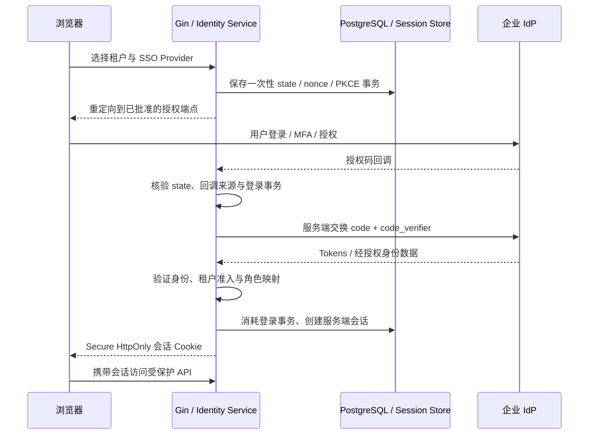
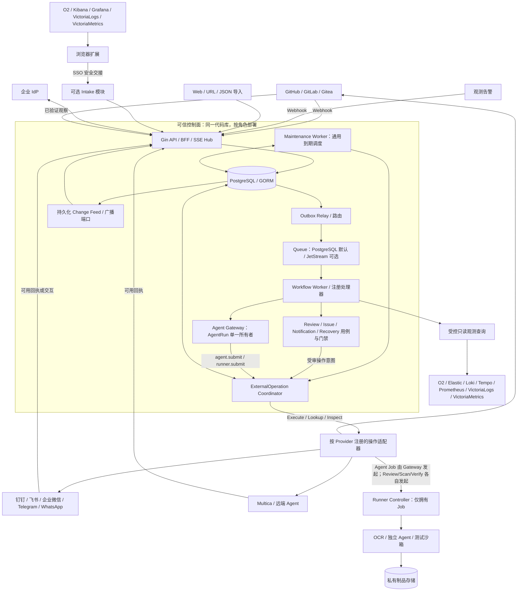
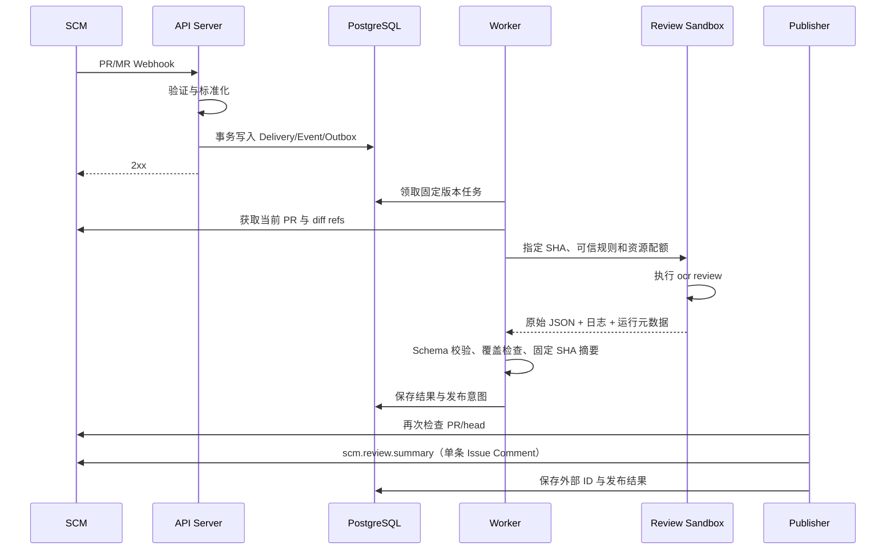
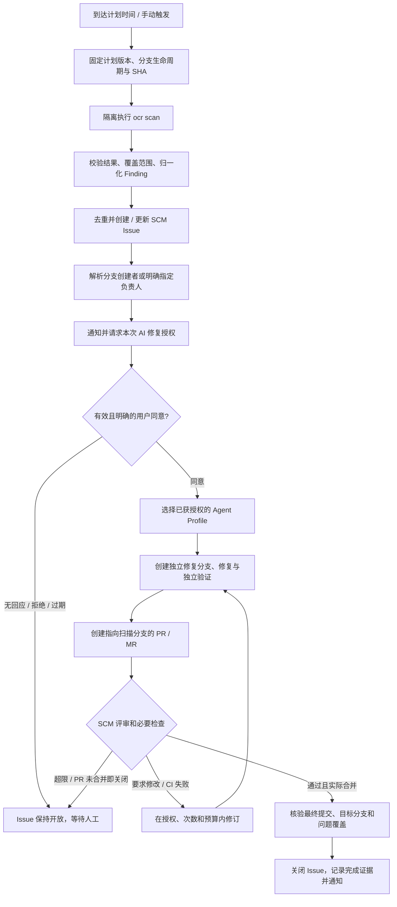
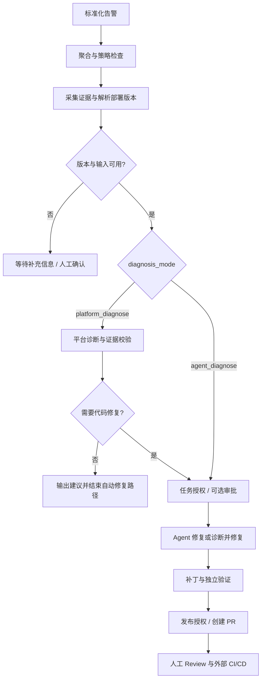

# AI DevOps 平台完整方案设计

> 基于 Go / Gin / GORM 的企业 SSO、多平台 AI Review、定时扫描，以及浏览器扩展驱动的多观测平台问题上报、诊断、受控修复与通知平台。

| 文档属性 | 内容 |
| --- | --- |
| 版本 | v1.6 验收编号、章节引用与迁移分组定点修订 |
| 状态 | 可用于技术评审与研发拆分；不是已实现或已压测的系统 |
| 本次修订日期 | 2026-09-15；历史第三方核查范围见第 33 章 |
| 后端开发语言与框架 | Go + Gin + GORM；PostgreSQL 业务存储 |
| 目标部署形态 | 首发单 API + 单 Worker 私有化，租户隔离不降级；HA Web 属于独立准入能力 |
| 核心依赖 | PostgreSQL、open-code-review、企业 IdP；按启用功能接入观测后端、Agent 与消息平台；NATS JetStream 为可选规模适配器 |
| 默认自动化边界 | 一键创建排查任务不等于修复授权；扫描/人工观测修复需有效同意；不自动合并、部署或生产写入；扫描 Issue 合并核验后关闭，生产观测问题默认部署恢复验证后关闭 |

示例中的 `incident-001` 等短 ID 是符号占位，正式资源标识在 Schema 中定义为 UUID；Provider 原生 ID 另行保存。

本文中的接口、事件、数据库和配置均为**本平台设计**，除明确注明外，不代表第三方产品原生协议。第三方能力依据文末官方资料核查；版本、输出结构、权限与部署差异必须经过适配器契约测试后才能进入生产。文中的性能指标、超时和配额是建议初始值，不是产品能力承诺。

### 本次修订范围与阅读顺序

本版直接修订 v1.5 原文，输入文件 SHA-256 为 `9ecb86a68e7498d0cb9330d12ca1fc5d787a34c900314bbfbbf276ca836e4cf3`。**v1.6 只修复四项一致性问题，不增加产品切片、状态机或另一条路线。** L0–L7 与 NOW-01～08 保持不变；历史验收编号恢复原语义，新增频率场景使用新编号。

| 本轮勘误 | 本版直接修改 | 权威落点 |
| --- | --- | --- |
| AC-47/48 原场景被覆盖 | 原文恢复“部分扫描/再次未发现不能关 Issue”和“不能推断 commit 作者为创建者”；原间隔场景完整移至 AC-185/186 | 第 30.2、30.10 节；第 11.2.1 节引用同步 |
| 两个 9.5 | 保留 9.5 分支和 Issue 扩展能力；L2 读端口改为 9.6，正文及 NOW-07 引用同步 | 第 9.6、10.5、23.1、31.3 节 |
| repair/scan 迁移合组 | repair 独立；L3 第一工作包不加载 scan；scan 仅在 GO/已验证 REPORT_ONLY 且 scope 明确选择时装配 | 第 22.13、25.1.1、29.2、31.1 节；AC-129 分档复验 |
| 第一章流程易被误读为行级首发 | 完整蓝图旁明确 L2 止于一条受控摘要，行级能力不进入首发排期 | 第 1.1、10.5 节 |

**现在做什么：** 按第 31.3 节执行 NOW-01～08。NOW-02 必须完成 Review 探针；Scan 可以取得实验决定，也可以签署 `DEFERRED` 明确本次 L2/L3 不交付扫描产品。签署排期决定不等于 scan 实验通过，`NOT_RUN` 不能被解释为 GO。本次没有代替实施团队签署任何门禁。

正文第 7～29 章保留完整蓝图，**不能因有表、有端口、有页面就一次性实现所有子系统**。第 3、19.8、31 章是范围与流程解释的单一依据；第 30 章选择对应 release-scope 的验收。安全规则在相关功能启用时始终强制。

**L2 首发只包含：** 一个企业 OIDC、GitHub PR Review 摘要、一个企业通知通道、统一外部操作和最小 Web。扫描、Agent 修复、告警、Intake、扩展、其他 Provider、HA Feed、JetStream、Temporal 均不进入 L2。

**前端关系：** FE-1.0 继续作为历史全量蓝图，不改写其 v1.3 基线。继续复用 `ai-devops-frontend-L2-contract-v0.1.md` 的 L2 capabilities、快照同步、导航和目录过滤合同，本轮不改动其接口或原文件；实现和发布仍按 NOW-08，不需要先重写 FE-1.1 全量设计。

**锚点规则：** 本版所有章节的 canonical anchor 与显示编号一致，如第 5 章为 `s05`、第 22 章为 `s22`。旧版本文件保持原样；不在本版保留会指向错误章节的旧数字别名，评审引用须带文档版本。语义子节锚点（如 `sql-first`）继续保留。

## 目录

1. [背景、目标与范围](#s01)
2. [总体决策与设计原则](#s02)
3. [功能需求与角色权限](#s03)
4. [SSO、OIDC 与 OAuth 2.0/2.1 身份接入](#s04)
5. [总体架构与部署边界](#s05)
6. [技术选型与 Go 工程结构](#s06)
7. [领域模型与对象关系](#s07)
8. [Webhook 接入与事件标准化](#s08)
9. [SCM 适配与代码工作区](#s09)
10. [AI Code Review 完整流程](#s10)
11. [定时分支全量扫描、Issue 与用户授权修复](#s11)
12. [多观测平台一键任务入口、浏览器扩展与安全导入](#s12)
13. [告警治理与事件关联](#s13)
14. [观测数据查询与证据包](#s14)
15. [源码映射与诊断引擎](#s15)
16. [两种诊断模式与策略配置](#s16)
17. [Agent Gateway、Multica 与独立 Agent 集成](#s17)
18. [修复验证、PR 发布与闭环](#s18)
19. [任务状态机与持久化编排](#s19)
20. [消息传输、统一外部操作与幂等](#s20)
21. [Notification Gateway 与官方消息平台接入](#s21)
22. [数据库与对象存储设计](#s22)
23. [Go 核心接口契约](#s23)
24. [Web API 设计](#s24)
25. [配置、密钥与策略管理](#s25)
26. [Web 控制台设计](#s26)
27. [安全、隔离与审计](#s27)
28. [可观测性、容量与成本](#s28)
29. [部署、升级与灾难恢复](#s29)
30. [测试方案与验收标准](#s30)
31. [唯一实施路线、当前待办与发布范围](#s31)
32. [风险、待确认项与架构决策记录](#s32)
33. [参考资料](#s33)

---

<a id="s01"></a>
## 1. 背景、目标与范围

### 1.1 产品定位

本平台是研发流程与运维告警之间的自动化协调层，负责接收事件、收集上下文、编排 AI 工具、控制执行权限并记录结果。它不替代代码托管平台、观测存储系统或 Agent 平台。

完整产品蓝图包含四个可关联工作流；按第 31 章逐切片启用，首发 L2 仅运行第一条。**L2 对应路径止于一条受控摘要，见第 10.5 节；下图的行号映射与行级评论属于完整蓝图，不进入 L2 排期。** 企业身份、问题治理和通知能力按已启用范围复用：

```text
代码审查：
PR/MR 更新 → Webhook → 固定代码快照 → open-code-review CLI
          → 结果校验与行号映射 → SCM API 写入 PR/MR

定时扫描：
计划触发 → 指定分支固定 SHA → ocr scan → 去重后创建/更新 SCM Issue
         → 通知创建者/明确指定负责人 → SSO 下明确同意
         → 所选 Agent 修复 → 独立验证 → PR/MR → 合并核验 → 关闭 Issue

告警修复：
告警 Webhook → 聚合去重 → 观测证据与源码版本定位
             ├─ 平台诊断 → 诊断报告 + 证据 → Agent 修复
             └─ 跳过平台诊断 → 证据 + 源码引用 → Agent 诊断并修复
           → 独立验证 → 创建 PR/MR → 人工评审

人工观测问题：
O2 / Kibana / Grafana / VictoriaLogs / VictoriaMetrics
           → 浏览器扩展一键提交，或粘贴 URL/JSON/文本
           → ObservationReport → 后端证据与源码映射 → 创建/关联 Incident/Issue
           → 两种诊断模式 + 明确授权 → 所选 Agent 修复 → PR/MR
           → 合并核验 → 外部部署 → 回查观测数据 → 问题闭环
```

全文将 GitHub/Gitea 的 Pull Request 与 GitLab 的 Merge Request 统一称为 PR；SCM 适配器保留各平台的原生语义。

### 1.2 完整蓝图、本版首发与非目标

下表的“完整蓝图”表示产品方向，不是当前发行承诺；所有 Provider 均须进入批准的 release-scope 并通过真实契约后才可在运行目录出现。首次切片不因本章列出目标而提前。

| 能力 | 完整蓝图 | L2 本版首发 | 首次或后续准入 |
| --- | --- | --- | --- |
| SCM | GitHub、GitLab、Gitea 与获准自托管实例 | 仅一个经验证的 GitHub 集成形态 | GitHub L2；GitLab/Gitea 与其他部署形态 L7 |
| Code Review | OCR 差异审查、摘要与可选行级结果 | 固定 SHA 的 `ocr review`，一条受控摘要 | 摘要 L2；行级/Review 容器 L7 |
| SSO | OIDC、OAuth 2.0 兼容、固定 OAuth 2.1 安全档案、身份绑定 | 一个企业 OIDC 实例，PKCE/state/nonce/会话与对象授权 | L2；OAuth-only、其他 IdP/安全档案 L7 逐项 |
| 扫描 | 指定分支原生全量扫描、Finding、Issue | 不安装、不运行、不因 Scan 未实验阻断 Review | L3 扫描工作包且 GO；REPORT_ONLY 单独验收；DEFERRED/BLOCKED 不启用 |
| 受控修复 | Issue/Incident 来源共用同意、Remediation、PRLink、验证与关闭 | 不开放修复 Agent 或修复审批 | L3 共享内核 + 一个已验证 CLI；第二个 Agent/Multica 等 L7 |
| 通知 | 钉钉、飞书、企业微信、Telegram、WhatsApp 官方维护方向 | 一个企业通道，实际选择在 L0 锁定 | L2 一个；其他 L7，WhatsApp 有独立合规准入 |
| 告警与证据 | 多来源告警、日志/指标/Trace 与服务源码关联 | 不启用告警/观测查询 | L4 一个告警入口 + OpenObserve；其余后端 L7 |
| 诊断模式 | 平台诊断或 Agent 诊断，均受相同权限与证据门禁 | 不启用 | L4；缺少部署版本时只交付调查工作台边界 |
| 人工报告 | 五平台 URL/JSON/JSONL/文本进入标准 Report，跨来源关联 | 不安装 Intake、不接受人工观测任务 | L5 import-ready，后台补查仅使用已验收后端 |
| 浏览器扩展 | 安全交接与逐平台结构化捕获增强 | 不发行扩展、不展示入口 | L6 首个增强；其余逐项增量 |
| 恢复验证 | 研发合并与生产恢复分离，按关闭策略核验 | 不宣称生产恢复 | L4 证据化人工核验；L7 自动 Recovery 计划 |
| 内核、Web 与运维 | 幂等、审计、授权、配额、可恢复执行及可选 HA | Gin/GORM SQL-first、PG Queue、统一 Operation、单 API/Worker、快照同步与最小 UI | L1 内核、L2 首发；HA/JetStream/Temporal 按 L7 条件 |

非目标保持：不自建观测存储，不重写通用 Agent/OCR 算法，不默认自动合并/部署/生产写入，不保证 AI 必然找对根因，不在首发建设任意 DAG、多区域多活或插件市场。

### 1.3 成功标准

代码审查链路需要证明“审查了哪个提交、覆盖了哪些文件、发现什么问题、哪些评论成功发布”。告警修复链路需要证明“依据哪些证据、针对哪个部署版本、由哪个 Agent 修改了什么、通过了哪些验证、PR 位于哪里”。

**PR 创建成功只表示自动化流程完成，不表示生产故障已经恢复。** 生产恢复需要独立的恢复告警、部署记录和观测验证。

### 1.4 新增成功标准

SSO 链路必须能证明“由哪个受信 IdP 确认了哪个用户、映射到哪个租户与资源权限”。通知链路必须能证明“哪个事件向哪个授权目标投递，远端是受理、送达、失败还是未知”。扫描修复链路必须能证明“扫描哪个分支/SHA、Issue 如何去重、负责人如何确认、谁对何种范围同意、由哪个 Agent 修复、哪个最终 PR 满足关闭条件”。

用户没有回应不能解释为同意；任务正常退出不能解释为修复成功；PR 已合并也不能代替告警场景的生产恢复验证。

人工观测链路还需证明“用户从哪个真实页面交接了哪些线索、后端按什么权限补查、URL/JSON 如何解析和脱敏、重复上报如何关联、哪些代码和恢复证据支持最终关闭”。无法补查的数据保留缺失状态；一键提交只代表报告已受理。

<a id="s02"></a>
## 2. 总体决策与设计原则

### 2.1 推荐基线

采用**模块化单体控制面 + 独立 Worker + 隔离执行面**。代码库保持统一，领域通过 Go 接口隔离；耗时和不可信任务在独立进程或沙箱中运行。先避免微服务间网络、分布式配置和部署数量的额外负担，后续按实际瓶颈拆分。

推荐组合：

```text
Go + Gin + GORM + PostgreSQL
PostgreSQL 状态机/Outbox + 默认 PostgreSQL Queue（JetStream 可选）
隔离 Runner + open-code-review CLI
企业 SSO + 可整体关闭的 Observability Intake + 观测适配器 + Agent Gateway + Notification Gateway
L2 固定 Go Pipeline + 通用 ExternalOperation/维护 Worker；L3 扩展长等待与扫描修复
React/TypeScript + REST/快照 SSE；TypeScript/MV3 扩展在 L6 渐进交付
```

NATS JetStream、Redis、Kafka、Temporal、向量数据库均不作为第一版必选依赖。已有企业基础设施可以复用，但同一问题只保留一套主实现。

### 2.2 不可破坏的设计约束

| 约束 | 具体含义 |
| --- | --- |
| Webhook 快速返回 | 请求线程仅验签、校验、持久化，不执行 clone、LLM 或 Agent |
| PostgreSQL 是业务事实源 | 队列通知丢失、重复或乱序，不应改变最终业务正确性 |
| 一切代码操作绑定不可变版本 | 使用实际 commit SHA，不把可变分支名当作执行快照 |
| 显式权限与发布责任 | 明确谁能读取代码、查询观测、运行命令、推送分支和创建 PR |
| 默认不信任外部文本 | 日志、代码、PR 描述、规则文件和 Agent 输出都是待校验数据 |
| 幂等优先于无限重试 | 对无法确认的外部写入先查证，不盲目重复创建评论或任务 |
| 缺失显式呈现 | 查询失败、采样缺失、审查截断不能伪装成“没有问题” |
| 诊断与执行解耦 | Agent 输出建议，策略和验证器决定是否进入下一阶段 |
| 明确用户授权 | 扫描 Issue 必须有有效的逐 Issue 同意；身份、通知受理和聊天 opt-in 不替代修复授权 |
| 框架统一 | HTTP 使用 Gin，业务持久化使用 GORM，不保留平行的框架/ORM 推荐路线 |
| 可靠关闭 | Issue 自动关闭依赖所选合并/部署恢复门禁，而不是模型自报状态 |
| 人工入口最小权限 | 浏览器只交接用户明确选择的线索；扩展不复制 Cookie/Token 或获得修复权限 |
| URL 非执行地址 | 先类型化解析，再按服务端登记映射查询；不提供任意 URL fetch 代理 |
| 身份与权限分离 | 共享 SSO 不等于共享观测数据权限；后台服务账号不得扩大调查主体权限 |
| 去重不泄密 | 只在授权边界内关联和返回候选；证据、问题、请求与修复幂等分开 |
| 外部副作用单一机制 | 统一 ExternalOperation/Attempt/Observation；业务模块不再有自己的写入重试循环 |
| 一个对象一个状态所有者 | Workflow、ExternalOperation、AgentRun、Runner Job 各有唯一写入入口，不互写状态 |
| 定义与执行器分离 | L2 固定 Go 定义与注册 Handler；L3 引入声明式长等待；只有注册定义决定步骤路由 |
| 依赖规则可执行 | 目录归属、depguard、传递依赖图和反例测试均为 CI 阻断门禁 |
| 可关闭而非删功能 | Intake 可不安装/排空/暂停；核心 Review/Scan 不依赖 Intake 表、代码或消费者 |

### 2.3 三个关键概念澄清

**OTel 不是统一查询后端。** OpenTelemetry 负责观测数据的采集、处理与导出，不等同于一个可查询历史日志、指标和链路的数据库。因此本平台查询实际存储后端，而不是设计一个虚构的通用“OTel 查询 API”。[S04]

**队列不是工作流引擎。** 本平台将业务状态、步骤结果、下一次执行时间和外部任务标识持久化到数据库；Queue 只分发工作提示，默认实现不需要独立 MQ，SSE 广播另用扇出端口。

**模型置信度不是执行授权。** 模型自报的高置信度只能作为参考，不能代替证据校验、代码验证、风险策略或人工审批。

<a id="s03"></a>
## 3. 功能需求与角色权限

### 3.1 功能矩阵与准入切片

**不再使用全局 P0/P1 给完整产品目录排期。** `Lx` 是唯一实施切片，定义在第 31 章；“强制安全门禁”表示该功能一旦启用就不能降级，不表示所有后续功能都属于首发。未进入当前切片的代码研究可记录 Backlog，但不得独立建立 Worker、迁移组或私有重试器。

| 编号 | 功能 | 首个准入切片 / 发布关系 | 必须满足的验收重点 |
| --- | --- | --- | --- |
| FR-01 | SCM 与仓库接入 | L2 GitHub；L7 GitLab/Gitea | 稳定仓库 ID、最小权限；后续 Provider 未验收不在可选目录 |
| FR-02 | Webhook 验证、去重、持久化 | L1 内核、L2 真实 SCM | 重放不产生重复业务任务 |
| FR-03 | PR 快照与 diff 获取 | L2 | fork、删除、重命名、分页、force-push 明确处理 |
| FR-04 | open-code-review review 执行 | L0 探针、L2 产品 | 固定版本、非交互、结构化结果与失败可复现 |
| FR-05 | PR 摘要与行级评论 | L2 必须摘要；行级 L7 可选 | 不能映射的位置回摘要；不因后续行级能力阻塞首发 |
| FR-06 | 告警标准化、聚合与恢复事件 | L4 | firing/resolved、重复与乱序不产生重复修复 |
| FR-07 | OpenObserve 查询 | L4 单后端 | 只读、证据可追溯、脱敏与有界查询 |
| FR-08 | Elastic/Loki/Tempo/Prometheus/VL/VM 查询 | L7 每次一个已冻结增量 | 输入导入支持不冒充该后端查询可用 |
| FR-09 | 服务—仓库—部署映射 | L4 | 无法确认版本禁止静默使用默认分支 |
| FR-10 | 两种诊断模式 | L4 | 共用来源授权、独立验证，不建第二套修复链路 |
| FR-11 | Agent Gateway | L3 一个已验证 CLI；L7 其他 | L2 不需要 Agent；未核实产品只存文档 Backlog |
| FR-12 | 修复验证、审批与 PR 发布 | L3 | 共享 Remediation/Approval/PRLink，最终提交验证与单发布方 |
| FR-13 | Web 控制台 | L2 最小页面，后续按切片增量 | 不一次实现全部页面目录；动作权威与 unknown 可见 |
| FR-14 | 租户隔离、RBAC、配额 | L1/L2，启用能力全程强制 | 私有化/单副本不豁免隔离与审计 |
| FR-15 | 策略、暂停、重跑、紧急停止 | L2 已启用范围 | 策略固定版本；重试回写与重跑模型分开 |
| FR-16 | 部署后恢复验证 | L4 证据化人工核验；L7 自动计划 | 未部署/无流量不伪造恢复通过 |
| FR-17 | Temporal、高级编排、语义检索 | L7 触发复评后另行批准 | 不是 L1 基础设施，也不自动列为必交付 |
| FR-18 | 企业 SSO | L2 一个 OIDC 实例；L7 OAuth-only 等扩展 | PKCE/state/nonce/当前权限；2.1 档案为规范兼容设计，不泛称全 IdP 支持 |
| FR-19 | 官方通知 | L2 一个企业通道；L7 其余 | 默认候选飞书自定义机器人；确认后锁定，不同期开工五个 |
| FR-20 | 指定分支原生全量扫描 | L0 范围决定可 DEFERRED；L3 扫描产品准入 | GO 才自动 Findings/Issue；REPORT_ONLY 仅已验收人工报告；DEFERRED/BLOCKED/NOT_RUN 不启用 |
| FR-21 | Finding 到 Issue | L3 且扫描 GO | 固定 SHA、稳定去重、负责人和噪音上限 |
| FR-22 | 同意 → 修复 → 合并关闭 | L3 | 完整长等待先通过；无同意零 Agent 启动 |
| FR-23 | 通知/Agent 进程外插件 | L7 有实际扩展需求时 | 首发仅静态注册端口，不建设插件市场 |
| FR-24 | Gin/GORM SQL-first 工程基线 | L1 | 真实 PostgreSQL 的事务、锁、约束、失败事务实验先通过 |
| FR-25 | 浏览器扩展任务入口 | L6 通用交接 + 首个页面增强 | 逐平台获验收能力徽标，非五平台 DOM 首发承诺 |
| FR-26 | URL/JSON/JSONL/文本导入 | L5 | 五平台各有实际来源样本与标准 Report；未知格式可解释降级 |
| FR-27 | ObservationReport 与多来源关联 | L5 | 人工/告警共用问题与修复，不重复派单 |
| FR-28 | SourceBinding/授权 QueryPlan | L4 后端、L5 UI 映射 | 补查只开放已验收后端，服务账号不扩大用户权限 |
| FR-29 | 人工入口五层幂等 | L5/L6 启用即强制 | 重复点击、回执未知、重启、跨来源和撤权均覆盖 |
| FR-30 | 观测问题复用修复/关闭策略 | L4/L5 | Intake 不另写 submit_agent；生产恢复状态独立 |
| FR-31 | 导入/扩展安全 | L5 导入、L6 扩展启用即强制 | 纯解析、SSRF、最小权限、双重脱敏与无远程代码 |
| FR-32 | 五平台能力档案 | L5 import-ready，L6/L7 按能力增强 | parse/import、capture、query、recovery 分别标记，不泛称“全支持” |
| FR-33 | Intake 配额、审计与恢复 | L5 | 不影响 Review/Scan，不因输入关闭停止共享修复 |
| FR-34 | 统一 ExternalOperation 与分区调度 | L1 内核、L2 首批类型 | unknown 不盲重试，通知风暴不饿死 PR，单一 Coordinator |
| FR-35 | 等待/观察决策与架构门禁 | L1 规范；L3 全长等待测试 | Handler 不私建轮询；Wait 与 Watch 分工明确 |
| FR-36 | 实时 UI 能力档案 | L2 snapshot-only；L7 web-ha | 最小版恢复快照；HA 才承诺持久化 Feed 重放 |

每个发布计划引用同一份 `release-scope.yaml`：选定 profile、已启用 capability、必执行的 AC/GATE 和真实 Provider 版本。功能负责人只能承诺当前清单，不能把历史优先级或未启用的示例配置当作排期授权。

### 3.2 角色模型

| 角色 | 主要权限 |
| --- | --- |
| Tenant Admin | 管理成员、集成、密钥引用、租户策略与配额 |
| Project Maintainer | 管理授权项目、审查策略、服务映射和修复审批 |
| Developer | 查看授权项目、发起 Review、反馈误报、查看修复结果 |
| SRE/Incident Responder | 处理告警、查看授权证据、确认诊断、批准修复 |
| Auditor/Viewer | 只读访问被授权的记录；敏感证据可另行限制 |
| Service Identity | 按具体任务授予最小机器权限，不继承管理员权限 |

权限检查同时覆盖 API、SSE、制品下载、后台任务和外部集成调用。审批人不能通过审批界面获取原本无权读取的生产日志。

### 3.3 新功能权限边界

新增 `observation_report.create/read`、`observation_capture.use`、`observation_source.manage`、`observation.query`、`incident.link`、`recovery.verify`、`extension_policy.manage`，以及 `identity_provider.manage`、`identity.link`、`scan_schedule.manage`、`scan.run`、`branch_owner.assign`、`issue.triage`、`remediation.consent`、`agent_profile.use`、`notification_channel.manage`、`notification.test` 和 `plugin.manage` 权限。

“分支创建者/指定负责人”是资源关系，不是自动获得管理员权限的新角色；其同意仍需当前有效的项目和仓库访问授权。维护者可管理计划、确认负责人及人工处置，但不能代替他人身份制造同意记录。用户可选择的 Agent Profile 必须同时属于租户批准目录、项目允许范围和当前任务能力集合。

<a id="s04"></a>
## 4. SSO、OIDC 与 OAuth 2.0/2.1 身份接入

> **交付边界：L2 只验收一个实际企业 OIDC 实例及安全下限。** 以下是完整身份蓝图；OAuth-only 的专有身份 Adapter、其他 IdP、聊天身份映射和完整单点退出矩阵在 L7 按能力增量，不能以兼容设计声称所有实例已接入。

### 4.1 协议与产品承诺

平台作为企业身份提供方的客户端接入 SSO，不自建通用身份提供方。**支持 OIDC 登录、OAuth 2.0 兼容接入及 OAuth 2.1 安全配置档案**，但三者不是可以随意互换的登录协议。

OIDC 在 OAuth 2.0 之上提供身份认证语义，适合作为默认 SSO 方案；仅提供 OAuth 的服务需要专用身份适配器，从受信的用户信息接口取得稳定身份，不能把任意 access token 当成身份证明。[S21][S23]

v1.1/v1.3 基线核查时将 OAuth 2.1 记录为活跃草案 `draft-ietf-oauth-v2-1-16`，不是已发布最终 RFC 的能力承诺；v1.4 未重新核查该草案当前进度，具体宣称需在所用 IdP 增量验收时再次冻结。本方案将“支持 2.1”实现为固定草案版本的安全配置档案和兼容性测试；规范更新后单独升级，不声称通过一个通用的“2.1 开关”即可兼容所有身份服务。[S22]

| 配置维度 | 取值 | 行为 |
| --- | --- | --- |
| 身份协议 `protocol` | `oidc` | 默认；Discovery/明确端点、ID Token 验证、可选 UserInfo |
| 身份协议 `protocol` | `oauth2` | 针对具体 Provider 的授权码流程与可信用户信息映射；无通用 ID Token 假设 |
| 安全档案 `security_profile` | `oauth2_compatible` | 支持符合本平台安全下限的 OAuth 2.0/OIDC Provider |
| 安全档案 `security_profile` | `oauth21` | 按已固定的 OAuth 2.1 草案配置授权码、PKCE、重定向和令牌安全约束 |

身份协议与安全档案是两个维度，例如 `protocol: oidc` 可以同时采用 `security_profile: oauth21`。生产禁用 implicit 和 password grant；授权码流程统一使用 PKCE S256。遗留 Provider 无法满足下限时显示不兼容，不自动降级。具体 IdP 品牌的“支持”以该实例、客户端类型、端点和策略的联调结果为准。[S21][S22][S23]

### 4.2 Gin BFF 登录与会话流程



采用 BFF：IdP access/refresh token 保留在服务端，不存浏览器 localStorage，不交给 Review Runner、通知插件或修复 Agent。会话 Cookie 使用 `Secure`、`HttpOnly`、合理的 `SameSite`、明确过期时间和路径；生产优先同站点前后端。跨站回调或特殊响应模式需要单独验证 Cookie 与 CSRF 行为，不能通过统一放宽 Cookie 策略解决。

登录事务绑定 Provider、租户、浏览器会话、精确 redirect URI、state、nonce、PKCE verifier、过期时间和允许的登录后相对路径；并发回调必须原子消耗一次。登录成功轮换本地 session ID，避免会话固定。敏感端点使用 CSRF Token 和 Origin 检查；PKCE 不代替本地业务 API 的 CSRF 防护。[S21][S23]

### 4.3 身份验证与端点安全

OIDC 验证签名、允许的算法、issuer、audience、必要的 azp、有效期、nonce 及适用的认证时间要求；使用 UserInfo 时验证其 `sub` 与 ID Token 一致。授权端点、Token 端点、JWKS 与 UserInfo 只能来自受信配置和经过检查的 Discovery；禁止用户请求直接指定远端地址。JWKS 轮换允许受控刷新，未知 key ID 刷新有频率上限，不能退化成不验签。[S21]

租户的 IdP 选择由已批准的组织入口或显式选择决定。OAuth-only Adapter 必须定义稳定身份字段、用户信息调用、Token 适用范围与错误语义；未能取得权威身份时登录失败，不能用用户提交的邮箱、昵称或未验证 JWT payload 建立会话。

客户端密钥通过 Secret Broker 读取；Token 传输使用 TLS，服务端加密保存并控制刷新并发。错误响应不展示 code、Token、Cookie 或完整授权 URL。重定向只允许精确注册地址，登录后的返回地址限制为批准的本地路径。

### 4.4 账户、SCM 与消息身份关联

核心身份键采用 `(tenant_id, auth_provider_id, issuer, subject)`；同名邮箱、昵称或跨 IdP 的相同 `sub` 都不能自动合并账户。确需关联时，用户需要证明对两个身份的控制，或由有权限的管理员执行带审计的恢复流程。

```text
企业身份 (issuer + subject)
        ↓ 受控绑定
平台 User + Tenant Membership
        ├─ SCMIdentity：Integration + Provider 原生用户 ID
        └─ MessageIdentity：Channel Integration + Provider 原生用户 ID
```

消息平台的群 ID 不是用户 ID，Webhook 持有人也不是审批人。SCM 用户、SSO 用户与聊天用户必须分别完成绑定验证。平台不能仅凭 Git commit 邮箱等于 SSO 邮箱就认定该用户是分支创建者或仓库授权人。

允许配置邀请制或受限制的 JIT 开户。JIT 只建立最小角色的 Membership；企业组映射必须匹配明确的受信 claim 和规则，不能让任意 IdP 文本授予 Tenant Admin。SCM 项目读写权和平台 RBAC 共同约束仓库操作，SSO 登录成功本身不授予代码访问、AI 修复或生产证据读取权限。

### 4.5 退出、停用与高风险审批

本地退出立即撤销会话；IdP 的前/后通道退出或令牌撤销仅在对应 Provider 确实支持且通过契约测试时启用。不能承诺所有 OAuth 服务都提供统一的单点登出。会话设空闲与绝对期限，后台定期检查成员停用和权限变化；对于无法及时推送停用信息的 IdP，使用较短授权缓存和执行前再验证限制风险窗口。

用户离职、SCM 权限撤销、消息身份解绑或租户暂停后，已有审批不能赋予永久执行权限。启动 Agent、发布 PR 和关闭 Issue 前重新检查当前权限；高风险操作可要求最近认证或 IdP 的 step-up/MFA 能力，无法证明要求满足时转人工处理。

通知中的“查看并审批”链接只能打开详情，**GET 请求永远不能批准修复**。用户 SSO 登录后查看准确范围，再通过带 CSRF、防重放和对象版本校验的 POST 提交决定。受支持的消息卡片审批也必须调用同一个 Approval Service，不能绕过本节身份与权限检查。

### 4.6 SSO 与机器身份的边界

SSO 客户端、SCM 应用身份、观测只读身份、通知发送凭据和 Agent 凭据独立管理。机器调用本平台可使用受限客户端凭据/服务身份配置，但不能将其解释为分支创建者的个人同意。IdP 自身的 OAuth consent 也不等于对某个 Issue 的 AI 修复授权。

身份服务故障时保留已验证且未过期会话的受限读取能力，由安全策略决定是否允许新的审批；默认禁止新登录降级成匿名和新建高风险授权。私有化可设计单独的 break-glass 管理流程，使用独立凭证、强审计、短时授权和显式启用，不能作为常开的“跳过 SSO”入口。

### 4.7 扩展交接身份与任务授权

浏览器扩展默认交接到本平台同源页面，继续使用 Gin BFF 登录与 CSRF，不导出 IdP Token、观测平台 Cookie 或 SCM 凭证。精确 origin/扩展消息验证只保护交接通道，不能代替 API 的用户身份和对象授权。[观测入口章节](#s12)规定 nonce、tab、租户选择和重试协议。

`observation_report.create`、`observation.query`、`remediation.consent` 是独立权限。创建排查任务不批准代码变更；提交人不是服务负责人时，通过统一 Approval Service 请求正确人员。后台长期调查使用有审计的调查角色/授权快照，并在查询、模型输入、发布和恢复验证前重新检查撤权。

<a id="s05"></a>
## 5. 总体架构与部署边界

### 5.0 首发运行路径（L1/L2 唯一必实现拓扑）

```text
企业 OIDC / GitHub Webhook / Web 控制台
                     ↓
              api-server × 1（Gin/BFF）
                     ↕
 PostgreSQL：业务状态 / SQL 约束 / Outbox / PG Queue / 外部操作账本
                     ↕
 worker × 1：固定 Review Pipeline + Relay + Coordinator + 最小 Job Watch
             （同进程、按 operation_type/action 公平领取与限额）
         ├─ GitHub 评论 / 一个企业通知通道
         └─ Runner Controller → OCR 隔离 Job → 私有报告

UI：REST 快照；可选单副本 SSE 失效提示；断线重取，不需持久化 Feed
未装配：Intake / 扫描 / 修复 Agent / 长期 Wait 引擎 / NATS / Temporal
```

下图是**后续能力全部启用时的逻辑蓝图**，不是首发进程清单。



图中模块不等于进程。所有外部写入经统一操作入口；只读观测查询、协议登录和消息传输本身不递归包装为 ExternalOperation。Secret Broker 按适配器/操作角色提供最小凭证，未在图中展开。

### 5.1 进程划分与首发单 Worker 纪律

| 进程 / 内部角色 | L2 首发运行方式 | 职责与边界 |
| --- | --- | --- |
| `api-server` | 单副本；无状态可恢复但不宣称 HA Web | Gin、SSO、Webhook/Inbox、查询、REST/快照 SSE；不直接执行代码 |
| `worker` | **一个进程同时装配 workflow + maintenance 角色** | 固定 Review Pipeline、Outbox、Coordinator、已启用 Job Watch 共用发行物；禁止另起通知/Issue/Agent 对账服务 |
| workflow 角色 | Worker 内模块，不是独立服务 | L2 调用固定 Go 定义和注册 Handler；L3 起增加长期执行器 |
| maintenance 角色 | 同 Worker 内有界分区调度器 | 按 operation_type/action 领取到期操作、查证、最小 Watch；领域 owner 判断业务结果 |
| `runner-controller` | 保留独立的受限执行控制面 | 只维护 Job/制品，不写 AgentRun 或承担代码发布；不属于 Coordinator 的拆分 |

第一版**不提供**“可选单独部署 Coordinator”快捷配置。日后拆 Worker 进程必须达到第 20.11 节测量触发条件、批准 ADR，并使用同一二进制/账本/Registry 和数据库分区租约；不得复制实现或建立另一条副作用通路。

`issue-reconciler`、通知重试、Agent 对账、recovery-reconciler 只是统一维护注册项。Outbox Relay 仅做内部事件传输，不递归创建 ExternalOperation。

### 5.2 外部依赖故障影响

SCM/通知/Agent 写入失败统一保留 ExternalOperation 及证据，按读取失败、确定未执行、可能已执行等语义处理；观测读取失败保留部分证据。数据库是事实源：不可用时不返回“已接收”，不能靠 MQ 替代持久化。

默认 PostgreSQL Queue 没有独立 MQ 故障域；LISTEN 断线仅增加到轮询周期的延迟。JetStream 模式下 Broker 不可用，Outbox 仍保留；数据库到期扫描可继续推进已持久化任务，吞吐/及时性可能下降，但不自动换一套业务所有者或无限重放外部写入。恢复后传输可重复，幂等键保持不变。上游不一定自动重投失败 Webhook，因此保留人工重放与投递检查入口。

### 5.3 部署职责与逻辑模块

默认私有化组合是单 API + 单 Worker + Runner Controller + PostgreSQL + 必要制品/Secret 服务；workflow/maintenance 在 L1–L3 强制同进程，逻辑分区与权限仍独立。可恢复性不等于无中断 HA；拆进程和 HA Web 分别受准入约束。L3 的首个 Agent 是一个已验证 CLI，不以 Multica 为前置。

通用维护不等于共享一把全局锁或一个无限权限账号：按租户、Provider、操作类型分区、限流、熔断及发放凭据，避免通知故障阻塞 PR 发布。临时 Intake 故障不影响核心 Review/Scan；完整关闭语义见第 12.17 节。

<a id="s06"></a>
## 6. 技术选型与 Go 工程结构

### 6.1 技术选型

| 领域 | 建议选择 | 设计理由 |
| --- | --- | --- |
| HTTP | **Gin** | 所有 Web API、Webhook、SSO 回调与 SSE 共用 Gin 路由和中间件。[S24] |
| 数据库 | PostgreSQL | 保存业务状态、审批、审计、幂等键与 Outbox |
| ORM / 数据访问 | **GORM + PostgreSQL Driver，SQL-first Repository** | GORM 负责映射和事务壳；锁/约束/隔离/CAS 以受审 SQL 与真实 PG 实验为准，不承诺降低持久化复杂度。[S25][S71] |
| 工作分发 | **Queue 端口，默认 PostgreSQL Outbox 轮询** | LISTEN 可选加速；JetStream 为经配置启用的规模适配器，正确性不依赖 MQ |
| 制品 | 现有 S3 兼容对象存储 | 保存报告、证据与补丁；本地开发可使用目录适配器 |
| Git | 固定版本 Git CLI | 与 Review CLI 的仓库行为统一，通过安全参数数组调用 |
| 日志 | `log/slog` | 统一结构化日志字段 |
| 遥测 | OpenTelemetry SDK/Collector | 观测平台自身调用链，不承载业务证据原文 |
| 前端 | React + TypeScript | REST 获取状态，SSE 展示阶段进度；同源接收扩展交接 |
| 浏览器扩展 | TypeScript + Manifest V3（L6） | 渐进增强；先通用交接，结构化采集逐平台认证，最小权限不降级 |
| 导入 | 类型化 Locator Parser + SourceBinding + QueryPlan | URL/JSON 先解析与授权，不做通用 HTTP 代理 |
| 沙箱 | 开发用隔离容器；生产推荐 Kubernetes Job 或受控 VM | 控制网络、资源、文件系统和执行身份 |
| 认证 | 企业 OIDC / OAuth 2.0 / OAuth 2.1 安全档案 | Gin BFF、服务端会话与可信身份适配；开发模式不得进入生产 |
| 定时任务 | 固定 Cron 解析语义 + 数据库 Scheduler | 时区、misfire、租约、固定分支快照与业务幂等 |
| 通知 | Notification Gateway；L2 只装一个企业通道 | 五类为后续目录；WhatsApp 单独合规准入，不是首发依赖 |
| Agent | Profile Registry + Gateway + 隔离 Runner | 远端 Multica 或独立 Agent 可选，不绑定一个编排平台 |
| 外部操作 | 统一账本 + Operation Registry + Reconcile 框架 | 统一 Execute/Lookup/Inspect、租约、证据和重试；业务完成仍由所属领域判定 |
| 编排 | L2 固定 Go Pipeline；L3 版本化长期执行器 | 注册 Handler 与稳定效果键从 L1 起保留；不先实现 Temporal 兼容层 |
| 依赖治理 | 固定版本 golangci-lint/depguard + 架构依赖图测试 | import、目录归属和禁止传递依赖均为 CI 阻断项 |
| SSE | L2 DB 快照/可选 SSE；HA Web 才加 Feed | 显式协商 snapshot-only / durable-feed，正确状态依靠 DB 与当前 ACL |

具体依赖版本通过锁文件、镜像 digest 和发布清单固定；不在方案中把“当前最新版本”写成长期要求。引入库前检查维护状态、许可证、漏洞与团队运维条件。

### 6.2 推荐目录与唯一归属

```text
ai-devops-platform/
├── cmd/{api-server,worker,runner-controller}/  # 唯一进程组装入口
├── internal/
│   ├── domain/{review,scan,issue,incident,agent,notification,identity,workflow,externalop,intake}/
│   ├── ports/                      # 依赖方向向内；跨模块契约，不含 SDK 类型
│   ├── application/
│   │   ├── review/                  # Review 用例与结果映射
│   │   ├── scan/                    # 计划/分支扫描用例
│   │   ├── issue/                   # Issue 意图、合并/关闭规则
│   │   ├── incident/               # 告警、证据与诊断协调
│   │   ├── intake/                 # 唯一人工接入用例归属；可不注册
│   │   ├── recovery/               # 恢复规则；可被自动告警使用，不依赖 Intake
│   │   ├── remediation/            # 共享同意/修订/验证/PR 协调，Case/Incident 只提供来源
│   │   ├── prlink/                 # 唯一 PR 关联及合并核验用例
│   │   ├── agentgateway/           # AgentRun 唯一业务写入者
│   │   ├── identity/               # SSO/会话/账户关联用例
│   │   ├── notification/           # 路由、模板与消息业务状态
│   │   ├── approval/               # 同意与发布授权
│   │   ├── externalop/             # 唯一外部效果规划/确认/证据状态逻辑
│   │   └── workflows/              # 已注册步骤处理器；不含调度线程
│   ├── adapters/
│   │   ├── scm/{github,gitlab,gitea}/
│   │   ├── alerts/{grafana,openobserve,elastic,generic}/
│   │   ├── telemetry/{openobserve,elastic,loki,tempo,prometheus,victorialogs,victoriametrics}/
│   │   ├── intake/{openobserve,kibana,grafana,victorialogs,victoriametrics,generic}/
│   │   ├── identity/{oidc,oauth2}/
│   │   ├── agent/{multica,claudecode,codex,cursor,grokbuild,qcoder,trae,zcode,generic}/
│   │   ├── notification/{dingtalk,feishu,wecom,telegram,whatsapp}/
│   │   ├── execution/{pipeline,postgres}/ # L2 固定 Pipeline；L3 长等待执行器
│   │   ├── queue/{postgres,jetstream}/
│   │   ├── fanout/{postgres,jetstream}/
│   │   ├── schema/                 # 内嵌 Schema 的固定验证器
│   │   ├── reviewer/opencodereview/
│   │   ├── runner/{local,kubernetes}/
│   │   ├── storage/{gormpostgres,objectstore}/
│   │   └── system/                 # Secret/clock/metrics/egress 等端口实现
│   ├── delivery/{ginhttp,sse,webhooks}/
│   └── bootstrap/                  # 唯一允许组装上述具体实现的内部包
├── workflows/definitions/          # L3 起使用；L2 定义编译在受审 Go 注册表
├── api/{openapi.yaml,schemas/}
├── db/migrations/{core,review,notification,repair,scan,incident,intake,feed}/ # repair/scan 独立清单；scan 子集见 22.13
├── web/
├── browser-extension/{src,manifests,tests}/
├── architecture/{modules.yaml,exceptions.yaml}/
├── .golangci.yml
├── tools/{archcheck,check-architecture-fixtures}/
├── tests/{architecture,contract,integration,e2e,fixtures,security}/
└── deploy/                         # postgres-default / jetstream-opt-in
```

依赖方向仍为 `delivery → application → domain/ports`，`ports → domain`；具体 Adapter 实现 ports，bootstrap 负责组装。**用例只能归属于 `application/<业务>`；禁止再建平行的 `internal/intake`、`internal/identity`、`internal/notification`、`internal/recovery`、`internal/workflow` 或第二套同名状态机。** 领域规则在 domain、用例在 application、Provider 协议在 adapters 是职责分层，不是同一用例的双重归属。

`architecture/modules.yaml` 固化每个目录的 owner、可导入模块、表写入权与允许跨域端口。跨业务协作通过 ports/类型化事件；例外逐条审查并带期限。禁止以通用 `common/utils/platform` 包绕过边界。

### 6.3 Gin 与 GORM 强制工程约束

Gin Handler 负责参数绑定、认证/授权、调用用例和响应；不直接运行 OCR、Git 或 Agent。Webhook 在反序列化前保留原始 body 验证签名；配置请求体上限、受信代理列表、恢复中间件、超时与日志脱敏。不要把请求结束后的 `*gin.Context` 传给后台任务；持久化独立领域输入，由 Worker 使用自己的标准 `context.Context`。

业务数据访问统一经 **SQL-first 的 GORM Repository**。GORM 只负责行映射、受限普通查询和事务壳；事务、隔离、锁、约束与状态更新语义以版本化 SQL 为准，复杂度不会因为使用 ORM 消失。参数化 SQL 是主路径之一，不是临时绕过。连接池仍由 `database/sql` 管理，不另建 sqlc/pgx 业务 Repository；必要底层监听仅限 Queue/Fanout Adapter。[S25][S71]

GORM Repository 的业务读写必须显式接收可信 AuthContext；已授权内部读取才可派生窄化 ReadScope，写路径不得只接收 tenant。不能仅靠 GORM 默认 Scope 声称杜绝跨租户访问；预加载、原生 SQL、后台任务和关联写入都需检查。使用 DTO 白名单避免将请求体直接绑定到持久化模型，状态修改使用显式字段、版本条件与 `RowsAffected` 校验。[S25][S26][S27]

生产采用版本化迁移；`AutoMigrate` 仅限本地开发/隔离测试。部分唯一索引、RLS、复合外键和在线迁移策略通过受审的 SQL 迁移实现，升级先验证兼容旧任务。GORM 的零值更新及 `Save` 行为需要明确处理，不能依靠默认行为完成关键状态机。[S27][S28]

**依赖方向是强制门禁而非约定：** 第 6.4 节的 depguard、跨模块/传递依赖检查、唯一目录归属检查必须在每个 PR 的 CI 中执行；未通过不得合并。Gin/GORM 的允许位置也由工具校验，不靠代码评审记忆。

<a id="module-governance"></a>
### 6.4 depguard、架构测试与 CI 阻断

golangci-lint 的 depguard 支持按文件 glob 限制允许/禁止导入及严格 allowlist；本项目使用固定版本的 v2 配置格式，不使用每次拉取 `latest` 的安装方式。[S63][S64] 下例模块路径 `example.com/aidevops` 由工程生成器替换为 `go list -m` 的真实路径，替换遗漏会被正例 fixture 检出。

```yaml
version: "2"
run:
  relative-path-mode: gomod
linters:
  default: none
  enable: [depguard]
  exclusions:
    generated: disable
  settings:
    depguard:
      rules:
        domain:
          files: ["**/internal/domain/**/*.go"]
          list-mode: strict
          allow: ["$gostd", "example.com/aidevops/internal/domain$", "example.com/aidevops/internal/domain/"]
          deny:
            - pkg: "database/sql"
              desc: "领域规则不得访问数据库"
            - pkg: "net/http"
              desc: "领域规则不得访问 HTTP"
            - pkg: "os/exec"
              desc: "领域规则不得启动进程"
        ports:
          files: ["**/internal/ports/**/*.go"]
          list-mode: strict
          allow: ["$gostd", "example.com/aidevops/internal/domain$", "example.com/aidevops/internal/domain/", "example.com/aidevops/internal/ports$", "example.com/aidevops/internal/ports/"]
        application:
          files: ["**/internal/application/**/*.go"]
          list-mode: strict
          allow: ["$gostd", "example.com/aidevops/internal/domain$", "example.com/aidevops/internal/domain/", "example.com/aidevops/internal/ports$", "example.com/aidevops/internal/ports/", "example.com/aidevops/internal/application$", "example.com/aidevops/internal/application/"]
          deny:
            - pkg: "database/sql"
              desc: "仅通过 Repository 端口访问持久化"
            - pkg: "net/http"
              desc: "远端 IO 通过端口，不能直接拼 HTTP 请求"
            - pkg: "os/exec"
              desc: "仅通过 Runner/操作端口执行"
        delivery:
          files: ["**/internal/delivery/**/*.go"]
          list-mode: strict
          allow: ["$gostd", "github.com/gin-gonic/gin$", "example.com/aidevops/internal/domain$", "example.com/aidevops/internal/domain/", "example.com/aidevops/internal/ports$", "example.com/aidevops/internal/ports/", "example.com/aidevops/internal/application$", "example.com/aidevops/internal/application/", "example.com/aidevops/internal/delivery$", "example.com/aidevops/internal/delivery/"]
          deny:
            - pkg: "database/sql"
              desc: "Handler 不能直连数据库"
            - pkg: "os/exec"
              desc: "Handler 不能运行仓库命令"
        adapters:
          files: ["**/internal/adapters/**/*.go"]
          list-mode: lax
          deny:
            - pkg: "example.com/aidevops/internal/delivery$"
              desc: "适配器不能反向依赖 HTTP 层"
            - pkg: "example.com/aidevops/internal/delivery/"
              desc: "适配器不能反向依赖 HTTP 层"
            - pkg: "example.com/aidevops/internal/application$"
              desc: "适配器实现 ports；编排组装位于 bootstrap"
            - pkg: "example.com/aidevops/internal/application/"
              desc: "适配器实现 ports；编排组装位于 bootstrap"
            - pkg: "example.com/aidevops/internal/bootstrap$"
              desc: "禁止反向依赖 composition root"
            - pkg: "example.com/aidevops/internal/bootstrap/"
              desc: "禁止反向依赖 composition root"
```

此处展示层级门禁；业务模块之间允许的最小边由 `architecture/modules.yaml` 生成附加规则/架构测试，不因 application 层 allow 前缀就允许任意跨业务调用。完整门禁同时检查：GORM 只可位于登记的持久化/PG 基础设施适配器，Gin 只可位于 delivery/组装入口，NATS 与 Temporal SDK 只可位于对应基础设施 Adapter；`review/scan → intake` 的直接与传递依赖都禁止。

CI 对 `go list -deps -test -json` 构建依赖图，检查禁边及传递绕过路径，并检查批准的 build tags/目标平台。被 build tag 隐藏的文件另按 AST/文件归属扫描。各模块 test 与生成代码默认也受检；需要真实数据库的测试放在 `tests/integration`，不能用全局 `_test.go` 排除逃避规则。`nolint:depguard`、规则文件和例外清单变更需架构 CODEOWNERS 审核；只跑新增代码的 lint 不够，依赖门禁全量执行。

```bash
# 固定工具版本及配置进入版本库；以下命令在项目实现对应工具后执行。
golangci-lint config verify
golangci-lint run ./...
go run ./tools/archcheck
go run ./tools/check-architecture-fixtures
go test ./...
```

反例 fixture 必须证明 `delivery→gorm`、`domain→gin`、`application→adapters`、`review→intake`、间接通过 helper 导入受禁包都被拒绝；正例证明规则不是“匹配不到文件”。CI 分支保护将这些检查设为 required。

**独立 domain Go module 是后续强化选项，不是自动安全边界。** Go module 定义依赖与构建边界，本身不阻止开发者新增 `require/replace`。[S69] 若拆分，必须配套 `GOWORK=off`、只读依赖构建、禁止依赖父模块/基础设施模块的 graph 检查和单独 CI；仍保留 depguard。v1 默认单 module，避免为治理再引入不必要的版本发布成本。

<a id="sql-first"></a>
### 6.5 SQL-first Repository 强制规范

**ADR-009 保留 Gin + GORM，但不再以“框架统一”推导 ORM 能降低此系统的持久化复杂度。事务、锁、隔离和约束以 SQL 为准；GORM 是映射与事务壳。** 复杂操作允许且优先使用受审的参数化 SQL，通过 `tx.Raw/Exec` 执行，仍属于同一 Repository、同一事务和同一连接。[S71]

| 约束 | 必须实现的规则 |
| --- | --- |
| 权威约束 | 复合键、部分唯一索引、CHECK、外键/RLS 写入版本化迁移；ORM 标签不能代替迁移 |
| 状态更新 | 明确 tenant、资源 ID、预期状态/版本/epoch；更新明确列，检查 Error 和 RowsAffected；不得用 `Save`、隐式 upsert、无条件 Update |
| 映射与零值 | 普通查询可用 GORM；状态列使用明确 SQL/列白名单，`false/0/NULL` 语义在测试中固定；不得依赖结构体省略零值 |
| 关联 | 禁止关键写路径自动 SaveAssociations/关联级联、默认 Scope 隐藏权限条件；预加载必须明确 tenant 与权限 |
| 事务 | 使用同一个 UnitOfWork/tx；回调内部不得访问全局 db、远端 API 或阻塞等待；错误向上返回并回滚 |
| 错误分类 | 依据 SQLSTATE/约束标识，不解析本地化报错；23505 不自动等于“同一次成功请求”，还需核对身份和 request hash |
| 失败事务 | 默认回滚整个短事务；仅有已审核 savepoint 的路径可局部恢复；失败后继续 SELECT 是禁止反例 |
| 冲突领取 | `ON CONFLICT DO NOTHING` + RETURNING/RowsAffected 区分插入；READ COMMITTED 下下一条 SELECT 重新取得快照；不能假定一条 INSERT-CTE-SELECT 一定读到竞争者 |
| 领取锁 | `FOR UPDATE SKIP LOCKED` 仅领取到期任务；事务提交后才做外部 IO，不能用跳锁结果推断没有待审批/未完成 PR |
| 重试事务 | 40001/40P01 等只重试整个已界定短事务，复用原输入与逻辑幂等键；提交结果未知先核对账本，不能当作新业务 |
| SQL 组织 | `adapters/storage/gormpostgres/<module>/sql/` 或受审常量，查询 ID、参数类型、约束及索引有对应测试；标识符只来自白名单 |
| GORM Hooks | 不做外部副作用、不产生隐式跨域写入；关键时间/版本显式维护，Hook 不是幂等或授权机制 |

PostgreSQL 的 `ON CONFLICT` 和 READ COMMITTED 可见性、失败事务与 savepoint、RLS 角色绕过都有原生语义，必须用实际数据库验证，Mock/SQLite 不具备替代资格。[S72][S73][S74][S75][S76] RLS 若启用，要使用非 owner、非 superuser、无 BYPASSRLS 的应用角色测试；连接池租户上下文以事务限定的受控配置注入，事务后不得泄漏到下一请求。即使未使用 RLS，也须通过 Repository tenant 参数、复合外键和对象权限的真实隔离测试。

**L1 退出前执行第 22.12 节的 PG-G01–PG-G12；未通过不得开始 L2 真实业务集成。** 声明 RLS 支持的发布必须通过其测试，未启用 RLS 不得在发布说明写成已提供该能力。

<a id="s07"></a>
## 7. 领域模型与对象关系

> 以下实体是完整蓝图，不是 L1 建表清单。首发只装配第 22.13 节列出的 core/review/一个 notification 迁移组；长等待、修复、扫描、Incident、Intake、Feed 分阶段增加。

### 7.1 主要实体

| 实体 | 说明 |
| --- | --- |
| Tenant | 数据、凭证、预算与审计的隔离边界 |
| Integration | SCM、观测、Agent 或消息通道的外部实例与凭据边界 |
| AuthProvider / UserIdentity / Session | SSO 档案、稳定外部身份、服务端登录会话 |
| SCMIdentity / MessageIdentity | 平台用户和代码/消息平台稳定用户 ID 的受验证绑定 |
| BranchLifecycle / BranchOwnership | 分支创建/删除世代、实际创建者证据与指定负责人 |
| ScanSchedule / ScheduleOccurrence / ScanRun | 定时计划、计划时段触发、固定分支 SHA 的扫描 |
| FindingIdentity / FindingOccurrence | 跨扫描稳定问题与每次不可变的发现记录 |
| ImprovementCase / IssueLink / PRLink | 扫描改进问题、SCM Issue、一个或多个修复 PR |
| NotificationIntent / Delivery / Subscription | 关键消息路由与逐目标投递状态 |
| AgentProfile / PluginRegistration | 可选择执行器的能力、授权与已核验版本 |
| Project / Repository | 产品项目与实际代码仓库，使用 Provider 的稳定仓库 ID |
| ServiceBinding | 服务、环境、观测源、仓库和子目录的关联 |
| Deployment | 某时段实际部署的服务版本、commit SHA、镜像 digest 与流水线来源 |
| WebhookDelivery | 某次已验证投递的原始记录与去重信息 |
| DomainEvent | 标准化后的业务事件；一次投递可以产生多个事件 |
| ReviewRun | 一次固定 PR 快照、引擎版本和策略版本下的审查 |
| Incident / AlertOccurrence | 一个待处理问题与其零到多次告警出现/恢复；人工问题可以没有告警 |
| ObservationReport / ObservationAnchor | 一次人工提交与日志/Trace/指标/文本锚点；快照和后端补查分开 |
| ObservabilitySourceBinding / AccessGrant | 页面数据域到查询 Integration 的受审映射及调查权限 |
| IncidentSource / SourceAlias | 人工/告警多来源关联与获授权确认的同源别名 |
| IntakeReceipt / APIIdempotencyRecord | 提交幂等、回执、规范化版本与重试/tombstone |
| RecoveryCheckPlan / RecoveryCheckRun | 固定恢复条件、部署关联、观测证据与人工核验 |
| EvidenceBundle | 某次证据收集的不可变清单、查询来源、覆盖与缺失情况 |
| Diagnosis | 事实、假设、证据引用、候选代码位置与建议 |
| WorkflowRun / StepRun | 自动化流程与各步骤的执行历史 |
| RemediationTask / AgentRun | 由 Incident、ImprovementCase 或人工请求产生的修复意图与一次或多次实际运行 |
| Approval | 分类型保存任务启动同意与补丁发布决定；分别绑定当时已经存在的不可变输入 |
| ExternalOperation / OperationAttempt | 唯一外部效果账本与不可变尝试历史，覆盖评论、Issue、PR、通知、Agent/Job 提交与取消 |
| ExternalWatch / ExternalObservation | 通用只读观察计划与事实历史；供业务所有者判断运行、送达、合并和恢复 |
| Publication | 兼容性业务投影，引用 `operation_id`；不再拥有独立重试/租约状态 |
| WorkflowDefinition / WorkflowSignal | 固定版本步骤/转移定义与持久化唤醒输入 |
| Artifact / AuditEvent | 制品与安全审计记录 |

### 7.2 关系与版本边界

```text
Tenant
  ├─ Integration ─ Repository ─ ReviewRun ─ Finding ─ Publication
  ├─ ServiceBinding ─ Deployment
  └─ Incident ─ AlertOccurrence
              ├─ EvidenceBundle(v1, v2...)
              ├─ Diagnosis(v1, v2...)
              └─ WorkflowRun ─ StepRun
                             └─ RemediationTask ─ AgentRun(1..N)
                                                ├─ Verification
                                                ├─ Approval
                                                └─ Publication
```

重跑创建新的 Run 或 Attempt，不覆盖历史证据。相同 Incident 可以因为证据补充产生新的诊断；新诊断不能悄悄替换已经审批的输入。

源码版本至少区分：`deployed_sha`、`diagnosis_sha`、`fix_base_sha` 和 `patch_head_sha`。生产问题通常先在部署版本诊断，而修复可能提交到主分支或维护分支；两者不相同时必须进行差异核对。

### 7.3 新增关系与来源统一

```text
User ─ UserIdentity(SSO) ─ Membership ─ SCMIdentity / MessageIdentity
Repository ─ BranchLifecycle ─ BranchOwnership
           └─ ScanSchedule ─ ScheduleOccurrence ─ ScanRun ─ FindingOccurrence
                                      FindingIdentity ─ ImprovementCase ─ IssueLink
                                                          ├─ Approval(task_start)
                                                          ├─ RemediationTask ─ AgentRun
                                                          │                   └─ PRLink(1..N)
                                                          └─ ClosureEvidence
DomainEvent ─ NotificationIntent ─ Delivery(1..N) ─ ProviderReceipt
AgentProfile ─ CompatibilityProfile ─ RuntimeTemplate / RemoteIntegration
```

RemediationTask 使用 `source_kind` 与受验证的来源关联：`incident`、`improvement_case`、`manual` 或授权的 `pr_feedback`。来源采用复合外键或显式关联表约束，不用任意 JSON 字符串引用其他租户；不为扫描 Issue 人工制造无意义 Incident。`source_revision` 和 `input_hash` 固化授权输入。

CLI Agent 不一定存在外部 Issue；外部平台 Task、Issue、Session、Run 与本地 Runner Job 使用有类型的独立引用。SCM Issue 的关闭状态、ImprovementCase 的已验证解决状态、Agent Run 的退出状态分别保存。

### 7.4 观测来源与证据的统一关系

```text
ObservabilitySourceBinding ─ QueryIntegration + DataNamespace + ACLPolicy
Browser Capture / URL / JSON ─ ObservationReport ─ ObservationAnchor
                                        └─ IncidentSource ─ Incident
Verified Alert Delivery ─ AlertOccurrence ─ IncidentSource ─┘
Incident ─ EvidenceBundle / Diagnosis / SCMIssueLink / RemediationTask
         └─ DeploymentLink ─ RecoveryCheckPlan ─ RecoveryCheckRun ─ ClosureEvidence
```

不为人工报告制造 AlertOccurrence；也不为同一问题的每个 Report 创建一个独立 RemediationTask。普通人工代码请求仍可使用原 `manual` 来源，人工观测修复默认引用 canonical Incident，保留 Report 链接便于统一聚合。IssueLink 扩展为带类型和同租户外键的 Case/Incident 关联；多态字符串不能绕过关系约束。

Incident 的存储所有者、可见项目和每条证据的权限独立保存。来源合并不等于权限并集；`closure_policy` 固定为该次问题适用的合并/部署/人工门禁，策略降低必须显式审批。

<a id="shared-remediation"></a>
### 7.5 共享 Remediation / Approval / PRLink，只实现一次

扫描来源和告警/人工观测来源的差异在**输入、负责人解析及关闭门禁**，不在修复执行。`application/remediation` 是唯一的修复编排用例归属；`application/approval` 只实现一套同意/发布授权；`application/prlink` 只实现一套 PR 关联、最终提交/合并核验与修订入口。AgentRun 仍由 Gateway 独占更新，不由 Remediation 直接写。

```text
ImprovementCase ─ ScanSourceAdapter ─┐
                                   ├─ Versioned RemediationSource
Incident ─ IncidentSourceAdapter ───┘     + closure_policy + access policy
                                               ↓
     shared Remediation → Approval → Gateway → Verification → PRLink
                                               ↓
        source owner 接收已核验事实 → merge_verified / deployment_verified /
                                     manual_resolution 关闭策略
```

| 唯一所有者 | 可写内容 | 不得做的事情 |
| --- | --- | --- |
| Scan / ImprovementCase | Finding、负责人来源、来源版本、Case 与 Issue 业务规则 | 不实现 `scan.submit_agent`、`scan.await_pr` 或私有审批 |
| Incident / Recovery | 证据、部署、症状与恢复关闭门禁 | 不实现 `incident.submit_agent` 或第二套 PR 合并核验 |
| Remediation | 修复意图、批准输入快照、授权内修订与验证协调、业务预算 | 不直接写 AgentRun 或操作账本终态 |
| Approval | 两类审批及原子决定、失效与撤销 | 不按扫描/告警分别复制批准表和路由 |
| PRLink | PR 身份/提交/必要性/合并事实；调用统一 Watch | 不做部署，也不因合并就替 Recovery 宣告恢复 |
| Source closure policy | 解释共享修复事实是否满足来源关闭条件 | 不越权获取另一来源证据，不注册新修复 Pipeline |

`RemediationSource` 至少固定 `source_kind/id/revision`、输入制品引用、仓库/修复基线、所需审批人关系、数据授权、`closure_policy/version`。这些由受信来源 Adapter 构造；浏览器不能填一个 `closure_policy=merge_verified` 就绕过生产恢复门禁。相同 Agent/目标分支/批准范围的重复来源只关联已有有效修复槽；scope 不同则重新授权，不强行合并。

核心只依赖来源端口，不依赖可选 Incident/Intake 表。源码映射和来源 ACL 仍各有规则；不为减少状态轴把 Report、Incident 或 Case 合并成万能 JSON 表。`case_pr_links` 的旧显示含义改为共享 PRLink 的只读关系投影，不能再维护一套独立的 PR 状态/重试计时。

**CI 强制：** `scan/issue/incident/intake` 不得 import Gateway Provider、Runner 提交器或写 remediation/approval/prlink 表；必须调用共享用例端口。用同一组修复验收参数化运行 ScanSource 与 IncidentSource，验证同意、修订、取消、最终提交和 PRLink 行为一致，仅关闭条件不同。

<a id="s08"></a>
## 8. Webhook 接入与事件标准化

### 8.1 入口协议

```text
POST /webhooks/scm/{integration_id}
POST /webhooks/alerts/{integration_id}
POST /webhooks/agents/{integration_id}
POST /webhooks/notifications/{channel_id}
```

`integration_id` 是不可猜测的路由标识，但不是认证凭据。租户、Provider、验证方式和允许的仓库由服务端 Integration 配置解析，不接受请求体指定的租户身份。

处理顺序：限制请求大小 → 查找 Integration → 读取原始字节 → 验签/认证 → 解析 → 校验仓库或告警源授权 → 在同一数据库事务中保存 Delivery、标准事件和 Outbox → 提交事务 → 返回 2xx。

合法但不关注的事件记录为 `ignored` 后返回 2xx。验证失败返回 401/403；格式错误返回 400；超出大小返回 413；持久化失败返回可重试 5xx。相同投递重试返回已经接收的结果，不再创建业务任务。

### 8.2 Provider 验证策略

| 来源 | 接入设计 |
| --- | --- |
| GitHub | 验证原始 body 的 `X-Hub-Signature-256`，使用恒定时间比较。[S05] |
| GitLab | 根据部署版本选择 signing token/HMAC 或旧版 `X-Gitlab-Token`；签名模式验证时间戳和消息标识，不能把两种方式混为同一协议。[S06] |
| Gitea | 验证 `X-Gitea-Signature`；注意其原生值是无前缀十六进制 HMAC-SHA256，不直接套用 GitHub 的前缀格式。[S07] |
| Grafana | 支持配置 HMAC 的版本优先启用签名及时间戳；旧部署使用认证头、mTLS 或受信入口代理。[S08] |
| OpenObserve / Elastic / 通用告警 | 按所部署告警组件实际支持的认证能力配置；不假设它们提供相同签名协议 |
| Agent 回调 | 签名或 mTLS、时间戳、事件 ID；无可信回调能力时使用轮询 |

GitLab 配置声明 `signature_required` 后，缺少签名必须失败，不能自动降级为 token，避免降级攻击。仅在管理员明确设定的迁移期允许兼容策略。

并非所有 Provider 都有签名覆盖的投递时间戳。没有此能力时，依赖投递记录与业务幂等控制重放；不能假装一个通用的“五分钟窗口”解决所有重放问题。

### 8.3 标准事件示例

以下是本平台内部事件，非 GitHub 原始 payload。示例 UUID 和 SHA 仅作协议演示。

```json
{
  "schema_version": "1.0",
  "event_id": "10000000-0000-4000-8000-000000000001",
  "tenant_id": "10000000-0000-4000-8000-000000000002",
  "integration_id": "10000000-0000-4000-8000-000000000003",
  "type": "scm.pull_request.changed.v1",
  "occurred_at": "2026-09-14T02:00:00Z",
  "received_at": "2026-09-14T02:00:01Z",
  "correlation_id": "10000000-0000-4000-8000-000000000004",
  "causation_id": null,
  "payload": {
    "repository_id": "10000000-0000-4000-8000-000000000005",
    "provider_repository_id": "123456",
    "pull_request_number": 42,
    "action": "head_changed",
    "head_sha": "1111111111111111111111111111111111111111",
    "target_sha": "2222222222222222222222222222222222222222",
    "is_draft": false,
    "is_fork": true
  }
}
```

消息只携带定位信息或制品引用，不携带密钥、完整源码或大段日志。原始告警内容经过加密后单独保存；进入分析链路前执行脱敏。

### 8.4 事件筛选

PR 创建、重新打开、草稿转可审查、head 变化和受策略影响的 base 变化可以触发审查。标签、描述或 assignee 变化只有相关策略确实改变时才重跑。关闭/合并事件停止未执行任务并标记已有结果。

GitLab 的 MR 更新事件需要检查具体变化，不能“每次 update 都运行 Review”。各 Provider 的事件名、delivery ID 稳定性和重投行为由适配器测试固定。

### 8.5 分支、Issue、PR 合并与通知交互事件

SCM Adapter 除 PR 更新外接收实际支持的分支创建/删除、Issue 创建/评论/关闭/重开、PR 评审/合并以及必要 CI 状态事件，转换为版本化内部事件。没有对应 Webhook 能力或事件丢失时，由只读轮询/对账补齐。记录原始 actor 的稳定 ID 和分支生命周期证据，不用提交作者代替创建者。

Issue/PR 的机器人评论用于状态展示；默认不从任意自然语言评论启动修复。启用受控命令时，必须取得 SCM API 可核实的原始 actor、绑定身份和当前权限，再检查明确的审批 ID/版本，并进入同一 Approval Service。

通知回调按 Channel Integration 的原生认证能力独立验证，消息里的 `tenant_id`、审批人字段和链接不是可信身份。SCM comment、消息卡片和控制台可能对同一审批重复提交，数据库版本与一次性决定共同保证只派发一次。

<a id="s09"></a>
## 9. SCM 适配与代码工作区

### 9.1 能力分层

SCM Adapter 提供仓库与 PR 查询、快照获取、差异版本、评论发布、状态回写和 PR 创建等能力。使用能力声明区分 `summary_comment`、`inline_review`、`draft_pr`、`check_status`、`branch_events`、`issue_write`、`issue_assignee`、`merge_inspection`，不能因为三个平台路径类似就复用全部 API 参数。

每个 Integration 保存经过验证的 `base_url`、Provider 版本/API 版本、认证方式和权限。仓库采用 Provider 的稳定 ID；名称变化只更新显示信息。

### 9.2 快照获取

执行前通过 SCM API 获取当前 PR 状态，并固化：目标仓库、源仓库、PR 编号、目标分支、源分支、target SHA、head SHA、merge-base SHA，以及 Provider 的 diff version 信息。

代码拉取必须覆盖 PR 的实际来源。Fork PR 的 head 可能不在目标仓库普通分支中，应通过受支持的 PR ref 或源仓库 fetch；不能直接 `checkout` 同名分支。Fetch 后验证本地 commit 与固定 head SHA 一致。

PR 差异通常按“分叉点到 head”理解。保存 `merge_base_sha` 并使用明确的比较模式，避免将目标分支独有提交算入 PR。若 GitLab 等平台提供 diff refs，应记录并验证它们与本地比较结果兼容；无法匹配时不发布错误行级评论。

### 9.3 大仓库与特殊变更

浅克隆找不到 merge-base 时按上限逐步加深；仍不可用则明确失败或降级，而不是比较错误区间。SCM 文件列表和评论列表必须处理分页；Provider 截断的 patch 不得当成完整 diff。

二进制、生成文件、vendor、依赖锁文件和超大文件按项目策略处理，并在覆盖报告中列出原因。默认不下载 Git LFS 对象、不递归初始化 submodule；需要时单独审核远端与配额。重命名保留 old/new 路径，删除文件保留旧侧行号。

### 9.4 工作区生命周期

```text
授权仓库与引用 → 有界 fetch → SHA 校验 → 建立独立工作区
→ 执行 Review/诊断/验证 → 保存制品与覆盖信息 → 销毁工作区
```

缓存键至少包含租户、Integration 与稳定仓库 ID。共享 bare mirror 只由可信 Fetcher 维护，不把共享 `.git` 直接可写挂载到不可信沙箱；导出私有工作区或对象副本，防止其他任务、仓库配置或 Git 对象被污染。

所有命令使用参数数组，不拼接 shell。远程地址从批准的 Integration 构造，不直接使用 Webhook 内的 URL。禁用未批准的 Git hooks、外部 diff/textconv、协议和配置继承。验证 SHA、路径、symlink/hardlink 和解包目标，防止目录逃逸。

### 9.5 分支和 Issue 扩展能力

新增分支枚举/快照、创建证据查询（可选）、Issue 创建/读取/更新/评论/关闭/重开、负责人指派（可选）、关联 PR 查询、必要检查与评审结果获取能力。Issue 被仓库禁用或当前凭据没有写权限时，扫描报告仍可保存，但流程进入 `issue_publication_blocked`，不得声称已完成 Issue 闭环。

Issue assignee 不被目标 Provider/当前用户支持时，在平台保存准确负责人并发送通知；不能通过虚构 assignee API 满足要求。分支匹配处理分页、删除与重建，源仓库/目标仓库均经过授权。关闭 Issue 采用最小权限 Publisher 并对账最终状态。

PR Merge Inspection 返回结构化 `merged`、`closed_without_merge`、`target_branch`、`head_sha`、`merge_sha`、`checks`、`review_requirements` 与查询时间；无法读取必要检查或保护规则时标记未知，关闭策略不得把未知当通过。

### 9.6 L2 读端口 / 写操作类型 / 确认谓词

**本表是 L2 Adapter 编写清单，不是全量 Provider SDK。** `SCMProvider` 仅由下面的只读子端口组成；第 23 章给出对应 Go 签名。写入只可由固定操作注册项的 `OperationExecutor.Execute` 发出，禁止新增业务可调用的 `PublishComments/CreateReview/SendSummary` 旁路。Lookup/Inspect 使用独立的 `reconcile_read` 身份；读和写的 Secret 引用不可互换。

| L2 只读方法 | 固定输入/返回边界 | 对应写操作 | 确认谓词/门禁 |
| --- | --- | --- | --- |
| `GetRepository` | Integration + 稳定 repo ID → 当前路径、原生 ID、授权与克隆定位引用 | 无；为全部 SCM 操作做前置 | 不信任 Webhook URL/owner 名；输入 repo 与授权一致 |
| `GetPR` | PRRef → 当前 open/draft、源/目标 repo、head/target SHA | `scm.review.summary` 的前置读取 | 发布前仍开放、绑定的 head/diff 与计划一致；竞态按旧 SHA 明确过时 |
| `ListPRFiles` | PRRef + 期望 head/target + cursor → old/new path、status、数量及覆盖元数据 | 无；审查范围输入 | 逐页状态漂移即 `stale_snapshot`；不能将截断或缺 patch 当作完整差异 |
| `GetPRDiff` | PRSnapshot → 有界 diff 制品、merge-base/Provider diff version、完整度 | 无；OCR 输入 | 本地 Git 固定 SHA 比较为可验证基线；远端 diff 不完整时显式降级/失败，不猜造位置 |
| `ListIssueComments` | 同一 PR 的 issue-comment 集合、cursor → 原生 ID、作者、body/目标引用、页覆盖 | `scm.review.summary` 的 Lookup | 在授权目标内按稳定关联标记查找；分页不全/多个匹配不算确认或可安全重发 |
| `GetIssueComment` | 固定 repo + comment ID → 同一条 comment 的当前事实 | `scm.review.summary` 的 Inspect | 目标 repo/PR、预期写入身份、操作关联标记及固定正文摘要一致；只有标记一致不构成授权 |

GitHub 的 PR 普通讨论评论可通过 Issue Comments API 创建/查询；它与 Pull Request Review 容器/行级评论是不同对象。本版 L2 选择前者，`scm.review.summary` **每个不可变 ReviewRun/generation 只计划一条摘要效果**，不是每个 Finding 一条。[S77] PR 文件列表及 diff 的读取按目标 API 版本和分页上限验收；本地固定 Git 快照补足输入验证，不要求 Provider 拥有并不存在的原生 diff-version 字段。[S78]

后续读能力在各自切片才注册：L3 的 `BranchProvider.ListBranches/GetBranch`、`IssueProvider.GetIssue/InspectMerge` 及 required-checks/评审证据读取支撑 Issue/PRLink；对应写操作为经过独立确认策略注册的 `scm.issue.create/close/reopen`、`scm.pr.create` 等。L3 Agent 读取增加 `GetRun/GetResult`，任务提交/取消仍走 Operation。L7 才引入 Review 容器和行级相关读能力，不能为 L2 摘要提前实现全套。

每个读返回必须区分 `unsupported/unauthorized/not_found/partial/stale_snapshot`；cursor 是 Adapter 构造的作用域绑定标识，不是任意远端 URL。读取端口可供 Inspect 复用，但不自带重试时钟、不自行写库；Coordinator 仍只调用 Lookup/Inspect 并统一调度。

<a id="s10"></a>
## 10. AI Code Review 完整流程

### 10.1 L2 摘要路径时序

图中的 Publisher 是统一操作框架的 SCM 执行/查证适配路径，不是新的发布重试服务。行级、Review 容器及额外 Check 写入属于 L7，不在本图的首发范围。



### 10.2 open-code-review 集成方式

官方 README 当前使用 `ocr` 命令，支持 `review --from ... --to ...` 的分支区间审查，以及 `--format json --output ...` 结果导出。平台采用 CLI Adapter，而不是将示例中的任意 diff 字符串传给一个假定存在的 Go SDK。[S01]

概念命令如下，实际执行时替换为已解析并校验的完整 SHA；使用已完成非交互配置的固定 Runner 镜像：

```bash
ocr review \
  --from "$REVIEW_BASE_SHA" \
  --to "$REVIEW_HEAD_SHA" \
  --format json \
  --output /artifacts/review.raw.json
```

这里的 `REVIEW_BASE_SHA` 为已验证的 merge-base 或与 Provider diff 语义一致的比较基点。启动前检查固定 CLI 的 `--help`、区间语义和实际 JSON 输出；不把未来版本兼容性建立在参数名称不变的假设上。

Runner 使用可信平台配置和规则版本；不允许 PR 新增的 `.opencodereview`、MCP、工具或模型端点设置扩大权限。具体配置加载顺序、session 写入路径和禁用能力属于 CLI 兼容性测试项目，未验证前不宣称“只读挂载一定可以直接运行”。

### 10.3 Adapter 的输入与输出

输入包括工作区引用、完整比较 SHA、规则快照、模型配置引用、超时和资源限制。输出包括 CLI 原始结果、标准化 Findings、覆盖统计、进程状态、日志引用、CLI/模型/规则版本和成本数据。

平台自有标准结构示例：

```json
{
  "schema_version": "1.0",
  "run_id": "10000000-0000-4000-8000-000000000010",
  "engine": "open-code-review",
  "engine_version": "PINNED_AND_VERIFIED_AT_BUILD",
  "head_sha": "1111111111111111111111111111111111111111",
  "outcome": "findings",
  "coverage": {
    "changed_files": 8,
    "reviewed_files": 6,
    "excluded_files": 2,
    "failed_files": 0,
    "is_complete_for_policy_scope": true
  },
  "findings": [
    {
      "finding_id": "finding-001",
      "severity": "high",
      "category": "correctness",
      "path": "internal/payment/handler.go",
      "old_path": "internal/payment/handler.go",
      "side": "new",
      "start_line": 85,
      "end_line": 88,
      "title": "查询失败后仍访问返回对象",
      "description": "错误分支未提前返回，后续读取可能访问空对象。",
      "suggestion": "先处理错误并返回，再访问查询结果。",
      "evidence_refs": ["source://snapshot-001/internal/payment/handler.go#L80-L90"]
    }
  ],
  "raw_result_artifact_id": "artifact-review-raw-001"
}
```

这是内部 Schema，不是对 CLI 原始 JSON 字段的承诺。字段缺失、未知严重级别、非法路径、越界行号、空结果文件和超限输出都必须有明确处理。

### 10.4 执行结果与审查结论分离

`process_exit_code` 描述进程执行；`workflow_status` 描述流程是否完成；`outcome` 描述审查结论，例如 `clean`、`findings`、`partial`、`inconclusive`。

不能将“退出码非零”直接解释为“发现缺陷”，也不能将“退出码为零但输出为空”解释为“代码安全”。适配器必须通过固定版本的测试样本建立退出码与结果映射。

### 10.5 L2 摘要发布与 L7 原生 Review 边界

**L2 固定选择：`scm.review.summary` → GitHub PR 下的一条普通 issue comment。** 每个不可变 ReviewRun/generation 登记一个效果，不按 Finding 数量拆成多个 Operation，不调用 Create Review、不建立行级评论、不自动 APPROVE/REQUEST_CHANGES，也不回写强制合并状态。[S77]

请求只含服务端登记的 repo/PR、固定 head SHA、ReviewRun ID、受控关联标记与脱敏摘要制品。正文显式显示“本次审查的 SHA/比较基点/覆盖范围/限制”；**普通 issue comment 没有 Review API 的原生 `commit_id` 绑定语义**，SHA 关联由平台记录及正文承担，不能在文档/界面宣称它是原生提交绑定的 Review。[S09][S77]

L2 为一次固定 Run 创建一条摘要，重试复用同一 operation key 和正文 hash；新提交/显式重跑是新 Run/generation，受审查冷却与发布噪音限额约束。旧摘要保留并明确 SHA，不反复改写同一共享评论，不删除人工讨论。超出 Provider 允许的正文上限时，由可信模板压缩为有覆盖说明的摘要及受控报告链接，**不偷偷拆成 N 次 API 写入**。发布前重读 PR；已经过时的未发送意图 supersede，若请求已经在途则保持 unknown/confirmed 的实际事实，并另标 business relevance。

Execute 的已验签/认证通道响应或 Lookup/Inspect 的事实必须满足第 9.6 节确认谓词；网络超时、空搜索、未知作者或内容被改写不授权再次 Create。L2 不承诺第三方严格 exactly-once；无充分否定证据则保留 unknown 并人工查证，不能换操作键重发。摘要成功、OCR 结果为 clean、整个任务完成是三个不同结论。

| 首次切片 / Provider 能力 | 原生发布边界 | 平台操作规则 |
| --- | --- | --- |
| L2 GitHub 普通摘要 | 一次 Issue Comments Create，对应一个 comment ID | 仅 `scm.review.summary`，一条固定正文；Lookup/Inspect 使用 issue-comment 读接口 |
| L7 GitHub Create Review | 原生 Review 容器，可一次包含正文及多条行级评论 | 注册独立 `scm.review.container.create` 与版本化确认谓词；以 review ID、commit/state、必要子评论集合核验，不默认拆 N 个 create |
| L7 GitHub 其他评论/修改动作 | 按已冻结 API 的单条、容器更新/提交等具体语义 | 各类型单独登记；仅已验证可分别确认/重试的效果才拆分 |
| L7 GitLab / Gitea | 按具体版本 Notes/Discussions/Reviews 的实际边界 | 保留各自 diff refs、路径/行号和原生状态，不套用 GitHub 参数 |

GitHub Create Review 接口确有 Review 容器及 `comments` 输入，容器/子评论的读回需要分别按其 API 语义处理；**本方案不额外断言它保证所有故障下原子提交，也不把整个容器创建失败一概解释成“部分评论已成功”**。出现未知/不一致时先查完整容器事实，再由经测试的确认策略处理。[S09]

全局“一个可确认效果一个 Operation”以 Provider 原生契约为边界，不以结果数量决定。只有 Provider 明确支持且契约已证明逐项独立效果/失败恢复的批处理才采用逐项操作；不是让通用框架替 Provider 猜测原子性。行级位置映射、数量上限、更新共享摘要等均属 L7 显式增量，不是 L2 必须实现的隐藏工作。

### 10.6 与全量扫描和通知的复用边界

PR 路径使用 `ReviewEngine` 的差异审查能力，定时路径使用独立的全文件扫描输入和能力声明；共享 Runner、规则快照、Finding 标准化、脱敏、预算和制品存储，不复用错误的 PR diff 行级评论模型。

PR Findings 继续发布到 PR/MR；扫描 Findings 默认进入 SCM Issue。严重问题、执行失败或发布失败通过 Notification Gateway 投递，普通成功按订阅摘要；通知失败不使已经发布的 Review 回滚或重复执行。

<a id="s11"></a>
## 11. 定时分支全量扫描、Issue 与用户授权修复

> **L3 条件产品，非 L2 首发。** 自动 Findings/Issue 路径必须取得 L0-G02 的 GO；L0-G02 可签署 DEFERRED 以先交付 Review 和共享修复内核，不强制执行 scan。只有安全人工报告路径实测通过时才可发布 report-only。

### 11.1 端到端闭环与完成语义

除 PR/MR 增量审查外，平台必须允许维护者为仓库配置定时任务，扫描一个或多个指定分支的完整文件内容，将可操作的优化建议发布为 SCM Issue，并请求分支创建者同意 AI 修复。该能力不依赖先创建 PR，也不要求近期存在代码差异。



本方案将“PR 通过”明确为：**PR 已实际合并到批准的目标分支，且满足项目要求的检查、评审与问题覆盖条件**。仅创建 PR、Agent 返回 completed、CI 变绿、收到一个 approve 或 PR 被关闭但未合并，都不足以自动关闭 Issue。

`ScanRun` 在结果和 Issue 发布完成后即可结束；`ImprovementCase` 单独跟踪授权、修复、评审和合并，可能持续多天。不能让 Cron 任务、数据库锁或运行容器一直等待人工评审。

### 11.2 计划配置与可靠调度

每个 `RepositoryScanSchedule` 包含仓库、启用状态、五字段 Cron、IANA 时区、分支选择器、路径策略、OCR/规则/模型档案、噪音控制、负责人策略、通知订阅、默认 Agent Profile、预算和错过触发策略。

| 参数 | 默认或设计要求 |
| --- | --- |
| Cron | 固定五字段语义；表达式解析器和“下一次执行”预览一致；过密表达式返回 `SCAN_INTERVAL_TOO_SHORT` |
| 最短间隔 | `min_interval_seconds` 默认 86400；有效下限取平台、租户和计划三者最大值，维护者只能收紧 |
| 时区 | 默认 UTC，可配置如 `Asia/Shanghai`；数据库仍保存 UTC 时间 |
| 分支选择 | 首版支持明确分支列表；可选模式匹配需要最大匹配数、分页和仓库权限约束 |
| 并发冲突 | 同一计划/分支默认 `skip_if_running`；可配置只保留一个待运行任务 |
| 错过触发 | 默认 `coalesce_latest`，只补最新有效时段，不补跑停机期间全部扫描 |
| DST | 不存在的本地时刻跳过；重复本地时刻按策略只执行一次，并记录选定 UTC occurrence |
| 抖动 | 允许在计划时刻后加有界 jitter；幂等键仍使用原计划时刻 |
| 无代码变化 | 默认仍按计划全量扫描；仅在显式启用缓存复用且完整缓存键匹配时标记 `reused` |
| 手动运行 | 使用新的手动请求 ID 和 generation，不冒充某次定时 occurrence |

多个 Scheduler 实例通过数据库到期索引、行锁/CAS 和租约领取计划。在短事务内固化触发 occurrence、写入 Outbox、推进下一次时间；分支枚举与 SCM API 调用在事务外执行。分支枚举结果形成不可变清单，再用唯一键生成每分支任务，防止崩溃后重复发起。

调度幂等键至少包含租户、计划 ID、计划版本和计划时刻；分支任务再包含分支生命周期 ID。修改计划只影响后续任务，已经开始的运行保留旧配置快照；禁用计划停止新调度，是否取消正在运行的扫描需要明确操作。分支删除后暂停相关任务；同名分支重建形成新生命周期，不能沿用旧创建者和旧授权。

#### 11.2.1 L3 频率与成本硬门禁

**最短间隔保护的是 OCR/模型启动，不是 Agent 同意。** L3 的嵌入安全默认和计划 Schema 都以 `min_interval_seconds=86400`（24 小时）为下限；租户可提高，维护者不能降低。有效值为 `max(platform_floor, tenant_floor, schedule.min_interval_seconds)`。以经过的 UTC 秒计，不用“跨了本地自然日”替代 24 小时。

以下为计划请求 Schema 的字段片段，不是额外配置服务。`default` 仅描述默认值，服务端显式补齐并持久化；JSON Schema 不负责查询租户策略。[本平台设计]

```json
{
  "$schema": "https://json-schema.org/draft/2020-12/schema",
  "type": "object",
  "required": ["cron", "timezone", "min_interval_seconds"],
  "properties": {
    "cron": {"type": "string", "minLength": 1, "maxLength": 128},
    "timezone": {"type": "string", "minLength": 1, "maxLength": 128},
    "min_interval_seconds": {"type": "integer", "minimum": 86400, "default": 86400}
  }
}
```

| 门禁位置 | 必须做的检查 | 拒绝/降级行为 |
| --- | --- | --- |
| 创建、修改、预览和启用 | 校验五字段 Cron、时区和租户下限；有界枚举未来 400 天的候选 UTC 时刻及最小相邻间隔，超过枚举预算即拒绝过密表达式 | 每分钟/每小时直接拒绝；不能只预览下五次就宣称未来永远安全 |
| 调度 occurrence | 在同一事务检查已固定的有效间隔、计划版本、上次准入、租户预算与 active slot | 过密/DST/配置变化导致候选违规时记录 `rate_limited_by_scan_interval` 并跳过或最多合并一个待运行项，不补跑风暴 |
| 真正启动新全量扫描 | 按计划以及 `(tenant, repository, branch_lifecycle, full_scan)` 两层准入槽原子领取，再登记 Runner Operation | 人工运行、重建计划、多个计划及失败后新全量重跑都不能绕过；没有准入记录不得启动 OCR |

同一次计划 occurrence 的多个批准分支属于一个调度批次；每个分支仍有独立准入槽、并发与 Token/Runner 预算。源代码、规则或模型改变不会绕开频率门禁。只重试已产出报告的读取/发布、或对已提交同一 Job 进行查证，不新计一次扫描；任何真正新开的全量 OCR 执行都须重新通过间隔和预算检查，不能通过改 Attempt 名称绕过。L3 不提供维护者“忽略限制”按钮。

`last_admitted_at/next_allowed_at` 与准入 generation 存于已有受控调度/资源槽记录，跨进程、重启、计划修改与删除重建仍有效；按同仓库/分支的额外槽防止用新计划 ID 绕开。恢复旧备份先冻结新扫描并核对在途 Job/消耗，再恢复准入，不能按空值立即重跑。尚未确认的旧 Job 不释放单写者。

夏令时地区“每天同一当地时刻”可能相隔不到 24 小时：预览须显示这个冲突，选择固定 UTC/更疏计划，或明确显示被合并/跳过的 occurrence。有限预览不是永久证明，启动时数据库门禁始终兜底。展示名义触发时刻、`next_allowed_at` 与实际有界 jitter 后窗口，不隐藏延后原因。单计划间隔之外，租户总扫描并发、每日预算、单次 Token 上限仍强制。

本节对应 AC-185/186 和 L3 Scheduler 测试。AC-47/48 保留原来的扫描完整度/关闭门禁及分支负责人场景，不复用其编号；新增频率场景只在扫描产品准入时适用，不新增全局 P0 或独立里程碑。

### 11.3 原生 OCR 全量扫描与输出契约

使用 OCR 原生 `scan`，而不是拿空树、全部 Git 历史或一个人工拼接的巨大 diff 模拟全量扫描。官方文档明确区分全文件扫描与差异审查，并给出扫描整个仓库、指定目录和恢复扫描会话的命令。[S01]

在已经 checkout 到固定 SHA 的私有工作区中运行：

```bash
# 完整扫描当前代码快照
ocr scan

# 仅扫描已批准的目录；与完整扫描互为不同的范围配置
ocr scan --path internal/payment

# 仅恢复同一任务、同一输入快照的受控会话
ocr scan --resume "$OCR_SESSION_ID"
```

上述命令展示已核实的扫描入口，不代表三条命令按顺序执行。**扫描结果导出参数必须单独验证 `ocr scan --help` 及固定版本的实际行为**；不得因为 `ocr review` 有 `--format/--output` 就无验证地将其复制到 `scan`。自动 Findings/Issue Adapter 必须取得经过契约验证的机器结果，否则该自动档案不能启用；报告模式仅在单独验证后可用于受控生成人工报告。不能靠解析人类终端颜色文本假装稳定协议。

Scan Runner 记录 `scan_sha`、分支生命周期、引擎/规则/模型/配置 hash、范围清单、已扫描/排除/失败文件数、是否截断、原始报告和成本。平台提供的是原生扫描流程与资源控制，不额外承诺未经本地压测的速度或 Token 节省比例。

缓存键包括租户、仓库、SHA、扫描范围、CLI 版本、规则、模型档案和影响结果的配置。复用结果必须注明产生时间和 `reused_from_run_id`；规则或模型变更不能使用旧结果。恢复会话不能跨租户、跨分支生命周期或跨不同 SHA 继续使用。

<a id="ocr-scan-gate"></a>
#### 11.3.1 L0-G02：扫描结构化结果可证伪实验

**这是扫描产品的 go/no-go，不是 Review 内核的技术前置。** L0-G02 这个标识保留用于追踪；L0 可通过已签署 `DEFERRED` 完成范围决策，SCAN-P 实验只在准备交付扫描时成为前置。 官方 README 确认存在原生 `ocr scan` 入口；本次未针对选定发行物完成实际扫描或机器输出契约实验，不能据此认定有/没有稳定 JSON。[S01] 文档不编造 `scan --format/--output` 参数，也不把一次网页检索当实验通过。

实验必须先冻结 `OCR tag/release + source commit + 二进制 hash + Runner image digest`，以及样本仓库 commit、规则/模型/配置 hash、运行权限和输入范围。**不得填 latest；缺少锁定项的实验不能形成 GO/REPORT_ONLY。** 未实验且无有效范围决定为 NOT_RUN；DEFERRED 是另有签署证据的排期决定，允许候选发行物暂为空，但绝不授予扫描能力。 版本由实施者从真实可用发行物选择并归档，本版没有冒充已选定并运行的版本。

| 探针 | 输入与操作 | 必须归档的可证伪产物 |
| --- | --- | --- |
| SCAN-P01 | 固定二进制的 help、配置检查与非交互启动 | CLI 帮助原文、argv、发行物摘要；没有隐藏交互提示 |
| SCAN-P02 | 合成样本仓：干净文件、已知缺陷、排除文件、中文路径、删除/二进制边界 | 实际完整扫描原始结果、文件范围/覆盖、固定版本的解析规则；不能只给手写 JSON |
| SCAN-P03 | 无 Finding、多个 Finding、截断/部分失败 | 机器结果 Schema/字段映射、clean/findings/partial 的独立状态，不依赖 ANSI/人类文案 |
| SCAN-P04 | 模型失败、CLI 非零/空输出、取消、输出过大、进程崩溃 | 失败不得生成成功报告；取消/未知有证据，重启不跨 SHA 恢复错误会话 |
| SCAN-P05 | 同一快照重复运行及受控恢复 | 结构/位置/版本契约一致；不要求 AI 文案或发现数完全相同，不把随机性伪装协议稳定性 |
| SCAN-P06 | 原始结果经 Adapter → 内部 Finding Schema → Issue dry-run | 原始字段到内部 DTO 的映射、非法位置拒绝、最终受审摘要；dry-run 不真实建 Issue |

GO 最低要求：实际可读取且版本锁定的机器数据来源、可验证位置/范围、明确完成/部分/失败语义、受控非交互与有界执行。来源可以是目标版本正式导出能力或经代码与 fixture 验证的版本化制品；若使用内部 session 格式，必须额外批准兼容性成本并固定源 commit，不能宣称稳定公共 API。纯人类 Markdown/终端输出用正则或另一个模型“转 JSON”不满足 GO。模型效果另行评估，机器 Schema 通过不证明缺陷都找得准。

| 决定状态 | 必要证据 | 允许交付 / 阻断边界 |
| --- | --- | --- |
| `GO` | 冻结候选、SCAN-P01～06 真实产物与结构化契约均通过，产品/技术签署 | L3 可启用 native scan/自动 Findings/Issue；仍需运行期配额、同意与独立验证 |
| `REPORT_ONLY` | 固定版本的安全人工报告路径已实测；明确结构化缺口和未满足探针，不将未跑写成通过 | 仅受控人工报告；不自动 Findings/Issue/Agent；不能作为自动扫描产品交付 |
| `BLOCKED` | 有实际阻塞探针/失败证据和签署结论；因前置失败无法继续的探针记 `blocked_by`，不强求执行无法启动的后续探针 | 扫描禁用；不阻断 L1/L2 Review；不用虚构输出或换引擎补洞 |
| `DEFERRED` | 产品/技术负责人签署 scope revision、原因、复评触发点，并明确 **L2/L3 当前范围不交付自动扫描，且未经人工报告验证也不启用任何 scan 执行** | 可以不跑 SCAN-P 就进入 L1/L2，也可进行 L3 共享长等待/fixture 修复工作包；运行目录无 scan 能力，不称能力实验通过 |
| `NOT_RUN` | 尚无真实实验，也无有效的 DEFERRED/其他签署决定 | 不授予扫描能力；L0 范围决策未完成，应签署范围延后或进行实验，不能自动视为 GO |

**L0 退出条件是 G02 有明确的范围决定，而不是必须跑一次 scan。** 有效 DEFERRED 足以解除 Review 内核/L1 的前置阻塞；NOT_RUN 仍不能冒充实验通过。主文档提供状态和模板，不代替产品负责人实际签署。

DEFERRED 记录至少包含 `decision_owner`、`technical_owner`、`signed_at`、`scope_manifest_revision`、`excluded_capabilities`、`reason` 和 `revisit_trigger`。默认排除 `scan.schedule/scan.run/scan.report/scan.auto_issues`；共享 Remediation 的 fixture 验证不是 scan 产品。进入 L3 scope 冻结时复评：继续排除扫描则保留/更新签署决定，**无需为进入共享内核工作包补跑 SCAN-P**；决定交付自动扫描，则在接受任何扫描计划/注册扫描执行能力前完成 SCAN-P01～06 并取得新的 GO。DEFERRED 不自动到期变为 GO，也不能由普通配置字段伪造。

既有 GO 因候选二进制/输出契约或影响配置变化而失效时，不继承给新版本；可重新实验或签署延后。改变报告/引擎路线要显式 ADR 与预算，不无限追加研究时间。

实验记录形状（待实施填写，不是本次测试结果）：

```yaml
experiment_id: L0-G02
status: NOT_RUN
candidate:
  ocr_release: null
  source_commit: null
  binary_sha256: null
  runner_image_digest: null
fixture_repository_commit: null
rules_hash: null
model_profile_revision: null
structured_output_schema_artifact: null
raw_runs: []
safe_report_only_verified: false
decision_owner: null
technical_owner: null
signed_at: null
scope_manifest_revision: null
excluded_capabilities: []
revisit_trigger: null
decision_reason: null
```

### 11.4 Finding、优化建议与 SCM Issue

扫描 Finding 归一化为稳定的问题记录：类别、规则 ID、严重级别、固定 SHA 的代码位置、证据、影响、建议方案、验证建议、适合 AI 修复与否、风险和发现版本。性能或架构优化没有充分测量证据时标注为“建议/待验证”，不冒充已证明的缺陷。

默认一个可独立验证与修复的问题对应一个 Issue；高度相关的多处 Finding 可以按照确定性规则合并。Issue 去重键包含租户、仓库、分支生命周期及问题 fingerprint。fingerprint 优先使用规则、符号、路径和归一化代码上下文，不仅依赖行号，也不直接 hash 易变的整段模型文案。

重复扫描命中既有问题时更新最近发现时间、证据版本和必要评论，不反复新建 Issue。不同分支的问题分别记录，可关联同源问题，但不能因默认分支的修复自动关闭维护分支的问题。设置每次/每天新建 Issue 上限、最低严重度、相似问题聚合、忽略和静默期；超限 Finding 保留在报告中，不能无声丢弃。

Issue 正文的受控模板包含：

```text
平台问题 ID / 本次扫描 ID / 仓库与目标分支 / scan SHA
问题与影响 / 固定 SHA 的文件位置 / 可复查证据 / 建议方案
扫描完整度与限制 / 预估风险 / 推荐测试
分支创建者或已指定负责人及其判定来源
候选 Agent、拟修改路径、预算和最大迭代次数
“查看范围并同意 AI 修复”链接 / 拒绝与人工处理入口
关联 PR 列表 / 合并与关闭证据 / 完整操作时间线
```

Issue 中不包含原始生产敏感数据，公开仓库采用更严格的发布策略。**SCM Issue 与 Multica 内部 Issue 是不同对象**：前者承载研发问题闭环，后者仅可能是某 Agent Provider 的任务容器，两者分别保存 Integration 和外部 ID。

Issue 的创建、更新、关闭与重开共用 ExternalOperation；去重后的 Case 是业务身份，`operation_key` 是某次固定版本写入的身份，两者不混用。Issue 用例不实现自己的发出/查找/退避循环。所有需等待的 PR/Issue 远端变化注册 ExternalWatch，由通用 Inspect 返回事实后交本用例判定。

### 11.5 分支创建者识别与负责人回退

Git 分支是指向提交的引用；不能从当前 tip 的 author/committer 自动得到可靠的“分支创建者”。SCM 分支接口中的提交作者字段也不能直接替代分支创建操作的执行人。[S43][S44][S45]

采用以下顺序，始终保留来源、原始事件和可信度：

| 优先级 | 证据 | 处理 |
| --- | --- | --- |
| 1 | 平台记录的建分支操作，或已验签且明确表示创建该 ref 的事件 | 关联稳定 SCM actor ID 与本次分支生命周期 |
| 2 | 目标 SCM 实例提供且获准访问的创建审计记录 | 核实 ref、时间与 actor；不假定每个版本都提供此能力 |
| 3 | 分支创建者在 SSO/SCM 身份验证后主动确认，维护者审核归属 | 保存确认和审核证据，不改写为原始 SCM 事实 |
| 4 | 老分支无记录、创建者是机器人、账号失效或人员已离职 | 进入 `owner_unresolved`，通知 Maintainer 明确指定有权限的负责人 |

回退到维护者/CODEOWNERS 等角色时，只能称其为**指定负责人**，不能对外宣称其就是创建者。默认分支通常适用指定负责人流程。指定和委托都需要显式审计；无人负责时可以生成 Issue 和通知，但绝不能自动分派 AI。

解析出的创建者还需完成平台账户绑定并具有当前仓库授权。给原作者发送消息不意味着向其开放当前已无权访问的仓库或生产证据。后续更换负责人不会自动继承原负责人的有效审批。

### 11.6 强制的用户同意与授权范围

**扫描产生的优化 Issue 强制要求逐 Issue 的明确用户同意，不能被告警链路的预授权策略、SSO 登录或聊天平台 opt-in 绕过。** 默认通过通知链接进入 SSO 控制台，审批人查看准确范围后提交批准/拒绝；没有回复、通知已读、点赞或未绑定身份的“同意”消息都不算授权。

初始 `task_start` 授权绑定：Issue 与 Finding 版本、负责人、仓库、分支生命周期、扫描/修复基线 SHA、目标分支、Agent Profile 与允许模型策略、数据外发范围、允许路径、变更类型、预算、总迭代上限、有效期和策略 hash。此时尚无补丁，不能要求一个虚构的 patch hash；补丁产生后的 `patch_publication` 审批再绑定真实 diff hash 和提交 SHA。

审批决定、状态版本变化和修复启动 Outbox 在同一事务中提交，并确保一个批准只产生一个修复意图。Agent 启动前重新核对输入、权限、预算和同意是否仍有效。更换 Agent 供应商、扩大修改范围、修改目标分支或发生超出授权的基线变化需要重新同意；不静默切换另一家 Agent。

用户拒绝或审批过期后 Issue 保持开放，可转人工处理或创建新版审批。审批提醒有次数和冷却限制，不能反复骚扰。用户撤销同意后阻止后续外部写入，取消正在运行的任务并确认远端停止；不能因为 PR 已创建就假装不需要执行撤销策略。

### 11.7 修复与评审迭代

默认以扫描分支作为 PR 目标，基于批准的不可变 `fix_base_sha` 创建新的 `ai-fix/<case-id>/<generation>` 分支。目标是 `release/1.x` 时不能擅自改为 `main`，也不能直接推送覆盖扫描分支。目标分支已有相关改动时先核实问题是否仍存在，再请求必要的新基线授权。

所有 Agent——无论 Multica 编排还是单独 CLI——走统一的修复结果核验、独立测试、发布责任和权限门禁。人工评审意见/CI 失败可以触发原任务的有界修订，但需判断其是否属于已同意的问题与路径范围；评论本身是待验证输入，不授予额外工具权限。

每次修订累计计算次数、成本与时长，且最终提交变化后重新验证。超过总次数、预算或授权期限时进入 `waiting_human`，Issue 保持开放，不以“直到通过”为理由无限重启 Agent。Agent 修复 PR 可以再次触发 AI Review，但该 Review 不默认创建新的顶层修复任务。

### 11.8 合并核验与 Issue 关闭

关闭前通过 SCM API 对账，不仅依赖一个 Webhook 字段。核验包括：仓库/PR 身份匹配、批准的目标分支、PR 已合并、最终 head/merge 标识、必要检查与评审策略、所有待解决 Finding 的覆盖，以及没有未满足的关闭前门禁。Squash/rebase 合并按 Provider 的合并语义核对，不能要求原 head SHA 必然作为祖先保留。

平台使用中性的 `Related to`/关联字段，不主动写入可能提前触发 SCM 自动关闭的 `Fixes/Closes` 指令。管理员还需核对目标 SCM 的原生自动关闭规则；无法完全控制时，对账区分“外部已关闭”与“平台已验证解决”，必要时在获授权策略下重新打开。

| 外部变化 | Issue 处理 |
| --- | --- |
| PR 已创建、CI 通过但未合并、已批准但未合并 | 保持开放，更新进展 |
| PR 被拒绝或关闭且未合并 | 保持开放，转待修订/人工；不自动无限创建新 PR |
| 一个 Issue 关联多个必要 PR | 所有要求的变更完成且覆盖全部问题后再关闭 |
| 人工 PR 完成同一修复 | 经有权限的人关联并通过相同合并/覆盖核验后关闭 |
| 用户手动提前关闭 Issue | 记录 `externally_closed_unverified` 并通知；按明确策略重新打开或等待确认，不能计入修复成功 |
| 后续扫描未再发现问题 | 仅作复查证据，不能单凭一次模型遗漏在未满足合并条件时关闭 |
| 忽略/不修复 | 记录单独的 `wont_fix/accepted_risk` 处置与授权；不是自动修复闭环成功 |
| 已合并修复被回滚或问题重新确认出现 | 按策略重开原 Issue 或创建关联新 Issue，保留原合并历史 |

关闭/重开只创建 `scm.issue.close/reopen` 的 ExternalOperation，由第 20.4 节统一执行及对账。`closure_unknown` 是业务展示对账本 `unknown` 的投影，不另建关闭重试器。Issue 用例验证领域门禁后消费操作事实；确认实际关闭才写关闭证据与通知意图。

### 11.9 内部事件与状态分离

```text
ScheduleOccurrence：pending → branches_resolved → dispatched / skipped / failed
ScanRun：pending → scanning → normalizing → publishing_issues → completed / partial / failed
ImprovementCase：open → owner_unresolved / awaiting_consent → approved
               → repairing → pr_open → waiting_review / revising / waiting_human
               → merge_verified → closing → closed
Consent：pending → approved / rejected / expired / revoked / invalidated
```

`closed` 自动路径需要保存可核实的 `closure_evidence_id`。扫描失败、通知失败、授权拒绝、预算耗尽、PR 关闭未合并均不能直接转为修复成功。恢复与重试从持久化步骤继续，不重放已完成模型调用或重新请求已经失效的用户同意。

<a id="s12"></a>
## 12. 多观测平台一键任务入口、浏览器扩展与安全导入

### 12.1 产品范围与默认选择

新增 **Observability Intake（观测问题接入）**，将人工在观测界面发现的问题转换成可追踪的调查任务，并复用 Incident、EvidenceBundle、Diagnosis、Approval、Agent Gateway、SCM Publisher 和 Notification Gateway。无需先创建告警规则，不伪造 `firing` 事件，不从观测页面直接调用 Agent。

**交付基线是 L5 的 URL/JSON/JSONL/文本标准导入；浏览器扩展在 L6 做渐进增强。** O2/OpenObserve、Kibana、Grafana、VictoriaLogs、VictoriaMetrics 各至少有一条经真实来源 fixture 验证的 URL 或 JSON → 标准 Report 路径。扩展可减少复制操作，但不能作为稳定导入或修复的前置条件；原生 Cross-Link/Data Link/Drilldown 同样可选。

“一键生成任务”指创建 `ObservationReport` 并进入受控证据采集/分析队列，**不等于批准代码修复、自动合并或部署**。已登录、实例映射明确、权限及预设采集范围有效时，可用一次明确的“创建排查任务”操作完成提交；初次使用、未知来源、敏感字段或多数据源歧义时必须确认。不能为了声称一键而隐瞒数据外发或跳过授权。

下列矩阵是后续能力蓝图，不表示同一里程碑全部交付。`import`、`capture`、`parse_url`、`resolve_reference`、`query`、`verify_recovery` 独立验收；L5 只承诺每个平台至少一种实际结构化导入路径。无法还原的 URL 明确要求该平台受支持 JSON/字段补充，不能仅保存 URL 字符串就计作导入验收通过；导入通过也不等于查询/修复已支持。

| 页面适配器 `ui_provider` | 主要页面与输入 | 需要捕获的线索 | 后端查询适配器与边界 |
| --- | --- | --- | --- |
| `openobserve` | 日志、Trace 详情、相关 Dashboard | 组织/stream 提示、Trace/Span ID、记录时间、选中日志、查询与固定窗口 | `openobserve`；使用授权的查询接口。Cross-Linking 可选。[S12][S61] |
| `kibana` | Discover、日志详情、APM/Trace 页面、相关面板 | Space、Data View、文档 `_index/_id`（如有）、`trace.id`、查询语言、筛选条件、时间 | `elasticsearch` / 经验证的 Kibana 只读查询路径；ELK 不作为统一 API 名称。[S13][S52][S53] |
| `grafana` | Explore Logs/Traces/Metrics、Dashboard Panel | org、pane、datasource UID/type、refId、panel/dashboard、表达式、标签、选中范围 | 解析获准的数据源映射，再使用 Loki、Tempo、Prometheus、VictoriaLogs、VictoriaMetrics、Elastic 等适配器；不能把 Grafana 页面当成固定存储后端。[S54][S55] |
| `victorialogs` | 原生日志 VMUI、JSON/表格/选区 | LogsQL、时间、`_time/_msg/_stream_id`（如有）、选中记录、源命名空间提示 | `victorialogs`；使用日志查询端点，不伪装成 Elasticsearch DSL。[S56] |
| `victoriametrics` | 原生指标 VMUI、Query/图表/表格 | MetricsQL/PromQL、标签集、查询步长、窗口、异常采样点、单位 | `victoriametrics`；区分单机/集群查询地址与命名空间。指标任务不强制 Trace ID。[S57][S58][S59] |
| `generic` | 其他页面、用户粘贴/上传内容 | URL/文本/JSON、用户说明、明确选择的服务 | 仅通用线索采集；没有已验证映射时不自动请求任何第三方地址 |

VictoriaLogs 与 VictoriaMetrics 是独立 Provider，不共用一个含义不明的 `victoria` 协议。VictoriaMetrics 的查询性能调试信息不自动视为业务分布式 Trace；业务链路需另行关联已授权的 tracing 后端。后续新增其他产品不扩大本版已有 Adapter 的声明范围。

### 12.2 最小用户旅程与四种输入方式

```text
观测页面选中日志 / Span / 指标异常区间
        ↓ 用户点击扩展“创建排查任务”
识别实例与页面 → 采集选中范围 → 本地脱敏与预览
        ↓ SSO 身份与本平台权限校验
ObservationReport + Intake Workflow + Outbox（事务）
        ↓
后台补查 → 固化证据 → 创建/关联 Incident → 问题分诊
        ↓
创建/关联 SCM Issue → 向有权限的负责人申请修复同意
        ↓
批准的 Agent → 独立验证 → PR/MR → 有界评审修订 → 合并
        ↓
外部 CI/CD 部署 → 观测恢复验证 → 关闭 Issue/Incident 或等待人工
```

| 入口 | 默认行为 | 必须保留的语义 |
| --- | --- | --- |
| 浏览器扩展 | 优先读取当前选中的详情/记录及 URL；本地预览后提交 | 不读取其他标签页、不后台持续抓取、不假装覆盖虚拟列表全部结果 |
| 粘贴 URL | 本地语法解析 → 服务端类型化解析与映射 → 必要时受控解析短链接/已保存对象 | 接收链接不等于对该 URL 发起 HTTP；链接不是快照或授权 |
| 粘贴/上传 JSON、JSONL | 明确格式、尺寸与字段映射后转为标准线索 | 原始数据标记为用户提供；JSON 内 URL 不自动跟随 |
| 选中文本/异常栈 | 保存用户说明和可用锚点，可先生成待补充任务 | 不编造 stream、Trace、环境、版本或根因 |

提交页面展示“将发送到哪个 AI DevOps 实例/租户/项目、选择了多少记录、已移除哪些敏感字段、是否授权平台补查、会不会调用外部模型”。模型分析采用项目批准的数据处理策略；提交本身不允许切换未批准的模型/Agent。

第一次配置成功后，可为**明确 origin + 数据域 + 项目 + 字段范围**保存快捷提交偏好。快捷偏好只省略重复表单，不允许采集更多数据、不代表修复预授权；敏感策略或范围变化使偏好失效。一次提交可以有多个相关锚点；不同服务/环境默认拆分为多个待确认问题，不能整页打包成为跨仓库任务。

### 12.3 浏览器扩展架构与权限

L6 的扩展子版本采用 **TypeScript + Chromium Manifest V3**，先验收批准的 Chrome/Edge 发行环境及一个页面 Adapter；它不是平台 L2 首发。其他浏览器另测，后端仍为 Go + Gin + GORM。

```text
扩展 Popup / 可选 Side Panel（可信扩展界面）
        ↕ 固定消息类型 + 作用域检查
Extension Service Worker（采集事务、来源校验、任务回执）
        ├─ 用户手势后注入的受限 Content Script
        │      └─ 当前页面可见的选区 / 详情 / 有限 DOM + 地址
        └─ 受信 AI DevOps 交接页（SSO BFF）
               └─ 同源 POST → Intake API
```

默认请求 `activeTab`、`scripting`、`storage`；键盘快捷键或右键菜单是可选入口。`activeTab` 只在用户调用扩展后授予当前站点的临时访问，不能当成跨全部站点或任意 iframe 的永久许可。[S46]

**默认不申请** `<all_urls>`、`cookies`、`history`、`debugger`、`webRequest`、`clipboardRead` 或常驻全站 Content Script。剪贴板由用户在输入框明确粘贴；扩展不读取 IdP/观测站点 Cookie、localStorage Token、密码框、隐藏表单、网络 Authorization 头或个人浏览历史。不拦截 fetch/XHR，不在生产页面执行远程脚本。[S47][S48]

第一版只抽取明确可见字段与已选 JSON/详情。页面主世界的应用状态、未公开前端 store、自动点击“加载更多”、跨域 iframe、Canvas 像素推断、OCR、截图和完整 DOM 导出均不作为默认采集能力。无法读取时给出具体缺失和 JSON/URL 回退，而不是额外申请所有权限。

### 12.4 扩展与 SSO 的最快安全交接

**默认采用平台交接页 + 既有 BFF 会话，不在扩展里复制一套 IdP 登录，也不共享 O2/Grafana/Kibana 登录 Token。** 交接协议是本平台设计，独立于第三方 UI API。

1. 用户在扩展可信界面确认“创建排查任务”；Service Worker 生成 `capture_id`、提交 generation、至少 128-bit 随机 nonce，保存有限的已脱敏 Capture，绑定源 tab/document、批准的目的 origin 和预选租户。
2. 扩展打开自己构造的 `/intake/extension#handoff=<nonce>`，登记目标 tab；URL 不包含日志、SQL、Trace ID 或访问 Token。nonce 只用于查找当前浏览器内的交接数据，不是服务端认证/审批凭证。
3. 平台页面完成 SSO，显示当前租户；如与预选租户不同，停止自动提交并要求重选。页面通过仅向已批准扩展 ID 发出的固定消息 `PULL_CAPTURE` 取得数据。
4. 扩展验证消息发送者的精确 origin、允许路径、目标 tab、顶层 frame、nonce、有效期与本地状态。观测源页面无权调用该交接接口；跨域导航和目标 tab 被替换时失效。仅允许当前交接数据，不接受任意 URL、脚本或方法参数。
5. 平台页面通过同源 Cookie + CSRF 的 `POST /api/v1/observation-reports` 提交，并使用稳定幂等键。登录身份和资源权限由 Gin 服务端核验；浏览器来源检查不能代替服务端授权。
6. 返回报告/工作流 ID 后发出绑定 capture 与 request hash 的 ACK。ACK 未收到时可在同一交接内重传**相同数据**，不得生成新 capture 或幂等键。扩展只删除本地副本，不决定业务已修复。

自托管发行包通过企业部署配置固定允许的 AI DevOps origin 和扩展 ID。`externally_connectable` 不是任意自托管域名的动态通行证；官方通用包不能为支持自定义实例就放开全部 HTTPS 页面。新增实例通过受审的企业包/受控配置发布；替代的 OAuth 公共客户端扩展登录需单独安全设计，不成为首版依赖。[S51]

示意 Manifest（企业部署将示例 origin 替换为确切 HTTPS 地址；其余构建资源需由项目提供）：

```json
{
  "manifest_version": 3,
  "name": "AI DevOps Observability Intake",
  "version": "1.2.0",
  "permissions": ["activeTab", "scripting", "storage"],
  "background": {
    "service_worker": "service-worker.js",
    "type": "module"
  },
  "action": {
    "default_popup": "popup.html",
    "default_title": "创建 AI DevOps 排查任务"
  },
  "externally_connectable": {
    "matches": ["https://aidevops.internal.example/*"]
  },
  "content_security_policy": {
    "extension_pages": "script-src 'self'; object-src 'none'; base-uri 'none'; connect-src 'self'"
  }
}
```

该默认模式不在扩展中 fetch 第三方后端或平台 API，因此没有通用跨域代理。以后启用扩展直连 API 时才申请明确平台 host 权限，并修改对应 CSP、认证和 CORS 测试；绝不能将 Content Script 提交的 `url` 直接交给带权限的 Worker 执行。[S48]

交接生命周期为 `captured → awaiting_login → transferring → submitted/expired/cancelled`。`storage.session` 只允许可信扩展上下文访问，敏感 payload 不写 `storage.sync/local`；配置也不得含凭证。Service Worker 可能被停止，不能仅靠全局变量保存状态；本地 session 状态用于短期恢复，不承诺浏览器重启后仍有草稿。用户关闭浏览器或扩展升级后丢失未提交数据，应提示重新采集。[S49][S50]

nonce 建议 5 分钟有效；登录超时后可由用户明确重新打开交接。相同请求在有效会话内允许重试，服务端的提交幂等独立于本地 nonce 期限。ACK 是缓存清理信号，不是安全边界；伪造 ACK 不能创建/批准任何任务。

### 12.5 捕获策略、页面漂移与完整度

每个 `PageCaptureAdapter` 声明页面类型、支持版本、稳定选择器、字段清单、URL 状态格式和测试 fixture。按可信配置中的 origin/path 确定候选，结合页面特征验证；不根据标题含“Grafana”或网站自身声明就确认来源。

捕获前后校验 tab ID、顶层文档身份、URL/SPA 路由、选区和时间范围。用户在捕获中切换项目、数据源、路由或 Trace 时返回 `capture_changed`，不把 A 页 URL 和 B 页日志组合。未知版本回退 `url_only`/`text_only` 并标注；禁止通过远程下发 JavaScript 来“热修复”选择器。

每次记录 `capture_method`、`adapter_id/version`、`captured_at`、`selected_count`、`visible_count`、`truncated`、`field_provenance`、`missing_fields`。DOM/用户粘贴始终属于 `user_supplied`，不能自报 `verified=true`；只有后端使用已授权连接查到的数据才标记 `backend_observed`，也不因此保证业务根因真实。

虚拟滚动列表只取得选中/已渲染范围；折叠栈、隐藏列、跨域 iframe 和图表没有可访问数据时不静默补全。图表任务优先保存表达式、时间、步长、标签和可见异常样本，而不是截图推断数值。数据不足仍可创建 `needs_input` 的报告，但禁止自动执行推测出来的查询。

### 12.6 URL 解析、短链接与已保存状态

将 URL 处理拆为三种能力，默认先走纯解析：

| 阶段 | 行为 | 网络与安全边界 |
| --- | --- | --- |
| `parse_url` | 解析 scheme/host/path/query/fragment、已知 Provider 状态编码 | 无网络、无脚本执行、受大小/深度限制 |
| `resolve_reference` | 通过已登记 Integration 的受支持 API 解析短链接或 Saved Object | 必须有授权；受限只读请求、固定路由、超时、逐跳验证 |
| `query_evidence` | 将解析结果编译为批准 QueryPlan 并读取观测数据 | 再次数据权限检查、参数/语法校验、预算和凭证隔离 |

**解析失败不能降级成 `http.Get(userURL)`、服务端浏览器登录或抓网页 HTML。** 仅支持人工补充范围、导出 JSON、指定 ServiceBinding 或由管理员建立映射。外部短网址和 URL 中的二级链接不自动展开；原生短链接也仅经所属 Integration 的固定解析策略处理。

Kibana 的 `_a/_g` Rison、Space、locator、Saved Object、会话存储状态存在不同形式，不能用一个正则当成全部版本协议。只支持已测试的格式；会话本地状态无法从 URL 还原时返回 `reference_incomplete`，不读取浏览器存储中的认证信息。[S52]

Grafana Explore 可以包含多个 pane 与多个 query/data source，短链接又可能引用服务端状态。必须让用户选择具体 pane/refId 或明确多锚点组合，保存 UID、变量及绝对窗口；不自动执行页面内所有查询。[S54]

URL query、fragment、Rison/JSON 及 Base64 可能包含敏感 SQL、客户标识和 Token。入口/反向代理/APM 不记录其原文。只把脱敏后的类型化定位保存为普通字段；经授权保留的原始 URL 存入加密短期制品。输出来源链接使用服务端生成的受控跳转或重新构造的安全 Provider 链接，不反射任意外链。

### 12.7 JSON、JSONL、文本导入的边界

支持标准 Intake Envelope、单条或数组日志 JSON、JSONL、已确认的 OpenObserve/Elasticsearch 查询响应、Grafana 导出数据、VictoriaLogs 日志记录、Prometheus/VictoriaMetrics vector/matrix，以及经版本验证的 OTLP JSON。未知 JSON 不强行套格式，展示字段映射和解析错误；完整 OTLP protobuf、HAR、压缩包、可执行脚本不在首版导入范围。

建议初始限制：URL 32 KiB、单条文本/JSON 256 KiB、单次 HTTP 解压后 body 2 MiB、最多 50 个锚点/200 条样本、JSON 深度 32；实际数值由租户安全上限进一步收紧。大文件以后使用受控上传和异步流式解析，不将上限简单提高到无限。

严格拒绝重复 JSON key、非法编码、过深结构和超大数值；JSONL 逐条有界解析，错误行和截断显式显示。禁止 `eval`、不安全反序列化、动态模板、自动 `$ref`/外部 URL 加载；前端防止 `__proto__/constructor/prototype` 等键污染对象合并。MIME/扩展名不能代替内容验证。

时间与大整数必须保留精度：纳秒级 epoch 和原生 ID 使用字符串，Go 解码采用明确 DTO 或 `json.Number`，浏览器不先转换为有损 `Number`。指标 `NaN/+Inf/-Inf` 按 Provider 原始字符串保留并标记，不替换为零。Chart 导出中显示值、变换值与原始样本分别记录；Grafana Inspector 的 JSON/数据类型可能不同，不能把面板配置当作查询结果。[S55]

导入内容只是一份已提交证据，永远不包含能生效的 `tenant_id`、`actor_id`、`approved`、`credential_ref`、任意 HTTP headers 或 Agent 命令。用户 JSON 中出现这些同名键时作为原始数据隔离，不绑定持久化模型/权限字段。

### 12.8 标准 ObservationReport 提交契约

统一提交接口使用版本化 Envelope，前端入口不同不改变业务模型。示例为 Grafana 页面发现 VictoriaMetrics 指标异常；短 ID 是示意，生产使用 Schema 规定的 UUID/枚举。

```json
{
  "schema_version": "1.2",
  "client_submission_id": "82c5a61b-9301-4f2d-9a4b-5be2a43c7f09",
  "capture_id": "c2717a1f-9b06-4b5a-877f-dae912b29cd8",
  "entrypoint": "browser_extension",
  "title": "payment-api 错误率上升",
  "description": "查询订单失败比例上升，期望返回明确业务错误。",
  "source": {
    "ui_provider": "grafana",
    "ui_integration_id": "grafana-production",
    "source_origin": "https://grafana.internal.example",
    "page_kind": "explore",
    "locator": {
      "datasource_uid": "payment-metrics",
      "pane_id": "left",
      "ref_id": "A"
    },
    "adapter_version": "grafana-capture-profile-v1"
  },
  "capture": {
    "captured_at": "2026-09-14T02:12:00Z",
    "method": "selected_query_and_visible_sample",
    "selected_count": 1,
    "truncated": false
  },
  "time_range": {
    "start": "2026-09-14T02:00:00Z",
    "end": "2026-09-14T02:10:00Z",
    "boundary": "closed",
    "timezone": "UTC",
    "resolved_at": "2026-09-14T02:12:00Z",
    "resolution_source": "ui_absolute"
  },
  "anchors": [
    {
      "client_anchor_id": "metric-A",
      "signal": "metrics",
      "query": {
        "language": "metricsql",
        "expression": "100 * sum(rate(http_requests_total{service=\"payment-api\",code=~\"5..\"}[5m])) / sum(rate(http_requests_total{service=\"payment-api\"}[5m]))",
        "step_seconds": 30
      },
      "labels": {"service": "payment-api"},
      "sample": {"timestamp": "2026-09-14T02:08:00Z", "value": "12.5", "unit": "percent"}
    }
  ],
  "service_binding_id": "payment-production",
  "intent": "diagnose_then_request_fix",
  "diagnosis_mode": "platform_diagnose",
  "preferred_agent_profile_id": "claude-code-isolated"
}
```

客户端只能提出选择和查询线索；`ResolvedSourceBinding`、数据命名空间、可信 ServiceBinding、授权范围、清洗/规范化 hash、关联 Incident、修复权限和最终 Agent Profile 由服务器决定。`source_origin`/UID 也不作为授权证据。

日志锚点可包含 event time、原生 document ID/索引或日志字段；Trace 锚点包含合法格式的 trace/span ID；指标锚点包含表达式、标签、时间及步长。不同 signal 使用 `oneOf` Schema，而不是允许一个任意大 `map[string]any` 控制全部操作。指标表达式和所显示单位保留；示例为 5xx 请求百分比，必须另设最小总请求量门槛。分母为零、数据缺失或查询口径无法验证时结果为不足以判断，而不是错误率为零。

响应示例：

```json
{
  "report_id": "report-001",
  "workflow_id": "workflow-intake-001",
  "status": "accepted",
  "submission_receipt": "receipt-001",
  "replayed": false,
  "replay_until": "2026-09-21T02:12:00Z",
  "next_action": "collecting_evidence"
}
```

`202` 表示已持久化并安排处理。报告可以随后进入 `needs_input`、`awaiting_authorization`、`linked`、`rejected` 等状态；不存在 `202 ⇒ 已批准修复` 的隐含规则。

### 12.9 相对时间、时钟、数据边界与来源快照

相对窗口只解析一次，并保存 `original_expression`、IANA 时区、`resolved_at`、绝对起止和边界语义。优先使用页面已执行查询的实际窗口；只能得到 `now-15m` 时，以用户确认的捕获时间解析并标注 `estimated_from_capture`，不能声称与上一次页面查询完全相同。只粘贴历史相对链接时必须确认希望重放的时刻，默认不假装能够恢复原始发现时间。

重试复用已解析时间，不随着 Worker 启动时间漂移。传入客户端时钟是线索而非授权时间；窗口过远、时钟差异或边界未知时提示确认。审批过期和幂等有效期使用服务端可信时间。

内部保留 RFC 3339/纳秒精度时间和 `boundary`。O2 Search 的微秒、Cross-Linking 的毫秒、指标响应中的秒级浮点时间、VictoriaLogs 支持的时间格式在 Adapter 边界显式转换；查询区间的开闭、step 对齐和源版本行为另测，禁止统一乘以一个常量处理所有信号。[S12][S56][S57][S61]

用户线索快照与后端补查结果分开保存；源数据删除、迟到、采样、统计窗口变化和后端保留到期均会影响回查。`not_found`、`unauthorized`、`expired`、`partial`、`unsupported` 不能映射成“无异常”。

### 12.10 数据源解析、查询后端与最小权限

使用 `SourceBinding` 将页面实例和数据域映射到已经登记的查询 Integration：

```text
已认证 Tenant/User + 获准的 UI Integration
  + O2 org/stream | Kibana space/data-view | Grafana org/datasource UID
  | Victoria namespace 提示
      ↓ 服务端登记映射与当前资源授权
Query Integration + DataNamespace + ACLPolicy + ServiceBinding
      ↓ 有界 QueryPlan
只读后端调用 → 证据制品（含 provenance、coverage、授权范围）
```

**共同接入同一个 SSO 不表示拥有相同的数据权限。** 后台有效权限必须限制在当前用户/获准调查角色、本平台项目授权、数据源范围和任务范围的交集。只有服务账号能读到而当前调查主体无权读的行/字段，禁止向其或 Agent 返回。

如果企业用服务身份代表获准 SRE 调查，必须显式配置数据访问授权规则并审计，而不是继承服务账号全部权限。Kibana DLS/FLS、Grafana 数据源权限、O2 组织/stream 和后端租户隔离无法安全等价映射时，禁止后台补查，只允许已授权的用户线索和人工补充。不能绕过 Kibana/Grafana 从底层库读取更宽范围。

VictoriaLogs 查询可使用 `AccountID/ProjectID` 选择数据命名空间；VictoriaMetrics 集群查询具有租户路由。**这些是数据寻址，不是认证凭证**。值由 SourceBinding 和受控代理固定，浏览器请求中的同名 header/path 不得改变它们。[S56][S58][S62]

| 后端 | 查询执行设计 |
| --- | --- |
| OpenObserve | 复用 Search 等已验证信号接口；stream、组织、字段和单位来自 SourceBinding |
| Elasticsearch/Kibana | 区分 KQL、Lucene、ES\|QL 和 Query DSL；KQL 不是可以直接发送给 `_search` 的任意 DSL。只采用已验证编译/接口或批准的模板查询，不改写成更宽查询。[S53] |
| Grafana | 只选择指定 pane/refId；通过登记的 datasource UID 映射到底层查询，或使用经权限等价核验的代理；Dashboard 变量、宏、变换不完整时阻断自动重放 |
| VictoriaLogs | 受控 `/select/logsql/query` 及需要的统计读取；明确时间、行数、字节和响应流期限；默认不启用无限 live tail。[S56] |
| VictoriaMetrics | 单机 `/api/v1/query`、`/api/v1/query_range`；集群从固定的查询 base prefix 构造同类端点。限定 series、point、step、时间和费用。[S57][S58] |

粘贴的查询只被视为线索，必须编译/验证为 QueryPlan。先采用服务、时间、Trace ID/错误特征模板；高级查询仅在语法、函数/管道、索引、子查询和资源范围都可验证时启用。不能仅检查 `SELECT`/HTTP GET，不能简单给任意 MetricsQL/LogsQL 后面加过滤字符串就声称实现租户隔离。

后台凭证只允许读取；禁止数据写入、删除、规则修改、强制 flush、任意管理端点和租户枚举。设查询 deadline、扫描预算、响应解压后字节数、解析深度、series/point 上限与取消；客户端断流后终止后端读取。缓存包含租户、数据域、授权范围/版本、查询与时间 hash，不能跨权限复用结果。

### 12.11 五层幂等：提交、捕获、证据、问题与外部副作用

幂等不是简单 `hash(url)`，也不能只靠扩展禁用按钮。采用以下独立层次：

| 层次 | 建议键或边界 | 规则 |
| --- | --- | --- |
| 提交幂等 | tenant + authenticated principal + API operation + Idempotency-Key | 同键同请求返回原 receipt；同键不同请求 409；数据库唯一约束 |
| 捕获重复 | tenant + actor + capture_id + submission_generation | 交接 ACK 丢失、重复传输或不同网络重试复用同一 capture；不同内容冲突而非静默覆盖 |
| 证据身份 | tenant + canonical data source/namespace + signal + strong anchor + source revision/observation hash | 对同一记录/Span/样本身份去重；多次采集结果仍保存独立 provenance 和覆盖 |
| 问题聚合 | tenant + visibility boundary + service + environment + normalized error signature + episode | 人工报告、自动告警、不同 UI 线索关联同一 Incident；弱相似性仅建议，不自动并案 |
| 修复与发布 | canonical Incident + repository + active repair slot；task + publication generation | 同一有效修复意图单写入者；Issue/PR/Agent/通知分别使用既有发布意图和对账 |

**请求摘要与问题指纹必须分开。** 请求摘要覆盖实际已验证 DTO、客户端提交的所有业务语义、原始字段内容的受控摘要和固定时间；只排除明确的传输字段，不把标题/Agent/目标范围变化当成同请求。规范化版本必须固定；JSON 对象键排序，数组按语义保序，数字保精度，拒绝重复键。不要用已经脱敏后可能相同的字符串判断两个原始请求等价。

建议使用租户隔离、服务端计算的 HMAC 摘要保护敏感内容，记录 hash 算法/规范化/密钥版本；密钥轮换后仍可按旧记录核对重试。高熵随机 Idempotency-Key 的查找摘要可采用稳定 SHA-256 并由 tenant/principal/operation 隔离；敏感请求正文使用版本化租户 HMAC，避免轮换后算出不同索引而找不到既有记录。若索引本身也采用轮换 HMAC，必须保留受控的旧版本查找与唯一性迁移方案。原始密钥和 hash 不向无权用户暴露。身份由服务器取得，客户端 `client_submission_id` 与 `capture_id` 不是认证凭据。

证据身份的具体规则：Elasticsearch 需要 Integration/namespace/index/文档 ID 及必要版本；Trace 需要 canonical tracing source + trace ID + 可选 span ID；VictoriaLogs 的 `_stream_id` 只表示流，不能单独作为日志事件 ID；缺少强 ID 时用高精度时间、规范化字段摘要形成**弱候选**，保留记录出现次数。指标样本需要数据源/租户、表达式或原始序列身份、标签、时间、step/语义；相同 URL 但窗口/标签不同不是同一证据。

同一个 Grafana datasource 指向 VictoriaLogs/VM 的已登记别名时，可以得到同一 canonical source；没有经过管理员验证的别名映射，不能因为 Trace ID 或错误文本一样就跨源合并。URL query/fragment 的参数顺序、编码、显示设置只在对应 Provider 规范已确认时规范化；不能随意排序重复参数、删除影响查询的变量或改动字符串/正则内容。

### 12.12 并发、重试、回执丢失与权限变化

服务端先做认证、请求限额、DTO 校验和资源授权，再在**同一 GORM 事务**中领取幂等记录、保存 Report/输入引用、创建 intake Workflow、记录 receipt 和 Outbox。唯一键竞争采用数据库约束；不能先查询“没有”再无条件插入。事务没有提交则不返回 accepted。

相同键重试时先验证当前权限，再读取原记录：摘要一致返回原资源标识和 `replayed=true`；摘要不一致 409。不能直接返回以前缓存的敏感正文，因为用户可能已被撤权。请求仍在事务竞争/处理时返回可恢复状态与明确重试提示；不能启动第二条流程。

幂等记录与活动 Report 的 `client_submission_id/capture_id` 关联至少保留到其生命周期结束。建议完整 request receipt 保留 7 天、key tombstone 至少 90 天或覆盖允许重试期；数值可配置，但必须规定到期后返回 `IDEMPOTENCY_KEY_EXPIRED`/要求显式新 submission，而不是接受旧 key 并无声重做。tombstone 仅保留最小不可逆摘要与资源引用，不长期保留原始日志。

**幂等保证有保留边界。** `replay_until` 之后且 tombstone 仍存在时，旧请求可以被明确拒绝；若 tombstone 和存续资源关联最终均被清理，服务端不能凭一个任意随机 key 判断它是否多年前用过。因此不承诺无限期 exactly-once：响应应提供 `replay_until`，客户端超窗停止自动重试并要求用户显式新提交；业务层仍执行问题/活动修复去重。要求任何超窗旧请求都能被服务端拒绝的部署，需额外启用服务端签发且绑定 actor/输入/有效期的 submission ticket，或按合规策略长期保留最小 tombstone，不能声称有限 TTL 自然满足这一要求。

刷新、离线重连、扩展 Worker 重启、用户重复点击均复用原 key 和规范化输入；用户修改范围/文本后创建新的 submission revision，不复用旧 key。`rerun` 明确创建新 generation；`retry_collect` 或 `retry_publication` 只重试原阶段，不重新请求模型/Agent。

跨用户上报同一问题可以保留多个 Report 和提交审计，但关联同一授权可见 Incident。合并候选时在短事务中锁定关联索引/CAS 版本，确保多个 Worker 不同时产生同类活动 Incident；仍出现并发重复时由受控 reconciliation 合并别名，并保留历史关系，不删除已有授权和外部 ID。

去重不得泄漏他人问题：调用者无权查看既有 Incident 时，保留自己的受限报告并由获授权后台关联；不返回他人标题、客户日志、Issue/PR URL、负责人或“已有机密故障”的存在提示。合并不会扩大任一证据的 ACL；通知和模型输入取本任务获准的证据子集，而不是 union 所有来源权限。

当人工报告与随后告警指向相同缺陷时，只增加来源/出现次数及必要补采；已有 Agent/PR 默认复用其修复意图，不再排一个顶层 Agent。新证据可能使原批准不再适用，需新审批；不能为了去重而把不同目标分支、不同部署代际或新的复发永久吞掉。

### 12.13 从人工报告到问题与修复闭环

`ObservationReport` 是一次人工报告，不是告警实例；一个没有告警的 Incident 完全有效。相同问题多次上报形成多个 Report/Occurrence 关联，Issue 用作研发载体，Agent 内部 Issue/Run 仍单独管理。

默认 `issue_policy=create_after_triage`：首先创建平台可见报告，完成基本关联、可操作性判断与敏感过滤后创建/关联 SCM Issue。项目可显式允许先建带“待调查”的 Issue，但要有噪音/每日限额；信息不足、误报和非代码问题不必创建代码修复 Issue。Issue 原文使用脱敏摘要及受控链接。

人工异常负责人从 ServiceBinding、项目维护者或明确指定的 SRE 解析，不强套“分支创建者”。提交人不自动拥有修复批准权限。`diagnose_then_request_fix` 默认先分析再请求启动授权；只提交线索和选择 Agent 不算同意。

沿用 `platform_diagnose` 与 `agent_diagnose`。可直接把已固化证据与源码引用交给被批准 Agent 定位，也可先由平台诊断；两者都要求正确部署映射、数据最小化、有效同意、预算、独立测试和单一发布责任。所选 Agent 继续支持 Multica 或独立 Claude Code、Codex、Cursor、Grok Builder、Qcoder、Trae、ZCode 的已验证 Profile，不新增专用 O2 Agent。

开始修复前绑定证据版本/诊断版本、repo、fix base、目标分支、允许路径、Agent Profile、模型/数据外发策略、预算和有效期。原基线/权限变化后重新核验。CPU/内存/延迟异常可能来自容量、配置或依赖；诊断不是代码问题时输出 `non_code_issue`，不强行生成 PR，也不给平台生产写权限。

### 12.14 研发闭环、生产恢复与 Issue 关闭策略

手工观测问题采用两个独立状态轴：**研发变更已完成**与**运行症状已验证恢复**。平台不自动合并或部署，只接收 SCM/CI/CD 的可信事件并通过 API 对账。

| 策略 | 适用范围 | Issue / Incident 行为 |
| --- | --- | --- |
| `merge_verified` | 定时扫描优化建议，或显式选择仅研发跟踪的项目 | 按原扫描门禁合并后关闭 SCM Issue；生产 Incident 不跟随无条件关闭 |
| `deployment_verified` | 人工观测发现的生产代码缺陷默认策略 | PR 合并仅完成研发阶段；修复部署到受影响环境并满足恢复验证后，才按策略关闭 Issue 与 Incident |
| `manual_resolution` | 无部署集成、低流量、非代码处置或无法自动验证 | 保持待人工核验；有权限的人明确记录证据、原因与处置类型；不伪装自动验证通过 |

恢复验证使用固定版本的 `RecoveryCheckPlan`：目标环境/实例、修复部署标识、原异常特征、基线、观察窗口、摄取等待、最小流量、完整度要求和评价阈值。指标样本使用同口径 labels/step/聚合，trace/log 检索保留采样/保留局限；不能仅以“没有 ERROR 日志”判断恢复。

PR 合并、测试全绿、一次查询为空、流量归零、数据采集停止、错误被隐藏或 Trace 被采样掉，都不足以关闭生产问题。证据不足进入 `inconclusive`，有界补查或请求人工；数据源不可用进入 retry/waiting，不计为成功。验证规则本身必须审查，不能接受 AI 随意降低阈值。

支持人工修复 PR 的受控关联、多个必要 PR/多个受影响环境、squash/rebase、灰度和回滚。修复版本未部署到受影响实例不算恢复；回滚/复发重新打开原 Incident generation 或创建关联新 episode。紧急情况下由人进行的业务恢复可作为独立 `operational_resolution`，不声称未合并的 AI PR 已修复。

关闭继续使用 ExternalOperation 与 SCM 对账；中性关联代替 `Fixes/Closes`，防止 PR 合并提前触发原生关闭。平台无法控制人工/原生关闭时记录 `externally_closed_unverified`，通知负责人，按授权策略重开或等人工，而不是改写成功指标。

### 12.15 URL/扩展入口的安全强制项

| 风险 | 强制控制 |
| --- | --- |
| SSRF / 任意内网请求 | URL 默认纯解析；Integration allowlist 决定 base URL、端口、路由与协议；查询服务端构造，不代理用户任意 URL。[S60] |
| DNS/重定向逃逸 | 每次连接检查 DNS/IP/IPv6/IPv4-mapped 地址和重定向目标，使用网络级 egress；禁止携带凭证跳到其他 origin，不只做一次字符串检查 |
| 合法私网与元数据攻击混淆 | 私有化允许管理员批准的私网；仍拒绝 localhost、link-local、云 metadata、Unix socket、异常 scheme、URL userinfo 等，特例必须隔离评审 |
| URL 编码与多重解析 | scheme/host/IDNA/端口规范化，限制解码层数，拒绝控制字符、模糊重复安全参数和解析器分歧；不把 Base64 当加密 |
| 页面伪造/消息注入 | Content Script/DOM 均不可信；校验 sender、tab/document、origin/path、nonce、消息枚举与字节数；不暴露任意 fetch/命令入口。[S47] |
| 跨站请求与点击劫持 | BFF 同源写 API 需要 CSRF/Origin；交接页禁止嵌入，GET 不触发提交/审批；CORS 不作为认证 |
| 日志/查询中的秘密与 PII | 客户端脱敏预览 + 服务端再次脱敏；禁止密钥进入 URL、遥测、剪贴板自动同步、群通知和公开 Issue |
| Prompt Injection / 恶意查询 | 输入为证据而非指令；工具、查询范围、路径、网络和发布由确定性策略执行；模型不能新增连接或 Secret |
| 资源耗尽 | 限制解析深度、解压字节、URL 长度、锚点/响应量、查询复杂度、时间/series/point、队列与成本；不无限抓历史 |
| 第三方 Adapter/扩展供应链 | 固定包/Schema 版本、签名审核、最小权限、CSP、无远程 JS/动态 eval、灰度与 kill switch；兼容异常降级而非绕过策略 |

来源 URL 中的 `orgId`、Space、AccountID、ProjectID、datasource UID、仓库和 Agent 名称都不能提升权限。后台原生 JSON 请求用 DTO allowlist，不能直接进入 GORM Model、HTTP Header 或 Agent Tool。

原始敏感输入默认不长期保存；确需诊断的受控原文先隔离加密、只允许专门角色读取，完成脱敏后按保留策略清理。证据/内容 hash/关联索引同样受租户和数据级 ACL 约束，不能通过“查重 API”暴露敏感事实。

### 12.16 必须交付的兼容性与降级行为

L5 对五个平台分别归档目标版本/部署模式、至少一条 URL 或 JSON 导入 fixture、时间/ID/查询语言/单位映射、完整度和权限边界。L6/L7 再分别增加页面捕获、短引用解析、后端查询和恢复校验证据；没有某能力则不出现相应徽标或按钮。通用文本收件箱不冒充五平台结构化导入，但不再把五平台 DOM 采集设为导入上线门槛。

统一降级状态：`unsupported_page`、`capture_changed`、`source_unmapped`、`reference_incomplete`、`needs_time_confirmation`、`access_denied`、`query_unsupported`、`evidence_expired`、`partial_capture`。能安全保存的问题报告保留并提供人工补充入口；认证失败、违法格式/超限或恶意协议直接拒绝，不先生成可执行修复任务。

实施只沿第 31 章：L4 一个告警/查询后端 → L5 五平台标准导入 → L6 通用扩展交接和首个平台结构化采集。其余页面采集按平台单独增量，不作为核心 Review/Scan 或 L5 的阻断项；未排期的增强只在 Backlog 中，不放入可点击目录。


#### 12.16.1 五平台能力徽标（按证据加星，不打总分）

| 能力 | 首次阶段 | 验收与 UI 含义 |
| --- | --- | --- |
| `import_ready` | L5 | 至少一个该平台真实脱敏 URL/JSON fixture 得到有用的标准锚点/窗口；显示“支持导入” |
| `extension_handoff_verified` | L6 | 通用扩展安全传递 URL/选中文本/JSON，不承诺读取全部 DOM |
| `structured_capture_verified` | L6 首个平台，L7 增量 | 特定平台/版本/页面可提取结构化字段；选择器漂移时取消该徽标并回退导入 |
| `backend_query_verified` | L4 一个后端，L7 增量 | 后台身份、范围、语言、单位及查询真实通过，与页面能力独立 |
| `recovery_verified` | L7 自动恢复增量 | 该后端、服务和固定恢复计划完成流量/完整度契约，不因 query 已通而默认赋予 |

不以一颗“支持 Grafana”的总星掩盖多个数据源差异。发布说明只列经验证的能力、版本和限定页面；页面 Adapter 维护预算与发布节奏独立于 API 导入契约。

<a id="intake-feature-lifecycle"></a>
### 12.17 Intake 可关闭模块与生命周期

`modules.intake.installed` 决定是否装配迁移组、路由、解析适配器、消费者及扩展交接能力；`enabled` 决定是否接受新任务。新建部署的默认最小私有化档案 `installed: false`，启用观测入口的完整档案设置为 true；已有 v1.2 部署升级时保留登记的安装/启用状态，不因缺少新配置就默默停用；这不取消 O2/ELK/Grafana/VictoriaLogs/VictoriaMetrics 的产品交付范围。

核心 `Review/Scan/Approval/ExternalOperation` 不导入 Intake 包、不读取其配置/表、不以它的健康检查为就绪条件。Intake 表可引用核心对象，核心表不可反向依赖可选表；来源使用受审的扩展关联，禁止核心入库必须存在 ObservationReport。`Recovery` 与 Telemetry 是可被自动告警复用的能力，不因关闭人工入口而一并强制删除。

| 状态/动作 | 接口与后台行为 | 已有任务处理 |
| --- | --- | --- |
| 从未安装 | 不运行 Intake 迁移、消费者或来源探测；能力接口明确 disabled | Review/Scan 端到端可独立通过 |
| `enabled: false, shutdown: drain` | 立即拒绝新导入/交接与新 Capture 授权；可用最小 handler 返回 `FEATURE_DISABLED` | 默认排空已接收的解析/补查；已进入核心 Incident/修复的任务不受影响 |
| `enabled: false, shutdown: pause` | 停止领取该模块新步骤，撤销仅为 Intake 发放的查询授权；保存持久化等待 | 不把暂停视为取消或恢复成功；恢复后先重验权限/输入 |
| 完全停用执行组件 | 在排空完成或显式暂停确认后，停止 Intake worker/consumer/Adapter | 已有报告保留受控只读和取消/审计能力；需要它的任务显示 `waiting_module` |
| 数据卸载 | 单独管理操作，不能由 feature flag 自动 DROP 表 | 有引用/保留或取证要求时禁止删除；先导出、过期与明确处置 |

关闭/排空时必须继续允许通用框架记录已发出的远端效果、停止任务并处理必要回执，不能停掉整个 ExternalOperation 维护角色而遗留未知写入。已经关联共享 Incident 的 Report 不拥有整个修复任务，不能因关闭 Intake 取消其他合法来源的工作。

业务安全开关在服务端检查，隐藏 UI 或浏览器按钮不是授权措施。CI 提供 **`postgres + intake 未安装`** 的独立迁移、启动、Review/Scan/同意/PR 合并闭环测试；另提供关闭期间重试/升级/重新启用测试。新增可选模块遵循相同注册方式，不在核心启动路径硬编码表检查。

<a id="s13"></a>
## 13. 告警治理与事件关联

### 13.1 标准告警模型

告警 Adapter 将不同 payload 映射为：来源 Integration、规则 ID、原始 fingerprint、`firing/resolved` 状态、开始/结束时间、服务、环境、集群、严重级别、标签、注释和可选 trace ID。

一次 Webhook 可能包含多个告警，必须拆分为多个 `AlertOccurrence`，同时保留它们来自同一通知的关系。分组通知中的总体 `status` 不能覆盖每条告警自身状态。标签或字段缺失不能由模型擅自补成确定值。

### 13.2 三层去重

| 层级 | 目的 | 建议键 |
| --- | --- | --- |
| 投递去重 | 防止同一通知重试重复入库 | Integration + Provider delivery ID；不稳定时使用带时效的原始 payload 摘要 |
| 告警实例去重 | 跟踪同一告警从 firing 到 resolved | Integration + rule/fingerprint + occurrence 起始标识 |
| Incident 聚合 | 将相关症状合并为一次调查 | Tenant + service + environment + cluster + 规范化错误特征 + 活动窗口 |

不要把 trace ID、随机 request ID、Pod 名称全部纳入 Incident 主 fingerprint，否则同一问题会被切成大量事件。也不能只按 `service.name` 聚合，否则不同故障会被合并。

建议初始聚合窗口 60 秒、修复冷却时间 30 分钟，同一活动 Incident 默认最多一个有效修复任务。窗口、并发、冷却和忽略规则均可配置。达到冷却不意味着永久吞掉告警；原始 occurrence 继续记录并用于趋势分析。

### 13.3 恢复、乱序与告警风暴

恢复事件更新告警实例和 Incident 活跃告警计数；默认不新建修复。未启动的自动修复可取消；已运行的 Agent 需要显式取消并确认终态，不能只修改本地状态。已创建的 PR 不因告警恢复而自动关闭，交由负责人决定是否保留防复发修复。

事件乱序时使用 Provider 实例标识、发生时间与最新已知状态对账，保留迟到事件但避免将 resolved Incident 因旧 firing 重新启动。重新出现的故障创建新的 occurrence/generation，并按关联规则链接历史 Incident。

告警风暴期间优先保护入口持久化、恢复消息和人工处置；限制模型调用与 Agent 并发，对同一服务合并采集，低优先级任务进入等待。不得将被限流任务无声丢弃。

### 13.4 人工上报与告警关联

Intake 和 Alert Adapter 输出不同来源记录，共同进入 Incident Correlator。人工上报无需规则 ID、fingerprint 或 firing/resolved 字段；把这些字段伪造成告警会破坏来源和恢复语义。

同一服务/环境/故障 episode 的授权证据可合并；未确认的弱相似性只产生关联建议。多个来源的 resolved 不相互覆盖，某条告警恢复不代表人工报告的业务症状已解决。保留全部来源时间线、来源权限和后续部署恢复检查。

<a id="s14"></a>
## 14. 观测数据查询与证据包

### 14.1 将告警来源与查询后端分开

例如 Grafana 发出的告警，其日志可能在 Loki，链路在 Tempo，指标在 Prometheus；因此 `AlertAdapter` 和 `TelemetryProvider` 必须是两个独立接口，一个告警可以关联多个查询源。

| 实际后端 | 适配方式 | 实施注意 |
| --- | --- | --- |
| OpenObserve | Search API、按部署能力接入其他信号接口 | SQL、stream、组织与字段映射需要配置；Search 时间字段按接口要求转换为微秒。[S12] |
| Elasticsearch | Search API 与受控 Query DSL | 索引/数据流和字段由服务绑定确定，不假定所有环境使用同一 ECS/OTel 映射。[S13] |
| Loki | LogQL 与 HTTP 查询 API | 适配标签、时间范围、分页和返回格式。[S14] |
| Tempo | Trace 获取与检索 API | 以实际可用的 trace ID 或检索能力查询，不假定每条告警都有完整 Trace。[S15] |
| Prometheus/Mimir 兼容查询端 | PromQL 即时/范围查询 API | 显式设置时间范围、步长和 series 上限；兼容后端另行验收。[S16] |
| Grafana 数据源代理 | 可选接入路径 | 只用经权限等价核验的路径；datasource UID/org/查询权限不得被客户端扩大 |
| VictoriaLogs | LogsQL 日志查询与按需统计 API | 固定 AccountID/ProjectID 等数据域；限制流式结果、时间、行数/字节，不默认 live tail。[S56] |
| VictoriaMetrics | MetricsQL/PromQL 即时/范围查询 | 单机/集群 base prefix 分别配置；限制 series/point/step，租户路由不是权限凭据。[S57][S58] |

Elastic 告警入口可能来自不同规则或通知组件，其 Webhook payload 必须在对应版本下确认。所谓“ELK 接入”不能只做一个固定 JSON 解析器就宣称覆盖全部部署。

### 14.2 证据收集顺序

先通过 ServiceBinding 限定服务、环境和允许的数据源，再围绕告警发生时间执行查询。建议从 `T-10m` 到 `min(T+5m, now)` 建立窗口；尚未到达的后半段和摄取延迟通过后续有界补采实现，不声称首次查询已经覆盖未来数据。

优先采集聚合指标与错误样本，随后获取错误关联的 trace、关键 span、结构化异常栈和相邻日志。缺少 trace ID 时，按服务、环境、错误模式和时间查询日志，再从返回记录发现候选 trace ID。跨服务扩展必须受服务关联和授权范围限制。

最后采集该时段部署记录、近期变更和必要源码片段，记录异常前基线与异常时段差异。日志缺失、trace 采样、查询超时和字段不匹配分别标注，不将“未查到”解释为“未发生”。

### 14.3 有界查询计划

模型只能提出结构化查询意图，例如“查询该服务过去十分钟 error 日志”，由 Query Planner 转换为批准模板。流、索引、标签键来自 allowlist；字符串值安全编码；设置查询超时、扫描预算、结果行数与 series 上限。

不能只通过检查 SQL 是否以 `SELECT` 开头来实现安全控制。除语法/AST 校验外，还必须使用只读后端身份、资源级授权和网络限制。第一版不向模型开放任意 SQL/LogQL/PromQL 自由执行入口。

建议初始上限如下，最终按真实日志量、模型上下文与查询成本调整：

| 项目 | 初始上限 |
| --- | --- |
| 单次后端查询 | 15 秒 |
| 单次采集总时长 | 90 秒，不包括明确安排的后续补采 |
| 单 Incident 日志样本 | 200 条，经去重与代表性采样 |
| 单 Incident Trace | 20 条；大型 Trace 另设 span/字节上限 |
| 指标序列 | 20 个关键序列，固定窗口与步长 |
| 发送给模型的总上下文 | 32K tokens 软上限，受选定模型实际限制进一步约束 |
| 检索总量 | 每租户和每 Incident 独立扫描/字节预算 |

### 14.4 EvidenceBundle

证据包是不可变清单，正文和大制品分离。每条事实必须能回溯到查询参数、采集时间、原始对象和脱敏版本。

```json
{
  "schema_version": "1.0",
  "evidence_bundle_id": "evidence-001",
  "incident_id": "incident-001",
  "version": 1,
  "service": {
    "namespace": "commerce",
    "name": "payment-api",
    "environment": "production"
  },
  "window": {
    "start": "2026-09-14T01:50:00Z",
    "end": "2026-09-14T02:03:00Z"
  },
  "deployment": {
    "version": "2026.09.14.1",
    "commit_sha": "3333333333333333333333333333333333333333",
    "mapping_source": "ci_deployment_record",
    "mapping_status": "verified"
  },
  "items": [
    {
      "id": "log-001",
      "kind": "log",
      "query_id": "query-001",
      "artifact_id": "artifact-log-001",
      "redacted": true
    },
    {
      "id": "trace-001",
      "kind": "trace",
      "query_id": "query-002",
      "artifact_id": "artifact-trace-001",
      "redacted": true
    }
  ],
  "completeness": {
    "logs": "available_sampled",
    "traces": "available_sampled",
    "metrics": "unavailable",
    "missing_reasons": ["metrics_backend_timeout"],
    "pending_collection_until": "2026-09-14T02:05:00Z"
  },
  "redaction_policy_version": "redaction-v1"
}
```

`artifact_id` 是经授权解析的内部对象引用，不是公共下载地址。实际制品保存字节长度、内容 hash、内容类型、来源、敏感级别和过期时间。模型输出只能引用有权限访问且确实存在的证据 ID。

### 14.5 数据最小化

过滤访问令牌、密码、Cookie、认证头和不必要的个人信息。需要关联用户或请求时可使用租户级不可逆映射；原始敏感证据仅在合规必要且获授权时短期保留。

PR 正文默认只展示脱敏摘要和受控控制台链接，不发布原始生产日志、客户数据或内网凭证。公网仓库采用比私有控制台更严格的数据发布策略。

### 14.6 人工入口的查询计划与证据来源

`EvidenceBundle` 扩展 `origin_report_ids`、`source_binding_version`、`access_grant_id`、`canonical_source_id`、`capture_snapshot_refs`、`resolved_window` 与 `query_plan_hash`。用户原始线索和后台查询结果分别记录来源、采集时间、脱敏版本及缺失；不能覆盖原证据或将页面文本宣称为后端已验证。

人工输入的原生查询首先作为 `query_hint`，只有经过权限和语言/资源检查的 QueryPlan 才执行。语法不同（KQL、ES|QL、SQL、LogQL、LogsQL、MetricsQL、PromQL）时显式选择适配器，不做字符串猜测。未获准重放复杂表达式时使用经用户确认的更窄模板，绝不自动扩成全库查询。

所有查询保存单位、区间边界、step、时间解析依据和覆盖信息。指标需要足够请求量及同口径分母来判断错误率，不能把一条失败日志或一个聚合峰值直接当作根因。

<a id="s15"></a>
## 15. 源码映射与诊断引擎

### 15.1 服务标识与部署登记

服务绑定优先使用 `service.namespace`、`service.name`、`service.version` 和环境维度。OTel 定义了服务和部署环境相关语义；具体字段是否采集及后端是否改名，需要接入时验证。[S17][S18]

平台建议 CI/CD 上报部署记录：

```text
tenant / service_binding / environment / cluster / region
artifact_version / commit_sha / image_digest / build_id
started_at / ended_at / rollout_id / traffic_selector / source_pipeline
```

`commit_sha` 必须是实际构建输入，不是提交部署记录时默认分支的最新提交。需要通过 telemetry 传递时，可以采用企业自定义属性 `app.git.commit_sha`；这是本方案建议的扩展属性，不声称它是统一 OTel 标准字段。

### 15.2 映射优先级

按 trace/log 明确版本及实例信息匹配部署记录，其次使用镜像 digest、构建号、版本标签和经验证的构建元数据。告警时段可能同时存在灰度、回滚和多版本实例，不能只选择“最近一次部署”。

映射结果分为 `verified`、`ambiguous`、`unknown`。后两种状态可以继续调查，但默认不允许自动创建修复任务。控制台提供人工选择版本，并将人工选择作为有审计的映射来源。

Mono-repo 的 ServiceBinding 必须包含代码子目录、模块与构建上下文。一项服务关联多个仓库时显式声明；第一版修复默认只作用于一个仓库，多仓库变更需人工协调和独立 PR。

### 15.3 源码检索策略

首先利用异常栈中的文件、函数和行号定位；随后搜索错误消息模板、服务入口、相关函数、调用方、接口实现与测试。使用固定 SHA 的代码树做检索，保留路径和行范围。

对 Go 仓库可以逐步加入 AST/符号分析；存在泛型、反射、生成代码或动态调用时，静态调用链只视为辅助信息。解析依赖或执行测试时仍进入沙箱，不能在可信 API 进程运行仓库命令。

第一版优先使用栈定位、受控文本检索和 AST，不依赖向量数据库。语义检索后续必须按租户、仓库和 SHA 隔离索引，并防止返回旧版本代码。

### 15.4 诊断输出

诊断报告结构包括：`observed_facts`、`hypotheses`、`supporting_evidence`、`counter_evidence`、`suspect_locations`、`missing_evidence`、`recommended_actions`、`risk` 和 `status`。

推荐状态为 `supported_hypothesis`、`needs_more_evidence`、`non_code_issue`、`inconclusive`。模型自评置信度可以保存，但必须标注为未校准参考值。

例如，错误率与连接等待时间同时上升只能支持“连接资源相关”的假设，不能直接证明某行代码泄漏连接。报告应区分观测事实、解释和待验证推断。若更符合外部依赖、容量、配置或网络问题，输出非代码处置建议并停止自动代码修复。

每个代码结论需要指向固定 SHA、确实存在的文件/符号和证据 ID。证据引用不存在、代码位置越界或声称完成未执行测试时，结果校验器拒绝推进。

### 15.5 人工观测的版本、负责人及非代码问题

从获准的 ObservabilitySourceBinding/ServiceBinding 和部署证据确定仓库及诊断 SHA。源 URL 中 repo/ref、日志里的 commit 字符串或页面 service 标签仅是线索，须与授权和部署元数据核验。未知/多版本灰度保持 `ambiguous/unknown`，不得静默使用最新 main。

负责人优先来自当前服务责任人/值班关系或明确指定的维护者，不等同分支创建者和报告提交人。指标异常只有容量/网络/配置证据时进入 `non_code_issue`；可以跟踪人工处置，但不因一键创建了任务就强制修改源码。

<a id="s16"></a>
## 16. 两种诊断模式与策略配置

### 16.1 模式定义

| 模式 | 本平台职责 | Agent 职责 |
| --- | --- | --- |
| `platform_diagnose` | 告警治理、证据采集、源码映射、根因假设与修复建议 | 验证诊断假设并生成修复，不盲目服从错误结论 |
| `agent_diagnose` | 告警治理、证据采集/脱敏、版本定位、访问与预算控制 | 基于证据自行定位问题、补充获准查询并生成修复 |

**跳过平台诊断，不等于跳过证据采集、脱敏、授权、版本定位、风险门禁和修复验证。** 两种模式默认均不赋予 Agent 生产写权限。



### 16.2 策略合并规则

全局安全下限与租户安全下限采用“更严格者生效”；项目、服务和告警规则可以进一步缩小权限，不能通过低层配置绕过硬限制。普通参数按全局 → 租户 → 项目 → 服务 → 告警规则细化。

一次 WorkflowRun 固化生效策略、模板、数据映射与模型版本。策略更新不改变已审批输入；但紧急停机、吊销权限和预算封顶应立即生效。策略快照决定功能行为，不授予永久权限。

模式切换只影响新 Run；对进行中任务切换需要显式取消或新建后续 Run，并保留原历史。

### 16.3 失败降级

平台诊断失败时默认进入待处理，不悄悄调用另一家模型或切换外部 Agent。项目可以预先批准 `platform_diagnose → agent_diagnose` 降级，但仍检查数据外发范围、任务预算和 Agent 能力。

缺少指标但日志/Trace 足够时可输出部分诊断；只有证据质量符合项目门禁才允许修复。未知版本、明显非代码问题、权限错误或模型输出不合法不自动降级成“强行修复”。

<a id="s17"></a>
## 17. Agent Gateway、Multica 与独立 Agent 集成

### 17.1 Gateway 的职责

Agent Gateway 将修复意图转换为远端平台任务或受控的独立 Agent 执行，保存外部对象 ID，追踪运行、处理取消和超时，收集制品，并将结果转换为内部 Schema。它不是无约束的 Prompt 转发器。

每个 Agent Provider 声明能力：任务创建、查询、按外部键查找、取消、事件回调、受限工具访问、补丁导出、分支推送、PR 创建和运行历史。未支持的能力显式返回 `unsupported`，由策略决定替代流程。

### 17.2 标准任务输入

```json
{
  "schema_version": "1.1",
  "task_id": "remediation-001",
  "idempotency_key": "source-001:repo-001:generation-1",
  "source": {"kind": "incident", "id": "incident-001", "revision": 1},
  "agent_profile_id": "multica-production",
  "approval_id": "approval-001",
  "diagnosis_mode": "agent_diagnose",
  "goal": "定位并修复 payment-api 在特定错误路径上的 panic",
  "repository": {
    "repository_id": "repo-001",
    "diagnosis_sha": "3333333333333333333333333333333333333333",
    "fix_base_sha": "4444444444444444444444444444444444444444",
    "target_branch": "main",
    "branch_name": "ai-fix/incident-001-generation-1",
    "allowed_paths": ["internal/payment/", "tests/payment/"]
  },
  "evidence_bundle_id": "evidence-001",
  "diagnosis_artifact_id": null,
  "publication_owner": "platform",
  "constraints": {
    "max_changed_files": 10,
    "max_changed_lines": 500,
    "allow_dependency_changes": false,
    "allow_database_migrations": false,
    "allow_ci_config_changes": false,
    "allow_auto_merge": false,
    "allow_production_access": false,
    "max_execution_seconds": 1800
  },
  "required_checks": ["unit_tests", "regression_test", "secret_scan"]
}
```

输入中的 `idempotency_key` 是本平台契约，不代表第三方已经实现服务端幂等。命令、工具和路径限制由 Runner、代理和验证器执行，不能仅写进 Prompt。

### 17.3 Multica 的实际集成边界

官方 CLI 文档提供 Issue 创建、指派、运行历史和取消等操作；官方运行文档区分 Issue 与 Run，一个 Issue 可以包含多次 Run。适配器应保存 `external_issue_id` 与多条 `external_run_id`，而不是只保存一个含义模糊的 `task_id`。[S02][S03]

推荐的映射流程是：创建带平台关联标记的 Issue → 配置仓库/上下文 → 指派已绑定的 Agent → 发现对应 Run → 轮询或接收可信事件 → 读取结果和制品 → 本平台验证。

生产优先使用经过目标部署版本验证的 HTTP API；若公开接口契约不足，可以在隔离适配进程中封装该版本 CLI。本文不虚构 `POST /fix`、统一任务返回 JSON 或未经核实的完成回调地址。

集成前需完成以下兼容性验证：认证和 workspace 范围、创建 Issue 的字段、是否能原子携带关联标记、指派是否触发 Run、结果获取、取消行为、任务重试语义以及仓库发布权限。命令参数和输出以所安装版本为准。

Multica 的 `completed` 只表示一次运行正常结束，不保证目标已经达成。因此平台不能收到该状态就将修复视为成功；必须继续验证实际 diff、提交、测试和 PR。[S03]

### 17.4 两种发布责任模式

| 模式 | 实际行为 | 门禁要求 |
| --- | --- | --- |
| `publication_owner: platform` | Agent 返回补丁或受控分支；本平台 Publisher 创建 PR | 推荐默认；Agent 不持有通用 PR 写权限 |
| `publication_owner: agent` | Agent 平台推送分支并创建 PR；本平台跟踪并验证 | 满足“由 Agent 提交 PR”的直接模式；必须受控授权并验证 PR 身份 |

两种模式互斥，同一任务只能有一个 PR 创建方。外部平台只支持第二种模式时，将其作为显式能力配置，不宣称默认第一种模式已经能直接工作。

Agent 直接创建 PR 时，发布前审批必须在远端 Runner 或受控 SCM 代理实际执行。仅在 Prompt 中写“请等待批准”不构成审批门禁。不具备可执行门禁时，采用预授权的低风险草稿 PR 策略，或禁用自动发布。

### 17.5 数据交付与工具访问

证据交付使用带权限检查的制品 API 或短期任务凭证；不能只给一个 Agent 无法访问的内网文件路径。凭证只允许读取当前任务获授权的已脱敏制品，过期后由 Gateway 判断是否续期。

需要 Agent 补查时提供只读 Evidence/Source Gateway，约束租户、服务、仓库、SHA、时间窗口、查询次数与返回字节数。不向 Agent 发放原始生产观测管理员账号或其他项目仓库 Token。

### 17.6 远端状态与不确定性

Gateway 为固定修复意图创建 `agent.task.submit` ExternalOperation，提交超时统一进入账本 `unknown`，由已注册 `Lookup/Inspect` 对账。`submission_unknown` 只是 Gateway 业务投影，不再保存另一套重试时钟。一个 Multica Issue 的创建与可能触发 Run 的指派若是两个独立副作用，应拆成有顺序的操作；指派可能触发重复 Run 时不能只核实“当前 assignee 相同”便安全重试。

提交操作 `confirmed` 只证明任务被受理；后续以 ExternalWatch 观察远端 Run，Gateway 独占地更新 AgentRun。远端自身重试出的多个 Run 继续归属于同一修复意图，不创建重复提交。取消是新的 `agent.run.cancel` 操作，其确认只表明取消请求达到适配器定义的效果；AgentRun 是否已停止仍需观察所有相关运行。未确认停止时保持 `cancel_pending/remote_unknown` 并冻结发布。

无可靠查找能力或无法证明一次失败请求没有触发远端任务时，框架阻止自动重发，转受控人工对账。Provider 不实现私有重试循环；共同算法、幂等与 fencing 限制见第 20.4 节。

### 17.7 许可证与商业边界

核查时的 Multica `LICENSE` 包含 Apache 2.0 文本及附加条件，涉及向第三方提供托管服务、商业嵌入与品牌等限制。不能仅依据仓库“开源”描述推断可以任意集成后对外销售。[S20]

内部使用、调用已有实例、托管给第三方和嵌入商业产品的授权边界可能不同。上线前由负责授权的人员核查所选版本许可证及协议；本方案不作法律结论。Gateway 解耦也用于降低单一供应商或授权条件变化带来的替换成本。

### 17.8 后续 Provider 调研矩阵（不是运行目录）

Gateway 支持三种接入层次：远端编排平台、直接运行的单个 Agent、经验证的外部桥接。**Multica 是可选 Provider，不是其他 Agent 的必经依赖**。平台后端保持 Go；外部 CLI 或 SDK Bridge 可以有各自运行时，但必须封装在隔离执行面。

以下继承历史官方入口核查，不表示本次重新实测。**L2 无修复 Agent；L3 只验收一个 CLI，默认候选 Claude Code，最终由 L0 契约记录锁定。** 其他产品只存受审的 pending_adapters/文档调研清单，不注册可执行 Profile、无“试运行/指派”动作，不能作为首发必做。通过真实生命周期/补丁/取消及安全验收后才按 L7 增量加入运行目录。

| 调研对象 / 候选 Provider ID | 公开入口与建议适配 | 历史核查边界与后续上线门禁 |
| --- | --- | --- |
| **Multica** / `multica` | 远端 API 优先，固定版本 CLI 可作为桥接 | 区分远端 Issue 与多个 Run；保持原有取消、结果和许可证核查。[S02][S03][S20] |
| **Claude Code** / `claude_code` | 官方非交互 CLI；可选受控 Agent SDK Bridge | 已核实 `claude -p` 和结构化输出入口；固定版本验证工具权限、会话、取消和结果。Go 不假设存在原生官方 Go SDK。[S35] |
| **Codex** / `codex` | 官方 `codex exec`，JSONL/结构化输出与沙箱档案 | 已核实非交互入口；不把人类终端登录状态、默认权限或历史参数当成生产契约。[S36] |
| **Cursor** / `cursor` | 官方 CLI 的 headless/print 模式 | 已核实 `agent -p` 类入口；文件写权限和运行行为按固定版本配置；不是远程操控桌面 UI。[S37] |
| **Grok Builder** / `grok_build` | 对应本次核查到的官方产品 **Grok Build**：`grok` CLI/headless；可选经验证的 ACP 桥接 | 在 UI 保留用户称呼并显示规范产品名；调用 Grok 模型 API 不等于调用 Grok Build Agent。[S38] |
| **Qcoder** / `qcoder` | 仅保留文档待确认事项，不生成运行 Provider/Profile；先确认确切产品/发行方 | 本次检索到同名 QCoder 与 Qoder 并非可直接视作同一产品。未确认前不进入可点击目录；旧数据只读标记 `identity_unconfirmed`，不得编造 `qcoder` CLI。[S39][S40] |
| **Trae** / `trae` | 商业桌面产品通过其可验证的官方无人值守入口或受控 Bridge 接入 | 本次未核实商业 Trae 的稳定远端任务协议。官方开源 `trae-agent` 可另建 `trae_agent` Profile，明确为不同发行物并独立验收，不能默认等价替换。[S41] |
| **ZCode** / `zcode` | 文档中保留候选产品；只有通过官方自动化入口/Bridge 契约后才加入选项 | 已确认官方产品和文档入口；本次未核实稳定的无界面任务创建/查询/取消协议。桌面自动化、Bot Channel 或内部 CLI 文件不自动等于可嵌入 API。[S42] |

对于用户所称 Qcoder，若管理员进一步确认实际目标是 **Qoder**，新增/启用明确的 `qoder` Provider；官方文档提供 CLI 脚本/无头使用入口，可走独立 Runner。映射需要显式记录，不能静默把 `qcoder` 配置改名并声称原需求已联调成功。[S39][S40]

Trae/ZCode/Qcoder 仅保留文档/管理员研发 Backlog，不进入普通用户目录或自动创建 Profile。旧记录的能力状态可只读查看，但所有执行动作关闭。`manual_handoff` 只有另行启用的人工交接能力，不能借未确认产品名显示可运行，也不计为自动 Agent 修复完成。

<a id="provider-release-scope"></a>
#### 17.8.1 完整目录与发布白名单分开

| 类别 | L2 首发 | 后续准入 | 未交付时 UI / 发布说明 |
| --- | --- | --- | --- |
| SCM | GitHub 真实链路 | GitLab/Gitea 在 L7 逐个验收 | 接口和测试 Fake 保留；普通选择器不存在，不写已支持 |
| 通知 | 一个企业通道，默认候选飞书自定义机器人 | 钉钉/企微/Telegram 逐个；WhatsApp 独立合规增量 | 管理员待办不等于可测试通道；不注册空 Adapter |
| Agent | 无 | L3 一个 headless CLI；L7 可选一个远端后再增其他 | 仅返回已批准且匹配任务能力的 Profile；Qcoder 未确认时完全不列入运行目录 |
| 观测 | 无 | L4 告警 + 一个 OpenObserve 查询；L5 五平台导入 | 不把 UI 名称目录当作后端 query 可用列表 |
| 扩展 | 无 | L6 通用交接 + 一个结构化 Adapter | 只对已验收页面显示增强能力，其他使用 URL/JSON |
| 实时/规模 | 单 API 快照模式 | L7 HA Feed；需要时独立启用 JetStream | 不因 Queue 选 PG 就声称自动具备 HA Web |

可运行条件是 `included_in_release ∧ implemented ∧ target_contract_verified ∧ enabled ∧ authorized`。前端可禁用一个临时 degraded 的**已交付** Profile 并解释原因；未实现/身份未确认的候选不进入这种列表。`pending_adapters` 不是 Registry，不能被普通配置转换为 ready。

### 17.9 Profile、Transport 与能力状态

每个 Agent Profile 固定：Provider ID、发行物标识、版本、接入方式、远端 Integration 或 Runner Template、凭据引用、允许模型集合、默认模型、工具权限、网络策略、数据驻留/外发范围、预算、发布责任和兼容性证据。

接入方式为 `remote_api`、`sandbox_cli`、`sdk_bridge`、`acp_bridge` 或 `manual_handoff`；只有实际经过验证的组合才可使用。MCP 是工具接入相关能力，不能仅凭“产品支持 MCP”就推断存在任务提交、运行查询、补丁导出或可靠取消接口。

能力按三层保存：`declared`（适配器声明）、`observed`（目标实例探测）、`verified`（契约测试证据）。自动任务还必须先属于当前发行白名单，再取实际探测/契约与租户策略交集，不仅检查命令是否存在。实例可用性至少包含 `disabled`、`configured_unverified`、`ready`、`degraded`、`blocked`、`identity_unconfirmed`、`handoff_only`。

Profile 选择顺序为全局默认 → 租户 → 项目 → 工作流/扫描计划 → 获授权的单次任务选择。低层选择只能在上层允许的集合内进行，且强制能力必须满足；配置越具体不代表能绕过安全下限。审批快照记录最终选择，不在执行中静默使用另一个供应商。

### 17.10 独立 CLI/SDK Agent 的运行模型

```text
已授权 RemediationTask + Agent Profile
        ↓
Gateway 创建本地 AgentRun 与 operation key
        ↓
Runner 建立独立工作区、私有 HOME、输入文件、有限凭据与网络
        ↓
固定二进制 / SDK Bridge 非交互执行
        ↓
收集事件、退出码、会话引用、工作区最终差异和成本
        ↓
导出补丁/提交制品 → 独立验证 → 可信 Publisher / 经授权的远端发布
```

Go 通过安全参数数组或受控 Runner API 启动进程，不拼接 shell，不让 Prompt 控制可执行路径、任意 CLI 参数或环境变量。固定 argv 模板和版本化输出解析器；启动时检查配置有效性，遇到需要交互登录、许可确认或人工工具确认时进入明确阻塞状态，不能无限等待终端输入。

每个任务独享会话目录和状态，不使用可能指向其他用户历史的全局“继续最近会话”。所有进程树取消、资源限制和凭据撤销由 Runner 执行；仅杀死父进程不足以证明其工具子进程和网络写入已停止。输出事件和日志设字节上限、脱敏并保留原始结构化制品。

需要模型凭据时使用任务限定的代理/短期凭据或最小配置注入，避免将通用账户 Secret 暴露给 Agent 可执行的任意脚本。没有生产权限不代表可以访问宿主机其他项目；工作区、HOME、缓存、Git 配置与网络均隔离。

平台独立检查工作区 diff、路径、二进制与权限变化、删除/重命名、submodule 和 symlink 行为，不能只依赖模型的“改了两个文件”描述。输出能解析 JSON 也不意味着有补丁、正确修复或测试通过。

**单一写者约束：** `AgentRun` 的业务状态、来源与结果关联只允许 `application/agentgateway` 的事务入口更新。Workflow Worker 对 Agent 的启动/取消必须调用 Gateway，不能绕过它直接提交 Runner；图中 Review/Scan/Verify 的 Runner 入口只拥有各自的非 Agent Job。Gateway 通过 ExternalOperation 请求 Runner，`runner-controller` 只拥有 Job 运行事实，不认识修复/同意/PR 状态；通用操作框架只写账本/观察，再以类型化事件交给 Gateway，不直接改 AgentRun。数据库写入仓储归属与反例测试同时验证此纪律。

### 17.11 通用任务和会话引用

AgentHandle 不再强制存在 `IssueID`。本地契约同时容纳 `provider_task_id`、`provider_issue_id`、`provider_session_id`、多个 `provider_run_id` 与 `runner_job_id`，并分别标注所在 Provider/Integration。没有的字段留空，不制造虚构 Issue。

Gateway 的请求/查询/取消用例保持统一语义；实际提交/取消进入 OperationExecutor，远端查找/检查统一由 OperationReconciler 的 `Lookup/Inspect` 提供。独立 Runner 使用固定 Job ID，远端 API 尊重 Provider 真实能力。CLI 退出码、远端 completed、补丁验证状态和 PR 状态互不替代。

Profile 更换是新授权版本或新 Attempt 的明确操作，旧任务需终止/冻结发布后才允许新任务接管。同一修复分支不能同时由 Multica 和独立 CLI 修改。针对 SCM 扫描 Issue 的全部 Agent 使用相同的用户同意、修订上限与合并关闭规则。

### 17.12 官方 Adapter 与后续插件验收

至少验证：非交互启动、认证失败、真实代码读写、结果/会话绑定、退出与取消、工具权限越界、补丁导出、进程崩溃恢复、远端重复调用和发布所有权。产品不具备某项能力时以 `unsupported`/`handoff_only` 显示，并由策略阻止对应无人值守任务。

Bridge/插件使用版本化协议、签名发行物、最小 Secret 和固定 egress；不能在可信 API 进程加载任意 Agent 扩展。外部 SDK 的运行时、用户订阅与企业服务账号使用条件分别核查，不自动假定购买桌面订阅即可作为后端共享多用户 Agent 服务。

<a id="s18"></a>
## 18. 修复验证、PR 发布与闭环

> 本章由 `application/remediation + approval + prlink` 共享实现，L3 起启用。Scan/Incident/Intake 只通过第 7.5 节来源端口接入，不各自复制本章流程。

### 18.1 修复基线检查

诊断基线和修复基线不同是正常场景。平台需要先检查问题在目标分支是否仍存在、相关代码是否已改变，以及是否已有人工或自动 PR。目标分支已修复时，记录 `already_fixed`，不创建重复修复。

补丁使用不可变 `fix_base_sha` 生成。若目标分支前进，按项目策略选择保持基线创建 PR、重新生成或在沙箱内重放补丁；凡最终提交变化，都必须重新绑定验证结果。

### 18.2 验证流水线

```text
校验提交/补丁来源 → 路径与变更范围检查 → Secret/危险改动检查
→ 编译/静态检查 → 定向单测与回归测试 → 项目批准的其他验证
→ 保存 verification manifest → 发布门禁 → PR
```

对 Go 项目可配置 `go test`、静态检查或项目自定义测试，但所有测试命令来自批准的项目配置；依赖下载、测试和构建都属于执行不可信代码，运行于无生产权限的验证沙箱。

验证清单记录命令配置版本、环境镜像 digest、退出码、日志制品、测试结果、`patch_head_sha` 与必要的目标分支快照。Agent 声称“测试通过”不能代替独立运行证据。

如果原基线自身测试失败，必须区分既有失败与新引入失败，必要时分别执行基线与修复版本。验证失败可以允许生成供人工检查的草稿 PR，但必须标记失败并经过明确策略，不能显示为可安全合并。

数据库迁移、依赖升级、CI/CD 配置、权限与认证模块、批量删除、超额变更默认列为高风险。禁止通过删除测试、降低断言或关闭安全检查来“修复”故障。

### 18.3 审批语义

支持两个独立门禁：任务启动前的资源/权限授权，以及补丁发布前的变更授权。修复模块启用后默认生产服务启用启动审批；后续告警增量的低风险项目可配置预授权自动创建草稿 PR。**定时扫描 Issue 不适用这一启动免审批选项，必须取得创建者或明确指定负责人的有效同意**。代码合并始终由 SCM 现有人工评审机制控制。

Approval 按类型绑定实际存在的输入。`task_start` 绑定任务来源、证据/诊断或 Finding 版本、基线、Agent Profile、路径、预算与策略；`patch_publication` 再绑定补丁 hash/最终提交 SHA、目标仓库和目标分支。审批后这些输入变化会使相应审批失效。审批拒绝、过期、取消和越权尝试都写审计。

### 18.4 PR 发布校验

平台发布前检查目标仓库属于该租户授权范围、分支名称和基线正确、当前任务未取消、预算和权限仍有效、必要审批有效且验证覆盖最终提交。

Agent 返回 PR 时，平台通过 SCM API 自行获取并校验 repository ID、base/head 分支、commit SHA、变更范围与平台关联标记，不信任一个孤立的 `pr_url`。分支或 PR 后续有新提交时，旧验证状态立即过时。

PR 正文包括问题摘要、证据范围、假设与局限、变更说明、验证结果、风险与人工回滚建议，以及平台任务链接。不贴原始敏感证据，不声称未完成的生产验证。

### 18.5 防循环与完成定义

Agent 创建的 PR 可以正常触发 AI Review，但其来源事件保留 `origin=agent_fix`、`incident_id`、`workflow_id`。Review Finding 不默认再次触发修复 Agent；后续修订作为原修复任务的受控子迭代，设置总次数与总预算上限。

流程分别记录：Agent 运行完成、补丁验证完成、PR 已创建、PR 已合并、部署已发生、生产症状已恢复。平台不主动合并和部署；执行任务交付到 PR 后释放运行资源，仍持续跟踪外部评审/合并。扫描 ImprovementCase 按合并证据关闭 SCM Issue；Incident 的生产恢复仍由外部部署与恢复事件独立验证。

### 18.6 Issue 闭环与授权延续

扫描问题引用 [定时扫描闭环](#s11) 的强制用户同意和关闭门禁。等待 PR 评审不是保持 Agent 运行；修订是有独立 Attempt 的受控子任务，每次重新检查当前权限、原批准范围、余量和最后提交。Agent 切换、超范围意见或过期授权需要新同意。

Issue 关闭与 Notification Delivery 分别持久化。关闭通知投递失败不能再次关闭 Issue 或制造修复任务；反之消息显示“已关闭”必须基于已确认的 SCM Issue 关闭事实，不能提前发布成功通知。

### 18.7 人工观测任务的批准与生产恢复门禁

人工观测报告默认采用 `diagnose_then_request_fix`，单独请求 `task_start`；快捷提交偏好不替代同意。已授权任务继续复用同一 Agent Gateway、验证、审批、Publisher 和有界评审迭代；不为每个告警/重复 Report 新建修复分支。

生产人工问题默认 `closure_policy=deployment_verified`：所有必要 PR 合并只是研发完成，随后由外部部署记录及 `RecoveryCheckRun` 验证目标环境。缺少有效流量、采样/采集不完整或部署映射不明时等待人工/补查。定时扫描继续使用原 `merge_verified`；不能将新门禁倒灌成未经批准的自动部署。

同一个 SCM Issue 关联多个必要 PR 或受影响环境时，保存各自必需状态；人工替代修复、回滚、提前外部关闭和 accepted risk 有独立处置类型。只有最终关闭证据确认后才能发送“问题已解决”通知。

<a id="s19"></a>
## 19. 任务状态机与持久化编排

### 19.1 状态分层

不要用一个 `status` 同时表示故障状态、Agent 状态和工作流状态。下表是完整领域蓝图；每个切片只装配第 22.13 节列出的对象，不能因为状态在此出现就将其表/处理器提前纳入 L1。启用对象时至少区分：

| 对象 | 示例状态 |
| --- | --- |
| Incident | `open`、`acknowledged`、`resolved`、`closed`；研发阶段和恢复阶段另存 |
| ObservationReport | `accepted`、`normalizing`、`needs_input`、`awaiting_authorization`、`collecting`、`linked`、`rejected`、`cancelled` |
| Incident remediation/recovery phase | `awaiting_consent`、`repairing`、`pr_open`、`merge_verified`、`awaiting_deployment`、`verifying_recovery`、`inconclusive`、`verified` |
| RecoveryCheckRun | `pending`、`running`、`passed`、`failed`、`inconclusive`、`cancelled` |
| WorkflowRun | `pending`、`running`、`waiting`、`succeeded`、`failed`、`cancelled`、`superseded` |
| StepRun | `ready`、`leased`、`running`、`waiting_external`、`retry_scheduled`、`succeeded`、`failed`、`skipped` |
| RemediationTask | `pending_approval`、`submitting`、`submission_unknown`、`running`、`verifying`、`publishing`、`pr_open`、`cancel_pending`、终态 |
| ExternalOperation | `prepared`、`sending`、`unknown`、`confirmed`、`failed`、`superseded`；唯一机械状态 |
| Publication | 引用操作 ID 的只读兼容投影，不再定义独立转移或 retry 时间 |
| ExternalWatch | `active`、`paused`、`completed`；保存 next inspection，不承诺业务完成 |
| WorkflowWait / Signal | 持久化相关键、generation、期限、已消耗状态；提前到达的 signal 也不丢失 |
| ScanRun | `pending`、`scanning`、`normalizing`、`publishing_issues`、`completed`、`partial`、`failed`、`reused` |
| ImprovementCase | `open`、`owner_unresolved`、`awaiting_consent`、`repairing`、`pr_open`、`waiting_human`、`merge_verified`、`closing`、`closed` |
| Approval | `pending`、`approved`、`rejected`、`expired`、`revoked`、`invalidated` |
| NotificationDelivery | 保留 `accepted/delivered/read/policy_blocked/suppressed` 等业务状态；发送机械状态与退避从 operation_id 派生 |

状态枚举在代码中显式定义，转移使用状态版本和允许转移表校验。数据库不能接受任意外部字符串作为内部终态。

### 19.2 代码审查步骤

```text
resolve_snapshot → prepare_workspace → run_review → normalize_results
→ validate_positions → publish_summary → publish_inline_comments → finalize
```

报告产出成功、部分行级评论失败时，可记录业务结果 `partial_publication`，并只重试失败的发布步骤；不重跑已经完成的 LLM 审查。

### 19.3 告警修复步骤

```text
normalize_alert → correlate_incident → resolve_service → collect_evidence
→ resolve_source_version → [diagnose] → authorize_task → submit_agent
→ wait_agent → collect_result → verify_patch → authorize_publication
→ publish_or_verify_pr → finalize_automation
```

`agent_diagnose` 模式将 `diagnose` 标记为 `skipped_by_policy`，其余步骤保留。证据不足、非代码问题和已修复属于明确业务分支，不强行进入 `submit_agent`。

### 19.4 持久化执行规则

步骤保存 `attempt`、`input_hash`、`output_artifact_id`、`lease_owner`、`lease_expires_at`、`lease_epoch`、`next_run_at`、`external_ref` 和错误分类。Worker 每次只执行一个有边界的步骤，完成后以事务保存结果并安排下一步骤。

所有模式先原子登记外部操作意图，Coordinator 负责提交并保存 Job/Run 引用。L2 使用 StepRun 的持久化外部引用和最小 Job Watch；L3 长等待才增加独立 Wait/Signal/Timer。两者都在登记检查点后释放本地执行资源，由各自唯一的到期/事件路径推进，不让 goroutine 或租约持续占用数天。

租约过期接管时增加 `lease_epoch`。旧 Worker 即使恢复，也不能以旧 epoch 提交状态或请求 Publisher 写入。对于外部系统已经发生的副作用，租约本身无法回滚；必须依靠发布记录和远端对账处理。

<a id="workflow-evolution"></a>
### 19.5 分级编排：固定 Go Pipeline 先于长等待执行器

**保留注册 Handler、版本、稳定效果键与唯一状态所有者；不把完整持久化引擎作为第一条 Review 的前置项目。** 第 23 章的 WorkflowExecutor/Wait/Signal 等接口是分阶段契约蓝图，接口存在不等于 L1 要全部实现。

| 档案 | 首次准入 | 必须实现 | 明确不做 |
| --- | --- | --- | --- |
| `go_pipeline` | L1 内核，L2 Review | 受审的固定 Go 步骤定义、Handler Registry、WorkflowRun/StepRun 的短事务检查点、相同效果键、运行期限、统一外部引用恢复 | 不解析 YAML 工作流，不创建周级 Wait/Signal/Timer 子系统，不做执行器迁移工具 |
| `postgres_durable` | **L3 同意/评审长等待之前** | 版本化转移定义、Wait/Signal/Timer、提前信号、绝对期限、有限修订、Registry/Schema 与唯一执行器 | 不允许任意 DAG/脚本编辑，不让业务 Handler 私建轮询 |
| 后续替代执行器 | L7 复评后另行批准 | 新 Run 引入已验证执行器、效果键兼容与独占执行权 | Temporal SDK、历史长 Run 在线迁移不属于 L1–L3 必交付 |

#### 19.5.1 L2 Review 固定 Go 定义

```text
review.pipeline.v1（编译进受审 Go 注册表，固定步骤和结果分支）
resolve_snapshot → prepare_workspace → run_review → normalize_and_validate
                 → publish_summary → [已交付时 publish_inline] → finalize
```

同一文件/注册表是定义唯一来源；纯路由函数可有枚举结果分支，不能把业务 if-else 散落在 Worker 主循环、Provider 或 UI。Handler 只做一个有界用例并返回明确结果，短事务记录检查点后释放 Worker。错误重试、Operation unknown 和只读 Job 观察共用原内核，不创建 Review 专用发送循环。

`run_review` 登记 Job 提交 Operation；**提交 confirmed 不等于 OCR Job 完成**。已知 Job 由最小 ExternalWatch 观察，Job owner 固化本地事实后产生 `run.reference.updated` 类类型化事件，统一短 Pipeline 恢复器按本地引用和 CAS 标记可继续。L2 的 StepRun 保存 `waiting_external + ref_kind/id/generation`，不需要独立 WorkflowWait/Signal/Timer 表；恢复器只能查已持久化本地投影，不能自行调用远端或管理另一条 polling 时钟。事件先到时读已有投影，异常漏提示由同一恢复器有界扫描本地等待引用兜底。

保存固定 `definition_version`、步骤输入 hash、Attempt、`logical_step_id/effect_slot/effect_generation`、Job/Operation 引用和 `deadline_at`；重启不重新生成逻辑身份、不延长原期限。到期由统一维护安排失败/取消意图，不能重新启动已可能发出的 Job。L2 不允许以这套短流程承载天级同意等待；需要长期审批必须进入 L3 准入。

#### 19.5.2 L3 长等待最小实现

L3 启用前才实现 `WorkflowDefinition`（受版本控制 YAML/JSON 或等价编译生成的只读定义）、注册 Handler/Guard、类型化结果/转移、持久化 Wait/Signal/Timer。转移函数不做网络、数据库或时钟读取；输入版本、时间和 ID 从执行上下文提供。定义不能来自用户脚本/远程代码。

```yaml
definition_id: consent_gate
version: 1
input_schema: consent_gate_input.v1
initial_step: wait_consent
steps:
  wait_consent:
    handler: approval.await.v1
    results: [approved, rejected, expired, waiting]
    transitions:
      approved: authorized
      rejected: declined
      expired: manual_required
      waiting: wait_consent
    wait:
      signal_type: approval.decided.v1
      correlation_fields: [tenant_id, approval_id, approval_generation]
      timeout: 7d
      on_timeout: expired
    retry_policy: read_transient_v1
terminal_states: [authorized, declined, manual_required]
```

`waiting` 自环是休眠，不能立即循环。Wait 与步骤状态同事务保存；审批/已核验领域事件产生持久化 Signal，可早于 Wait 到达；登记时匹配未消费 Signal 并核对当前领域状态。按 Run/Step/Wait generation 固定 Timer 的绝对到期，重启不重置。唤醒用 CAS，重复事件只返回已有结果；过期绝不批准修复。

业务修订产生新 logical activation/generation；机械重试或等待唤醒不改变 `logical_step_id + effect_slot + effect_generation`。两个执行器不能同时拥有同一 Run。L2 已运行 Review 保持 go_pipeline 到完成，不为 L3 上线迁移其状态。未知定义/Handler 的旧 Run 等待兼容版本，不套最新定义猜测执行。

#### 19.5.3 演进边界，不提前建设迁移产品

定义/处理器契约和效果身份现在保留；具体 Temporal 适配与跨执行器迁移只在长期等待/版本事故、人工恢复量或机械代码维护成本超过团队批准阈值时进入 ADR。优先“新 Run 用新执行器，旧 Run 自然排空”；确实需要迁移时另行设计 freeze/export/import/owner 转交与回放验证，不将其工具、数据表或 SDK 作为首发依赖。[S68]

L3 的 owner epoch 是本地并发控制，不宣称能 fence 已在第三方网络中的请求。未来执行器仍服从同一 Operation 账本；迁移不能改变效果键绕过 unknown。必须保留替换路径，但不能以“将来可替换”为理由先实现一套 Temporal 兼容平台。

### 19.6 扫描与长期 Issue 流程

```text
扫描：claim_schedule → persist_occurrence → resolve_branches → snapshot_branch
    → run_full_scan → normalize_findings → deduplicate_issues → publish_issues → finalize_scan

问题：resolve_owner → request_consent → wait_consent → authorize_task → submit_agent
    → wait_agent → verify_patch → authorize_publication → publish_pr
    → wait_review_or_merge → [authorized_revision] → verify_merge → close_issue → notify
```

`wait_consent`、`wait_review_or_merge`、`wait_agent` 使用持久化状态与到期对账，不保持事务、HTTP 请求或无期限 goroutine。Webhook/Signal 提供及时性，统一 ExternalWatch/Inspect 与领域处理器提供最终核验。没有收到同意不能通过超时分支直接进入 `submit_agent`。

按状态版本 CAS 推进到 `approved/repairing/merge_verified/closed`，来源、审批、发布与关闭证据均在同租户事务边界验证。扫描可以继续按计划运行，并更新已有 ImprovementCase 的新发现版本；不得悄悄替换正在执行任务已审批的输入。

### 19.7 人工观测入口与长期恢复编排

```text
接入同步事务：validate_and_authorize → reserve_idempotency → save_report_workflow_outbox
短期采集：parse_locator → resolve_source_access → freeze_window → normalize_anchors
         → bounded_collect → persist_evidence → correlate_incident → triage_and_link_issue
受控修复：[diagnose] → task_consent → approved_agent → verify → publish_pr
长期核验：wait_review → bounded_revision → verify_merge → wait_deployment
         → observe_recovery → authorize_close → reconcile_issue_close → notify
```

所有 `wait_*` 保存到期时间与外部 ID，不保持浏览器扩展、HTTP 请求、goroutine 或 Agent 沙箱长期运行。Report `linked` 只表示线索进入 canonical Incident，并非修复成功；短期 intake Workflow 完成后长期 Incident 工作流继续。

取消 Report 停止其尚未授权的补查，不无条件取消已被其他有效来源支持的共享 Incident 修复；取消共享 Remediation 必须独立有权操作。合并重复 Incident 时旧任务先冻结写入并对账，不能运行两个分支写入者。

<a id="waiting-decision"></a>
### 19.8 等待与观察决策表（Handler 强制评审规范）

本节规范在 **L0/L1** 冻结并配正反例；其中 Wait/Signal/Timer 的完整运行实现在 **L3** 准入。不允许按每个业务再发明一组 Watch/Wait 组合。判断先问“等待哪一层的什么事实”，再选择一个拥有调度时钟的机制。

| 场景 / 问题 | 唯一主机制与时钟所有者 | 可唤醒谁 | 禁止的实现 |
| --- | --- | --- | --- |
| 等本平台审批决定、核验后的 PR/Agent 领域状态 | L3 `WorkflowWait + Signal`；Timer 仅约束等待期限 | 匹配 tenant/resource/generation 的 Step | Handler 自己查第三方、每分钟创建新 Timer、把超时当批准 |
| 一次写入是否发生仍未知，包括 submit/cancel 超时 | `ExternalOperation.next_action` 的 Lookup/Inspect | 该操作的领域 owner；再推进本地步骤 | 为同一未确认效果再建 ExternalWatch / retry goroutine |
| 已知 PR 是否合并、已知 Run 是否停止、消息是否送达 | `ExternalWatch + Inspect`；维护框架唯一 next_check_at | Observation → **领域 owner 核验/更新** → 领域事件 | Workflow Wait 直接轮询远端；Operation confirmed 后继续拿它当 Run 状态 |
| 操作或 Watch 已到期，有人需要工作 | `Queue delivery`，只负责提示与领取 | 统一 Coordinator / 注册 Handler | Queue 退避与领域重试各发一份新的业务意图 |
| 浏览器需要显示最新状态 | snapshot-only 刷新，或 HA `Change Feed` | API 实例 Hub/浏览器 | UI/Feed 更新反向推进业务、把网络断线当任务停止 |
| 一次实际恢复观测查询 | 有界 Recovery Handler + 本地结果事务；需要下次查询时由固定计划 Timer | Recovery owner 与等待该领域结果的工作流 | 无远端对象也造 Watch，或把本地查询结果当出站 Operation |

**等 PR 合并时可以同时有 Wait 和 Watch，但二者职责不是重复：** 一个共享 Watch 观察远端对象；PRLink owner 将验证过的事实写入本地；工作流的 Wait 只等本地 `pr.merge_verified` Signal。不得为每个 Wait 建一条独立查 SCM 的时钟，也不得直接用原始 Webhook 文本越过 PRLink 核验。

Watch 唯一键绑定 tenant、Integration、外部对象、观察目的、授权范围与 generation；同作用域多个消费者共享观察事实，分别有自己的 Signal 投递回执。不同权限范围不能合并读取。`cancel 请求的效果未知` 由取消 Operation 查证；`已知 Run 的执行状态` 可由既有 Watch 继续观察，它们回答不同问题，不是为未知取消再建第二条 Watch。两者共享实际 Inspect 结果时仍分别按确认谓词应用。

#### 19.8.1 完整例子 A：等负责人同意（L3，无 Watch）

```text
共享 Remediation 用例 → Approval pending + 同意范围/hash/期限
       ↓ 同事务登记 Wait，或由固定定义登记并核对已经存在的决定
用户 SSO POST 决定 → Approval owner 核验权限/版本 → 决定 + 类型化 Outbox
       ↓
Signal Router → 持久化 approval.decided(tenant, approval_id, generation)
       ↓
Wait CAS 唤醒 → 再核对当前同意/权限 → 共享 Remediation 开始修复
```

信号早于 Wait：登记 Wait 时能消费已有合法 Signal，或从当前 Approval 状态恢复。重复批准：只有一个决定/一个有效修复意图。到期：Timer 唤醒为 expired，通知有次数上限；不产生 Agent submit。通知发不出去不需要“观察审批按钮有没有被读”，更不能让 message delivered 生成 approved。

**允许对象：** Approval + Wait/Signal/Timer + 独立通知 Operation。**禁止对象：** 查询聊天已读来决定同意的 Watch、approval 专用轮询器、跨模块直接写 AgentRun。

#### 19.8.2 完整例子 B：等 PR 合并（L3，一个共享 Watch + 本地 Wait）

```text
PR create Operation prepared → sending → confirmed（或 unknown 先查证）
       ↓ 得到已核验 repo/PR ID
PRLink owner → PRLink(open) + 注册 pr.lifecycle Watch
       ↓
固定 Workflow → Wait(pr.merge_verified, pr_link_id, required_generation)
       ↑
SCM Webhook → Inbox ─┐
Watch Inspect ───────┴→ ExternalObservation → PRLink owner
                         → 验 repo/base/head/最终合并/所需检查/必要 PR
                         → 更新 PRLink + pr.merge_verified 领域事件 → Signal
```

创建结果未知时由原创建 Operation Lookup/Inspect，不能因为还没有 PR ID 就无限 Watch 搜索并重建 PR。PR 已关闭但未合并产生明确本地否定结果，工作流转人工/授权内修订，Issue 不关闭。合并回调先到于 Wait/Watch：Inbox 保留事实、PRLink 核验后固化状态，后注册 Wait 读取已有事实。多等待者共享同一个获准生命周期观察，不多个 polling。

Signal 只表示共享 PRLink 门禁通过；ScanSource 的 `merge_verified` 可以进入关闭核验，IncidentSource 的 `deployment_verified` 仍等部署/恢复。等待超时只升级/提醒，不合并 PR、不关闭 Issue；等待终止后按剩余订阅者与审计需要停止 Watch。

#### 19.8.3 完整例子 C：请求 Agent 停止（L3，取消 Operation 与运行 Watch 分离）

```text
有权用户取消 → Gateway 写 cancel_requested + 冻结发布
       ↓
agent.cancel Operation → Execute / unknown 查证 / confirmed（取消请求效果）
       ↓ 不等于停止
既有 agent.lifecycle Watch + 已验证回调 → Run/子进程终态观察
       ↓
Gateway 核对该意图所有相关 Run/Job 已停止及任务凭据处置
       ↓
AgentRun stopped/cancelled + agent.stop_verified 领域事件
       ↓
Wait(agent.stop_verified) 唤醒 → 共享 Remediation 完成取消/决定是否允许接管
```

取消请求已受理但进程仍跑：保持 cancel_pending，分支不得交新 Agent。Lookup 不支持/读权限撤销：停止新写入、unknown/remote_unknown 保留并转人工；不能让超时 Timer 编造 stopped。旧 Run 后来产出 PR：按原操作/分支身份记录迟到事实，不以取消抹掉外部效果。停止信号先到时同样幂等消费，原取消 unknown 只在实际证据满足其谓词后确认或保留未知。

#### 19.8.4 Handler 编写与评审清单

每个 Handler PR 必须给出：所等待事实、权威领域 owner、已知远端对象与否、唯一 next_action/next_check/Timer 所有者、相关键/generation、提前/重复/乱序事件策略、超时业务含义、停止订阅条件、当前权限和预算。架构测试拒绝 Handler 里的周期 goroutine/sleep/Provider polling、未知操作旁路写入、每域自建 PRLink、Wait 直接写业务终态。

正例测试至少覆盖上述三例及“L2 无 Wait 表仍能恢复 OCR Job 引用”；反例至少覆盖“未确认 PR 创建同时建 Watch + 重发”“message.read 直接批准”“cancel accepted 直接 stopped”“每个 Wait 新建同目的 PR Watch”。所有测试按所属切片执行，不以文档通过替代真实故障注入。

<a id="s20"></a>
## 20. 消息传输、统一外部操作与幂等

### 20.1 事务 Outbox 与内部消息路径

```text
领域事务：业务状态 + 已校验的类型化事件/Outbox
               ↓
Relay：冻结逻辑订阅者/路由版本
       ├─ 默认 PostgreSQL：同库创建 outbox_deliveries
       └─ 可选 JetStream：发布固定 event_id，记录传输确认
               ↓
逻辑消费者：读数据库/CAS 领取，完成状态或下一步提交后确认
```

业务事件、工作提示和外部操作账本不是同一对象。Outbox 负责“本地已提交事实可靠进入内部消费者”；ExternalOperation 负责“远端可能已发生的业务副作用”。不能为每次队列 Publish/ACK 创建 ExternalOperation，更不能让 Outbox Relay 判断 PR 是否关闭。

默认每个 `(event_id, logical_subscriber_id)` 独立 delivery；同一工作组多副本竞争消费，不同订阅者都能收到事实。`published_at` 不再是“所有订阅者已处理”的布尔真相；路由、传输确认和消费完成分别记录。新订阅者是否补读历史需明确策略，不能因增加订阅者重新触发所有旧业务写入。

两种传输均按至少一次处理设计。消费者只在已经持久化结果、下一步或可解释 no-op 后 ACK；工作提示指向已租用/完成步骤时可确认，因为 DB 到期恢复负责继续推进。JetStream 自带 ACK/重投不代替应用幂等。[S19] 框架轮询不以递增 ID 的 `max(id)` 当“全部已提交”的游标，领取依据尚未路由/未确认状态，避免事务乱序提交漏任务。

### 20.2 主题设计

```text
aidevops.event.scm.changed.v1
aidevops.event.alert.received.v1
aidevops.command.review.ready.v1
aidevops.command.incident.ready.v1
aidevops.command.remediation.ready.v1
aidevops.command.external_operation.ready.v1
aidevops.event.workflow.updated.v1
aidevops.event.observation.report.created.v1
aidevops.command.intake.ready.v1
aidevops.event.observation.report.linked.v1
aidevops.command.recovery.ready.v1
aidevops.command.scan.ready.v1
aidevops.event.scan.issue.created.v1
aidevops.event.scan.issue.consent_required.v1
aidevops.event.scan.issue.closed.v1
aidevops.event.remediation.failed.v1
aidevops.event.scm.pull_request.created.v1
aidevops.event.approval.decided.v1
aidevops.event.scm.pull_request.merged.v1
aidevops.command.external_watch.ready.v1
aidevops.command.notification.ready.v1
aidevops.event.notification.receipt.v1
```

实际 subject 不含空格。事件负责描述发生的事实，command 负责通知有可执行工作，不将两者混为同一语义。

不同工作类型使用独立逻辑订阅者和并发配额；PostgreSQL 模式对应 delivery 分组，JetStream 模式对应 durable consumer。SSE 广播不得共享这类竞争消费者。消息带 Schema 版本、关联 ID、因果 ID 和数据库引用，消费者只支持明确版本。

### 20.3 业务幂等键

| 操作 | 键的组成 |
| --- | --- |
| Review | Tenant + Integration + repository ID + PR number + head SHA + diff-base/version + engine/rules/policy hash + generation |
| 告警实例 | Integration + rule/fingerprint + occurrence ID/开始时间 |
| 修复意图 | Source kind/ID/version + repository + evidence/Finding version + fix base + Agent Profile + policy hash + generation |
| PR 创建 | RemediationTask + publication generation + 目标仓库/分支 |
| 行级评论 | ReviewRun + Finding fingerprint + 位置 + 发布版本 |
| 手工 API | Tenant + actor scope + endpoint + `Idempotency-Key`，同时校验请求体摘要 |
| 计划触发 | Tenant + schedule ID + schedule version + nominal scheduled_at |
| 分支扫描 | 计划 occurrence + branch lifecycle ID；手动触发另用 request/generation |
| 扫描 Issue | Tenant + repository + branch lifecycle + finding fingerprint + case generation |
| 同意派发 | Approval ID + input hash + decision version；唯一修复意图 |
| 通知投递 | Event + channel + destination ref + template version + reminder generation |
| Issue 关闭 | ImprovementCase + closure evidence hash + close generation |

自动重复事件使用同一 generation；用户“重新执行模型审查”创建新的 generation；用户“重试回写”复用原 Run，不重新消耗模型预算。规则或模型配置变化必须影响运行身份。

Finding fingerprint 建议基于规则/类别、路径、代码位置或代码片段摘要、规范化问题内容，不包含不稳定生成文本的全部原文。跨提交去重属于提示优化，不能代替当前提交审查。

<a id="external-operations"></a>
### 20.4 通用 ExternalOperation 账本与可插拔对账

#### 20.4.1 统一范围与三层职责

所有需避免重复的外部业务写入只走一个机制，按 operation type 注册，不再复制状态机。注册项包含类型/Schema、Execute、Lookup/Inspect、确认谓词、读一致性与幂等能力、退避/预算、凭据及后续 Watch 策略。

| 类型 | 业务用例保留的职责 | 统一账本确认的效果 |
| --- | --- | --- |
| PR 评论/摘要/状态/PR 创建 | Review 位置、SHA、内容、发布权限 | 对应目标上的某次固定版本写入已存在或被可靠受理 |
| Issue 创建/更新/关闭/重开 | Finding 归并、同意、合并/恢复关闭门禁 | Issue 对象/状态操作确实发生；不是自动证明故障已恢复 |
| 消息发送/编辑 | 路由、模板、接收许可、消息业务状态 | Provider 按原生响应受理这次发送；送达/已读另观察 |
| Agent/Runner 提交、指派、取消 | Gateway/各 Job 用例的身份、权限、运行状态 | 任务创建/指派/取消请求的特定效果被确认；不等于任务成功/已停止 |
| 恢复结果外发 | Recovery 规则、实际流量和部署证据 | 只有真正向外部系统提交核验结果时才创建 `recovery.result.publish` |

**三层：** 业务 Planner 验证权限/输入并登记 Operation；Coordinator 负责唯一的租约、发出、查找、状态和退避；Provider Adapter 执行协议转换及读取。业务所有者消费不可变确认/观察事件，用 CAS 推进自己的对象。统一框架不能批准修复、替业务关闭 Issue 或将 notification accepted 改成 delivered。领域 Planner 与账本写入使用同一 UnitOfWork/事务端口，不能先提交业务再另起一个事务 Plan；跨执行器也保留此原子登记和去重边界。 UnitOfWork 向回调提供已绑定事务的 Repository、OperationPlanner 与 Outbox Writer；这些端口共享同一事务连接，离开回调后失效，不在 context 中偷传 `*gorm.DB`。独立操作也由用例打开一个这样的短事务，网络 Execute 始终在提交之后。

**“两个函数”仅指对账插件。** `Lookup` 按稳定关联键寻找效果/对象，`Inspect` 检查已知对象或回调引用并返回结构化事实；两者只读，无内部重试/睡眠/写库。真实写入仍由单独 `Execute` 完成。缺少能力返回 `unsupported`，不能伪造为空结果。外部客户端的自动 POST 重试默认禁用；只有经验证的原生幂等操作才可按注册策略启用，且计入总尝试预算。

#### 20.4.2 操作身份与尝试

账本主身份为 `(tenant_id, integration_id, operation_type, operation_key)`。`operation_key` 由可信用例基于业务对象、逻辑效果槽和授权 generation 生成，不包含机械 Attempt/Worker ID。`request_hash` 绑定规范化类型化 payload、目标、输入/策略/授权版本和确认条件；同键不同 hash 返回冲突，不覆盖旧意图。固定请求制品和原生幂等键跨重试复用。

一项 Operation 表示**按已注册 Provider 契约可分别确认的效果**。先建 Issue 后指派 Agent、先推分支后建 PR 等非原子步骤分别登记；原生 Review 容器按整个容器和所需子项的确认谓词登记一次，不因含 N 条评论就拆 N 个 create。只有已验证支持逐项独立确认/恢复的批接口才逐项处理；未知原子性不默认拆分或整体重发。`parent_operation_id` 只记录因果，不构成第二个工作流引擎。L2 实际只开放第 10.5 节的单条摘要。

`OperationAttempt` 记录 action（execute/lookup/inspect）、开始/结束、租约 epoch、请求摘要、响应制品、错误分类和可见性证据；开始记录先落库，结束时只允许一次受控封存，封存后不可变。迟到证据追加为关联 Observation，不覆盖已封存尝试。重试只新增 Attempt，不删除历史或重新申请业务授权。统一使用 per-tenant/Integration/operation type 的并发/速率预算；不建立全局串行大锁。

#### 20.4.3 唯一状态机

| 当前状态/结果 | 框架动作 | 允许的下一状态 |
| --- | --- | --- |
| `prepared`、授权有效且到期 | 短事务 CAS 领取，保存 execute Attempt，**先提交 sending** 再调用远端 | `sending` |
| Execute 有可信效果证据 | 校验目标/关联/响应，保存证据与事件 | `confirmed` |
| 明确未执行且可重试 | 保存否定证据、退避及 next_action；再次检查授权后才执行 | `prepared`（延迟，不忙循环） |
| 请求可能已发出、5xx/断连/超时或 sending 租约过期 | 保留稳定键，先 Lookup；已知 ID 则 Inspect | `unknown` |
| Lookup 唯一匹配 + Inspect 确认效果 | 保存外部引用/事实；业务相关性另记 | `confirmed` |
| Lookup 未找到但分页不全、索引最终一致、旧请求可能仍在运行 | 继续有界查证或人工处理，禁止重发 | `unknown` |
| 已证明没产生且不会迟到产生效果，或原生幂等重发经过契约保证 | 策略允许且授权仍有效时，保留同一操作键重试 | `prepared` |
| 永久拒绝且已知未发生效果 | 保存明确原因 | `failed` |
| 请求已过时/被撤销且证实尚无效果 | 不再执行 | `superseded` |

`next_action/next_action_at/blocked_reason` 描述下一次动作，不给每个业务再定义 retry 状态表。**unknown 不能仅因用户取消、授权过期或超时预算耗尽就改成 failed/superseded**；必须保留未知事实、冻结新写入并允许仅为查证的受限读取。已确认效果也不被后续撤销抹掉：例如已创建旧 SHA 评论仍是 confirmed，可另标 `business_relevance=stale`。

否定结果必须同时说明查找范围、分页完整度、观察时点、读一致性、Provider 幂等键有效期及旧执行是否可能迟到。HTTP 404、空搜索和一个短等待窗口都不是通用的“可以安全重发”证明。迟到可能性必须明确为 `ruled_out` 才能作为否定证明的一部分；未知/缺失字段按不安全处理，不能让 bool 零值等同“确定不会迟到”。`Lookup=ambiguous/unsupported` 默认转人工，操作框架不挑第一个结果。

**过期 sending 是一等维护路径。** Coordinator 与 prepared/unknown 同级注册 `recover_expired_sending`，使用第 22.2.1 节独立索引/SQL；每轮有保留的本地恢复批次，不能只靠异常处理 catch、Webhook 或队列重投发现失联操作。PG-G01/AC-112 在“Execute 成功后确认前崩溃、没有新消息”条件下验收。

#### 20.4.4 权限、并发、取消与 fencing

创建意图与对应业务状态/Outbox 同事务；每次 Execute 前重新验证当前授权、输入 hash、紧急停止、预算、资源写入租约和 operation epoch。凭据只发给当前获准 Executor；在数据库事务外执行网络请求，完成后按 epoch/CAS 保存。对同一个修复分支、PR 摘要或 Issue 维护目标设置资源级单写者 key；不同对象可并行。

`lease_epoch` 只能拒绝旧 Worker 的本地写回，**不能让第三方自动拒绝已经在路上的旧请求**。没有远端 fencing/可靠原生幂等时，旧 attempt 失联先 unknown 和查证，不把租约接管当成再次发请求的许可。未知取消操作不能让新 Agent 接管同一分支。

取消、重开、删除或补偿是经过独立授权的**新操作**，引用原操作；不能对外部效果做假想事务回滚。密钥撤销后可保留专用受限只读查证身份，但不得借“对账”绕过读权限；读权限也失效时进入人工阻塞。通用后台角色按能力分组配置凭据，不因机制统一而获得全租户发布权。

#### 20.4.5 Watch、回调与业务状态

`ExternalWatch` 使用同一维护调度器和 Inspect 插件，保存已知对象、观察目的、领域 owner、next_check_at、deadline 与结果版本；不为每一次轮询创建新的写入 Operation。用于 Agent 执行、PR 合并、消息送达等长期观察，结果形成 `ExternalObservation` 再交领域 Handler。

已验证 Webhook/回执先进入统一 Inbox（可以复用 webhook_deliveries 的去重框架），按 Integration + Provider event ID 去重，核验目标和权限后保存 observation；它与轮询结果共享观察归一化逻辑。事件 ID 不可靠时保存有界内容摘要和来源实例信息，不把攻击者提供的标记当身份。乱序/重复事实使用 Provider revision 或适配器明确的偏序规则处理；无法排序时回查，不能用接收时间强行覆盖终态。

**恢复验证回执的分类：** 外部系统主动上报结果是入站事实，走 Inbox/观察；本平台读取 O2/VL/VM 等产生的 RecoveryCheckResult 是只读查询后的本地领域事务；只有向远端发布结果才走 ExternalOperation。三者共享证据/调度纪律，但不能把入站回执重新发送一遍“补偿”。

#### 20.4.6 业务投影与统一运维

`PublicationReceipt` 收敛为 `OperationReceipt` 的兼容别名；旧 Publication、NotificationDelivery、AgentRun 仅引用 operation_id 和各自业务事实，不保存第二份 authoritative sending/unknown/retry 时钟。账本确认、状态版本与类型化 `external_operation.observed.v1` Outbox 同事务；领域消费以 `(operation_id, observation_version, handler_id)` 幂等，域内状态由自己的 owner 更新。

管理员统一在 External Operations 页面按目标/来源筛选，执行“只读对账”“暂停新执行”“在明确风险与授权下重试”“查看证据”，不提供任意 URL/任意 operation payload 执行器。确认未知效果的人工处置保留 actor、证据和原因；风险接受不冒充 confirmed。

通用故障测试一次覆盖状态机、Crash 窗口、租约和重试；每个 Provider 仍必须验证真实协议、Lookup 唯一性/分页、一致性、确认谓词和错误映射。统一机制减少重复测试实现，**不减少每种 Provider 的语义契约验收**。

### 20.5 错误与重试策略

| 分类 | 示例 | 行为 |
| --- | --- | --- |
| 暂时性读取失败 | 网络抖动、部分 5xx | 有上限指数退避与 jitter |
| 服务限流 | 429 或 Provider 明确限流 | 遵循有效的重试提示，降低该 Integration 并发 |
| 凭证/权限 | 401、明确的权限 403 | 暂停对应能力，通知管理员，不无限重试 |
| 输入或配置 | 无效 ref、非法路径、缺失模型配置 | 失败或等待修正 |
| 远端写入未知 | 请求超时但可能已执行 | 先 reconcile，禁止盲目重放 |
| 结果质量 | JSON 不合法、证据引用无效 | 有界纠正/人工处理，不冒充成功 |
| 状态过时 | PR 新提交、审批输入变化 | supersede 或重新计划 |
| 资源/预算 | 超时、内存不足、Token 封顶 | 终止或等待额度，记录已消耗成本 |

示例退避为 5 秒、30 秒、2 分钟、10 分钟，带随机扰动；这是业务策略，不是所有 Provider 的默认重试规则。认证刷新最多进行受控尝试；403 需区分权限与 Provider 的次级限流。

### 20.6 并发和取消

同一 PR 同时只允许一个“最新快照”的有效发布序列；同一修复分支只有一个写入者；同一 Incident 与仓库默认一个活动修复任务。使用数据库唯一约束/CAS/租约保护，而不是只用进程内 mutex。

取消是持久化意图：停止后续步骤 → 取消沙箱和远端 Run → 撤销任务凭证 → 确认外部终态 → 标记本地取消完成。尚未确认外部停止时，不得将其显示为已停止。

### 20.7 调度与通知的并发约束

计划领取和 occurrence 唯一性使用 GORM 事务结合数据库锁/CAS，不依赖某个进程中的 Cron 锁。不同计划扫描同一仓库分支时，执行预算可以串行化，但各自保留计划身份；Findings/Issue 去重在业务层跨计划生效。

Notification Delivery 与 Issue 意图使用不同操作键和配额，但共用操作账本/维护框架；配置不同分区不等于各建一套消费者业务状态机。审批回调无论来自哪个入口，都受同一条 Approval 决定约束。关停或恢复期间，待审批和远端状态未知任务不得被通用“重试全部”命令误推成已授权。

### 20.8 人工入口幂等、权限与重复问题

[观测入口五层幂等](#s12)为本节新增强制规则。提交幂等不依赖 URL hash；证据去重不依赖模型文案；业务关联不以同一 Trace ID 无条件跨租户/数据源合并。capture、Idempotency-Key、规范化版本、固定窗口和 receipt 必须能跨交接重试复用。

GORM 中使用数据库唯一约束保护 `tenant + principal + operation + key` 和 capture 世代；Report、Workflow、receipt、Outbox 同事务。重复请求重新鉴权后返回原资源 ID，不返回旧敏感正文。不同 body 返回 409，过期 tombstone 要求显式新提交。幂等键清理与报表保留是不同生命周期。

已有活动修复的来源追加只安排需要的证据/关联步骤，不重新 submit Agent。Issue/PR 创建超时继续 `unknown → reconcile`，不得宣称通过本地幂等就实现第三方 exactly-once。通知失败不回滚 Report，也不触发第二次修复。

<a id="queue-port"></a>
### 20.9 Queue 端口：PostgreSQL 默认，JetStream 可选

Queue 是**工作分发端口**，不包含业务状态、领域重试和长等待；最小语义是 `Publish`、按逻辑工作组 `Consume`、持久化后 `Ack`、传输失败的有界重投。大 payload 仅放制品引用。扇出到每个 API 实例使用独立 EventFanout 端口（第 24.4 节），不强迫工作队列承担广播。

| 项目 | `postgres` 默认实现 | `jetstream` 可选实现 |
| --- | --- | --- |
| 消息耐久源 | Outbox + 逐订阅者 delivery 表 | Outbox + JetStream；本地记录传输与消费身份 |
| 领取 | 按状态/到期索引、短事务 `FOR UPDATE SKIP LOCKED` 与租约 | 分组 durable pull consumer，取得消息后仍检查 DB 当前任务 |
| 唤醒 | 轮询必需，LISTEN/NOTIFY 可选加速 | Broker 通知；DB 到期安全扫描继续存在 |
| 并发控制 | 租户轮转、批量上限、work kind 配额、lease epoch | Consumer 流控 + 同一应用配额/幂等 |
| 保留与失败 | ACK/死信/期限分别记录，GC 不删活动关联 | 消息保留/ACK/MaxDeliver 配置；不能无限 requeue |
| 部署代价 | 无新增有状态系统 | 自行承担 NATS 持久化、容量、权限、HA 与升级 |

PostgreSQL 文档明确 SKIP LOCKED 适合多个消费者访问队列式表，但提供不一致视图，不能用于权限、余额、关闭门禁等要求完整事实的业务判断。[S70] 领取先完成并提交，再执行远端 IO；公平性、到期索引、死信、批量清理和 vacuum 监测是默认档案的一部分，不能靠不断增 Worker 掩盖 DB 压力。

**LISTEN 不承载耐久性。** 使用专用连接（允许仅在 queue/fanout Adapter 内采用底层驱动监听，不是第二套业务 Repository），先提交 LISTEN，再读取积压；断线重连重复此顺序，并始终有定期轮询兜底。[S65] 不使用事务池连接维持会话监听。NOTIFY 只携带不敏感的唤醒提示，不能塞完整事件/Token；其可见性及队列限制不适合作权限隔离。[S66]

通知加速放在业务提交之后的独立短操作，失败不回滚已接受业务；原子性来自 DB Outbox，不依赖“必须发出 NOTIFY”。不得把可能令提交失败的满通知队列挂到每个关键业务事务上。Relay 崩溃漏唤醒由轮询恢复。默认建议 1 秒轮询加 jitter、单批 100，实际按 DB 压测调整；这些不是容量承诺。

**切换协议：** 传输选择由管理员显式配置并固化 `transport_generation`；暂停旧 Relay 领取、记录未完成 delivery 后启用新 Adapter。迁移保留 event_id、logical_subscriber、业务操作键和消费去重记录；旧 Broker 消息到达只产生重复 no-op。可分工作组迁移，但同组不让两套 Relay 独立分配新业务身份。降级到 PostgreSQL 不重新生成所有 Effect；默认无 Broker 依赖，完整私有化 Review/Scan 验收必须在未启动 NATS 的环境通过。

<a id="event-schema-discipline"></a>
### 20.10 类型化事件与 Outbox Schema 纪律

出站事件必须由注册的 Go 结构体构造，按 `(event_type, schema_version)` 固定 Schema 序列化校验；不再使用任意 `Payload map[string]any` 作为事件构造接口。存储可以是 JSONB/`json.RawMessage`，但它是**经过校验的字节**，不是跳过类型的入口。GORM `Updates(map[string]any)` 的显式列更新仍允许，与事件 payload 不同。

写 Outbox 前校验；Relay 发布前根据原版本再次校验；消费端按支持版本严格解码/验证。固定 envelope 包含 event ID、tenant、aggregate/version、type、Schema 版本、correlation/causation 与发生时间；payload 的 Schema 与 envelope 类型必须一致。文档版本 v1.4 不意味着所有事件 Schema 都自动改成 1.4，历史事件按原契约读取。

Schema 在发布包内嵌并校验 hash，不运行时下载远程 `$ref`；新增类型/版本有正反 fixture 和兼容性审查。未知版本、缺必填字段、非法枚举、重复 JSON key 或超限 payload 进入带原因的 quarantine，保留原文与审计，不静默忽略/填默认值、更不能调用 Agent。任何 upcaster 是显式、版本化、可测试的数据转换；保留原 payload 与转换来源，不能覆盖历史。

Schema 能验证结构，不能代替授权、对象存在性或输入 SHA 校验。客户端提交的 tenant/type/subject 不决定出站路由，subject 由注册表确定；取消/同意等高风险事件不能因为“JSON 合法”就直接执行。

<a id="maintenance-partitions"></a>
### 20.11 Maintenance 的最小公平调度、连接与拆分门禁

**L1–L3 强制 workflow/maintenance/Coordinator 同一 Worker 进程、同一实现。** 统一实现不能退化为 `SELECT 全部到期 LIMIT 100` 后再筛类型；通知 unknown 会长期抢占头部批次。首版用可审计的有限分区轮转即可，不自研复杂全局调度产品。

分区键至少包含 `operation_type + action_class(execute/read)`，再按获准租户/Integration 轮转；有独立 next_action 与类型索引。每轮先为有就绪工作的受保护分区保留槽位，再按固定权重借用闲置额度；只领取可立即执行数量，未获得执行槽不持租约。没有就绪工作不保留空锁，失败读退避后离开本轮。

| 类别 | 示例首发配置（待 L1 压测冻结） | 约束 |
| --- | --- | --- |
| SCM 写入 | weight=4，execute 并发≤2，至少保留 1 个可用执行槽 | 不被消息 unknown 阻塞；同资源仍单写者 |
| Runner 控制 | weight=4，并发≤2，至少保留 1 个控制槽 | 提交/取消有界；不把操作确认当 Job 终态 |
| 企业消息发送 | weight=1，并发≤1 | 单渠道 429/unknown 只影响自身；不能借用全部保留槽 |
| Lookup/Inspect | 与写入分开，read 总并发≤2，每类每轮至多小批次 | 按操作类型轮转；同一外部对象允许结果复用，权限不可扩大 |
| Outbox/租约恢复 | 独立短事务预算与有界批次 | 不能被远端慢 HTTP 占满数据库连接；不另外变成服务 |

初始全局 execute 上限可设 4，read 上限 2；具体数值是配置/测试输入，不是系统性能承诺。L1 用“1 万条持续失败消息 + 持续 SCM/Runner 就绪任务 + 慢回包”固定负载验证每类都有进展、领取数不超槽、无跨租户饥饿；冻结 P95 就绪等待与最长等待阈值，阈值为空则公平性门禁不通过。

API/Worker 使用有界、独立连接预算；Worker 内控制短事务与外部操作记录可用两组小池隔离，连接总量仍受统一 DB 容量上限。网络 HTTP 客户端按 Provider/Integration 的 base URL、TLS/代理和凭据边界缓存；不共用可变全局 Authorization header，不每租户无限创建连接池。事务级租户上下文、可取消 deadline、读写身份和 Secret 注入每次校验。

**拆进程触发条件：** 必须提供至少一个受影响指标的连续观察：SCM/控制任务 P95 就绪年龄超过已批准 SLO、某类型 oldest unknown 随到达持续增长、类型独立高 CPU/内存导致控制循环超预算，或 DB lock/pool 等待 P95 超过阈值。先做类型配额、索引/批次/退避和连接预算修正；仍不达标才提交包含 before/after 负载、瓶颈归因、资源/凭据隔离及回滚的 ADR。第三方不可查证导致的 unknown 本身不能靠多进程解决；纯 DB 锁热点也不能假定增实例会改善。

批准后只分组部署**同一代码**，租约分区持久化、operation key 不变、同一操作仅一个有效 owner；不得按组织团队建立五个 Coordinator 服务。本节的容量阈值由 L1/L2 实测填入 release manifest，不使用“企业级”或团队人数作为拆分依据。

<a id="s21"></a>
## 21. Notification Gateway 与官方消息平台接入

### 21.1 目标、分层与可靠性边界

关键业务和系统事件必须能够通过第三方消息平台通知。平台提供稳定的 `NotificationProvider` 扩展接口；完整产品目录保留钉钉机器人、飞书、企业微信机器人、Telegram、WhatsApp。**L2 只交付一个企业通道**（默认候选飞书自定义机器人，L0 锁定）；其他在 L7 逐项增加，WhatsApp 必须单独完成企业账户、收件许可、模板/窗口、退出及合规验收。未来平台通过插件，不修改业务流程。

```text
领域状态事务 + NotificationIntent Outbox
               ↓
Notification Router（租户、项目、事件、严重度、收件人、静默与升级）
               ↓
模板渲染 / 脱敏 / 能力降级 / 按收件目标独立 Delivery
               ↓
ExternalOperation（message.send/update）→ NotificationProvider / Plugin Host
   ├─ DingTalk Bot
   ├─ Feishu Bot / 可选应用机器人
   ├─ WeCom Group Bot
   ├─ Telegram Bot API
   ├─ WhatsApp Business Platform Cloud API
   └─ 后续第三方插件
               ↓
统一效果回执 / ExternalWatch + 已验证入站观察 / 通知业务投影
```

消息投递与业务主流程解耦。Review 完成或 Issue 创建不因聊天平台故障回滚；但**修复启动依赖有效审批，不依赖“消息已发送”**。通知失败时待审批仍然待审批，控制台保留待办并触发有界备用通知或维护者升级。

### 21.2 官方适配器能力矩阵

“官方适配器”是后续由本产品维护的目录，不是本次发布范围或第三方认证。下面五类分别有能力门禁；只有发行白名单内且实际账户联调通过的通道可注册。未实现项只在管理员 Backlog，不提供测试发送按钮。

| Provider ID | 官方接入形态 | 首个交付的发送能力 | 交互审批与边界 |
| --- | --- | --- | --- |
| `dingtalk_bot` | 钉钉自定义机器人 Webhook | 脱敏文本/该通道支持的富文本、链接、获准的提醒方式 | 默认发送审批链接；不将简单 Webhook 机器人等同于完整交互应用。[S29] |
| `feishu` | 飞书自定义机器人；可选企业应用机器人模式 | 文本、受支持卡片与链接 | 自定义机器人采用控制台审批；应用机器人仅在事件身份、权限和卡片回调通过验证后开启直接交互。[S30] |
| `wecom_bot` | 企业微信群机器人 Webhook | 文本、受支持 Markdown/模板与链接 | 默认发送审批链接；不能假定群机器人具有可信用户回调。[S31] |
| `telegram` | Telegram Bot API | `sendMessage` 等受控发送、受支持按钮 | 可选处理可信 Webhook 的 `callback_query`；绑定真实用户并调用统一 Approval Service。[S32] |
| `whatsapp` | WhatsApp Business Platform Cloud API | 合规的模板消息，以及允许窗口内的会话消息 | 使用企业消息产品，不使用个人账号自动化；模板/互动能力由账户、版本和策略决定。[S33][S34] |

适配器配置区分发送凭据、签名/验证凭据、目标群/会话/手机号引用与模板档案。自定义机器人安全设置必须匹配对应平台，不能把几种签名算法、时间单位或错误结构混用。钉钉、飞书和企业微信的部分官方资料本次只取得文档入口或受动态页面限制；本文不据此承诺统一回调、固定限额或相同 payload，具体字段进入契约测试。

Telegram Webhook 使用其支持的 secret token 校验接入头，并以 update ID 去重；不要虚构 Telegram 为每条回调计算通用 HMAC 的协议。远端回调真实性与实际点击人的身份授权是两项不同检查。[S32]

### 21.3 WhatsApp 的特殊约束

WhatsApp 需要合法企业接入、已配置的发送身份和收件人同意接收消息；用户可退出，平台需要保存同意来源与退出状态。业务主动发起和超出客服窗口的消息需遵守批准模板要求；在用户最后一条消息后的 24 小时窗口外，不得因为“这是系统告警”就假定可以任意发送自由文本。[S33]

Adapter 在发送前选择适用模板、语言和参数，检查策略要求、可用窗口与收件人许可；不能满足时返回可处理的 `policy_blocked`，进入控制台/其他已批准渠道的备用通知。费用、模板分类和额度随账户及规则变化，由部署时配置和账单核对，不在方案中硬编码单价。

WhatsApp 的消息 opt-in 只表示允许接收通知，不等于同意某个代码修复；聊天消息“已送达/已读”同样不等于修复审批。

### 21.4 通知事件目录与默认路由

| 事件组 | 触发点 | 默认目标与处理 |
| --- | --- | --- |
| Code Review | 严重 Finding、审查失败、结果发布失败 | PR 相关负责人或项目群；无问题的普通成功可仅留站内或定时摘要 |
| Repository Scan | 扫描失败、优化 Issue 创建、负责人缺失、请求 AI 同意 | 分支创建者/已指定负责人；必要时升级 Maintainer |
| Incident | 新严重告警、诊断待确认、证据不足、非代码建议 | 当前服务 SRE/负责人，不向无权限群发送生产详情 |
| Observation Intake | 报告受理/关联、来源映射缺失、需要补充、请求修复同意 | 提交人与有权限的服务负责人；不透露其无权看到的重复问题信息 |
| Recovery | 等待部署、恢复验证失败/证据不足、最终验证解决、复发 | 服务责任人和获准订阅者；通知需引用实际证据状态 |
| Agent | 已启动、阻塞、执行失败、取消未确认、远端状态未知 | 修复负责人和运维责任人 |
| PR/Issue | PR 创建、要求修改、必要检查失败、合并、Issue 关闭 | Issue 负责人、PR 相关人和订阅项目群 |
| 安全与运维 | 凭证失效、预算告警、Outbox 积压、审计异常、通知通道不可用 | 有权限的租户管理员/平台值班渠道 |

路由采用租户 → 项目 → 事件类型 → 严重度 → 收件人解析规则，支持个人通知和项目群、静默时段、摘要、抑制窗口、升级链和备用通道。重要安全/可用性告警可以绕过普通静默策略，但仍有聚合和速率限制。维护者配置规则和模板，普通用户只能在策略允许范围内修改自己的订阅。

单次任务发出多个状态变化时优先更新已发送消息（仅当 Provider 支持且保留正确消息 ID），否则合并为摘要；不能用持续刷屏代替任务页面。提醒轮次使用独立 generation，并限制次数。

### 21.5 标准消息与模板契约

领域层提交结构化事件而不是指定平台 Markdown。模板层按 Provider 支持能力渲染，并进行字段转义、长度检查、分段和降级。不存在的卡片或按钮能力降级为文本与链接，而不是整个任务失败。

```json
{
  "schema_version": "1.1",
  "notification_id": "notification-001",
  "event_id": "event-001",
  "tenant_id": "tenant-001",
  "type": "scan.issue.consent_required.v1",
  "severity": "action_required",
  "resource": {
    "kind": "improvement_case",
    "id": "case-001",
    "version": 3
  },
  "audience": {
    "kind": "responsible_user",
    "user_id": "user-001"
  },
  "template_id": "scan-consent-v1",
  "variables": {
    "repository_display_name": "payment-service",
    "branch": "release/1.x",
    "issue_number": "128",
    "summary": "错误处理路径存在待确认的资源释放问题",
    "agent_display_name": "Claude Code",
    "approval_ref": "approval-001"
  },
  "classification": "project_internal",
  "expires_at": "2026-09-21T02:00:00Z"
}
```

`approval_ref` 由服务端解析成授权页面地址，不允许模型提供任意审批 URL。通知使用概要、风险等级与受控链接，不包含 Token、生产日志正文、未授权的完整代码 diff 或客户个人信息。即使通知目标是企业群，也不能视为拥有项目全部读取权限。

模板的安全上限由平台管理；模型生成的标题和描述必须转义，并禁止创建隐形外链或替换操作目标。Webhook URL 本身可能包含密钥，只存 Secret 引用，不进入通知投递日志。

### 21.6 投递、回执与共享操作机制

每个 `(tenant, event_id, channel_id, destination_ref, template_version, generation)` 对应一个业务 Delivery；发送/编辑各登记 ExternalOperation。所有 sending/unknown、网络退避、凭证失败、Lookup/Inspect 和 Attempt 统一使用第 20.4 节，不再有独立 Notification Reconciler。通知模板、路由、收件许可、静默与升级仍属于 Notification 用例。

账本 `confirmed` 仅表示 Provider 原生业务响应证明受理；没有消息 ID 但有可靠受理响应的 Webhook 机器人允许保存 `ack_only` 证据，不能因此虚构消息 ID 或送达回执。HTTP 200 本身不足，Adapter 必须解释对应业务错误码。

`delivery_status=accepted/delivered/read/failed` 与操作机械状态分离；没有送达/已读能力不生成后两者。支持查询的通道注册 ExternalWatch；入站回执经 Inbox/签名/身份/目标检查后产生同类观察。乱序受理不能覆盖已送达，消息重试也不能让旧批准按钮复活。策略拒发为 `policy_blocked/suppressed`，不等于网络失败。

简单机器人无 Lookup/回执能力且发送超时，操作保持 unknown，默认不自动重发；管理员可配置特定低风险通知的“接受重复风险补发”策略，形成有审计的新效果 generation，绝不推广到 Agent 提交、审批或 PR 创建。消息发送不能回滚业务任务，也不能触发再次修复。

通知系统故障仍由独立的外部运维告警通道发现；通用框架有统一故障 Runbook，各 Provider 只附加目标/模板/认证/限额诊断步骤。

### 21.7 安全交互与统一审批入口

最低共同能力是“通知 + SSO 控制台审批”。可交互 Provider 可以提交 `ActionIntent`，但必须完成回调认证、事件去重、用户身份绑定、项目权限、特定审批对象/版本、有效期和一次性 challenge 检查，再调用 Approval Service。

审批 challenge 随机、短期、仅保存摘要；绑定 tenant、actor/允许审批人、资源、输入 hash 和操作类型。链接转发、按钮重复点击、其他群用户点击、身份解绑、Provider 账号更换或旧卡片回调必须被拒绝或返回原决定。打开链接不能消耗授权或触发业务副作用，防止消息预览机器人误批准。

满足交互身份要求但仍需高风险再认证时，卡片回调只返回控制台跳转，不直接批准。任何插件都不得写 `approvals` 表、直接启动 Agent 或自行推送 PR；统一 Approval Service 在事务内完成校验和派发。

### 21.8 插件契约与运维

首版官方 Adapter 与未来插件采用相同的能力和错误模型。基础接口为配置校验、能力声明和发送；消息编辑、回执查询、可信交互、文件发送属于可选接口。插件清单声明版本、Provider ID、配置 Schema、所需 Secret 名称、允许出站域、事件能力和兼容的接口版本。

推荐进程外 HTTP/gRPC 插件协议，由受控 Plugin Host 管理超时、熔断、日志、配置和最小密钥注入；不从仓库 PR 或通知正文动态下载并加载 Go `.so`。只允许管理员安装审核/签名的插件，生产新插件默认禁用，需要配置检查和契约测试后启用。

插件不可读取其他租户配置、原始生产证据或数据库；它只接收已渲染、已脱敏且属于当前 Delivery 的必要字段。插件版本升级支持灰度和回滚；历史 Delivery 保留原模板和 Provider 版本，重放需要明确选择“原消息补发”还是“新模板新通知”。

### 21.9 人工观测任务的消息语义

新增 `observation.report.accepted/needs_input/linked`、`incident.consent_required`、`recovery.waiting_deployment/failed/inconclusive/verified` 等版本化事件。前者来自已提交状态事务，后者来自已核验的外部与观测事实。事件字段只带资源/状态版本与安全模板数据。

“已受理”“PR 已创建”“PR 已合并”“已验证恢复”使用不同模板，不能统一渲染为“修复成功”。通知提交人时仅展示其可访问的摘要；关联到权限更高的 Incident 不自动邀请其进入生产群或开放日志。

<a id="s22"></a>
## 22. 数据库与对象存储设计

### 22.1 逻辑表清单

所有租户业务表显式包含 `tenant_id`。时间统一使用 UTC，数据库使用带时区时间类型；原始来源时间和接收时间分别保存。以下是完整领域蓝图，不是首发建表任务单；实际安装范围以第 22.13 节迁移组和第 31 章 release-scope 为准。

| 表 | 关键数据与约束 |
| --- | --- |
| `tenants`、`users`、`memberships` | 租户、平台用户与权限；SSO 外部身份独立映射 |
| `integrations`、`integration_capabilities` | Provider、实例地址、密钥引用、探测结果、认证策略 |
| `projects`、`repositories`、`project_repositories` | 稳定仓库 ID、所属 Integration、项目关系 |
| `service_bindings` | 服务/环境、仓库子目录、查询源和映射配置 |
| `deployments` | 服务版本、SHA、镜像、部署有效区间与实例选择条件 |
| `policy_versions` | 不可变策略内容、hash、创建人、生效范围 |
| `webhook_deliveries` | 认证结果、投递键、payload hash、加密原文引用 |
| `domain_events`、`outbox_events` | 标准化事实与待发送通知 |
| `workflow_runs`、`step_runs` | 持久化状态、输入快照、租约与重试 |
| `review_runs`、`review_findings` | PR 审查范围、引擎版本、覆盖率、结论与 Finding；扫描实体见扩展表 |
| `incidents`、`alert_occurrences`、`incident_alerts` | 故障生命周期、告警出现/恢复；人工 Report 可无告警 |
| `observation_reports`、`observation_anchors`、`intake_receipts` | 人工上报、不可变线索、捕获来源、处理回执 |
| `api_idempotency_records` | principal/operation/key 摘要、request hash、receipt、版本、到期/tombstone |
| `observability_source_bindings`、`source_aliases`、`observation_access_grants` | UI/数据域映射、同源别名、当前数据授权范围 |
| `incident_sources`、`incident_correlation_keys` | Report/告警多来源、授权聚合边界和并发唯一键 |
| `recovery_check_plans`、`recovery_check_runs`、`incident_deployments` | 固定恢复规则、目标部署、执行证据与独立状态 |
| `evidence_bundles`、`evidence_queries`、`evidence_items` | 证据版本、查询溯源、采样与缺失 |
| `diagnoses` | 事实/假设/位置/建议及输出校验状态 |
| `remediation_tasks`、`agent_runs` | 修复意图、远端 Issue/Run、实际运行与取消状态 |
| `verifications`、`approvals` | 验证清单、审批对象 hash、决定与过期时间 |
| `external_operations`、`external_operation_attempts` | 所有外部业务效果的唯一账本、请求/确认 Schema、远端引用、租约与尝试证据 |
| `external_watches`、`external_observations` | 统一只读核查计划、回调/Inspect 事实、Provider revision 与领域消费去重 |
| `publications` | 可选兼容投影/来源关系，只引用 operation_id，不独占 sending/unknown/retry |
| `workflow_definitions`、`workflow_waits`、`workflow_signals` | 定义版本/hash、Handler/转移表、长等待、提前到达信号和 Timer generation |
| `outbox_deliveries`、`consumer_receipts` | 每逻辑订阅者/路由世代的分发状态、领取/确认和跨传输幂等 |
| `change_feed_heads`、`change_feed_events` | 按租户串行提交的恢复序号、最小资源变更与原始事件去重 |
| `artifacts` | 存储键、hash、大小、敏感级别、保留期限 |
| `usage_records`、`budget_reservations` | 消耗、预算预留、结算、已知/估算标识 |
| `audit_events` | 操作者、资源、操作、前后状态、原因、关联 ID |

JSONB 用于版本化配置和扩展 payload，不替代核心关系、过滤字段与状态约束。大日志、源码、模型输出和补丁不直接塞入任务表。

### 22.2 核心 DDL 示意

以下 DDL 展示可落地的主键、租户外键、幂等和租约结构；不是完整生产迁移。完整迁移还应覆盖上述业务表、枚举约束、RLS、审计索引、保留策略与升级脚本。

```sql
CREATE TABLE tenants (
    id uuid PRIMARY KEY,
    name text NOT NULL,
    created_at timestamptz NOT NULL DEFAULT now()
);

CREATE TABLE integrations (
    tenant_id uuid NOT NULL REFERENCES tenants(id),
    id uuid NOT NULL,
    provider text NOT NULL,
    base_url text NOT NULL,
    secret_ref text NOT NULL,
    config jsonb NOT NULL DEFAULT '{}'::jsonb,
    enabled boolean NOT NULL DEFAULT true,
    PRIMARY KEY (tenant_id, id)
);

CREATE TABLE webhook_deliveries (
    tenant_id uuid NOT NULL,
    id uuid NOT NULL,
    integration_id uuid NOT NULL,
    delivery_key text NOT NULL,
    payload_hash text NOT NULL,
    payload_artifact_id uuid,
    status text NOT NULL,
    occurred_at timestamptz,
    received_at timestamptz NOT NULL DEFAULT now(),
    PRIMARY KEY (tenant_id, id),
    FOREIGN KEY (tenant_id, integration_id)
        REFERENCES integrations(tenant_id, id),
    UNIQUE (tenant_id, integration_id, delivery_key)
);

CREATE TABLE workflow_runs (
    tenant_id uuid NOT NULL REFERENCES tenants(id),
    id uuid NOT NULL,
    workflow_type text NOT NULL,
    definition_version integer NOT NULL,
    definition_hash text NOT NULL,
    executor_kind text NOT NULL DEFAULT 'go_pipeline', -- 新部署默认；L3 显式选择 postgres_durable
    executor_owner_epoch bigint NOT NULL DEFAULT 1,
    idempotency_key text NOT NULL,
    status text NOT NULL,
    state_version bigint NOT NULL DEFAULT 0,
    policy_hash text NOT NULL,
    input_artifact_id uuid,
    cancel_requested_at timestamptz,
    created_at timestamptz NOT NULL DEFAULT now(),
    updated_at timestamptz NOT NULL DEFAULT now(),
    PRIMARY KEY (tenant_id, id),
    UNIQUE (tenant_id, workflow_type, idempotency_key),
    CHECK (status IN (
        'pending', 'running', 'waiting', 'succeeded',
        'failed', 'cancelled', 'superseded'
    ))
);

CREATE TABLE api_idempotency_records (
    tenant_id uuid NOT NULL REFERENCES tenants(id),
    id uuid NOT NULL,
    principal_id text NOT NULL,
    operation text NOT NULL,
    key_digest text NOT NULL,
    request_hash text NOT NULL,
    canonicalizer_version text NOT NULL,
    hash_key_version text NOT NULL,
    status text NOT NULL,
    response_schema_id text,
    response_metadata jsonb NOT NULL DEFAULT '{}'::jsonb,
    workflow_id uuid,
    accepted_at timestamptz,
    replay_until timestamptz NOT NULL,
    tombstone_until timestamptz NOT NULL,
    created_at timestamptz NOT NULL DEFAULT now(),
    PRIMARY KEY (tenant_id, id),
    UNIQUE (tenant_id, principal_id, operation, key_digest),
    FOREIGN KEY (tenant_id, workflow_id) REFERENCES workflow_runs(tenant_id, id),
    CHECK (status IN ('reserved','accepted','tombstone')),
    CHECK (tombstone_until >= replay_until),
    CHECK (status <> 'accepted' OR
           (response_schema_id IS NOT NULL AND accepted_at IS NOT NULL))
);
CREATE INDEX api_idempotency_gc_idx
    ON api_idempotency_records (tombstone_until);

CREATE TABLE step_runs (
    tenant_id uuid NOT NULL,
    id uuid NOT NULL,
    workflow_id uuid NOT NULL,
    step_name text NOT NULL,
    logical_step_id text NOT NULL,
    handler_version text NOT NULL,
    attempt integer NOT NULL DEFAULT 0,
    status text NOT NULL,
    input_hash text NOT NULL,
    output_artifact_id uuid,
    external_ref jsonb,
    lease_owner text,
    lease_epoch bigint NOT NULL DEFAULT 0,
    lease_expires_at timestamptz,
    next_run_at timestamptz NOT NULL DEFAULT now(),
    error_code text,
    created_at timestamptz NOT NULL DEFAULT now(),
    updated_at timestamptz NOT NULL DEFAULT now(),
    PRIMARY KEY (tenant_id, id),
    FOREIGN KEY (tenant_id, workflow_id)
        REFERENCES workflow_runs(tenant_id, id),
    UNIQUE (tenant_id, workflow_id, logical_step_id, attempt),
    CHECK (attempt >= 0)
);

CREATE INDEX step_runs_due_idx
    ON step_runs (next_run_at, tenant_id)
    WHERE status IN ('ready', 'retry_scheduled', 'waiting_external');

CREATE TABLE outbox_events (
    tenant_id uuid NOT NULL REFERENCES tenants(id),
    id uuid NOT NULL,
    aggregate_id uuid NOT NULL,
    subject text NOT NULL,
    schema_version text NOT NULL,
    payload jsonb NOT NULL,
    payload_hash text NOT NULL,
    route_version integer NOT NULL DEFAULT 1,
    created_at timestamptz NOT NULL DEFAULT now(),
    available_at timestamptz NOT NULL DEFAULT now(),
    routed_at timestamptz,
    routing_attempts integer NOT NULL DEFAULT 0,
    PRIMARY KEY (tenant_id, id)
);

CREATE INDEX outbox_pending_idx
    ON outbox_events (available_at, created_at)
    WHERE routed_at IS NULL;

CREATE TABLE external_operations (
    tenant_id uuid NOT NULL,
    id uuid NOT NULL,
    integration_id uuid NOT NULL,
    workflow_id uuid, -- 通知等独立操作无需伪造 Workflow
    parent_operation_id uuid,
    owner_kind text NOT NULL,
    owner_id uuid NOT NULL,
    operation_key text NOT NULL,
    operation_type text NOT NULL,
    request_schema text NOT NULL,
    request_hash text NOT NULL,
    request_artifact_id uuid NOT NULL,
    confirmation_profile text NOT NULL,
    policy_hash text NOT NULL,
    authorization_ref uuid,
    resource_write_key text NOT NULL,
    status text NOT NULL DEFAULT 'prepared',
    state_version bigint NOT NULL DEFAULT 0,
    lease_owner text,
    lease_epoch bigint NOT NULL DEFAULT 0,
    lease_expires_at timestamptz,
    next_action text NOT NULL DEFAULT 'execute',
    next_action_at timestamptz NOT NULL DEFAULT now(),
    blocked_reason text,
    deadline timestamptz,
    external_refs jsonb NOT NULL DEFAULT '[]'::jsonb,
    confirmation_evidence_id uuid,
    business_relevance text NOT NULL DEFAULT 'current',
    created_at timestamptz NOT NULL DEFAULT now(),
    updated_at timestamptz NOT NULL DEFAULT now(),
    PRIMARY KEY (tenant_id, id),
    FOREIGN KEY (tenant_id, integration_id) REFERENCES integrations(tenant_id, id),
    FOREIGN KEY (tenant_id, workflow_id) REFERENCES workflow_runs(tenant_id, id),
    FOREIGN KEY (tenant_id, parent_operation_id) REFERENCES external_operations(tenant_id, id),
    UNIQUE (tenant_id, integration_id, operation_type, operation_key),
    CHECK (status IN ('prepared','sending','unknown','confirmed','failed','superseded')),
    CHECK (next_action IN ('execute','lookup','inspect','none')),
    CHECK (status <> 'confirmed' OR confirmation_evidence_id IS NOT NULL),
    CHECK (status <> 'sending' OR (lease_owner IS NOT NULL AND lease_expires_at IS NOT NULL)),
    CHECK (state_version >= 0 AND lease_epoch >= 0)
);

CREATE INDEX external_operations_due_idx
    ON external_operations(tenant_id, operation_type, next_action_at, id)
    WHERE status IN ('prepared','unknown') AND next_action <> 'none';

CREATE INDEX external_operations_sending_expiry_idx
    ON external_operations(tenant_id, operation_type, lease_expires_at, id)
    WHERE status = 'sending' AND lease_expires_at IS NOT NULL;

CREATE TABLE external_operation_attempts (
    tenant_id uuid NOT NULL,
    id uuid NOT NULL,
    operation_id uuid NOT NULL,
    attempt_no integer NOT NULL,
    action text NOT NULL CHECK (action IN ('execute','lookup','inspect')),
    lease_epoch bigint NOT NULL,
    request_hash text NOT NULL,
    started_at timestamptz NOT NULL,
    finished_at timestamptz,
    outcome_code text,
    evidence_artifact_id uuid,
    PRIMARY KEY (tenant_id,id),
    FOREIGN KEY (tenant_id,operation_id) REFERENCES external_operations(tenant_id,id),
    UNIQUE (tenant_id,operation_id,attempt_no)
);

```

每次状态更新显式更新 `updated_at` 和版本；不要误以为列默认值会在 UPDATE 时自动刷新。引用业务对象时优先采用 `(tenant_id, id)` 复合外键，避免误关联其他租户对象。

上面展示的是 v1.5 新建库的核心结构，不是对在线旧表直接执行的迁移。Artifact、Approval、owner 业务链接及资源单写者表在完整迁移中补充复合外键；`owner_kind/id` 本身不是数据库自动检查的多态外键，必须通过类型化关联表/用例与约束实现。`sending` 由上面的独立 `external_operations_sending_expiry_idx` 和第 22.2.1 节的同级领取路径恢复；迁移/启动检查必须验证该索引和 sending 非空租约约束真实存在。JSON 数组引用不代替关系和权限校验。

#### 22.2.1 L1 必建：`recover_expired_sending` 领取路径

Coordinator 每轮在类型/租户公平预算内处理三类本地工作，**第三类不可依赖 Queue 提示或 Provider 回调**：

| 领取路径 | 候选条件 | 本轮允许动作 |
| --- | --- | --- |
| `claim_prepared` | prepared、到期、当前授权与执行槽有效 | 先持久化 sending/Attempt，再执行 |
| `claim_unknown` | unknown、到期、获准查证身份有效 | Lookup/Inspect，不自动再写 |
| `recover_expired_sending` | sending 且 lease_expires_at 已到 | 短事务恢复为 unknown、提高 epoch、记录审计/Outbox；之后交查证路径 |

`recover_expired_sending` 与前两条在同一个 Coordinator 注册和启动，使用独立 DB-only 配额/保留批次，不被 message unknown 或 Execute 槽耗尽饿死。即使新执行暂停、授权过期、外部写入冻结，也继续扫描并记录未知事实；缺少查证权限则在 unknown 上设置阻塞原因，不恢复成 prepared。配置不存在“只扫描 prepared/unknown 就可生产启用”的模式。

以下是**同一 GORM 短事务内**的参数化恢复 SQL：`$1` 为内部恢复身份已获准的 tenant，`$2` 为已注册 operation type，`$3` 为正整数且不超过批次上限。实际 GORM 使用绑定参数重写，不拼接用户值。恢复器遍历由受信配置提供的租户/类型分区，不接收公网任意 tenant 参数。[S70]

```sql
WITH expired AS (
    SELECT tenant_id, id, lease_epoch
    FROM external_operations
    WHERE tenant_id = $1
      AND operation_type = $2
      AND status = 'sending'
      AND lease_expires_at IS NOT NULL
      AND lease_expires_at <= statement_timestamp()
    ORDER BY lease_expires_at, id
    LIMIT $3
    FOR UPDATE SKIP LOCKED
)
UPDATE external_operations AS op
SET status = 'unknown',
    state_version = op.state_version + 1,
    lease_epoch = op.lease_epoch + 1,
    lease_owner = NULL,
    lease_expires_at = NULL,
    next_action = 'lookup',
    next_action_at = statement_timestamp(),
    blocked_reason = 'execute_lease_expired',
    updated_at = statement_timestamp()
FROM expired
WHERE op.tenant_id = expired.tenant_id
  AND op.id = expired.id
  AND op.status = 'sending'
  AND op.lease_epoch = expired.lease_epoch
  AND op.lease_expires_at <= statement_timestamp()
RETURNING op.tenant_id, op.id, op.state_version, op.lease_epoch,
          op.operation_key, op.request_hash;
```

同一事务使用 RETURNING 结果封存尚未结束的旧 execute Attempt（`outcome_code=lease_expired_effect_unknown`，不伪造远端响应），写类型化状态观察/Outbox，全部成功后才提交。任何写入失败回滚整个恢复事务；返回零行只表示本批无可领取项/竞争已处理，不能推断第三方没有执行。下一轮即使丢提示也能从 unknown 到期索引继续 Lookup；已有经过验证的主外部引用时 Coordinator 可按注册策略改派 Inspect，不另造一种机械状态。

旧 Worker 的本地确认因 epoch/CAS 失效而被拒绝，但其迟到响应仍可经过独立受控入口追加为 Observation，供当前 Coordinator 查证；**提高 epoch 不证明远端旧请求已停止，也不授权第二次 Execute**。未知不得因人工取消或 deadline 到期改成 superseded。历史损坏记录若 sending 却缺少租约，升级先隔离为 unknown/人工核查再验证约束，不能忽略该行或捏造可安全重试证据。

部分索引的 predicate 只表达稳定状态/非空条件；`now()` 等“当前时刻”放在领取查询，不放到索引 predicate。查询必须含与部分索引匹配的条件；执行计划在代表性数据量上验证，不要求极小测试表强制走索引。[S79]

PG-G01 必须同时覆盖三条领取路径，具体故障点见第 22.12 节；迁移缺此索引、Coordinator 未注册此路径或开关错误关闭它，均属于 L1 阻断。

### 22.3 索引与事务

常用索引覆盖：租户内任务状态/时间、仓库与 PR、Incident 服务/环境/时间、活动修复唯一性、审批待办、外部 Issue/Run ID、制品过期时间和 Outbox 未投递记录。

核心事务边界包括：接收事件与 Outbox；领取步骤与租约；步骤完成与下一步骤；审批决定与待执行状态；外部发布结果与任务推进。调用模型或外部 API 时不持有长数据库事务。

活动修复和发布者竞争使用唯一约束与乐观并发控制。高频轮询查询要有到期索引；大规模运行后再按保留期评估分区，而不是第一版对所有表分区。

### 22.4 对象存储布局

```text
tenants/{tenant_id}/observations/{report_id}/capture/redacted.json
tenants/{tenant_id}/observations/{report_id}/normalization/{revision}/manifest.json
tenants/{tenant_id}/incidents/{incident_id}/recovery/{run_id}/manifest.json
tenants/{tenant_id}/reviews/{run_id}/raw.json
tenants/{tenant_id}/reviews/{run_id}/normalized.json
tenants/{tenant_id}/incidents/{incident_id}/evidence/{version}/manifest.json
tenants/{tenant_id}/remediations/{task_id}/patch.diff
tenants/{tenant_id}/remediations/{task_id}/verification/manifest.json
tenants/{tenant_id}/runs/{run_id}/logs/{attempt}.log
```

对象存储默认私有，加密、按租户授权、不允许列出其他租户前缀。写入先获得内容 hash 和长度，再登记引用；清理孤儿对象和未完成上传。

保留期建议：临时工作区任务后立即清理；原始敏感证据默认不保留或短期保留；脱敏证据 30 天；Review/修复结果 90 天；审计 180 天。以上均为产品初始策略，合规、合同或事故保全要求优先。

### 22.5 新增身份、扫描、通知与 Agent 数据模型

| 表 | 关键字段与约束 |
| --- | --- |
| `auth_providers` | tenant、issuer/端点、protocol、安全档案与规范版本、client ID、Secret 引用、准入/组映射版本 |
| `user_identities` | tenant、user、auth_provider、issuer、subject；唯一外部身份，不以邮箱作为合并键 |
| `auth_transactions`、`sessions` | 一次性 state/nonce/PKCE、期限、消耗状态；会话摘要、用户、最近认证、失效/撤销 |
| `scm_identities`、`message_identities` | user、Integration/Channel、Provider 原生用户 ID、绑定证据、状态和版本 |
| `branch_lifecycles`、`branch_ownerships` | repo、完整 ref、世代、创建/删除时间；创建 actor、证据、指定负责人、委托和有效期 |
| `scan_schedules`、`schedule_occurrences` | Cron、IANA 时区、next_run_at、misfire/重叠策略、配置版本；唯一计划时段 |
| `scan_runs` | occurrence、branch lifecycle、固定 SHA、范围/hash、引擎/规则/模型、覆盖、结果和成本 |
| `finding_identities`、`finding_occurrences` | 稳定 fingerprint 与每次 Run/代码版本的观察；忽略和复现历史单独保存 |
| `improvement_cases`、`case_findings` | 改进问题状态、owner resolution、输入版本、修复意图、全部待解决 Finding 关系 |
| `scm_issue_links`、`pr_links`、`remediation_pr_links` | 共享 PR 身份/合并事实与必要关系；Case/Incident 只投影这些事实，旧 case_pr_links 显示字段不再独立维护状态 |
| `approvals`、`approval_decisions` | 类型、负责人、resource/version、input hash、Agent Profile、期限、版本；不可变决定历史 |
| `remediation_sources` | 同租户来源关联：Incident/ImprovementCase/人工请求；明确外键和类型一致性 |
| `closure_evidence` | PR 最终 head/merge、目标分支、检查/评审/覆盖证据、核验时间、关闭策略版本 |
| `agent_profiles`、`agent_capability_checks` | Provider、发行物/版本、Transport、Integration/Runner、允许范围、已验证能力和证据 |
| `notification_channels`、`notification_subscriptions` | Provider、企业账户/目标、Secret 引用、模板、路由、静默和升级配置 |
| `notification_intents`、`notification_deliveries`、`notification_receipts` | 业务事件和逐目标唯一投递、原生消息 ID、受理/送达/unknown、重试与回执去重 |
| `notification_actions` | challenge 摘要、身份、审批对象、输入 hash、期限和使用状态；不保存可复用批准口令 |
| `message_recipient_consents` | WhatsApp 等渠道的消息许可、来源、时间、退出；与修复同意分表 |
| `plugin_registrations` | 类型、版本、配置 Schema、签名、允许网络/Secret、审核与启用状态 |

所有涉及 tenant 的外键使用 `(tenant_id, id)`；单独的 Provider 原生 ID 只有与 Integration 组合才有意义。用户身份、会话和通知目标属于敏感数据，设置字段加密/脱敏及保留期限。审批决定、Issue 合并证据与审计保存不可变历史，不能被后续扫描覆盖。

### 22.6 新增唯一性、索引与状态约束

以下是要实现的迁移约束清单，不把 ORM 标签当作全部数据库约束的替代。

| 约束 | 目的 |
| --- | --- |
| `UNIQUE(tenant_id, auth_provider_id, issuer, subject)` | 防止外部身份重复绑定；已禁用身份重新启用也需受控流程 |
| `UNIQUE(tenant_id, integration_id, provider_user_id)`（有效 SCM 绑定） | 同一外部用户不能被静默绑定给两个平台用户 |
| `UNIQUE(tenant_id, repository_id, ref_name, lifecycle_generation)` | 区分同名分支删除/重建 |
| 活动分支部分唯一索引 `(tenant_id, repository_id, ref_name) WHERE deleted_at IS NULL` | 同时只保留一个活动生命周期 |
| `UNIQUE(tenant_id, schedule_id, schedule_version, scheduled_at)` | 多 Scheduler 同时触发只产生一个 occurrence |
| `UNIQUE(tenant_id, occurrence_id, branch_lifecycle_id)` | 分支枚举/派发重试不重复扫描 |
| `UNIQUE(tenant_id, repository_id, branch_lifecycle_id, fingerprint)` | 同分支的问题身份跨扫描稳定 |
| 有效 Case / Finding 关系唯一约束 | 不同计划发现同一问题时不能并发建多个活动 Issue |
| `UNIQUE(tenant_id, approval_id)`（批准对应的初始修复意图） | 同意重放/跨渠道点击不重复派发 |
| 活动修复部分唯一约束 | 同一 Case/仓库/修复分支只有一个有效写入者 |
| `UNIQUE(tenant_id, event_id, channel_id, destination_ref, template_version, generation)` | 通知逐目标幂等 |
| `UNIQUE(tenant_id, channel_id, provider_event_id)` | 同一通知回执/交互事件不重复处理 |
| `closed ⇒ closure_evidence_id IS NOT NULL`（自动成功路径） | 自动关闭有来源；人工 wont_fix 使用不同处置字段 |

到期索引覆盖 `scan_schedules.next_run_at`、审批过期、会话失效、通知重试、PR/Issue 待对账和分支 ownership 待确认。对状态机采用 `state_version` 条件更新和适用的 CHECK 约束；数组/JSON 内的引用不能绕过关系完整性。

### 22.7 GORM：批准与 Outbox 的原子提交示例

> **仅适用于 `task_start` 的单人批准教学片段；`patch_publication` 禁止照抄。不是完整 Approval Service，也不能直接作为 HTTP Handler。** 函数名显式为 `ApproveTaskStartAndEnqueue`，命令包含 Kind 并在 SQL 前拒绝非 task_start。共享类型来自第 23 章，不再引入 tenant-only 写路径。

调用前由 Approval 用例对当前 AuthContext、目标资源、适用 grant/策略、负责人和输入 hash 完成真实授权；调用后执行 Agent 前仍复验。示例只演示 CAS/决定/Outbox 的 SQL-first 原子边界，不涵盖授权器、生产事件全部字段或发布补丁门禁。示例 module prefix `example.com/aidevops` 应替换为工程实际 module，`internal/ports` 对应第 23 章契约包，不新造一套身份模型。

| Kind | 共同 CAS 与鉴权 | 本 Kind 额外绑定 | 使用的实现 |
| --- | --- | --- | --- |
| `task_start` | tenant/principal、资源、pending、版本、input hash、有效期、当前授权 | 来源/证据、基线、Agent、范围和预算；此时无补丁 | 下方专用示例；生产仍由统一 Approval 用例调用 |
| `patch_publication` | 同上，并核对审批记录确为 patch_publication | patch hash、最终 head SHA、目标 repo/branch、验证 manifest hash 及当前发布授权必须一致 | 单独命令/SQL 分支并独立测试；不得仅把下方 kind 字符串改名后复用 |

补丁命令的 `PatchPublicationBinding` 在第 23 章有明确字段；缺字段或变更后不能批准。两种 Kind 共用 Approval 领域、Outbox 与幂等机制，但不共用一段丢失差异字段的条件 SQL。

```go
package persistence

import (
	"context"
	"crypto/sha256"
	"encoding/hex"
	"encoding/json"
	"errors"
	"time"

	ports "example.com/aidevops/internal/ports"
	"gorm.io/gorm"
)

var ErrInvalidApprovalInput = errors.New("invalid approval input")
var ErrApprovalConflict = errors.New("approval stale, expired, unauthorized or already decided")

type ApprovalRow struct {
	TenantID       string    `gorm:"type:uuid;primaryKey"`
	ID             string    `gorm:"type:uuid;primaryKey"`
	ApproverUserID string    `gorm:"type:uuid;not null"`
	Kind           string    `gorm:"not null"`
	InputHash      string    `gorm:"not null"`
	Status         string    `gorm:"not null"`
	StateVersion   int64     `gorm:"not null"`
	ExpiresAt      time.Time `gorm:"not null"`
	DecidedAt      *time.Time
	UpdatedAt      time.Time
}

func (ApprovalRow) TableName() string { return "approvals" }

type OutboxRow struct {
	TenantID      string          `gorm:"type:uuid;primaryKey"`
	ID            string          `gorm:"type:uuid;primaryKey"`
	AggregateID   string          `gorm:"type:uuid;not null"`
	Subject       string          `gorm:"not null"`
	SchemaVersion string          `gorm:"not null"`
	Payload       json.RawMessage `gorm:"type:jsonb;serializer:json;not null"`
	PayloadHash   string          `gorm:"not null"`
	CreatedAt     time.Time
	AvailableAt   time.Time
}

func (OutboxRow) TableName() string { return "outbox_events" }

// 示例中本地声明便于独立阅读；生产类型归 domain/events，端口归 ports。
type ApprovalDecidedV1 struct {
	ApprovalID   string `json:"approval_id"`
	Decision     string `json:"decision"`
	StateVersion int64  `json:"state_version"`
	InputHash    string `json:"input_hash"`
}

type EventSchemaValidator interface {
	// 必须从固定注册表取 Schema；未知版本、非法字段返回错误。
	Validate(context.Context, string, string, json.RawMessage) error
}

type ApprovalDecisionRow struct {
	TenantID     string `gorm:"type:uuid;primaryKey"`
	ID           string `gorm:"type:uuid;primaryKey"`
	ApprovalID   string `gorm:"type:uuid;not null"`
	ActorUserID  string `gorm:"type:uuid;not null"`
	InputHash    string `gorm:"not null"`
	Decision     string `gorm:"not null"`
	StateVersion int64  `gorm:"not null"`
	CreatedAt    time.Time
}

func (ApprovalDecisionRow) TableName() string { return "approval_decisions" }

type ApproveCommand struct {
	Auth            ports.AuthContext  // 真实 Authorizer 已核验；Shape 检查不构成授权
	Kind            ports.ApprovalKind // 本函数只接受 ApprovalTaskStart
	ApprovalID      string
	ExpectedVersion int64
	ExpectedHash    string // 用例层已核验的当前输入摘要
	EventID         string // 服务端生成的 UUID，不由浏览器指定
	DecisionID      string // 服务端生成的 UUID
}

func ApproveTaskStartAndEnqueue(ctx context.Context, db *gorm.DB, validator EventSchemaValidator, c ApproveCommand) error {
	if db == nil || validator == nil || c.Auth.ValidateShape() != nil ||
		c.Auth.PrincipalKind != ports.PrincipalHuman || c.Kind != ports.ApprovalTaskStart ||
		c.ApprovalID == "" || c.ExpectedHash == "" || c.EventID == "" ||
		c.DecisionID == "" || c.ExpectedVersion < 0 {
		return ErrInvalidApprovalInput
	}
	const subject = "aidevops.event.approval.decided.v1"
	const schemaVersion = "1"
	payload, err := json.Marshal(ApprovalDecidedV1{
		ApprovalID: c.ApprovalID, Decision: "approved",
		StateVersion: c.ExpectedVersion + 1, InputHash: c.ExpectedHash,
	})
	if err != nil {
		return err
	}
	if err := validator.Validate(ctx, subject, schemaVersion, payload); err != nil {
		return err // Schema 不通过时不能批准/入 Outbox
	}
	sum := sha256.Sum256(payload)
	now := time.Now().UTC()
	return db.WithContext(ctx).Transaction(func(tx *gorm.DB) error {
		// 固定 SQL / 明确条件；数据库迁移负责复合键与状态约束。
		// 示例使用已批准的 PostgreSQL/GORM 方言，? 由 GORM 参数化绑定。
		result := tx.Exec(`UPDATE approvals
            SET status = 'approved', state_version = state_version + 1,
                decided_at = ?, updated_at = ?
            WHERE tenant_id = ? AND id = ? AND approver_user_id = ?
              AND kind = ? AND status = 'pending'
              AND state_version = ? AND input_hash = ?
              AND expires_at > clock_timestamp()`,
			now, now, c.Auth.TenantID, c.ApprovalID, c.Auth.PrincipalID,
			string(c.Kind), c.ExpectedVersion, c.ExpectedHash)
		if result.Error != nil {
			return result.Error
		}
		if result.RowsAffected != 1 {
			return ErrApprovalConflict
		}
		decision := ApprovalDecisionRow{
			TenantID: c.Auth.TenantID, ID: c.DecisionID, ApprovalID: c.ApprovalID,
			ActorUserID: c.Auth.PrincipalID, InputHash: c.ExpectedHash,
			Decision: "approved", StateVersion: c.ExpectedVersion + 1, CreatedAt: now,
		}
		if err := tx.Create(&decision).Error; err != nil {
			return err
		}
		event := OutboxRow{
			TenantID: c.Auth.TenantID, ID: c.EventID, AggregateID: c.ApprovalID,
			Subject: subject, SchemaVersion: schemaVersion,
			Payload: json.RawMessage(payload), PayloadHash: hex.EncodeToString(sum[:]),
			CreatedAt: now, AvailableAt: now,
		}
		return tx.Create(&event).Error
	})
}
```

任一步失败整个 GORM 事务回滚。本版示例以明确参数化 UPDATE 演示 SQL-first；允许在普通明确列更新中使用 `Updates(map[string]any)`，但关键 CAS 不依赖结构体零值/Save 语义。应用时间用于示例审计记录，审批有效性由数据库当前时间检查，执行 Agent 前仍重新核对授权；实际项目补齐事务超时、复合外键、字段校验和独立决定/Outbox 的一致性。[S25][S27][S71]

完整生产事件 Envelope 还需包含 correlation/causation、aggregate version、路由与内容类型等登记字段；本段仅演示批准 payload 的类型化和事务写入，不能替代第 20.10 节完整 Schema。

同一批准的网络重试可能得到 Repository 冲突；**原事务已返回/回滚后**，上层在新的已授权只读事务读取原决定并核对 actor/kind/input/version：完全相同的决定返回原结果，冲突决定返回 409。Outbox 消费者创建修复意图也要使用唯一约束，不能认为审批事务成功就自然保证第三方任务只启动一次。

领取计划/步骤时可以使用 GORM 的 `clause.Locking{Strength: "UPDATE", Options: "SKIP LOCKED"}`，结合短事务和到期索引；不在锁内调用 SCM、通知 Provider 或模型。[S26]

这里的 `EventSchemaValidator` 必须注入实际验证器，不能以 `json.Valid` 或永远返回 nil 的 Stub 代替生产实现；Relay 也使用同一注册表按原版本校验。合法的 `Updates(map[string]any)` 只表示 SQL 列更新，事件 payload 已改为类型化结构。旧 `schema_version=1.1` 的历史事件不批量改名成 `1`，迁移按已归档原 Schema 读取或显式 upcast。

### 22.8 新制品与保留策略

```text
 tenants/{tenant_id}/scans/{scan_run_id}/manifest.json
 tenants/{tenant_id}/scans/{scan_run_id}/raw-result.json
 tenants/{tenant_id}/cases/{case_id}/findings/{revision}/manifest.json
 tenants/{tenant_id}/cases/{case_id}/closure/{version}/evidence.json
 tenants/{tenant_id}/agents/{run_id}/events.jsonl
 tenants/{tenant_id}/notifications/{delivery_id}/rendered-redacted.json
```

通知正文和收件人标识按敏感程度短期保存，回执与审计保留必要元数据。任务审批、身份绑定证据和关闭证据的保留期由租户合规策略决定；删除账户或消息身份时不能使已完成审批记录被重新归属给另一个人。SSO 会话和一次性 challenge 到期后清理，恢复备份后也不能复活已经撤销的授权。

### 22.9 观测接入表、唯一约束与回执

观测输入由不可变 revision/制品保存，Report 的可变字段仅描述阶段、关联和当前版本。规范化前后的输入 hash、Schema/Adapter/脱敏版本分别记录。`principal_id` 来自可信 User/ServiceIdentity，不接收 JSON 自报；正式迁移补充本系统用户/成员表的同租户外键。

| 表 | 关键字段与约束 |
| --- | --- |
| `observation_reports` | tenant、id、principal、client_submission/capture/generation、entrypoint、input hash/artifact、status/version、workflow、created_at |
| `observation_report_revisions` | report、revision、不可变输入/规范化/脱敏版本、创建 actor；唯一 `(tenant, report, revision)` |
| `observation_anchors`、`observation_collections` | signal、canonical source/namespace、强/弱 identity、采集来源/时间/窗口/覆盖；相同身份可有多次采集 |
| `api_idempotency_records`、`intake_receipts` | principal/operation/key 摘要、request hash、算法/密钥版本、report/workflow、状态、期限和 tombstone |
| `observability_source_bindings` | UI Integration、精确 origin/路由模式、源 scope/UID、Query Integration、DataNamespace、ACL/mapping version、enabled |
| `source_aliases` | 经管理员核验的同源映射、双方 scope、证据和版本；不依赖 URL 相似 |
| `observation_access_grants` | 调查主体、source binding、服务/环境/字段/窗口限制、有效期、撤销/策略版本；不保存长期凭证 |
| `incident_sources` | 同租户 Incident 与 Report/Alert 关系，来源类型一致性、可见范围；禁止任意多态字符串关联 |
| `incident_correlation_keys` | canonical signature、服务/环境/可见范围、episode、Incident；活动键唯一，弱候选另表 |
| `recovery_check_plans/runs` | 固定规则、部署/服务/版本、证据、窗口、最小流量/完整度、结果和人工决定 |

`_stream_id`/Trace ID/样本时间都只有在正确 canonical source/namespace 内才有意义。弱指纹不得设成跨所有源的唯一记录约束，否则相同时间/文本可能丢失真实重复发生次数。

下列 DDL 补充提交主事务所需约束，可接在前述核心 DDL 后；其他业务表、权限/RLS、加密引用和在线升级仍需完整迁移实现。`request_hash` 已由可信用例层基于输入计算，不在数据库里运行模型或外部请求。

```sql
CREATE TABLE observation_reports (
    tenant_id uuid NOT NULL REFERENCES tenants(id),
    id uuid NOT NULL,
    principal_id text NOT NULL,
    client_submission_id uuid NOT NULL,
    capture_id uuid,
    submission_generation integer NOT NULL DEFAULT 1,
    entrypoint text NOT NULL,
    request_hash text NOT NULL,
    canonicalizer_version text NOT NULL,
    input_artifact_id uuid NOT NULL,
    status text NOT NULL DEFAULT 'accepted',
    state_version bigint NOT NULL DEFAULT 0,
    workflow_id uuid NOT NULL,
    created_at timestamptz NOT NULL DEFAULT now(),
    updated_at timestamptz NOT NULL DEFAULT now(),
    PRIMARY KEY (tenant_id, id),
    FOREIGN KEY (tenant_id, workflow_id) REFERENCES workflow_runs(tenant_id, id),
    UNIQUE (tenant_id, principal_id, client_submission_id),
    CHECK (submission_generation > 0),
    CHECK (entrypoint IN ('browser_extension','pasted_url','pasted_json',
                         'uploaded_json','pasted_text','native_link','api')),
    CHECK (status IN ('accepted','normalizing','needs_input',
                     'awaiting_authorization','collecting','linked',
                     'rejected','cancelled'))
);

CREATE UNIQUE INDEX observation_capture_once_idx
    ON observation_reports
        (tenant_id, principal_id, capture_id, submission_generation)
    WHERE capture_id IS NOT NULL;

-- api_idempotency_records 来自 core；这里仅增加可选模块到核心的正向关联。
CREATE TABLE intake_receipts (
    tenant_id uuid NOT NULL,
    id uuid NOT NULL,
    report_id uuid NOT NULL,
    workflow_id uuid NOT NULL,
    accepted_at timestamptz NOT NULL,
    PRIMARY KEY (tenant_id, id),
    FOREIGN KEY (tenant_id, report_id) REFERENCES observation_reports(tenant_id, id),
    FOREIGN KEY (tenant_id, workflow_id) REFERENCES workflow_runs(tenant_id, id)
);
CREATE TABLE intake_idempotency_links (
    tenant_id uuid NOT NULL,
    idempotency_record_id uuid NOT NULL,
    receipt_id uuid NOT NULL,
    PRIMARY KEY (tenant_id, idempotency_record_id),
    FOREIGN KEY (tenant_id, idempotency_record_id)
        REFERENCES api_idempotency_records(tenant_id, id),
    FOREIGN KEY (tenant_id, receipt_id) REFERENCES intake_receipts(tenant_id, id)
);

CREATE INDEX observation_owner_status_idx
    ON observation_reports (tenant_id, principal_id, status, created_at);
-- 防重 GC 索引位于 core，不因卸载 Intake 自动清空。
```

源 URL/JSON 不直接保存在普通表字段或错误日志中。`input_artifact_id` 在接收前完成尺寸/脱敏和私有制品准备；DB 提交失败会有孤儿制品，由有界清理任务回收。只有已确认制品存在、授权及 hash 正确才允许提交有效 Report；对象存储与 PostgreSQL 不被虚构为一个分布式原子事务。

### 22.10 GORM 提交算法与竞争处理

业务 Repository 一律经 `db.WithContext(ctx).Transaction(...)`；网络读取、LLM 和 Agent 在事务之外。提交步骤如下，真实 PostgreSQL 隔离级别与 GORM `RowsAffected` 的基础实验必须先在 L1 通过；L5 再验证完整 Intake 参数化场景：

```text
前置：身份/资源/格式/配额 → 冻结 DTO/时间 → 计算受控 request hash → 准备私有输入制品
事务内：
  INSERT idempotency(reserved) ON CONFLICT DO NOTHING
  若未插入：按可信 tenant/principal/operation/key 查询现存记录
      → 使用其 canonicalizer/hash-key version 核对本次请求
      → 一致且当前仍授权：返回原 report/workflow/receipt 标识
      → 不同：409；tombstone 过期语义按策略拒绝旧 key
  若已插入：
      检查 capture/client_submission 的唯一性并核对原 request hash
      → 已有相同 Report：将本次 key 关联原 receipt（不再建 workflow/outbox）
      → 新提交：创建 workflow + report + receipt + domain event + outbox
      → idempotency 改为 accepted 并绑定 report/workflow/receipt
提交后：返回 202 / 原 receipt；异步 Worker 开始处理
```

不能在一个失败的 SQL 唯一键语句使 Postgres 事务进入失败状态后继续执行查询；用 `ON CONFLICT`、受控 savepoint 或回滚后重试整个短事务，并完整检查错误。锁竞争/序列化失败使用同一输入/幂等键重试；不是重新生成 UUID 作为新的业务提交。[S25][S26]

`reserved` 不作为先行独立事务提交，避免遗留无限 in-progress；此设计的已接受记录、Report 和 Outbox 同时可见。对象回执不缓存生产正文。因清理/灾备需要保留的 capture/key tombstone 不依赖被删除的业务正文；正式清理迁移先将引用转为最小受控回执，不能 `CASCADE` 删除防重记录后允许旧请求重做。

活动 Incident 聚合锁仅覆盖 canonical key 的创建/链接短事务；修复槽位部分唯一索引覆盖 active Incident/repository。跨来源关联、证据权限、Issue 和现有远端操作对账是另外的业务步骤，不持锁等待远端查询或合并 PR。

### 22.11 通用机制的关系、约束与保留

| 表/记录 | 强制约束与用途 |
| --- | --- |
| `external_operations` | 唯一效果键/请求 hash；confirmed 有证据；一次 Effects generation 不随 attempt 改变 |
| `external_operation_attempts` | 唯一 operation + attempt_no；封存后只追加，不覆盖旧失败/未知证据 |
| `external_watches` | integration、目标引用、目的、领域 owner、active/paused/completed、next_check_at、deadline、lease epoch；同一观察目的/generation 唯一 |
| `external_observations` | Provider event/revision、operation/watch 引用、来源 callback/inspect/manual、证据和 observed_at；入站与轮询可幂等归并但保留来源 |
| `operation_effect_links` | 按评论/Issue/Delivery/AgentRun 等类型显式关联；所有关系同租户，不依靠自由 JSON 当外键 |
| `resource_write_leases` | tenant + integration + resource_write_key 唯一；新 owner 不绕过旧未知写入，epoch 不宣称远端 fencing |
| `workflow_waits`、`workflow_signals` | 唯一 Run + logical_step + wait generation；signal 唯一 source event + destination；允许先到达未消费信号 |
| `outbox_deliveries` | event + logical_subscriber + route generation 唯一；状态/到期/租约独立；同组竞争消费 |
| `consumer_receipts` | tenant + logical_subscriber + event 唯一；传输切换不改逻辑订阅者身份 |
| `change_feed_heads/events` | tenant 内序号在同一锁定事务分配/提交，source event 唯一，不能把普通 BIGSERIAL 当提交序 |

Publication/消息 UI 可保留老字段的**只读投影**，但不得与 external_operations 双向同步、各自更新退避。共享效果日志只记最小标识与受控制品引用，不因机制统一汇总可明文读取的全租户凭证。

活跃 unknown、未完成 Watch、待消费 Signal 和授权/取证依赖必须保留，不能套用普通已完成任务 TTL 删除。效果键墓碑及 Provider 原生幂等期限分别记录；过期后重复可能性仍存在，自动重放需查证而不是清空表重做。无意义过期 Signal/已完成 delivery 可批量清理，保留审计摘要；长期等待配置保留期至少覆盖最大等待/恢复窗口。

迁移按第 22.13 节的 release profile 分组，不再把 Scan/Incident/Recovery/Feed 全放入首发 core。安装状态登记在核心模块注册表；已有部署采用显式迁移映射保留所有启用表/状态，不能为了新分组删除历史表。核心健康检查不访问未安装模块。

<a id="postgres-gates"></a>
### 22.12 L1 真实 PostgreSQL 准入实验

**不得等业务功能齐了才测试持久化。** 下列 PG-G01–PG-G12 在 L1 阻断进入 L2；使用锁定 PostgreSQL 版本的真实服务/容器、实际 GORM Driver、正式迁移和非特权应用角色，至少两个独立连接并发。Mock、SQLite、gofmt、SQL 静态解析或 ORM DryRun 仅辅助，不算通过。

| 门禁 | 实验 | 必须得到的证据 / 禁止的错误结论 |
| --- | --- | --- |
| PG-G01 | prepared/unknown/sending 三条领取路径；两个连接竞争、持锁跳过；Execute 成功后确认前崩溃且无队列/回调 | 正式迁移含 sending_expiry 部分索引/租约约束；租约过期自动 sending→unknown→Lookup/Inspect，原 key/hash/外部效果不变且不二次 Execute；旧 epoch 回写拒绝；不同类型可前进 |
| PG-G02 | 并发插入同一幂等键，相同/不同 hash | ON CONFLICT 只有一个新意图，其他核对原记录；不同 hash 冲突；capture/业务约束同理 |
| PG-G03 | A 插入未提交，B ON CONFLICT 等待后 DO NOTHING | READ COMMITTED 下下一条 SELECT 可读已提交竞争者；单 statement CTE 的空结果不得当新任务创建许可 |
| PG-G04 | 唯一键失败后故意继续 SELECT | 记录 23505 后 25P02 的失败路径；正常实现回滚后重开；批准的 savepoint 恢复另测 |
| PG-G05 | 两连接 CAS 同一版本/epoch，旧 Worker 迟到写回 | 仅一个 RowsAffected=1；0 不写成功 Outbox；旧 epoch 不覆盖 |
| PG-G06 | 更新 false、0、NULL、清空允许字段 | 明确列/SQL 完整更新；Save/自动关联旁路测试失败 |
| PG-G07 | 业务更新成功后故意令 Outbox 插入失败 | 整个短事务回滚；没有业务成功或孤立发信；无网络 IO 在事务中 |
| PG-G08 | 相同资源跨 tenant FK/owner link；RLS 档案分支 | 跨租户拒绝；启用 RLS 时按应用角色测试读取/写入/RETURNING/池复用；不能以 owner/superuser 测试假通过 |
| PG-G09 | 活动修复/操作部分唯一索引、关闭旧 generation 后新建 | 不出现两个有效写入者；unknown 未查清时不能通过切状态释放槽位 |
| PG-G10 | lock_timeout、statement_timeout、取消 context、死锁/序列化错误 | 有界失败、连接回收、回滚完整；复用同业务键，分类后重试整个短事务 |
| PG-G11 | COMMIT 成功但客户端响应断开、应用重启/恢复 | 同请求重查幂等事实，不重新构造业务；保留未知提交诊断；API 不返回虚假成功 |
| PG-G12 | migration 向前/兼容回退、未装 Intake/Feed、固定索引 EXPLAIN | L1/L2 独立启动；需索引的领取/CAS 真实命中合理计划；可选模块无隐式 FK 依赖 |

PG-G09 使用 L1 的最小资源租约/操作模型；L3 再用真实 Remediation 表参数化回归。PG-G12 在 L3 按第 22.13 节增量验证 repair 无 scan 的独立迁移/启动、报告子集不依赖 repair，以及 GO 子集的显式依赖；这些增量不倒灌为 L1 必建表。PG-G08 中 RLS 是否启用必须明确写入报告：未启用档案仍执行 tenant/FK/权限隔离；宣称 RLS 的档案必须通过完整 RLS 分支。[S70][S72][S73][S74][S75][S76]

PG-G01 固定故障过程：先提交 sending 与 execute Attempt → 让测试 Provider 实际记录一次成功写入 → 在保存确认之前终止进程 → 通过受控测试夹具使数据库租约到期 → 不发送任何 Queue/Webhook，重启同一 Coordinator → 在冻结的恢复扫描预算内观察 unknown 与 Lookup/Inspect → 确认外部调用写次数仍为 1、操作键/请求 hash 未变、旧 epoch 不能覆盖。另测“尚未调用 Execute 就崩溃”也只能先 unknown、暂停写入仍能恢复事实、恢复 Outbox 插入失败整笔回滚及通知风暴不阻塞该路径。SQL/伪时钟 Harness 不等于生产 Provider 一致性验证，真实数据库结果必须归档。

归档内容：PG/GORM/Driver/迁移版本、应用角色属性、隔离级别、并发屏障和步骤、实际 SQLSTATE/RowsAffected、事务前后行数/外部意图数、锁等待与执行计划摘要。CI 的数据库服务不可用时**失败而非 skip-green**。后续阶段复用相同 Harness 增加业务表，不重新发明持久化测试框架。

### 22.13 按交付切片装配迁移，而不是先建全域 50+ 表

| 迁移组 | 首个阶段 | 包含范围与装配条件 | 依赖边界 |
| --- | --- | --- | --- |
| `core` | L1 | tenant/身份准入所需骨架、Integration、请求幂等、WorkflowRun/StepRun 短检查点、Outbox/delivery、Operation/Attempt、必要 Observation/Job Watch、资源租约、制品/审计、模块登记 | 不依赖 Scan/Incident/Intake/Feed |
| `review` + `notification` + SSO 扩展 | L2 | 实际企业会话/权限、仓库、Review/Findings、首个消息通道/投递引用；只注册实际使用对象 | 不依赖 Approval/Agent/扫描/五渠道矩阵 |
| `repair` | L3 第一工作包 | 共享 Remediation/Approval/PRLink、一个 Agent 的运行记录、Wait/Signal/Timer；用于长等待、控制台同意与受审 fixture 修复 | 只引用已安装的核心/仓库对象；不引用 scan、Case、扫描计划/分支生命周期、Incident 或 Intake 表 |
| `scan` | L3 扫描工作包，且 GO 或已验证 REPORT_ONLY | `reporting` 子清单：扫描所需分支生命周期、计划/occurrence、ScanRun、范围/报告制品；GO 才增加 `auto_issues` 子清单：Finding/Case、负责人关系与扫描来源关联 | reporting 不依赖 repair；auto_issues 显式依赖 reporting + repair，引用共享修复而非复制；两种模式均不依赖 Incident/Intake |
| `incident` | L4 | 告警/服务/部署/证据/诊断/恢复人工决定及来源 Adapter | 不依赖 ObservationReport |
| `intake` | L5 | 人工 Report/revision/anchors、UI source binding、Intake 专用关系 | 核心表不得反向依赖本组 |
| `feed` | L7 HA Web 准入 | change_feed_heads/events、投影/广播所需登记 | 不自动要求 JetStream |
| Provider 特有扩展 | L7 对应增量 | 只有该平台必需的合规/许可等数据；如 WhatsApp 收件许可 | 不进入 L2 通用消息强制 Schema |

**装配以独立迁移清单为准，不按“同属 L3”整组执行。** L3 第一工作包在已安装 L2 基础上只增加 `repair`，设置 `repair.installed=true`、`scan.installed=false`；其启动、健康检查、同意、fixture 修复及 PRLink 核验均不得读取扫描表或注册 Scan Handler/Runner。`repair` 的来源契约不产生指向扫描 Case 的反向外键；扫描侧的来源关联由 GO 子清单持有，继续复用第 7.5 节唯一的修复内核。

同一 `scan` 迁移组内，`db/migrations/scan/reporting/` 与 `db/migrations/scan/auto_issues/` 使用明确的有序子清单、依赖和 checksum；部署只能加载已批准清单，不递归执行整个 `scan/` 目录，也不在同一序列中任意跳号。它们是同一模块的装配子集，不新增业务状态机、执行器或里程碑。

| L3 范围选择 | 在 L2 基础上增加的迁移 | 不得隐式装配 |
| --- | --- | --- |
| 第一工作包：长等待、控制台同意与 fixture 修复 | 仅 repair；无 scan 实验前置 | 全部 scan 子清单、扫描计划/Case 表、Scan Handler/Runner |
| 扫描自动模式：G02=GO，且 scope 选择自动扫描修复 | repair 先就绪；再装 scan/reporting 与 scan/auto_issues | 未准入的其他 Provider/模块 |
| 纯报告模式：G02=REPORT_ONLY 且 safe_report_only 已验证 | 仅 scan/reporting；全新报告档案不安装 repair | scan/auto_issues、修复/审批/Agent 表与执行入口 |
| 扫描排除：DEFERRED/BLOCKED/NOT_RUN | 不增加任何 scan 迁移；repair 是否增加只由第一工作包 scope 决定 | 不能仅因 milestone=L3 就安装 scan；NOT_RUN 也不代替 L0 所需的范围签署 |

上述规则针对新增装配；已有安装不会因为切换 scope 或 feature flag 自动 DROP 表、抹掉迁移历史或撤销共享修复。历史任务先按已有 drain/pause/保留协议处理。PG-G12 在 L3 增量复验这些依赖，AC-129 检查各档案无隐式装配；这不是把 L3 表提前纳入 L1 数据库门禁。

本章 DDL 展示的是完整蓝图的**示例约束片段**，不是可以顺序执行的一份 L1 全库迁移。生产必须按组建立真实迁移与依赖图，L1 测试使用首发实际表结构。本版 DDL 将报告关联放入 `intake_receipts/intake_idempotency_links`，通用 `api_idempotency_records` 已移到 core，只保存经 Schema 校验的最小回执元数据和可选核心 Workflow 引用，无 ObservationReport 反向外键。返回回执前仍按当前权限重建可见字段，不直接回放旧敏感正文；existing v1.3 数据需按增量迁移拆开，PG-G12 验证核心独立部署。

本版只减少**每阶段要建的对象**，不承诺完整产品最终只需十几张表。保留单一事实与正确约束优先于人为压低表数量；同意/修订/PRLink 通过第 7.5 节共享，不能靠复制业务表换取“开发方便”。

<a id="s23"></a>
## 23. Go 核心接口契约

**L1 最小身份契约就是 `AuthContext`，不是只带 TenantID 的 Scope。** 业务读写/操作规划/执行/查证/审批都显式传入可信上下文；其字段至少覆盖 tenant、principal/kind、资源范围和适用的 grant 版本。第 23.1 节规定验证边界。下面 `ValidateShape` 仅做形状检查，不能当成权限判断通过。

以下类型是完整产品的接口蓝图，不包含第三方 Adapter 实现；**不是 L1 必须全部实现的接口清单**。L1/L2 只实现已注册 Review/通知/Job 所需端口；Wait/Signal 在 L3、Intake 在 L5、HA Feed 在 L7 分阶段装配。生产拆入所属领域包，补齐验证、Schema、权限与 SQL 约束。编译全部接口不表示全部运行实现已存在。

```go
package contracts

import (
	"context"
	"encoding/json"
	"errors"
	"time"
)

type PrincipalKind string

const (
	PrincipalHuman    PrincipalKind = "human"
	PrincipalWorkload PrincipalKind = "workload"
)

// ResourceScope is a server-authorized upper bound, not an ACL submitted by a client.
// Empty collections grant nothing; a role name or a matching TenantID is not permission.
type ResourceScope struct {
	ProjectIDs     []string
	RepositoryIDs  []string
	IntegrationIDs []string
	DataDomainIDs  []string
	Actions        []string
}

// Construct after authentication/authorization; never bind this type from HTTP JSON.
// Rehydrate and reauthorize background work; do not persist it as permanent authority.
type AuthContext struct {
	TenantID                string
	PrincipalID             string
	PrincipalKind           PrincipalKind
	ResourceScope           ResourceScope
	Roles                   []string // trusted hints only; never the sole authorization check
	AuthorizationDecisionID string
	PolicyVersion           string
	GrantID                 string
	GrantVersion            *int64 // optional only when no task/data grant applies
	ExpiresAt               time.Time
}

var ErrInvalidAuthContext = errors.New("invalid authorization context")

// ValidateShape only detects incomplete/contradictory context. It is NOT an Authorizer.
// It does not prove signature, current membership, current grant, action or object access.
func (a AuthContext) ValidateShape() error {
	if a.TenantID == "" || a.PrincipalID == "" ||
		(a.PrincipalKind != PrincipalHuman && a.PrincipalKind != PrincipalWorkload) ||
		a.AuthorizationDecisionID == "" || a.PolicyVersion == "" || a.ExpiresAt.IsZero() ||
		len(a.ResourceScope.Actions) == 0 {
		return ErrInvalidAuthContext
	}
	r := a.ResourceScope
	if len(r.ProjectIDs)+len(r.RepositoryIDs)+len(r.IntegrationIDs)+len(r.DataDomainIDs) == 0 {
		return ErrInvalidAuthContext
	}
	if (a.GrantID == "") != (a.GrantVersion == nil) {
		return ErrInvalidAuthContext
	}
	if a.GrantVersion != nil && *a.GrantVersion <= 0 {
		return ErrInvalidAuthContext
	}
	return nil
}

// Optional narrowed read projection, produced from an authorized context.
// Not accepted by any write/planning/approval interface below.
type ReadScope struct {
	TenantID                string
	ProjectIDs              []string
	RepositoryIDs           []string
	DataDomainIDs           []string
	AuthorizationDecisionID string
}

// Login happens before a human principal exists; no fictitious authenticated user.
type PreAuthContext struct {
	TenantID           string
	AuthProviderID     string
	LoginTransactionID string
	RequestID          string
}

// Trusted integration routing, NOT proof that the incoming body has been verified.
type IntegrationReceiveContext struct {
	TenantID      string
	IntegrationID string
	RequestID     string
}

type ApprovalKind string

const (
	ApprovalTaskStart        ApprovalKind = "task_start"
	ApprovalPatchPublication ApprovalKind = "patch_publication"
)

type PatchPublicationBinding struct {
	PatchHash          string
	PatchHeadSHA       string
	TargetRepositoryID string
	TargetBranch       string
	VerificationHash   string
}

type PRRef struct {
	IntegrationID string
	RepositoryID  string
	Number        int64
}

type PRSnapshot struct {
	Ref          PRRef
	SourceRepoID string
	HeadSHA      string
	TargetSHA    string
	MergeBaseSHA string
	DiffVersion  string
	ProviderRefs map[string]string
	Open         bool
	Draft        bool
}

type PublicationRequest struct {
	OperationKey   string
	WorkflowID     string
	LeaseEpoch     int64
	Snapshot       PRSnapshot
	ResultArtifact string
	PolicyHash     string
}

type OperationStatus string

const (
	OperationPrepared   OperationStatus = "prepared"
	OperationSending    OperationStatus = "sending"
	OperationUnknown    OperationStatus = "unknown"
	OperationConfirmed  OperationStatus = "confirmed"
	OperationFailed     OperationStatus = "failed"
	OperationSuperseded OperationStatus = "superseded"
)

type OperationReceipt struct {
	OperationID        string
	State              OperationStatus
	StateVersion       int64
	ExternalIDs        []string
	EvidenceArtifactID string
	URL                string // 仅显示经过校验/授权的链接，不作为执行目标
}

// 仅为旧契约兼容，不是第二套状态/重试实现。
type PublicationReceipt = OperationReceipt

type PRCreateRequest struct {
	OperationKey    string
	RepositoryID    string
	BaseBranch      string
	HeadBranch      string
	ExpectedHeadSHA string
	BodyArtifactID  string
	Draft           bool
}

type RepositoryRef struct {
	IntegrationID string
	RepositoryID  string
}

type RepositorySnapshot struct {
	Ref                  RepositoryRef
	ProviderRepositoryID string
	CanonicalPath        string
	CloneLocatorRef      string // server-approved locator, not an arbitrary URL
	ObservedAt           time.Time
}

type PageRequest struct {
	Cursor string // adapter-issued, tied to namespace and query/snapshot
	Limit  int
}

type PRFileQuery struct {
	PR                PRRef
	ExpectedHeadSHA   string
	ExpectedTargetSHA string
	Page              PageRequest
}

type PRFile struct {
	Path           string
	PreviousPath   string
	ChangeType     string
	PatchAvailable bool
}

type PRFilePage struct {
	Files      []PRFile
	HeadSHA    string
	TargetSHA  string
	NextCursor string
	Coverage   string // complete / paginated / partial / truncated
	Warnings   []string
}

type PRDiffSnapshot struct {
	PR             PRRef
	HeadSHA        string
	TargetSHA      string
	MergeBaseSHA   string
	DiffVersion    string // native version or a clearly identified derived snapshot hash
	DiffArtifactID string
	Complete       bool
	Warnings       []string
}

type IssueCommentRef struct {
	Repository       RepositoryRef
	CommentID        string
	ExpectedPRNumber int64
}

type IssueCommentSnapshot struct {
	Ref              IssueCommentRef
	ActualPRNumber   int64
	ProviderAuthorID string
	Body             string // sensitive input; redact before artifacts/UI publication
	ObservedAt       time.Time
}

type IssueCommentPage struct {
	Comments   []IssueCommentSnapshot
	NextCursor string
	Coverage   string
}

type SCMRepositoryReader interface {
	GetRepository(context.Context, AuthContext, RepositoryRef) (RepositorySnapshot, error)
}

type SCMPRReader interface {
	GetPR(context.Context, AuthContext, PRRef) (PRSnapshot, error)
	ListPRFiles(context.Context, AuthContext, PRFileQuery) (PRFilePage, error)
	GetPRDiff(context.Context, AuthContext, PRSnapshot) (PRDiffSnapshot, error)
}

type SCMSummaryReader interface {
	ListIssueComments(context.Context, AuthContext, PRRef, PageRequest) (IssueCommentPage, error)
	GetIssueComment(context.Context, AuthContext, IssueCommentRef) (IssueCommentSnapshot, error)
}

// L2 composition, all read-only. Write methods exist only behind OperationExecutor.
type SCMProvider interface {
	SCMRepositoryReader
	SCMPRReader
	SCMSummaryReader
}

type RunSpec struct {
	TaskID          string
	TemplateID      string // 服务端批准的沙箱模板，不接受任意 Pod Spec
	InputArtifactID string
	PolicyHash      string
	Deadline        time.Time
}

type RunHandle struct {
	ID string
}

type RunState struct {
	Status          string
	OutputArtifacts []string
	ErrorCode       string
}

// 业务层只读 Job；提交/取消由受控 OperationExecutor 适配器执行。
type Runner interface {
	Get(context.Context, AuthContext, RunHandle) (RunState, error)
}

type ReviewInput struct {
	WorkspacePath string
	BaseSHA       string
	HeadSHA       string
	OutputDir     string
	PolicyHash    string
}

type ReviewOutput struct {
	RawResultPath string
	ExitCode      int
	EngineVersion string
	Outcome       string
}

// ReviewEngine 在隔离 Runner 内调用，不在 API Server 执行。
type ReviewEngine interface {
	Run(context.Context, ReviewInput) (ReviewOutput, error)
}

type TimeRange struct {
	Start time.Time
	End   time.Time
}

type EvidenceQuery struct {
	SourceID   string
	ServiceID  string
	Signal     string // logs / metrics / traces
	TemplateID string
	Window     TimeRange
	Parameters map[string]string
	Limit      int
	Cursor     string
}

type EvidencePage struct {
	ArtifactID   string
	NextCursor   string
	Completeness string
	Warnings     []string
}

type TelemetryProvider interface {
	Query(context.Context, AuthContext, EvidenceQuery) (EvidencePage, error)
}

type DiagnosisRequest struct {
	EvidenceBundleID string
	SourceSnapshotID string
	PolicyHash       string
}

type DiagnosisOutput struct {
	ArtifactID string
	Status     string
}

type Diagnoser interface {
	Analyze(context.Context, AuthContext, DiagnosisRequest) (DiagnosisOutput, error)
}

type AgentCapabilities struct {
	Transport         string
	Headless          bool
	StructuredEvents  bool
	IsolatedWorkspace bool
	ResumeRun         bool
	NativeIdempotency bool
	LookupByKey       bool
	CancelRun         bool
	SignedCallbacks   bool
	PatchExport       bool
	CreatePR          bool
	EnforcedGate      bool
}

type AgentRequest struct {
	Source           SourceRef
	AgentProfileID   string
	ApprovalID       string
	InputHash        string
	TaskID           string
	IdempotencyKey   string
	InputArtifactID  string
	PolicyHash       string
	PublicationOwner string
	Deadline         time.Time
}

type AgentHandle struct {
	ProviderID        string
	IntegrationID     string
	ProviderTaskID    string
	ProviderIssueID   string // Multica 等适用；独立 CLI 可为空
	ProviderSessionID string
	ProviderRunIDs    []string
	RunnerJobID       string // 平台调度独立 Agent 时使用
}

type AgentLookup struct {
	State  string // found / absent / ambiguous / unsupported
	Handle AgentHandle
}

type AgentState struct {
	Status           string
	Handle           AgentHandle
	ResultArtifactID string
	ReportedPRURL    string // 必须由 SCM 适配器核验
	ErrorCode        string
}

type AgentResult struct {
	Handle           AgentHandle
	ResultArtifactID string
	PatchArtifactID  string
	Completeness     string
}

// L3 read-only operations; unsupported capabilities fail explicitly. No local polling loop.
type AgentProvider interface {
	Capabilities(context.Context, AuthContext) (AgentCapabilities, error)
	GetRun(context.Context, AuthContext, AgentHandle) (AgentState, error)
	GetResult(context.Context, AuthContext, AgentHandle) (AgentResult, error)
}

type AgentGateway interface {
	RequestRun(context.Context, AuthContext, AgentRequest) (string, error) // 返回本地 AgentRun ID
	RequestCancel(context.Context, AuthContext, string) (OperationReceipt, error)
	ApplyObservation(context.Context, AuthContext, string, RemoteObservation) error
}

// SourceRef 表示本地业务来源，不把扫描 Issue 伪装成 Incident。
type SourceRef struct {
	Kind     string // incident / improvement_case / manual / pr_feedback
	ID       string
	Revision int64
}

type BranchRef struct {
	IntegrationID string
	RepositoryID  string
	RefName       string // 完整 refs/heads/...，入口需校验
}

type BranchSnapshot struct {
	Ref         BranchRef
	LifecycleID string
	SHA         string
	CapturedAt  time.Time
}

type BranchPage struct {
	Branches   []BranchSnapshot
	NextCursor string
}

type OwnerResolution struct {
	State              string // verified_creator / designated_owner / unresolved
	UserID             string
	SCMUserID          string
	EvidenceArtifactID string
	OwnershipVersion   int64
}

type BranchProvider interface {
	ListBranches(context.Context, AuthContext, string, string) (BranchPage, error)
	GetBranch(context.Context, AuthContext, BranchRef) (BranchSnapshot, error)
}

type BranchOwnerResolver interface {
	Resolve(context.Context, AuthContext, BranchSnapshot) (OwnerResolution, error)
}

type ScanInput struct {
	RunID           string
	WorkspacePath   string
	Snapshot        BranchSnapshot
	ApprovedPaths   []string
	PolicyHash      string
	OutputDir       string
	ResumeSessionID string // 只允许属于此任务与相同输入的会话
}

type ScanOutput struct {
	RawResultPath string
	ManifestPath  string
	ExitCode      int
	EngineVersion string
	Outcome       string // findings / clean / partial / inconclusive
}

// FullScanEngine 独立于 PR 差异输入，具体 Adapter 使用原生 ocr scan。
type FullScanEngine interface {
	Scan(context.Context, ScanInput) (ScanOutput, error)
}

type IssueRef struct {
	IntegrationID string
	RepositoryID  string
	Number        int64
}

type IssueSnapshot struct {
	Ref            IssueRef
	ExternalID     string
	State          string
	PlatformMarker string
	UpdatedAt      time.Time
}

type IssuePublication struct {
	OperationKey        string
	CaseID              string
	RepositoryID        string
	BodyArtifactID      string
	ExpectedCaseVersion int64
	AssigneeExternalIDs []string // 不支持原生 assignee 时不伪造成功
}

type IssueCloseRequest struct {
	OperationKey        string
	Ref                 IssueRef
	CaseID              string
	ClosureEvidenceID   string
	ExpectedCaseVersion int64
}

type MergeInspection struct {
	PR                 PRRef
	Merged             bool
	ClosedWithoutMerge bool
	TargetBranch       string
	HeadSHA            string
	MergeSHA           string
	RequiredChecks     string // passed / failed / pending / unknown
	ReviewRequirements string // satisfied / unsatisfied / unknown
	EvidenceArtifactID string
	ObservedAt         time.Time
}

type IssueProvider interface {
	GetIssue(context.Context, AuthContext, IssueRef) (IssueSnapshot, error)
	InspectMerge(context.Context, AuthContext, PRRef) (MergeInspection, error)
}

type IdentityStart struct {
	ProviderID         string
	LoginTransactionID string
	ReturnPath         string
}

type IdentityRedirect struct {
	AuthorizationURL string // 仅来自已批准端点；不得写入包含敏感参数的日志
	ExpiresAt        time.Time
}

type IdentityCallback struct {
	LoginTransactionID string
	Code               string
	State              string
}

type VerifiedIdentity struct {
	ProviderID         string
	Issuer             string
	Subject            string
	AuthenticationTime time.Time
	Assurance          string
	ProfileArtifactID  string // 受保护的最小身份元数据，不包含浏览器可读 Token
}

// 实现必须完整验证协议；VerifiedIdentity 不能由用户 body 构造。
type IdentityProvider interface {
	Begin(context.Context, PreAuthContext, IdentityStart) (IdentityRedirect, error)
	Complete(context.Context, PreAuthContext, IdentityCallback) (VerifiedIdentity, error)
}

type ApprovalDecision struct {
	ApprovalID        string
	Kind              ApprovalKind
	Publication       *PatchPublicationBinding // required only for patch_publication
	ExpectedVersion   int64
	ExpectedInputHash string
	Decision          string // approve / reject / revoke
	Reason            string
}

type ApprovalResult struct {
	State             string
	StateVersion      int64
	RemediationTaskID string
}

type ApprovalService interface {
	Decide(context.Context, AuthContext, ApprovalDecision) (ApprovalResult, error)
}

type NotificationCapabilities struct {
	Text                          bool
	RichContent                   bool
	UpdateMessage                 bool
	DeliveryReceipt               bool
	ReadReceipt                   bool
	VerifiedInteraction           bool
	NativeIdempotency             bool
	LookupByKey                   bool
	TemplateRequiredOutsideWindow bool
}

type NotificationMessage struct {
	DeliveryID         string
	OperationKey       string
	ChannelID          string
	DestinationRef     string
	TemplateVersion    string
	RenderedArtifactID string // 只读的已脱敏正文
	Classification     string
	ExpiresAt          time.Time
}

type NotificationReceipt struct {
	State             string // accepted / delivered / read / unknown / failed / policy_blocked
	ProviderMessageID string
	ProviderEventID   string
	RetryAfter        time.Duration
	ErrorCode         string
}

type NotificationProvider interface {
	ValidateConfig(context.Context, AuthContext, string) error // channel ID
	Capabilities(context.Context, AuthContext, string) (NotificationCapabilities, error)
}

// 发送/编辑统一注册为 OperationExecutor；回执查找归 Lookup/Inspect，
// 无查询能力的机器人显式 unsupported，不额外启动私有轮询循环。

type NotificationInbound struct {
	ChannelID  string
	Headers    map[string][]string
	Body       []byte // 验证前保留原始字节，禁止直接日志输出
	ReceivedAt time.Time
}

type VerifiedMessageEvent struct {
	ChannelID         string
	ProviderEventID   string
	ProviderActorID   string
	EventType         string
	ApprovalChallenge string
	Receipt           *NotificationReceipt
}

type NotificationInteractionProvider interface {
	VerifyAndParse(context.Context, IntegrationReceiveContext, NotificationInbound) (VerifiedMessageEvent, error)
}

// 通用外部操作契约：具体 HTTP/CLI 客户端只在 Adapter 内可见。
type ExternalRef struct {
	IntegrationID string
	Kind          string
	Namespace     string
	ID            string
}

type OperationSpec struct {
	OperationType       string
	OperationKey        string
	IntegrationID       string
	Owner               SourceRef
	WorkflowID          string // 可为空，不为独立通知虚构 Workflow
	LogicalEffectID     string
	EffectGeneration    int64
	RequestSchema       string
	RequestArtifactID   string
	RequestHash         string
	PolicyHash          string
	AuthorizationRef    string
	ResourceWriteKey    string
	ConfirmationProfile string
	Deadline            time.Time
}

type OperationPlanner interface {
	Plan(context.Context, AuthContext, OperationSpec) (OperationReceipt, error)
	Get(context.Context, AuthContext, string) (OperationReceipt, error)
	RequestReconcile(context.Context, AuthContext, string) error // 仅调度查证，不强制重发
}

type AuthorizedOperation struct {
	OperationID        string
	Spec               OperationSpec
	AttemptID          string
	LeaseEpoch         int64
	ExecutorOwnerEpoch int64
	PermitRef          string // Coordinator 生成、受限且可撤销的授权，不接受浏览器自报
}

type ExecutionEvidence struct {
	Effect             string // confirmed / definitely_not_applied / uncertain
	ExternalRefs       []ExternalRef
	EvidenceArtifactID string
	ProviderReceipt    json.RawMessage // 按固定 Provider receipt Schema 校验
	RetryAfter         time.Duration
}

type OperationExecutor interface {
	Execute(context.Context, AuthContext, AuthorizedOperation) (ExecutionEvidence, error)
}

type LookupRequest struct {
	OperationID         string
	OperationType       string
	OperationKey        string
	IntegrationID       string
	ExpectedRequestHash string
	ExpectedNamespace   string
	Cursor              string
}

type LookupResult struct {
	State              string // found / absent / ambiguous / unsupported / unknown
	Candidates         []ExternalRef
	NextCursor         string
	CoverageComplete   bool
	LateEffectState    string // unknown / possible / ruled_out；空值视为 unknown
	ConsistencyProfile string
	EvidenceArtifactID string
}

type InspectRequest struct {
	OperationID         string // Watch 可无创建操作，此字段可空
	WatchID             string
	Target              ExternalRef
	Purpose             string
	ConfirmationProfile string
	ExpectedRequestHash string
}

type RemoteObservation struct {
	ObservationID      string
	Source             string // inspect / verified_callback / audited_manual
	Target             ExternalRef
	ProviderRevision   string
	ObservedAt         time.Time
	Schema             string
	Facts              json.RawMessage // 类型化、校验后传递；不接受自由 map 推进状态
	EvidenceArtifactID string
}

// 对账插件仅两项读取能力；框架拥有分页、退避/预算及结果汇聚。
type OperationReconciler interface {
	Lookup(context.Context, AuthContext, LookupRequest) (LookupResult, error)
	Inspect(context.Context, AuthContext, InspectRequest) (RemoteObservation, error)
}

type WorkMessage struct {
	EventID       string
	TenantID      string
	Subject       string
	SchemaVersion string
	PayloadRef    string // 已校验的 Outbox/制品引用，不要求小消息复制到对象存储
	PayloadHash   string
	AvailableAt   time.Time
}

type WorkSubscription struct {
	LogicalSubscriberID string
	WorkKinds           []string
	TransportGeneration int64
}

type DeliveryToken struct {
	ID                  string
	LogicalSubscriberID string
	LeaseEpoch          int64
}

type WorkDelivery struct {
	Message WorkMessage
	Token   DeliveryToken
}

// 竞争工作分发，不承担 SSE 广播。Ack 不表示领域任务完成。
type Queue interface {
	Publish(context.Context, WorkMessage) error
	Consume(context.Context, WorkSubscription) (WorkDelivery, error)
	Ack(context.Context, DeliveryToken) error
	RetryDelivery(context.Context, DeliveryToken, time.Time) error
}

type ChangeHint struct {
	TenantID string
	Sequence int64
	Resource SourceRef
}

type FanoutSubscription struct {
	InstanceID string
	Topics     []string
}

// 每实例一份，不共享工作队列 consumer；ctx 取消必须清理订阅。
type EventFanout interface {
	Publish(context.Context, ChangeHint) error
	Subscribe(context.Context, FanoutSubscription) (<-chan ChangeHint, error)
}

type WorkflowStart struct {
	DefinitionID      string
	DefinitionVersion int
	DefinitionHash    string
	InputArtifactID   string
	InputHash         string
	IdempotencyKey    string
}

type WorkflowSignal struct {
	ID             string
	Type           string
	CorrelationKey string
	Generation     int64
	Schema         string
	Payload        json.RawMessage
	OccurredAt     time.Time
}

type StepContext struct {
	WorkflowID         string
	LogicalStepID      string
	InputArtifactID    string
	InputHash          string
	DefinitionVersion  int
	ExecutorOwnerEpoch int64
	Now                time.Time // 由执行器注入；处理器不重置长期等待时刻
}

type WaitSpec struct {
	SignalType     string
	CorrelationKey string
	Generation     int64
	Deadline       time.Time
}

type StepResult struct {
	Outcome          string // 必须是定义中声明的结果
	OutputArtifactID string
	OperationIDs     []string
	Wait             *WaitSpec
}

type StepHandler interface {
	Execute(context.Context, AuthContext, StepContext) (StepResult, error)
}

type WorkflowExecutor interface {
	Start(context.Context, AuthContext, WorkflowStart) (string, error)
	Signal(context.Context, AuthContext, string, WorkflowSignal) error
	RequestCancel(context.Context, AuthContext, string) error
}

// 下列保留 v1.2 观测端口。身份、grant、hash 均由可信用例层产生，
// JSON/浏览器输入不能直接构造一个有效的 BoundObservationQuery。
type ObservationSignal string

const (
	ObservationLogs    ObservationSignal = "logs"
	ObservationTraces  ObservationSignal = "traces"
	ObservationMetrics ObservationSignal = "metrics"
	ObservationText    ObservationSignal = "text"
)

type ObservationSourceHint struct {
	UIProvider      string
	UIIntegrationID string
	SourceOrigin    string
	PageKind        string
	Locator         json.RawMessage // 有界、严格 Schema 校验；只是数据，不可任意 fetch
}

type ObservationAnchorInput struct {
	ClientAnchorID string
	Signal         ObservationSignal
	Payload        json.RawMessage // 按 signal oneOf 校验；保留数字/时间精度
}

type ObservationIntakeInput struct {
	SchemaVersion             string
	ClientSubmissionID        string
	CaptureID                 string
	SubmissionGeneration      int
	Entrypoint                string
	Title                     string
	Description               string
	Source                    ObservationSourceHint
	CapturedAt                time.Time
	Window                    TimeRange
	WindowBoundary            string
	Anchors                   []ObservationAnchorInput
	PreferredServiceBindingID string
	DiagnosisMode             string
	PreferredAgentProfileID   string
}

type ObservationParseResult struct {
	Input         ObservationIntakeInput
	ParseProfile  string
	Warnings      []string
	MissingFields []string
}

// Parse 不执行任何外部网络请求；短链接解析属于获授权 Resolver 的能力。
type ObservationInputParser interface {
	Parse(context.Context, string, []byte) (ObservationParseResult, error)
}

type ObservationIntakeReceipt struct {
	ReportID    string
	WorkflowID  string
	ReceiptID   string
	Replayed    bool
	AcceptedAt  time.Time
	ReplayUntil time.Time
}

type ObservationIntakeService interface {
	Submit(context.Context, AuthContext, string, ObservationIntakeInput) (ObservationIntakeReceipt, error)
	// 参数依次为可信 AuthContext、Idempotency-Key、待验证输入；principal 只来自 AuthContext。
}

type ResolvedObservationSource struct {
	SourceBindingID      string
	SourceBindingVersion int64
	QueryIntegrationID   string
	CanonicalSourceID    string
	DataNamespaceRef     string
	AccessGrantID        string
	ServiceBindingID     string
}

type ObservationSourceResolver interface {
	Resolve(context.Context, AuthContext, ObservationSourceHint) (ResolvedObservationSource, error)
}

type ObservationQueryBudget struct {
	MaxBytes  int64
	MaxRows   int
	MaxSeries int
	MaxPoints int
	Deadline  time.Time
}

type BoundObservationQuery struct {
	QueryID        string
	ReportID       string
	Source         ResolvedObservationSource
	Signal         ObservationSignal
	Window         TimeRange
	WindowBoundary string
	PlanArtifactID string
	PlanHash       string
	PolicyHash     string
	Budget         ObservationQueryBudget
}

type ObservationCollectionResult struct {
	EvidenceArtifactID   string
	ProvenanceArtifactID string
	Completeness         string
	MissingReasons       []string
}

// Query 前必须重查 grant/策略是否仍有效；客户端不能自行指定 headers/凭证/URL。
type ObservationEvidenceCollector interface {
	Collect(context.Context, AuthContext, BoundObservationQuery) (ObservationCollectionResult, error)
}

type RecoveryCheckRequest struct {
	IncidentID      string
	PlanID          string
	PlanVersion     int64
	DeploymentID    string
	EvidenceScopeID string
	PolicyHash      string
}

type RecoveryCheckResult struct {
	RunID              string
	Status             string // passed / failed / inconclusive；不等于已经关闭 SCM Issue
	EvidenceArtifactID string
	Reasons            []string
}

type RecoveryVerifier interface {
	Verify(context.Context, AuthContext, RecoveryCheckRequest) (RecoveryCheckResult, error)
}
```

`AuthContext` 必须由认证/Authorizer 构造，不从请求体、Webhook、Queue payload 或模型输出直接绑定。`ReadScope` 只是可选的内部窄化读取视图，不是写入授权；本章任何写路径均不接收它。接口中尚为字符串的状态在正式实现中改为类型化枚举。Gateway 请求取消或取消操作 confirmed 只表示其声明的请求效果，最终停止仍由 Inspect/已验证观察和所属业务状态确认。

所有 Adapter 统一返回可分类错误：`transient`、`rate_limited`、`unauthorized`、`invalid_input`、`unsupported`、`stale_snapshot`、`external_state_unknown`。调用方基于类别执行策略，不解析错误文本猜测行为。

### 23.1 契约实现补充

#### 23.1.1 AuthContext 的强制使用规则

| 边界 | 合同与拒绝条件 |
| --- | --- |
| 浏览器/API | principal 来自已验证会话；tenant 选择只用于路由，必须验证 Membership。`roles` 不是“已授权”的替代，资源/actions 集合为空就没有该权限 |
| 业务读写 | Authorizer 校验 principal × 项目/仓库 × Integration/数据域 × 当前策略/适用 grant。所有 Repository 写入须同时接收可信 AuthContext、固定目标和明确 CAS，不允许仅靠 tenant 条件通过 |
| 后台执行 | 使用具体 workload principal，并从已持久化授权引用重新装配范围；不能把先前用户会话原样保存为永久权限。人工同意另作范围约束，机器身份不能伪造用户同意 |
| grant/version | 没有任务/数据授权模型时可不带 GrantVersion，但当前 Membership/Policy 仍必查；只要操作引用 GrantID，缺失/不匹配版本、过期或撤销都拒绝。nil 不是无限权限或免复验 |
| Lookup/Inspect | 使用独立 `reconcile_read` principal/Secret Broker 角色，只授予对应目标的读取；禁止复用 Execute 的写凭据。写授权失效仍可获准查证，读授权也失效则保持 unknown/阻塞 |
| 内部过期恢复 | 使用 `externalop.recover_expired` 的受限 workload 身份，只更新获准 tenant/type 的账本事实，不取得 SCM 写权限。记录原 actor/授权引用，不改写成恢复器“批准” |
| 认证前入口 | OIDC Begin/Complete 用 PreAuthContext，Webhook 验证用 IntegrationReceiveContext；验证成功后再取得人/机器 AuthContext，不能制造占位 PrincipalID 跳过身份验证 |

`ValidateShape` 不查签名、数据库或当前权限，不验证 Scope 与具体对象的关联，也不证明 ExpiresAt 尚未过期。生产 Authorizer 才完成这些校验；时间使用受信服务端时钟。类型示例的公开字段仅供蓝图阅读，生产可通过私有构造器/端口限制创建，但类型封装也不能替代执行时复验。日志审计记录 principal 和 decision/grant 版本，不记录 Token。

#### 23.1.2 按已启用能力实现端口


接口示例不要求一个 Adapter 包办全部能力。SCM 的 Issue/Branch、通知送达/编辑/交互均按能力声明启用。原 SCM/Issue/Notification/Agent Provider 中的直接写入与私有 Reconcile/Lookup 入口已收敛到 OperationExecutor/OperationReconciler；业务只登记意图。L2 SCM 必须实现第 9.6 节的读清单与摘要确认策略，不允许为缺少读端口创建私有 PublishComments 旁路。DTO 名称保留不表示允许绕过账本直接调用第三方 API。远端回调通过验证只能证明事件来源，后续仍需进行用户身份映射和资源级授权；`VerifiedMessageEvent` 不能直接作为有效 Approval。

Identity 完成流程需要服务端登录事务保存 PKCE/nonce 等秘密，不能让前端通过接口参数自行覆盖。ApprovalService 将“同意”作为领域状态转移，不允许通知插件直接操作 GORM 模型。端口层使用标准 context，Gin 只位于 delivery；GORM 只位于 persistence Adapter。

### 23.2 接口归属与实现纪律

本章合并展示便于阅读，生产应按第 6 章拆包：纯实体/事件在 domain，接口在 ports，用例在 application，协议客户端/注册实现位于 adapters，bootstrap 组装。`OperationSpec` 只引用已验证制品和登记的 operation type；不能变成通用任意 URL、命令或 JSON-RPC 执行器。

通用 Coordinator 只调用 Execute/Lookup/Inspect，不 import 某家 SCM/机器人 SDK；Adapter 不写账本或领域表。Gateway 通过 Planner 产生效果，ApplyObservation 只接受从持久化可信观察中装配的输入并核对 tenant/owner/版本。外部回调 body 不能直接绑定 RemoteObservation 后调用。

Queue 的 Publish 适配器行为需满足第 20.1/20.9 节：PG 写 delivery、JetStream 发消息；相同 event_id 与 logical subscriber 不能产生新业务身份。EventFanout 只是及时性提示，丢失后通过持久化 Feed 恢复；不提供无界内存重放承诺。WorkflowExecutor 不决定 AI/审批策略，同一个 StepHandler 在不同执行器下使用相同稳定效果键。

<a id="s24"></a>
## 24. Web API 设计

### 24.1 资源接口

以下均为本平台完整 API 蓝图，不是 L2 必须全部实现的路由清单。各路由只在其模块/切片已交付后注册，并由 capabilities 宣告；它们不是 Multica、GitHub 等原生地址。

| 方法与路径 | 用途 |
| --- | --- |
| `GET /auth/providers` | 当前组织可用的最小 SSO 登录入口信息；不得泄露密钥或完整租户清单 |
| `POST /auth/{provider_id}/start` | 创建登录事务并返回授权跳转；浏览器 GET 入口如提供也不得产生业务批准 |
| `GET /auth/{provider_id}/callback` | 固定授权码回调；其他响应模式单独注册和验证 |
| `POST /auth/logout` | 撤销当前本地会话；可选受支持的 IdP 退出 |
| `GET /api/v1/me` | 当前用户、租户、角色与有效权限 |
| `GET/POST /api/v1/auth-providers` | 管理租户 IdP 与安全档案；敏感配置权限 |
| `POST /api/v1/auth-providers/{id}/test` | 检查协议、端点、PKCE/claim/身份映射兼容性 |
| `POST /api/v1/identity-links/{provider}/start` | 受控建立 SCM/消息身份绑定，不接受未经证明的外部 user ID |
| `DELETE /api/v1/identity-links/{id}` | 解绑并使相关交互/授权关系重新核验 |
| `GET/POST /api/v1/scan-schedules` | 查询/创建仓库分支定时扫描计划 |
| `PATCH /api/v1/scan-schedules/{id}` | 使用版本条件修改、启停计划 |
| `POST /api/v1/scan-schedules/preview` | 校验五字段 Cron、时区、分支选择及下一次执行时间 |
| `POST /api/v1/scan-schedules/{id}/runs` | 手工触发独立扫描，支持幂等键 |
| `GET /api/v1/scan-runs/{id}` | 固定 SHA、覆盖、Findings、Issue 发布与复用说明 |
| `GET/PATCH /api/v1/branches/{id}/ownership` | 查询或受审修改指定负责人，保留创建事实与委托来源 |
| `GET /api/v1/improvement-cases/{id}` | Issue、Finding、同意、修复、PR 和关闭证据时间线 |
| `POST /api/v1/improvement-cases/{id}/consent-requests` | 产生新版待同意请求；不能直接启动 Agent |
| `POST /api/v1/improvement-cases/{id}/pr-links` | 有权限的人关联人工/已有 PR，后续仍需核验 |
| `POST /api/v1/improvement-cases/{id}/reconcile` | 仅重新核查远端状态，不绕过合并门禁 |
| `GET/POST /api/v1/agent-profiles` | 可选择 Agent、Transport、模型、运行模板与能力状态 |
| `POST /api/v1/agent-profiles/{id}/test` | 有界能力探测；修改代码的测试仅允许显式指定的测试仓库 |
| `GET/POST /api/v1/notification-channels` | 五类官方渠道与插件配置 |
| `POST /api/v1/notification-channels/{id}/test` | 向获准测试目标发送明确测试消息；审计和限流 |
| `GET/POST /api/v1/notification-subscriptions` | 路由、个人/项目订阅、静默、升级链与模板 |
| `GET /api/v1/notification-deliveries` | 受理/送达/unknown、错误、重试与回执 |
| `POST /api/v1/notification-deliveries/{id}/retry` | 有权限且未过期时受控补发；unknown 先对账 |
| `GET/POST /api/v1/plugins` | 管理员查询/登记审核过的插件，不允许任意远端代码自动加载 |
| `GET /intake/extension` | 扩展交接页；完成 SSO 后取得本地 Capture，GET 不创建任务 |
| `GET /intake/observability` | 原生链接/手工导入页面；URL 参数只作预填 |
| `POST /api/v1/observation-inputs/parse` | 无外部网络的有界 URL/JSON 解析预览，鉴权和限额，不启动 Agent |
| `POST /api/v1/observation-reports` | 创建报告/采集 Workflow/幂等 receipt；异步 202 |
| `GET /api/v1/observation-reports` | 仅列出当前用户可访问的报告 |
| `GET /api/v1/observation-reports/{id}` | 当前状态、输入缺失、授权可见的关联问题和工作流 |
| `POST /api/v1/observation-reports/{id}/revisions` | 显式补充/修改输入，创建新版本并核对已有授权影响 |
| `POST /api/v1/observation-reports/{id}/retry-collection` | 仅重试原窗口/范围采集；重采新时间须新 revision |
| `POST /api/v1/observation-reports/{id}/cancel` | 取消报告自身未完成步骤，不越权取消共享修复 |
| `GET/POST /api/v1/observability-source-bindings` | 有权限管理员配置 UI/data namespace/backend/ACL 映射 |
| `POST /api/v1/observability-source-bindings/{id}/test` | 固定端点、权限等价和受限查询契约测试 |
| `POST /api/v1/incidents/{id}/source-links` | 受控人工关联来源，保留各证据 ACL |
| `GET/POST /api/v1/incidents/{id}/recovery-checks` | 读取或安排固定方案的恢复验证，不执行部署 |
| `POST /api/v1/incidents/{id}/resolution-decisions` | 有权人工记录恢复/非代码处置；含理由、证据和版本 |
| `POST /api/v1/integrations` | 创建外部集成与密钥引用 |
| `POST /api/v1/integrations/{id}/test` | 验证连通性、权限和能力 |
| `GET /api/v1/integrations/{id}/capabilities` | 返回经验证的适配能力及核查时间 |
| `GET/POST /api/v1/projects` | 查询/创建项目 |
| `GET/POST /api/v1/repositories` | 查询/登记仓库 |
| `GET/POST /api/v1/service-bindings` | 服务、观测源与仓库映射 |
| `POST /api/v1/deployments` | 接收授权 CI/CD 的部署记录 |
| `GET/POST /api/v1/reviews` | 查询/手动发起 Review |
| `GET /api/v1/reviews/{id}` | 获取快照、结果、覆盖与回写状态 |
| `POST /api/v1/reviews/{id}/reruns` | 创建新的审查 generation |
| `POST /api/v1/reviews/{id}/retry-publication` | 仅重试已有结果发布 |
| `GET /api/v1/incidents` | 查询事件列表 |
| `GET /api/v1/incidents/{id}` | 获取事件、证据和修复历史 |
| `POST /api/v1/incidents/{id}/diagnoses` | 手工发起新诊断 |
| `POST /api/v1/incidents/{id}/remediations` | 以指定模式创建修复意图 |
| `GET /api/v1/workflows/{id}` | 获取步骤状态与历史 |
| `POST /api/v1/workflows/{id}/cancel` | 请求取消整个工作流 |
| `GET /api/v1/approvals` | 查询当前用户可处理的审批 |
| `POST /api/v1/approvals/{id}/decision` | 对明确输入版本批准或拒绝 |
| `GET/POST /api/v1/policies` | 查询策略或创建新版本 |
| `GET /api/v1/artifacts/{id}/content` | 授权读取制品或获取短期下载授权 |
| `GET /api/v1/audit-events` | 查询审计 |
| `GET /api/v1/events/stream` | SSE，多副本独立扇出与授权 Feed 游标恢复 |
| `GET /api/v1/external-operations` | 按授权资源/Provider/状态查询统一账本 |
| `GET /api/v1/external-operations/{id}` | 回执、Attempt、相关 Watch 与证据；不泄漏凭据 |
| `POST /api/v1/external-operations/{id}/reconcile` | 安排只读 Lookup/Inspect，幂等，不自动强制写入 |
| `POST /api/v1/external-operations/{id}/retry-requests` | 申请受审重试，CAS/当前授权/否定证据门禁；unknown 不能直接重发 |
| `GET /api/v1/workflow-definitions` | 读取已部署的定义/Handler/Schema 版本，非任意 DAG 编辑 API |
| `GET /api/v1/capabilities` | 当前安装/启用模块与兼容能力，无密钥 |
| `PATCH /api/v1/modules/intake` | 管理员启停/排空/暂停；不自动卸载表 |

列表统一采用游标分页和稳定排序；过滤项包括状态、项目、仓库、服务、环境和时间。批量操作也必须逐项鉴权。

### 24.2 异步响应

耗时操作返回 `202 Accepted` 和 Workflow ID；资源创建成功且不需要执行的操作可返回 `201 Created`。

```json
{
  "request_id": "request-001",
  "workflow_id": "workflow-001",
  "resource_id": "remediation-001",
  "status": "pending_approval"
}
```

手动创建 Review/修复请求支持 `Idempotency-Key`。相同键、相同请求返回已有资源；相同键但请求摘要不同返回 409。审批和配置更新使用版本号或 `If-Match`，避免覆盖已经变化的对象。

### 24.3 错误结构

```json
{
  "error": {
    "code": "SOURCE_VERSION_AMBIGUOUS",
    "message": "告警时段存在多个部署版本，需要选择匹配的实例或版本。",
    "retryable": false,
    "request_id": "request-001",
    "details": {
      "service_binding_id": "service-binding-001"
    }
  }
}
```

向用户展示可处理信息，不在错误响应返回 Token、完整 SQL、带凭证的远端地址或未经脱敏的模型日志。

<a id="sse-fanout"></a>
### 24.4 实时同步分档：最小快照模式与 HA Feed

**SSE 是 UI 及时性，不是业务正确性依赖。** L2 不必先建设三跳 Change Feed；`postgres-minimal` 采用单 API 的 REST 快照 + 可选 SSE 失效提示。只有宣称 HA Web / 可恢复事件游标时才进入下述 durable-feed 档案；Queue 驱动和 UI 同步档案是独立维度。

| 模式 | 首个阶段 | 浏览器契约 | 不承诺 |
| --- | --- | --- | --- |
| `db_snapshot` | L2 默认；api_replicas=1 | 获取当前资源快照，SSE 可发“需要刷新”；无 SSE 时有界 HTTP 轮询 | 不承诺漏过的中间状态逐条重放，不提供持久化 Last-Event-ID 语义，不宣称 HA Web |
| `durable_feed` | L7 / HA Web 准入 | 持久化 Feed + 当前 ACL + opaque cursor + 重放/resync；多副本独立扇出 | 不把 Broker ACK 当用户已收到，不保证超保留期无损回放 |

#### 24.4.1 L2：单副本快照同步，不建 Feed 表

API 实例的刷新器按已认证主体/授权范围合并当前活跃资源的读取，每批有界；可每 2–5 秒检查固定资源的 state_version/存在性并提示客户端重取，具体周期与上限由 L2 压测冻结。列表采用定期刷新首屏/当前游标和显式 invalidation，不把全库 `MAX(updated_at)` 或普通序列当作可靠事件游标。没有 Watch/Queue 消息也要能读到最终 DB 状态。

LISTEN 仅可选加速：先提交监听，再读取快照，并保留轮询；断连后重做。只传不敏感的资源引用/失效提示，不把 NOTIFY 当耐久事实。[S65][S66] 服务端拒绝任意表名/SQL/其他租户 ID 的订阅参数；API 每次读取和推送重新检查资源权限。没有 RLS 也不允许越权快照查询。

首次连接、API 重启、网络恢复、权限/过滤变化和能力模式切换都执行 `snapshot_required`，客户端重新 GET 当前资源/列表；该模式不发行或信任可恢复 event ID，收到旧 Last-Event-ID 时明确要求快照而非猜测补发。可以漏掉中间 UI 动画，但审批/外部操作/审计历史已持久化，可通过各资源详情读取，业务事实不丢。

客户端只更新更高 state_version；删除/撤权的资源清出缓存，无权读取时不得显示旧敏感内容。断线显示“状态可能过时”，不显示“任务停止”；高风险动作始终基于最新 GET + If-Match/当前权限，不能凭最后一条 SSE 批准。

最小版禁止配置多 API 副本来伪称 HA；滚动更新采取不重叠提供服务的策略或显式短维护窗口，存量任务由 Worker/DB 保持。升级到多副本时先通过 feed 迁移/重放/ACL/故障验收，不允许仅 `replicas=2`。

#### 24.4.2 HA Web：持久化 Feed 与多副本广播（非 L2 前置）

SSE 用于有权用户的状态变化，不传原始模型输出，也不作为业务正确性的唯一消息源。Web 多副本无需 sticky session；每个实例持有本地连接 Hub，但不能只收到分配给该实例的一部分事件。

```text
领域事务 + Outbox
        ↓
Change Feed Projector（注册的短 Handler）
        ↓
持久化 tenant 内 Feed 序号 + 资源/状态版本 + 唯一 source_event_id
        ↓
workflow.updated.v1 唤醒提示（非敏感引用）
   ├─ PostgreSQL：每个 API 实例独立定期追赶；可选 LISTEN 加速
   └─ JetStream：每个 API 实例独立订阅/consumer
        ↓
实例内 Hub → 当前 tenant/资源 ACL 过滤 → 清洗后的 SSE
```

Projector 幂等读取原领域事件，在短事务中锁定 `change_feed_heads(tenant)`，分配并提交下一 seq、最小 Feed 项及提示 Outbox；**序号与提交在同一租户锁内完成**，不能使用普通 sequence/UUID 排序后 `MAX(id)` 作为可靠提交游标，避免先分配后提交的旧事务被永久跳过。提示类型显式不再次投影，避免 `workflow.updated` 自循环。兼容旧 `workflow.updated.v1` 时，按注册的 envelope/schema 识别新 Feed 提示，缺少 seq 的旧提示只触发 DB 补读；不把旧 payload 猜解为新字段，不改变旧领域事件身份。相同 source event 不重复生成 Feed；资源 state_version 过时的事实可忽略或只做历史标记，不回退 UI 状态。

PostgreSQL 模式轮询始终可独立工作；启用 LISTEN 加速时先提交 LISTEN，再读 Feed/补发可见事件，并定期扫描，断线重连重复此过程。NOTIFY 不是耐久队列，漏提示不丢 Feed。[S65][S66] 连接数和租户追赶按实例合并，不为每个浏览器创建一条数据库监听连接。

JetStream 模式订阅完整主题 `aidevops.event.workflow.updated.v1`，**每个 API 实例使用不同 consumer 身份，不能共享 durable 或 queue group**。工作组分发是负载均衡，不是广播。[S67][S19] Feed 提示 Stream 采用允许多消费者重读的保留策略，不复用 work-queue 独占消费语义；可用带清理期限的实例独立 consumer。实例 ACK 提示仅表示已纳入本地追赶，不表示所有浏览器都收到；跨实例断线恢复仍以 DB Feed 为准。

客户端 `Last-Event-ID` 为带完整性校验的 opaque cursor，绑定 tenant/订阅过滤范围和主体上下文；服务端重新认证、校验当前 ACL 后从 Feed 恢复，不接受客户端用其他租户 seq 绕过权限。推送前再次验证资源可见性，SSE 页面只展示通过安全模板的最小字段；membership/资源权限变更触发授权缓存失效，撤权后关闭或收窄连接。订阅权限不等同于 Broker 可见权限，NATS 凭据不下发浏览器。

首次连接/重连采用“建立实例订阅并缓冲提示 → 读取授权快照/恢复 Feed → 去重并继续”的流程，轮询兜底覆盖 projector 延迟。每连接设置有界缓冲、心跳、超时与最大存活期限；慢消费者溢出时发送 `resync_required`（能发送时）并断开，不能无限占内存。游标早于 Feed 保留期、签名无效、过滤版本变化时要求重新获取快照，不宣称历史无损重放。客户端按 resource/state_version 幂等更新。

GET 连接继承 BFF 会话或受批准访问身份，不在 URL 放长期 Token。代理关闭事件缓存/缓冲并配置适当空闲超时；多副本和断线验证必须分别在 PostgreSQL 与 JetStream 模式下测试。


#### 24.4.3 能力协商与升级

`GET /api/v1/capabilities` 至少返回 `realtime.mode`、`sse_enabled`、`resume_supported`、`protocol_version`、快照刷新建议和当前 release profile。L2 组合为 `db_snapshot / resume_supported=false`；HA 才为 durable_feed/true。事件 Schema 与文档版本分开，不通过缺字段猜默认。

切换时先让后端能提供目标模式，再通知客户端重新获取 capabilities、丢弃旧连接/游标、读取授权快照；旧客户端不支持新模式时回退 REST，不解读未知事件。FE-1.0 的默认持久化游标逻辑需按第 26.6 节修订；不能悄悄把 snapshot SSE 冒充其原 durable Feed 合同。

### 24.5 Gin 路由分组与安全语义

`/auth` 仅开放必要的协议入口；`/api/v1` 统一经过 Session/Service Identity、Tenant、RBAC、CSRF（Cookie 写操作）、请求限制与审计中间件。`/webhooks` 不走交互登录，但逐 Integration/Channel 验证第三方事件来源，不能因不要求 SSO 就免认证。

Gin 返回的 SSE 事件基于用户当前可见资源过滤。Web 控制台和消息审批使用相同 `POST /api/v1/approvals/{id}/decision` 语义；消息 Provider 的回调地址不等于对公众开放的直接批准 API。所有状态写操作具有请求 ID、版本校验和审计。

审批链接不携带长期 access token；短期 challenge 也不单独构成授权。API 必须确认当前用户属于该审批的允许人，并核对当前输入 hash、期限、仓库权限和 Agent 选择。跨渠道重复批准返回原决定，批准/拒绝冲突返回 409。

#### 24.5.1 发行能力与执行动作过滤

`GET /api/v1/capabilities` 的响应必须区分：release profile、模块 installed/enabled、编排模式、realtime 模式、当前已交付 Provider 能力。`GET /api/v1/agent-profiles` 仅返回本版已实现、目标契约通过且调用者可见的实际 Profile；pending_adapters 不属于此集合。对于已交付但临时 degraded 的资源可以返回只读状态和禁用原因，不能将未实现目录混入以 enabled=false 充数。

本版 L2 capability 字段按第 26.6 节的 `web-l2-v1` 短合同进入 OpenAPI/Schema 并在 NOW-08 前冻结；FE-1.0 的其他 D 项留作对应后续切片的缺口，不扩大首发。未冻结时安全缺省为隐藏新动作/REST 快照。`realtime.resume_supported=false` 时不发行持久游标，`scan.auto_issues=false` 时服务端拒绝自动 Issue/修复入口；不能只禁用 UI 按钮。

### 24.6 Intake API 的请求与错误语义

所有提交在当前认证 principal/tenant 作用域强制 `Idempotency-Key`，扩展使用稳定 `client_submission_id` 派生传输键；服务端不信任客户端摘要、角色和 `approved` 字段。单次 202 同时提交 Report、receipt、Workflow 和 Outbox；重放返回原 ID、原回执及 `replayed=true`，当前状态通过 GET 查询。

400 表示无效 Schema/重复 JSON key/非法 URL；401/403 表示身份或资源拒绝；409 包括 `IDEMPOTENCY_PAYLOAD_MISMATCH`、对象版本或 capture 冲突；413 表示尺寸超限；422 表示可解释的输入语义错误；429 带受控重试提示；过期幂等墓碑返回明确的 `IDEMPOTENCY_KEY_EXPIRED`。已安全受理但需要源映射/时间/权限补充时，通过 Report 的状态表示，不伪造成功查询。

解析接口没有任意远端 fetch 能力；后续解析短引用和查询由受限 Worker 执行。查询可以合法使用 POST，但只允许经过验证的只读操作类型；以 HTTP method 判断只读是不充分的。跨来源重复候选只返回用户本来有权访问的对象，不能通过 409 或详细错误暴露其他项目资源。

同源 BFF 路由继承 Gin 的 CSRF、Origin、body/解压限制与敏感日志过滤。扩展消息校验在浏览器端执行，不能作为跳过 API 鉴权的信号；不接受任意 `chrome-extension://...` Origin 作为身份。

### 24.7 NOW-08 前冻结的最小 Web 合同

`GET /api/v1/capabilities` 采用配套 `web-l2-v1` 合同，明确当前 release profile/scope revision、已安装/启用模块、已交付 Provider、`realtime.mode=db_snapshot`、`sse_enabled`、`resume_supported=false` 和刷新建议。能力字段不足或未知版本时拒绝推断新权限；旧客户端只做可安全读取的 REST/重新认证，不照旧订阅 durable 游标。

L2 SSE 仅定义 `snapshot_required`、`resource_invalidated`、`scope_changed` 三类最小消息和心跳；无持久化 `id:`，不授予新权限、不携带源码/日志或直接决定状态。客户端刷新当前有权资源，按上下文与资源版本校验结果。导航和已注册操作固定在受审客户端中，不由 capabilities 下发任意 URL/脚本。完整字段、示例与路由白名单见第 26.6 节配套短合同；双方确认后才用于真实集成，不以 Mock 当后端支持。

<a id="s25"></a>
## 25. 配置、密钥与策略管理

### 25.1 L2 唯一默认配置：postgres-minimal

以下是本平台**期望配置形状**，不是已实现的配置解析器或第三方原生配置。它只启用首发范围；Secret/Profile/Schema/镜像版本须先由 L0/L1/L2 证据登记，不能在 YAML 写 ready=true 代替验收。示例安全值与预算是初始设计输入。

```yaml
schema_version: "1.5"
release:
  profile: postgres-minimal
  milestone: L2
  scope_manifest: release-scope-L2
  enforce_registered_capabilities: true
platform:
  http_framework: gin
  persistence: gorm_sql_first
  database: postgres
  public_origin: https://aidevops.internal.example
  api_replicas: 1
  worker_replicas: 1
  worker_roles: [workflow, maintenance]
  allow_standalone_coordinator: false
  webhook_max_body_bytes: 2097152
modules:
  review: {installed: true, enabled: true}
  notification: {installed: true, enabled: true}
  repair: {installed: false, enabled: false}
  scan: {installed: false, enabled: false}
  incident: {installed: false, enabled: false}
  intake: {installed: false, enabled: false, shutdown: drain, historical_read: true}
  feed: {installed: false, enabled: false}
messaging:
  queue_driver: postgres
  transport_generation: 1
  postgres:
    poll_interval: 1s
    poll_jitter: true
    claim_batch_ceiling: 20
    claim_only_available_execution_slots: true
    listen_notify_enabled: false
  jetstream: {enabled: false}
  retain_consumer_receipts_across_transport_change: true
external_operations:
  registry: compiled-release-operation-registry
  require_authorization_before_execute: true
  preserve_unknown_after_cancellation: true
  on_uncertain: lookup_or_inspect
  on_unsupported_lookup: block_for_manual_reconciliation
  external_client_automatic_post_retry: false
  sending_recovery:
    required: true
    handler: externalop.recover_expired_sending.v1
    poll_interval: 1s
    reserved_db_batch: 10
    require_expiry_index: true
    run_when_execute_paused: true
  scheduling:
    mode: weighted_partition_round_robin
    partition_by: [operation_type, action_class]
    global_execute_limit: 4
    global_read_limit: 2
    scm: {weight: 4, max_inflight: 2, reserved_execute_slots: 1}
    runner_control: {weight: 4, max_inflight: 2, reserved_execute_slots: 1}
    message: {weight: 1, max_inflight: 1, reserved_execute_slots: 0}
workflow_execution:
  driver: go_pipeline
  definitions: compiled_review_v1
  handlers: compiled_registry
  allow_user_scripts: false
  stable_effect_key_across_attempts: true
  long_waits_enabled: false
realtime:
  mode: db_snapshot
  sse_enabled: true
  resume_supported: false
  periodic_snapshot_refresh: true
  poll_interval: 3s
  listen_notify_enabled: false
  authorize_before_push: true
  on_reconnect: snapshot_required
identity:
  browser_mode: bff_server_session
  require_sso: true
  auto_link_by_email: false
  session:
    cookie_name: __Host-aidevops
    secure: true
    http_only: true
    same_site: lax
    idle_timeout: 30m
    absolute_timeout: 8h
    csrf_required_for_cookie_writes: true
  providers:
    - id: corporate-sso
      protocol: oidc
      security_profile: oauth2_compatible
      issuer: https://sso.internal.example/realms/engineering
      client_id: aidevops-web
      client_secret_ref: secret://tenant/sso/client-secret
      redirect_uri: https://aidevops.internal.example/auth/corporate-sso/callback
      scopes: [openid, profile, email]
      pkce_method: S256
      membership_mode: invitation_or_approved_group
      compatibility_profile: L0-enterprise-oidc-verified
review:
  enabled: true
  scm_provider: github
  engine: open-code-review
  runner_template: L0-pinned-review-image
  rules_snapshot: approved-review-rules-v1
  model_profile: approved-review-model
  trigger: {draft_pr: false, on_head_change: true, on_base_change: true}
  publish: {summary: true, inline: false, operation_type: scm.review.summary, github_object: issue_comment, per_review_run: true}
  timeout: 10m
  max_changed_files: 200
notifications:
  enabled: true
  adapters_in_release: [feishu]
  require_verified_channels: true
  send_sensitive_evidence: false
  channels:
    - id: engineering-feishu
      provider: feishu
      mode: custom_webhook_bot
      credential_ref: secret://tenant/notify/feishu-webhook-and-secret
      destination_ref: destination://engineering/feishu-group
      compatibility_profile: L2-feishu-account-verified
  subscriptions:
    - id: review-key-events
      event_profile: review-critical-findings-and-failure-v1
      channel_ref: engineering-feishu
      redaction_profile: project-summary-v1
agents:
  enabled: false
  profiles: []
  expose_pending_in_task_selectors: false
security:
  enforce_tenant_isolation: true
  redact_before_model: true
  deny_public_artifacts: true
  allow_auto_merge: false
  allow_production_write: false
limits:
  review_concurrency_per_tenant: 2
  max_review_tokens_per_run: 100000
  on_budget_exceeded: pause_and_notify
```

首发通知候选只选一个；若 L0 实际账号条件决定使用钉钉，应原子替换 release manifest 与对应配置/验收，**不顺便多做第二个渠道**。OAuth2-compatible 仍执行本平台 PKCE/state/nonce 等安全下限；需要宣称 OAuth 2.1 档案时单独冻结对应规范版本和 IdP 契约。

#### 25.1.1 L3 扫描与单 CLI 的显式增量

第 22.13 节的迁移清单是本段配置的装配依据。**L3 第一工作包只在 L2 基础上增加 repair**，设置 `repair.installed=true`、`scan.installed=false`，不加载扫描配置、扫描子清单、Scan Handler/Runner 或扫描健康检查；其 fixture 来源使用共享修复契约，不读取 Case/ScanRun。

下面的完整 YAML **仅表示 G02=GO 且 scope 已选择扫描自动产品时的增量**：repair 与 scan 分别登记和执行迁移，不以这一份配置将二者合为迁移组。DEFERRED/BLOCKED/NOT_RUN 不加载其中的 scan 部分；不能把 GO 示例当作第一工作包的默认配置。

不是默认加载的第二套全量配置。`GO` 来自不可伪造的实验/发布登记，不允许普通租户配置自行置真。

```yaml
schema_version: "1.5"
release:
  profile: postgres-scan-repair
  milestone: L3
  scope_manifest: release-scope-L3
modules:
  repair: {installed: true, enabled: true}
  scan: {installed: true, enabled: true}
workflow_execution:
  driver: postgres_durable
  existing_review_driver: go_pipeline
  definitions: embedded_versioned_manifests
  handlers: compiled_registry
  long_waits_enabled: true
  allow_user_scripts: false
  stable_effect_key_across_attempts: true
  single_executor_owner: true
repository_scanning:
  capability_gate_ref: experiment://L0-G02
  on_missing_or_non_go: disable_automatic_issue_pipeline
  native_command: scan
  output_mode: verified_structured
  issue_creation: after_normalization_and_dedupe
  scheduler:
    cron_fields: 5
    min_interval_seconds: 86400
    tenant_can_only_raise_min_interval: true
    enforce_interval_at_start: true
    enforce_repository_branch_quota: true
    default_misfire: coalesce_latest
    default_overlap: skip_if_running
    max_catchup_occurrences: 1
    dst_nonexistent_time: skip
    dst_repeated_time: once_earlier_offset
  schedules:
    - id: payment-weekly-scan
      repository_ref: payment-repository
      cron: "0 3 * * 1"
      min_interval_seconds: 86400
      timezone: Asia/Shanghai
      branches: {mode: exact, refs: [refs/heads/main], max_matches: 1}
      runner_template: L0-pinned-scan-image
      include_paths: []
      exclude_paths: [vendor/, generated/]
      timeout: 30m
      max_new_issues: 10
      ownership: verified_creator_or_explicit_maintainer_assignment
      consent: {required_per_issue: true, expires_after: 7d, max_reminders: 2}
      target_branch: scanned_branch
      closure_policy: merge_verified
remediation:
  implementation: shared_remediation_v1
  publication_owner: platform
  require_start_approval: true
  require_publish_approval: true
  create_draft_pr: true
  allow_auto_merge: false
  max_total_iterations: 2
  max_execution: 30m
  max_changed_files: 10
  max_changed_lines: 500
  allow_ci_config_changes: false
  allow_database_migrations: false
  verification_profile: approved-go-tests-v1
agents:
  enabled: true
  expose_pending_in_task_selectors: false
  silent_provider_fallback: false
  profiles:
    - id: first-cli-isolated
      provider: claude_code
      transport: sandbox_cli
      runner_template: L0-pinned-first-cli-image
      credential_ref: secret://tenant/agent/first-cli
      compatibility_profile: L3-cli-lifecycle-verified
      publication_owner: platform
```

实验为 REPORT_ONLY 时使用单独 `postgres-scan-report-only` 发行档案，只装第 22.13 节的 scan/reporting 子清单；全新报告档案设置 `scan.installed=true`、`repair.installed=false`、`repair.enabled=false`、`agents.enabled=false`，不装 scan/auto_issues。`output_mode=human_report`、`issue_creation=disabled`，不注册自动 Finding/Issue/修复入口。不能只关 repair.enabled 却仍将其迁移装入报告档案。

safe_report_only 未验证或结论 DEFERRED/BLOCKED/NOT_RUN 时不增加扫描迁移/执行能力。报告模式不是 `postgres-scan-repair` 的默默降级，更不能在发布说明写自动扫描修复已完成。已有 repair 安装按模块登记、任务排空及保留规则处理，不因选报告能力而自动删表或误停其他合法来源的共享修复。

`pending_adapters` 只存在于研发 Backlog 清单（非运行配置），例如未交付的 Codex/Cursor/Multica/其他通知；Qcoder 仅存产品身份待确认记录，无可执行 Provider ID 注册。完整后续配置在实际增量评审时补齐，不在首发示例预置一排 enabled=true 的候选。

### 25.2 密钥生命周期

Integration 只保存密钥引用和必要元数据。密钥可由企业 Secret Manager/Vault/KMS 保护，或使用经过审核的数据库信封加密方案；禁止明文存储、日志输出或前端回显。

GitHub 优先采用具有最小仓库授权的应用身份；GitLab/Gitea 按实际支持能力使用专用机器人、应用或范围受限的访问令牌。Git 读取身份与评论/PR 写入身份分离；只读 Deploy Key 不能替代 PR API 的写权限。

短期任务凭证按需发放、可撤销、与租户/仓库/操作绑定。长期 Token 允许被安全存储并轮换，正确要求是“不明文存储或过度暴露”，而不是无法实际集成的“永远不保存任何 Token”。

### 25.3 配置测试与变更

集成测试分别验证网络可达、认证有效、仓库读取、评论权限、证据查询和 Agent 生命周期。探测权限不足与版本不支持应分别展示。

配置变更记录操作者、前后 diff 和生效范围。模型端点、Agent 平台、数据外发策略、仓库权限与审批规则属于敏感配置，需要更高权限；平台安全规则不能被 PR 内的配置覆盖。

### 25.4 新配置的校验与继承约束

示例中的 Provider Profile、Runner Template、Secret、目标群、身份接口和 compatibility profile 都是部署占位，不代表已经启用或验收；release-scope 必须声明它属于哪个唯一切片。`require_verified_capabilities/channels` 必须由运行时读取受审的探测证据判定；不能在普通 YAML 中手写 `ready: true` 绕过验证。

`protocol` 与 `security_profile` 独立；OAuth-only 的 `identity_adapter` 必须真实实现受信身份查询且通过测试。Cookie 使用 `__Host-` 前缀时必须符合 Secure、Path=/ 和不设置 Domain 的约束。任何生产配置禁止 `allow_implicit/password_grant`、跳过验签或匿名审批。

扫描配置 `include_paths` 非空时，代表对所配置路径的完整文件扫描，不应在 UI 声称覆盖仓库全部文件；全仓库扫描将其留空并按允许的排除策略执行。默认分支/main 的示例配置不能覆盖 `target_branch: scanned_branch` 的扫描工作流专用规则。扫描逐 Issue 同意是硬约束，租户或项目的告警预授权不能取消。

全局硬上限与租户硬上限取严格者，计划的 `max_total_iterations` 只在其内生效。Profile 固定执行器并定义允许的模型策略，审批包含相关版本/hash；更换供应商、模型外发策略、工具权限或目标分支后必须判定授权是否失效。`pending_adapters` 是文档/管理员研发 Backlog，不进入运行 Registry、普通用户目录或可发送请求的配置。

通知平台和凭据配置与订阅路由分离；测试发送属于真实外部副作用，只能发送到管理员批准目标，受限流和审计。WhatsApp 模板和许可状态在发送前动态检查，不通过配置常量假定永远有效。

### 25.5 L5 导入与后续扩展的配置增量

以下是 L5 标准导入的显式增量，不由 L2 默认加载；前置 L4 已有一个实际后端/Incident 能力。源映射示例保持 disabled，只有当前发行白名单且 ACL/查询契约通过才可启用。扩展默认关闭，L6 另行批准；Recovery 默认保留严格生产关闭语义，但自动执行计划在 L7，不能因导入配置存在就启用。

```yaml
schema_version: "1.5"
release:
  profile: postgres-intake
  milestone: L5
  scope_manifest: release-scope-L5

modules:
  intake:
    installed: true
    enabled: true
    shutdown: drain
    historical_read: true

observability_intake:
  enabled: true # 兼容显示字段；必须与 modules.intake.enabled 一致，否则拒绝配置
  default_intent: diagnose_then_request_fix
  default_issue_policy: create_after_triage
  supported_ui_providers: [openobserve, kibana, grafana, victorialogs, victoriametrics, generic]
  allowed_inputs: [pasted_url, pasted_json, uploaded_json, pasted_text, native_link]
  require_authenticated_actor: true
  require_source_access_grant: true
  allow_generic_url_fetch: false
  allow_credential_import: false
  allow_query_hints_as_executable: false
  freeze_relative_time_once: true
  on_unresolved_relative_url: needs_time_confirmation
  on_unsupported_source: save_report_and_request_input
  on_partial_capture: mark_and_request_missing_context
  issue_close_policy_for_production: deployment_verified
  extension:
    enabled: false  # L6 通过独立契约后才启用；其余字段是安全上限
    structured_adapters_in_release: []
    runtime: chromium_manifest_v3
    handoff: platform_bff_page
    destination_origin: https://aidevops.internal.example
    require_release_profile: true
    externally_connectable_origin: https://aidevops.internal.example
    minimum_permissions: [activeTab, scripting, storage]
    default_all_urls_permission: false
    capture_on_user_gesture_only: true
    capture_scope: explicit_selection_or_visible_detail
    read_source_credentials: false
    intercept_network_requests: false
    allow_remote_code: false
    allow_external_capture_requests_from_source_page: false
    raw_capture_storage: none
    redacted_capture_storage: trusted_session_only
    handoff_ttl: 5m
    ack_retry_uses_original_capture_and_key: true
    on_unknown_page_version: url_or_text_with_warning
    quick_submit:
      default_enabled: false
      requires_per_origin_project_opt_in: true
      invalidate_on_policy_or_scope_change: true
      grants_remediation_permission: false
  limits:
    max_url_bytes: 32768
    max_uncompressed_request_bytes: 2097152
    max_record_bytes: 262144
    max_json_depth: 32
    max_anchors_per_report: 50
    max_samples_per_report: 200
    max_new_reports_per_user_per_minute: 10
    max_collection_seconds: 90
    max_query_seconds: 15
    max_response_bytes_per_query: 2097152
    max_metric_series: 20
    max_metric_points: 10000
  idempotency:
    required: true
    scope: tenant_principal_operation
    canonicalizer: observation-request-v1
    hash_mode: tenant_hmac_sha256
    payload_mismatch: conflict
    full_receipt_ttl: 7d
    minimum_tombstone_ttl: 90d
    keep_active_resource_capture_key: true
    recheck_acl_on_replay: true
    expired_key_action: require_explicit_new_submission
  correlation:
    alias_mapping: administrator_verified_only
    strong_match_action: link_with_acl_check
    weak_match_action: suggest_only
    group_by: [visibility_scope, service_binding, environment, episode]
    preserve_source_evidence_acl: true
    active_remediation_per_incident_repository: 1
  privacy:
    client_preview_redaction: true
    server_redaction: true
    log_raw_url_or_query: false
    raw_input_retention: disabled_by_default
    approved_raw_quarantine_ttl: 24h
    browser_sync_sensitive_data: false
    allow_public_evidence_links: false

observability_source_bindings:
  - id: o2-payment
    enabled: false
    ui_provider: openobserve
    ui_integration_ref: o2-console
    origin: https://o2.internal.example
    source_scope:
      organization: production
      streams: [payment_logs, payment_traces]
    query_integration_ref: openobserve-readonly
    canonical_source_ref: payment-o2-data
    data_access_profile: payment-observation-read
    service_binding_refs: [payment-production]
    compatibility_profile: o2-target-version
  - id: elk-payment
    enabled: false
    ui_provider: kibana
    ui_integration_ref: kibana-console
    origin: https://kibana.internal.example
    source_scope:
      space: engineering
      data_view_refs: [payment-logs]
    query_integration_ref: elastic-readonly
    canonical_source_ref: payment-elastic-data
    data_access_profile: payment-elastic-dls-fls-verified
    service_binding_refs: [payment-production]
    compatibility_profile: kibana-and-elastic-target-version
  - id: grafana-payment
    enabled: false
    ui_provider: grafana
    ui_integration_ref: grafana-console
    origin: https://grafana.internal.example
    source_scope:
      organization: "1"
    datasource_mappings:
      - uid: payment-logs
        backend_binding_ref: vl-payment
      - uid: payment-metrics
        backend_binding_ref: vm-payment
    data_access_profile: grafana-query-acl-equivalence-verified
    service_binding_refs: [payment-production]
    compatibility_profile: grafana-target-version
  - id: vl-payment
    enabled: false
    ui_provider: victorialogs
    ui_integration_ref: vl-console
    origin: https://vl.internal.example
    query_integration_ref: victorialogs-readonly
    canonical_source_ref: payment-vl-data
    data_namespace_ref: victoria-account12-project34
    data_access_profile: payment-victoria-read
    service_binding_refs: [payment-production]
    compatibility_profile: victorialogs-target-version
  - id: vm-payment
    enabled: false
    ui_provider: victoriametrics
    ui_integration_ref: vm-console
    origin: https://vm.internal.example
    query_integration_ref: victoriametrics-readonly
    canonical_source_ref: payment-vm-data
    data_namespace_ref: victoria-account12
    data_access_profile: payment-victoria-read
    service_binding_refs: [payment-production]
    compatibility_profile: victoriametrics-target-version

recovery:
  automated_check_execution: false  # L7；之前使用有证据的人工恢复核验
  production_observation_default: deployment_verified
  allow_platform_deployment: false
  allow_production_write: false
  require_trusted_deployment_event: true
  require_affected_environment: true
  require_fix_version_mapping: true
  require_approved_check_plan: true
  require_minimum_traffic: true
  require_telemetry_completeness: true
  empty_query_result_means_success: false
  observation_window: 30m
  max_collection_rounds: 6
  on_inconclusive: wait_or_request_authorized_manual_confirmation
  on_regression: reopen_or_link_new_episode
```

`minimum_tombstone_ttl` 是下限而不是自动安全删除条件；仍活动的 Report/Task 和最长允许离线重试窗口优先。源映射/ACL/Backend Profile 未通过测试时 `enabled=false`，界面可创建待补充报告但不能后台补查。所有 enabled 的 SourceBinding 引用必须在同租户存在且当前授权有效。

L4 实际交付的观测源引用、ServiceBinding 与上例需要按实际命名统一，不通过合并 YAML 自动推断别名。VictoriaLogs 的命名空间 header、VictoriaMetrics 的单机/集群查询 prefix 和代理路由只在受审 Query Integration 中配置；浏览器输入不得覆盖。恢复窗口和次数为初始设计参数，最小流量/阈值在启用自动验证前必须写入服务级 RecoveryCheckPlan，不能只用这里的布尔开关完成有效恢复判断。L4/L5 的人工核验使用有权限的 `resolution-decisions`：核对真实部署/恢复证据并标注 `verification_method=human_reviewed`，不伪造自动 RecoveryCheckRun.passed；证据不足时只有明确获授权的 manual_resolution/accepted_risk 处置，不能冒充 deployment_verified。上例自动轮次/窗口/计划开关是未启用 L7 功能的预置约束，不强迫 L4 先实现自动 Recovery 引擎。

### 25.6 通用机制配置的一致性

模块安装/启用以 `modules.intake` 为准，兼容字段冲突应拒绝配置而非猜优先级。切换 Queue、执行器、操作确认 profile、Schema 和依赖门禁都需独立版本/审计；不把普通 feature flag 当作数据迁移器。关闭 Intake 不自动禁用自动告警需要的 recovery/telemetry。

Operator 只能选择已注册 operation/handler/provider 和经过校验的参数，不能上传任意执行函数或动态 Go 插件。确认语义、重试安全性和 ACL 不允许租户通过普通 YAML 降低；“接受通知重复风险”的窄例外不得改成 Agent 自动重试。

实时模式与 Queue 独立：默认 `db_snapshot + postgres Queue`，不安装 Feed；`durable_feed` 先有 HA Web 证据后才能多副本，JetStream 仍可不装。`api_replicas>1 && realtime.mode=db_snapshot`、L2 开 long_waits、非 GO 开 auto_issues、未交付 Provider 生成 Profile 都必须配置校验失败。Feed/Outbox/幂等回执/长期等待保留各自校验，不以 UI 保留期截断业务事实。

<a id="s26"></a>
## 26. Web 控制台设计

> 本章为分阶段页面蓝图。L2 只实现第 31 章首发页面集；不能把下表全量页面交给前端作为同一 sprint。FE-1.0 的具体调整见第 26.6 节。

### 26.1 主要页面

| 页面 | 关键内容 |
| --- | --- |
| 登录与身份 | 企业 SSO 入口、已绑定 SCM/消息身份、会话与退出 |
| 总览 | 待处理告警、Review 队列、审批待办、错误与预算 |
| 外部操作中心 | 按业务来源/Provider 筛选操作、Attempt、unknown、只读对账及证据；业务状态独立展示 |
| 定义与模块 | 固定工作流版本、Handler 注册状态、执行器归属、Intake 安装/排空/暂停 |
| 观测任务入口 | 扩展交接、URL/JSON/JSONL/文本、范围/数据源确认、敏感预览、提交回执 |
| 人工报告详情 | 捕获来源、选中与实际采集范围、缺失/部分状态、关联问题、输入修订和当前权限 |
| 来源映射 | 五平台 UI 实例、数据命名空间、后端 Integration、权限及兼容性档案 |
| 恢复验证 | PR/部署/症状状态分开展示，目标环境、流量/完整度、验证或人工处置证据 |
| 扫描计划 | 仓库与分支、Cron/时区、下一次运行、范围、OCR Profile、负责人和 Agent |
| 扫描报告 | 固定 SHA、全文件覆盖、失败/排除、复用状态、Finding 与 Issue 关联 |
| 改进 Issue | 创建者证据/指定负责人、同意详情、修复迭代、PR/检查/合并和关闭证据 |
| 通知中心 | 五类官方渠道、订阅模板、测试、身份绑定、受理/送达/unknown、重试与升级 |
| Agent 目录 | L2 不出现；L3 仅当前发行白名单中的已验证 CLI；后续 Profile 按增量开放，未确认 Qcoder 等无可点击项 |
| 集成中心 | SCM、观测后端、Agent 与模型配置；能力探测和权限状态 |
| 项目与仓库 | 接入仓库、触发策略、路径过滤、Review 与修复历史 |
| 服务目录 | 服务/环境/仓库映射、部署版本、观测字段映射 |
| Review 详情 | 固定 SHA、差异文件、Findings、覆盖率、原始结果、发布状态 |
| Incident 详情 | 告警时间线、证据、版本定位、诊断假设、缺失信息、关联 PR |
| Agent 任务 | 远端 Issue/Run、工具活动摘要、预算、取消与阻塞原因 |
| 修复与审批 | 补丁、测试证据、风险、审批对象版本、批准/拒绝 |
| 审计与设置 | 权限、密钥轮换、策略版本、保留期、操作记录 |

### 26.2 状态展示原则

Review 页面明确显示“已审查 6/8 个变更文件，2 个按策略排除”，而不只显示绿色成功。Incident 页面区分事实、假设、反证和缺失证据。任务页面区分“正在运行”“正在请求取消”“远端状态未知”。

主操作采用“重试回写”“重新审查”“补充证据”“重新诊断”“创建修复任务”等明确名称，避免一个泛化“重试”按钮重复执行昂贵或有副作用的流程。

审批页面展示本次操作的准确范围和目标分支。新证据或新提交到来时提示原审批失效。代码与日志展示要做 HTML 转义、Markdown 清洗和远程资源限制，防止内容注入与跟踪。

### 26.3 新交互的明确性

审批页面显示“同意使用某 Agent，在某仓库/目标分支、指定路径和预算内修复 Issue #N 并创建 PR”，而不是无上下文的“同意”按钮。申请人与审批人、原始分支创建者与指定负责人、消息许可与代码修复同意分别显示。

Issue 页面把“CI 已通过但尚未合并”“PR 已关闭但未合并”“外部 Issue 已关闭但未核验”“已合并并核验后关闭”显示为不同状态。未实现或尚无目标自动化契约的 Agent 不进入任务选择器；已交付但临时退化的 Profile 才展示具体禁用原因。另行交付的人工交接功能也明确不等于自动修复。

Cron 预览展示用户配置时区与对应 UTC，下一个名义时刻与 jitter 后执行窗口分别标注。启停计划需要说明是否影响正在执行任务和已有 Issue；提醒/拒绝 AI 不能使问题从报告中消失。

### 26.4 扩展与人工观测交互

L6 的扩展 Popup 显示来源域名/实例、信号类型、选中记录/查询、目标 AI DevOps/租户/项目、脱敏结果和“创建排查任务”按钮。不把“修复”作为无范围确认的默认按钮；快捷模式只在批准的 origin/项目及相同安全策略下省略重复步骤。

报告受理页给出 receipt 和 Workflow 链接，即使补查暂不可用也能查看进展。URL-only、文本-only、样本导入和 backend-observed 有不同来源徽标；网页变更/数据源歧义时明确提示。指标页面不强制填写 Trace ID，图表无法读取时使用表达式/导出数据而非虚构数字。

详情同时展示“研发阶段”和“运行恢复阶段”；同一问题的报告列表按权限过滤，提交人无权的证据不因自动并案而出现。支持明确的“重试采集”“补充新版输入”“关联已有问题”“请求修复同意”“重新验证恢复”，不使用会重跑所有阶段的泛化重试。

### 26.5 通用机制的用户可见语义

历史“重试评论/重试通知/重新对账 Issue”按钮可以保留，但底层都调用统一操作 API；区分只读查证、同一操作安全重试与新授权 generation。操作 confirmed 与 `已送达/Agent 完成/PR 合并/恢复通过`分别展示；unknown 被取消后仍显示事实未确认，不能以灰色取消图标掩盖可能发生的写入。

关闭 Intake 的实例隐藏新建入口并向扩展返回明确能力状态；保留已授权历史读取和必要取消/审计操作。SSE 出现断线/游标过期时提示重新同步快照，不将网络失联显示为任务停止。

### 26.6 FE-1.0 与 NOW-08 的 L2 最小合同

FE-1.0 的主基线仍是 v1.3，不修改历史文件、不宣称整体对齐。本次配套短合同为 [L2 前端最小合同](ai-devops-frontend-L2-contract-v0.1.md)，协议标识 `web-l2-v1`，范围只含 capabilities、snapshot SSE/REST、L2 导航、不可点目录和既有写操作安全语义。**NOW-08 开始界面集成前，前后端共同确认它；无需先生成全量 FE-1.1。** 其余视觉/组件原则可参考 FE-1.0，不能按其全表排首发页面。

API 路径/状态以主文档第 24 章为准，范围/排期只引用第 3、19.8、31 章；短合同不是另一份路线图，字段变更回写同一合同并更新协议版本，不用评审说明里的 FE-Δ 编号建里程碑。

| 前端事项 | v1.5 / L2 合同要求 | 主要受影响 FE-1.0 章节 |
| --- | --- | --- |
| 首发导航 | L2 只有登录、工作台、GitHub/项目、Review、一个通知通道、外部操作与基础设置；其余路由按 capability 不装配 | 3、11–19、22、25–27、34 |
| Provider 目录 | 未实现/身份未确认不进入选择器；已交付但 degraded 才显示禁用原因；Qcoder 不留可点占位 | 22、25、26 |
| 扫描结果 | L2 不装扫描导航；后续 GO 才显示自动动作，REPORT_ONLY 仅人工报告；DEFERRED 只在获权 scope 管理信息中标“延后”，不称失败或可用 | 14、15、21 |
| 实时协议 | 读取 capabilities 的 db_snapshot / durable_feed；前者不发送持久游标，每次重连重新 GET；后者沿原游标/ACL 逻辑 | 7、8、9、28、29 |
| 定义页面 | L2 固定 Go Pipeline 只读，不请求尚未安装的长期 Wait/Timer/Temporal 数据 | 24、27、28 |
| Intake/扩展 | L5 先导入；L6 扩展增加 source/版本能力徽标；不要求五平台 DOM 完整采集才能上线 | 16–18、32、34 |
| 共享修复 | Case/Incident 复用同一审批/修订/PRLink 交互与 API，差异仅来源摘要/关闭策略 | 15、19、21、23 |
| 测试范围 | 按 release profile 选必测集；未启用页面不是漏测通过，也不要求首发 140 项全部功能同时实现 | 32–36 |

所有收敛不改变高风险动作无乐观成功、unknown 可见、撤权清缓存、CSRF、稳定幂等键等既有前端安全规则。前后端能力缺口未冻结时禁用对应动作，不用 Mock 或隐藏错误填补。

<a id="s27"></a>
## 27. 安全、隔离与审计

### 27.1 威胁模型与控制

| 风险 | 强制控制 |
| --- | --- |
| 伪造 Webhook 或回调 | 原始 payload 验证、时间/投递检查、Integration 授权 |
| 登录伪造/身份混淆 | OIDC 完整验证、PKCE/state/nonce、可信端点、禁止按邮箱自动关联 |
| 消息链接冒领审批 | SSO + 实际 actor 绑定 + 输入 hash/期限/一次性 challenge，GET 无批准副作用 |
| 分支归属误认 | 创建事件证据与生命周期，未知归属要求明确指定负责人 |
| 桌面 Agent 共享会话泄漏 | 专用服务身份、私有 HOME/Session/工作区、受控 CLI/Bridge，不借用个人终端 |
| 通知插件泄漏与供应链 | 进程隔离、签名清单、最小密钥与出站白名单，禁止 PR 动态安装 |
| SSRF 与内网探测 | 集成地址审批、DNS/重定向检查、网络级 egress allowlist |
| 跨租户访问 | 对象级授权、复合租户外键、可选 RLS、任务与制品隔离 |
| 恶意仓库与测试脚本 | 沙箱、无宿主挂载、无生产权限、资源限制 |
| Prompt Injection | 外部数据不授予新权限，工具请求通过确定性授权 |
| 密钥外泄 | Secret Broker、短期身份、最小注入、日志脱敏、出站限制 |
| 越权修复与发布 | 路径/变更类型验证、可信 Publisher、审批与分支保护 |
| 供应链和配置污染 | 固定镜像与 CLI、可信规则、限制 MCP/插件和依赖来源 |
| 成本或资源耗尽 | 接入大小限制、配额、超时、并发、预算与熔断 |

### 27.2 沙箱策略

Review 沙箱默认只读取源码，只写私有 HOME、临时目录和报告目录。若固定 CLI 需要仓库写入，使用独立临时副本并比对前后变更，且不给予推送权限。修复沙箱可写私有工作区；验证沙箱执行测试但不持有 SCM 发布或生产访问凭证。

生产 Runner 使用非 root、只读根文件系统、禁止提权、最小 capabilities、进程/CPU/内存/磁盘/时长限制与受控网络。禁止挂载 Docker socket、宿主根目录、共享 SSH Agent、长期用户 HOME 或集群管理员 kubeconfig。

Kubernetes 场景下，创建 Job 的权限只分配给受限 Runner Controller，限制命名空间、模板、镜像和 Secret 引用；普通任务 Pod 不自动挂载 ServiceAccount Token。高风险或互不信任租户按需要采用独立节点、VM 或更强运行时隔离，不能把普通容器视为绝对安全边界。

### 27.3 出站与 Prompt Injection 防护

生产故障日志可能包含攻击者输入，仓库也可能新增诱导 Agent 执行命令的文件。Prompt 中可以声明这些内容是数据，但真正的防护依赖于工具、文件、网络与发布权限。

所有工具调用通过 Policy Engine 校验。读取其他租户、上传完整仓库、访问云元数据服务、修改流水线或下载执行任意脚本都不能因模型提出请求而自动批准。

自托管服务可能合法使用私网地址，因此采用管理员批准的主机/网络与证书策略，而不是简单禁止所有私网。重定向到未批准主机不得携带原凭据；控制 DNS 重绑定及所有可选 Git 协议。

### 27.4 审计和紧急停止

审计覆盖集成变更、认证失败、证据读取/下载、外部查询、模型/Agent 调用、审批、发布、取消、人工重放、密钥轮换和策略修改。

记录 `actor`、`tenant`、`resource`、`action`、`reason`、`request_id`、`workflow_id`、时间和结果。审计默认不可由普通业务用户修改；敏感正文以受控制品引用保存，不将密钥写入“审计日志”。

提供租户级和全局紧急停止开关：阻止新模型调用、Agent 启动与 SCM 写入，撤销任务凭证，取消可控运行并持续对账。紧急停止不应阻止接收告警、保存事件、只读调查和安全审计。

### 27.5 身份、通知与新流程的撤权

会话撤销、审批撤销、Agent Profile 停用、消息通道解绑或仓库权限变化传播为独立事件。已批准的扫描修复在启动、每次修订和发布前检查实时安全限制；撤权后不复用旧会话、旧卡片或缓存角色。消息 Provider 回执只更新投递状态，不更新业务审批决定。

模型不能修改计划以增加扫描频率、添加通知目标、变更收件人、将身份提供方指向攻击者或扩大允许 Agent 范围。对创建者/负责人指定、SSO 安全档案、通知出口、插件安装和高风险审批策略变更设置单独管理权限。

扫描读取全文件可能比 PR diff 暴露更大代码范围；必须在首次启用扫描时明确数据外发策略和模型可见范围。每个沙箱都采用可信规则，拒绝仓库文件覆盖模型端点、MCP、工具授权或通知地址。

### 27.6 观测入口与浏览器扩展安全补充

[观测入口安全强制项](#s12)同时适用于扩展、粘贴和通用 API。禁止把 URL/JSON 变成任意 HTTP 代理；不在首版复制观测站点认证或拦截请求；仅在用户手势后采集有限选区，先本地脱敏再服务端复检。

必须测试 localhost/IPv6/link-local/metadata、DNS 重绑定、重定向和 URL userinfo；允许私有部署不等于允许整个内网。短链接/保存对象只通过批准 Integration 的特定只读操作解析，不跟随用户 JSON 内的嵌套链接。网络策略与只读凭证共同保护，不以 URL 正则或 CORS 替代身份/egress。[S60]

后台使用源数据授权范围与调查主体的交集；DLS/FLS 或多租户映射无法安全保持时阻断补查。证据缓存、dedupe 索引、Issue/通知、模型输入、SSE 与下载必须检查相同数据边界。恶意日志/查询只作为输入，不改变授权和工具能力。

扩展供应链采用受审源代码、锁定依赖、签名发布、精确 origin、最小 manifest、无远程代码、灰度/撤销。用户取消授权、平台禁用某个 Adapter 或扩展版本时停止新采集/提交；已运行的服务器任务仍按其独立授权和取消语义处理，不将卸载扩展误认为远端任务已停止。

### 27.7 通用框架的权限与供应链边界

Operation Registry、WorkflowDefinition、Schema、lint/依赖规则属于受控发行内容，修改有代码所有者审批。Generic Executor 只能处理批准类型和最小凭据；不接受任意 URL、命令、Header 或 Provider ID 来扩大网络/工具权限。Lookup/Inspect 默认只读，也要受租户/对象范围和扫描预算约束。

架构门禁验证业务状态单写者与 Adapter 私有客户端不可从 Handler 触达；运行时 Repo 鉴权/CAS 和 Secret Broker 仍必需，lint 不构成运行时安全证明。In-flight 撤权、迟到远端效果和恢复旧备份都通过同一 unknown/证据路径处理，不能靠禁用某个功能隐藏账本。

<a id="s28"></a>
## 28. 可观测性、容量与成本

### 28.1 平台自身可观测性

平台自身的遥测与用户业务证据分开存储、分开授权。调用链关联 Webhook、数据库事务、队列通知、Worker、Runner、观测查询、模型、Agent 与 Publisher，但不在 span 属性中塞入源码或原始日志。

| 类型 | 建议观测项 |
| --- | --- |
| 接入 | 请求量、验签失败、处理延迟、payload 超限、去重命中 |
| 队列/编排 | Outbox 最旧年龄、到期未调度任务、租约过期、重试、死信和对账失败 |
| Review | 排队时间、执行时间、文件覆盖、结果解析失败、Finding 数、评论映射失败 |
| 观测查询 | 每 Provider 耗时/错误/扫描量、证据完整度、采样率与补采次数 |
| Agent | 按 Provider/Profile 的提交未知、排队/执行、阻塞、取消延迟、实际 Run 数 |
| SSO | 登录成功/失败、身份映射拒绝、会话撤销延迟、IdP/JWKS/刷新错误 |
| 定时扫描 | 名义时刻到执行延迟、错过/跳过、分支数、全文件覆盖、每次成本与缓存复用 |
| Issue 闭环 | 新建/去重、归属未知、同意等待/拒绝/过期、修订次数、PR 合并与关闭延迟 |
| 通知 | 按 Provider 的受理/送达/unknown、投递积压、业务错误、限流、无有效收件人、回调拒绝 |
| 修复 | 验证通过率、人工接受/拒绝、重复 PR、超额变更、部署后复发 |
| 成本 | 输入/输出 tokens、外部已知费用、查询扫描成本、沙箱时长、预算余额 |
| 安全 | 越权拒绝、出站阻断、异常下载、凭证错误、敏感配置变更 |

指标标签限制在 Provider、任务类型、阶段、结果等有界维度。任务 ID、commit SHA、完整 URL 和日志正文放到授权日志/Trace，而非高基数 metrics 标签。

重要告警包括 Outbox 堆积、Webhook 已入库但长时间未创建任务、远端写入长期 unknown、取消长期未确认、后台凭证失效、制品删除失败和预算异常增长。

### 28.2 初始非功能目标

这些目标是评审和压测输入，需要在明确测试环境、数据规模与外部依赖状态后确认。

| 项目 | 建议初始目标与范围 |
| --- | --- |
| 接入可用性 | 月度 99.9%，不包括事先约定的维护窗口；正式 SLO 另行批准 |
| Webhook 接收延迟 | 合法小型 payload 的 P95 < 500ms，P99 < 2s；包含持久化，不包含异步执行 |
| 已确认事件恢复 | 进程重启后所有已确认事件仍可追踪，不丢失业务状态 |
| 正常负载下调度延迟 | 到期可执行任务 30 秒内开始调度；审批和限流等待单独统计 |
| Review 耗时 | 对限定样本集建立 P50/P95；初始期望普通 PR 在 10 分钟内完成，不作为未压测保证 |
| 可恢复性 | Worker 在任意步骤崩溃后，能从持久化结果继续且不无条件重放写操作 |
| 安全性 | 未授权跨租户访问、无效签名接受、生产凭证暴露均为阻断发布问题 |
| 审计 | 所有审批、发布、取消和敏感配置变更可按关联 ID 追溯 |

明确区分平台排队、外部 API、模型生成、沙箱运行和人工等待，不能用一个平均总耗时掩盖某阶段瓶颈。

### 28.3 容量估算

分别统计峰值事件到达率 `λ`、平均任务占用时长 `W` 和期望利用率 `ρ`，估算执行槽位：

```text
所需并发槽位 C ≈ ceil(λ × W / ρ)
队列排队还受突发分布、长尾任务、外部并发/Token 配额限制。
```

Review 的 Git/I/O 并发、LLM 并发和沙箱并发是不同维度；Agent 运行并发也单独限制。不能只增大 Worker Pod 数量，就假定模型配额和数据库吞吐会同步增长。

压测至少覆盖日常 PR、集中推送、告警风暴、大仓库、慢模型、慢 SCM 回写和远端 Agent 离线。队列保留容量按入口突发与最长允许等待估算；排队超过业务时效的任务需重新确认快照和策略。

### 28.4 预算与成本控制

在任务启动前预留估计预算，运行中记录实际使用，完成后结算差额。配额层次包括租户、项目、模型、Incident、单 Run 和重试总预算。预算记录区分 provider 实测、平台估算和未知，不把未知视为零。

估算公式：模型输入/输出量乘相应单价，加观测扫描、计算与存储费用。单价来自部署时配置并保留计价版本，本方案不硬编码易变化的供应商价格。

如果外部 Agent 无法实时上报费用或即时停止，只能提供预算预授权、并发控制和尽力取消，不能宣称精确硬封顶。达到策略阈值停止新任务，并在 UI 展示可能存在的未结算远端成本。

### 28.5 AI 效果评估

Review 评估包含人工确认的准确性、误报原因、有效 Finding 数、漏报抽样和覆盖范围；不能用“评论越多越好”作为指标。修复评估包含可复现问题比例、验证通过率、人工接受率、改动大小、PR 周期和复发情况。

对每种诊断模式建立离线历史样本，比较证据质量、定位合理性、修复有效性和成本。模型、规则或 Prompt 变更先在留出的评估集验证，再灰度到项目；历史评估数据也必须遵守租户和脱敏策略。

### 28.6 新能力的成本与产品指标

定时全量扫描需要独立并发和每日/每周预算，避免周一凌晨所有仓库同时扫描挤占严重告警。计划预览提供匹配分支数、范围和估算成本；分支模式扩大、规则变更和新模型上线时重新评估。

分别统计通知受理成功率、实际送达率（只针对支持回执的通道）、待审批可触达比例、有效用户同意率、AI 修复被合并比例和已核验 Issue 关闭比例。不能把消息已读计入同意率，也不能将人工 wont_fix、外部提前关闭或 PR 未合并关闭计为 AI 修复成功。

通知费用、Agent 推理费用和远端长任务费用分开记账；关键业务通知不因普通状态消息配额用尽而无声消失，但仍应有安全总上限与替代升级路径。指标标签不使用聊天用户 ID、手机号、Issue URL 等高基数或敏感字段。

### 28.7 观测 Intake 的容量、指标与保留

新增有界指标：各 page adapter 的采集成功/URL-only 降级率、源映射缺失、解析失败/超限、幂等命中/冲突、报告到证据耗时、duplicate correlation、查询预算耗尽、恢复验证 inconclusive 与来源撤权拒绝。禁止将原始 URL/表达式、Trace ID、用户 ID 和客户字段放入 metrics 标签。

Intake 查询/解析使用独立 consumer 和租户/用户并发配额，避免复制一页日志或批量报告压垮告警、审批和 PR 发布。首次建议每用户每分钟最多 10 个新报告、每报告最多 50 锚点/200 样本；按真实负载调整，重复已接受请求不重复计 AI 任务费用，但仍受入口速率限制。

短期浏览器草稿和服务器原始隔离输入采用最短保留；报告、修复审计与幂等 tombstone 分开清理。恢复验证与告警查询各自有时间/数据扫描预算，低流量问题以人工确认收敛，不能无限补查。

### 28.8 收敛后的机制指标与复评信号

统一看板按有限维度 `operation_type/provider/outcome` 展示 prepared/unknown 年龄、查证次数、否定证据不足、重复风险阻断、stale epoch 拒绝、领域观察消费延迟；不再复制五套指标定义。Provider/业务视图只是过滤，不能将任务 ID、目标 URL 或租户敏感标识作为高基数标签。

默认 PostgreSQL 档案监测队列深度/最老 delivery、领取延迟、锁等待、轮询空转、DB IOPS、vacuum、连接数及可选 NOTIFY 积压；这些量和告警风暴压测决定是否启用 JetStream。SSE 监测 projector 延迟、Feed 缺口/过期恢复、每实例广播覆盖、慢连接与 ACL 拒绝。Workflow 监测长期 Wait 数、Signal 到达/消耗延迟、Timer 漂移、定义兼容阻塞、人工恢复次数和机械代码维护成本，为 ADR-003 提供复评证据。

未安装 Intake 时不探测其表/Adapter，不产生其 consumer 健康告警；Review/Scan 的 SLO 独立计算。统一维护 Worker 按工作类型保留公平调度和资源上限，不能让一批 unknown 通知饿死 PR 发布。

<a id="s29"></a>
## 29. 部署、升级与灾难恢复

### 29.1 本地与测试环境

本地默认 Compose 只启动 API、Worker、PostgreSQL 和前端；NATS 放入显式启用的可选 profile，对象存储可用本地目录适配器。Review/验证通过受限容器运行，开发机不挂载个人 Git/SSH/云凭证到任务。

集成测试使用专门仓库、合成日志和模型/Agent Stub；真实 CLI、真实 SCM API 与真实 Agent 各有独立契约测试，避免将全部开发测试依赖昂贵的外部模型调用。

### 29.2 部署档案与声明边界

| 档案 | 首个切片 | 进程和状态依赖 | 不可宣称 |
| --- | --- | --- | --- |
| `postgres-minimal` | L2 | 单 API、单 Worker（workflow+maintenance 同进程）、Runner、PG、必要 Secret/制品；db_snapshot | HA Web、持久化 UI 事件重放、修复/扫描/Intake 已交付 |
| `postgres-scan-repair` | L3 且 scan GO | repair 独立就绪后，按清单增加 scan/reporting + scan/auto_issues；同一 Worker/Coordinator，一个 CLI | 将 repair/scan 合成不可分迁移组、第二 Agent/远端平台必需、已具备生产自动恢复 |
| `postgres-scan-report-only` | L3 REPORT_ONLY | 只增加 scan/reporting 的安全报告与必要计划；新安装不装 repair，不装 scan/auto_issues | 自动扫描 Findings/修复闭环、暗中安装修复/审批/Agent 表 |
| `postgres-incident` | L4 | 一个告警/查询、服务/部署/证据；共享已验证修复内核，人工恢复 | 五后端全量查询、自动部署 |
| `postgres-intake` | L5 | 增加标准导入/Report，扩展仍可未装 | 五平台 DOM 或每个后端查询已支持 |
| `web-ha` | L7 显式准入 | 至少两 API、durable Feed/每实例扇出、DB/Secret/制品可用性设计与故障实测 | 仅副本数即可构成端到端 HA |
| `jetstream-enabled` | L7 实测触发增量 | 与上述适用档案组合，显式 Broker 持久化/权限/容量 | Queue 换驱动就自动补齐 HA Web |

默认最小生产同样需要 TLS、备份、资源/网络隔离、权限和报警；不以“单机”为由豁免安全。但单 API/Worker 停机期间的业务不可用必须诚实说明，不能沿用未经演练的无中断高可用承诺。PG 可复用企业已有托管/HA 实例；首发不因此强制自建 NATS/集群运维。

已有 Kubernetes 能力可以使用其受限 Job；否则用独立 VM/受控容器 Runner。L2 API 更新不重叠提供服务（允许明确短维护）；想滚动不停机先启用并验收 web-ha。Worker 拆分遵循第 20.11 节测量 ADR，不按团队组织结构拆 Coordinator。

### 29.3 发布与升级

平台、CLI Runner、规则、模型配置、Agent 适配器分别版本化。每个运行保存执行使用的镜像 digest、配置 hash 和 Adapter compatibility profile。

采用兼容性数据库变更：先添加新字段/表，部署可兼容读写版本，再迁移数据，最后移除旧结构。旧任务的 Schema 和状态机版本保持可解释；升级期间不能使进行中的审批或远端 Run 失联。

滚动停机时 API 停止接收新请求前完成正在提交的事务；Worker 停止领取新步骤，保存已启动外部任务引用；Runner Job 事实由通用 Watch 读取，并交给各业务 owner；Controller 仅维护 Job。部署脚本不能直接删除所有运行中的工作区。

### 29.4 灾难恢复

数据库采用备份与日志归档，对象存储采用版本/保留策略，关键 Secret 有独立恢复流程。具体 RPO/RTO 需结合基础设施与成本批准；初始可将数据库灾难恢复目标设为 RPO 15 分钟、RTO 4 小时，之后通过演练修正。

恢复时先以**禁止外部写入**模式启动，重建 Integration 状态、扫描 Outbox 和未终止任务，查询远端 Agent、分支、评论与 PR。因恢复到旧备份而缺失的本地发布记录必须先对账，不能直接重放。

队列不能代替数据库备份。已收到 2xx 的事件在灾难性存储丢失场景仍受 RPO 约束；若要求严格零丢失，需要额外的同步持久化与故障域设计，不能仅靠应用重试宣称满足。

### 29.5 通用 Runbook 与 Provider 差异附录

运维按机械故障类型交付一套主流程，业务/Provider 只补差异项，避免五条发布流水线各复制一份处理手册。

| 主 Runbook | 通用步骤 | 附录仅补充 |
| --- | --- | --- |
| RB-01：外部效果 unknown/重复风险 | 暂停该资源新写入 → 查看 Operation/Attempt → Lookup/Inspect/回调证据 → 明确处置 → 恢复 | SCM 标记/分页、通知查证支持、Agent 原生重试/幂等期限 |
| RB-02：无法取消/迟到效果/撤权 | 冻结发布权 → 独立取消操作 → Watch 查证 → 旧 writer 未确认前不接管 | Runner 进程树、Multica 多 Run、Provider 取消响应语义 |
| RB-03：内部传输/租约/等待积压 | 查 DB 到期/未确认记录 → 验证定义/Signal → 恢复当前 owner → 幂等续跑 | PG 锁/vacuum/LISTEN、可选 JetStream ACL/consumer |
| RB-04：SSE 不同步 | 检查 Feed Projector/各实例订阅 → ACL/游标/缓冲 → 快照恢复 | PG 唤醒或 JetStream per-instance consumer 配置 |
| RB-05：凭据/模板/限流 | 限定能力暂停 → 更新受控配置 → 最小测试 → 续跑同一操作键 | IdP/JWKS、SCM 权限、WhatsApp 模板、Agent 交互阻塞 |
| RB-06：恢复备份/定义与传输迁移 | 禁止外部写入 → 对账所有未知效果 → 恢复 owner/Signal → 分组放行 | 原生外部 ID/保留期限与 Schema upcaster |
| RB-07：Intake 与源数据安全 | 停新输入/授权补查 → 证据保全 → 映射/脱敏修正 → 受控恢复 | 扩展/短链/SSRF/ACL、部署恢复无流量 |

独立保留证据泄漏、恶意仓库/沙箱、供应链与灾备安全处置，不为了减少文档数而合并不同授权操作。每个主流程明确安全暂停、不可盲重放条件、证据字段、升级路径和恢复验收；所有“全部重试”入口必须遵守 unknown 与当前授权门禁。

### 29.6 v1.0 到 v1.1 的迁移与兼容

若此前只有设计而没有实现，直接以 Gin/GORM 建立工程；若已有按旧方案编写的代码，迁移 HTTP 入口与数据访问层时保留现有 API/数据库事务语义，不同时运行两套会争抢状态的业务 Repository。分步上线身份、扫描、通知和通用 Agent 引用表，旧 Incident 来源自动迁移为显式 `source_kind=incident`，旧 Multica Issue/Run 字段保留可追溯映射。

旧租户成员先受控绑定企业身份，禁止按相同邮箱批量自动合并。已有分支没有可靠创建记录时统一标记归属待确认；不能通过遍历最近 commit 填充“创建者”。旧任务不得因为上线新通知或新扫描模块而获得自动同意。

恢复备份后优先撤销/重新核查恢复出的会话与一次性审批 challenge；冻结外部写入，对账已经发生的 PR/Issue 关闭、消息投递和 Agent 会话。Scheduler 按批准的 misfire 策略恢复，不一次性补发所有历史扫描和审批提醒。通知重发不能复活过期批准按钮。

v1.1 历史所需场景继续覆盖，但纳入第 29.5 节主 Runbook 及 Provider 附录：身份/JWKS、负责人、Cron、Issue 提前关闭、无消息回执、模板受阻、子进程未停止及撤权传播，不再各复制一套发布对账机制。

### 29.7 v1.1 到 v1.2 迁移与扩展发布

采用 additive migration 增加观测报告、source bindings、idempotency receipt、incident source 与恢复验证表；旧 Incident 缺失来源时标记 `legacy_alert`，不伪造人工用户。原有扫描 Issue 保持 `merge_verified`，不将新增 `deployment_verified` 静默应用到已经审批的任务；已有 Alert/Incident 关闭策略显式迁移。

SourceBinding 必须管理员确认 origin、数据域、后端和 ACL 后启用；不从历史 URL 自动创建带凭证 Integration。既有 Grafana/Victoria 别名需受审登记，开启聚合前核对数据来源和可见范围。旧输入 Schema 继续可读；新字段按版本校验，禁止旧客户端绕过新安全下限。

浏览器扩展与后端协议独立版本化，携带 Adapter/manifest/Schema 版本，服务器可禁用不安全版本。企业私有部署包固定本平台 HTTPS origin/扩展 ID，签名/灰度发布；无需在五个观测平台先装插件。恢复数据库后冻结外部写入，重新核验幂等回执、审批撤销、Incident 合并别名、未知 Issue/PR 和部署恢复事实。

扩展 origin/交接超时/ACK 丢失、页面漂移、短链接、SSRF/数据域映射、重复报告/双 PR、无流量和权限不等价场景纳入 RB-01/RB-07 的来源附录，不再新增对账守护进程。

### 29.8 v1.2 到 v1.3 的收敛与兼容迁移

只有文档尚未实现时，直接按新边界建工程，无需制造历史迁移系统。已有数据/代码时按下列顺序迁移，任何阶段都不以双写两个 authoritative 状态机保证“兼容”。

**先冻结所有者，再搬迁事实。** 注册通用操作类型与旧 Provider 契约；为旧 Publication、Delivery、Agent submit 等建立 legacy ID → operation_id 唯一映射，保留原 operation/idempotency key、request hash、external ID、证据和已确认事实。无法恢复原稳定键或 sending 结果的记录标记 unknown/manual，不重新造一项 prepared。旧消息 accepted 只能映射为发送确认，不能变成 delivered；纯入站恢复回执导入 Inbox/观察而非出站队列。

按 operation type/Integration 停止旧写入器并确认其执行边界，切换到统一 Coordinator；旧 API/UI 保留只读投影。允许受隔离的子集滚动迁移，但同一效果的旧/新 reconciler 不同时发送。兼容期结束移除各域 retry 时钟/循环/额外写表入口，数据库权限与架构测试阻止回归。

消息从 NATS 降为 PostgreSQL 时保留 Outbox event_id/逻辑订阅者/consumer receipt，冻结路由世代后转移未完成 delivery；旧 Broker 延迟消息只是重复输入。SSE 同时部署持久化 Feed 与实例独立扇出，不能降级到“只推本实例创建的任务”。旧游标不兼容时要求客户端重新取快照。

Workflow 先归档现有固定定义与 Handler 版本，为运行绑定当前 PostgreSQLExecutor/owner epoch，迁移 Wait/Signal 不重新计算审批期限。未来更换执行器使用第 19.5 节协议；旧 Run 不因框架升级自动改定义或业务授权。

事件 payload 从 map 改为结构体后保留旧 Schema 解码/显式 upcaster，历史非法事件进入隔离队列；不要“修正”租户、权限或自动同意。Intake 关闭默认先 drain，新版本核心 schema/健康检查不能依赖可选表。版本回滚只回到理解现有 ledger/定义/Schema 的兼容版本，不能启动已被撤销的旧独立写入器。

<a id="s30"></a>
## 30. 测试方案与验收标准

### 30.1 测试分层

| 层次 | 重点 |
| --- | --- |
| 单元测试 | 状态转移、签名格式、去重键、路径验证、配置合并、审批失效、diff 位置映射 |
| 契约测试 | 每个 SCM/观测/Agent 的固定版本输入、输出、分页、错误与权限 |
| 集成测试 | 当前档案的 PG Queue/Outbox、租约/过期 sending 恢复、统一操作与制品/沙箱；长等待、HA Feed/JetStream 仅在其声明档案增加 |
| 端到端 | 仅当前 release-scope 内真实链路；L2 为一个 OIDC + GitHub OCR 摘要 + 一个企业通知通道；扫描/修复/告警/其他通知进入其对应切片后才成为该次门禁 |
| 安全测试 | 跨租户、SSRF、Prompt Injection、恶意仓库、越权工具、脱敏与密钥泄漏 |
| 故障注入 | 在外部调用前后、事务前后、ACK 前后强制崩溃或断网 |
| 性能测试 | PR 高峰、告警风暴、长尾查询、长任务、预算与资源保护 |
| AI 评估 | 人工标注缺陷、历史故障、不可修复问题、误导证据与错误假设 |

### 30.2 必须通过的验收用例

| 编号 | 场景 | 预期结果 | 首次准入/条件 |
| --- | --- | --- | --- |
| AC-01 | 同一 SCM Webhook 重放多次 | 同一业务快照只生成一个自动 generation | L2 |
| AC-02 | 两个不同 delivery ID 表达同一 head 更新 | 业务去重有效，不能只依靠 delivery 去重 | L2 |
| AC-03 | Review 执行中 PR 新增提交 | 旧结果不冒充新提交结果，新快照正确调度 | L2 |
| AC-04 | Fork PR、重命名与删除文件 | 正确 fetch、比较并映射；不支持的位置降级摘要 | L2 |
| AC-05 | Provider diff 截断或分页超过一页 | 不漏读分页；截断明确标记并采用本地验证方案 | L2 |
| AC-06 | CLI 退出非零、输出为空、JSON 不合法 | 分别分类，不出现假成功 | L2 |
| AC-07 | L2 一次多 Finding 审查只发布一条摘要，远端创建后 Worker 崩溃 | 一个 scm.review.summary/issue-comment 效果；使用完整读端口 Lookup/Inspect 原标记/作者/目标/body；不拆 N 条/不重复模型或 Create | L2 |
| AC-08 | 默认 PG 及可选 JetStream 消息重复/乱序/ACK 后崩溃 | 数据库状态可恢复，已完成步骤不重复执行；无 Broker 环境也须通过 | L2；JetStream 分支 L7 |
| AC-09 | 告警通知包含多个 firing/resolved 条目 | 分别记录状态，不由总体通知状态覆盖 | L4 |
| AC-10 | 同一 Incident 告警风暴 | 聚合、配额生效，最多一个有效修复意图 | L4 |
| AC-11 | 灰度部署存在多个 SHA | 标记映射歧义，需要实例关联或人工确认 | L4 |
| AC-12 | `agent_diagnose` 模式 | 不调用平台诊断，但仍执行脱敏、映射与授权 | L4 |
| AC-13 | 观测数据缺少 Trace/指标 | 显式报告缺失，按证据门禁决定是否继续 | L4 |
| AC-14 | 外部依赖故障而非代码问题 | 输出非代码建议，不自动编造代码修复 | L4 |
| AC-15 | Agent 创建请求超时但远端已成功 | 查找远端任务；无法确认时不重复创建 | L3 |
| AC-16 | Multica 一个 Issue 对应多个 Run | 所有运行被追踪，平台不额外无条件重试 | L7 Multica |
| AC-17 | Agent `completed` 但无补丁/测试失败 | 不标记修复成功，不发布为验证通过 | L3 |
| AC-18 | 取消远端任务未确认 | 保持 cancel_pending/unknown，冻结发布权限 | L3 |
| AC-19 | Agent 返回其他仓库 PR URL | SCM 核验失败，拒绝关联为有效修复 | L3 |
| AC-20 | 审批后补丁、SHA 或目标分支变化 | 相关审批失效，重新验证和审批 | L3 |
| AC-21 | 恶意日志要求上传密钥或访问云元数据 | 工具/网络层阻断并记录审计 | L4 |
| AC-22 | PR 修改模型端点、MCP 或 CI 配置 | 不覆盖可信规则；高风险改动被阻断或审批 | L2 核心；修复分支 L3 |
| AC-23 | 相同 tenant 的另一个 principal/项目/数据域、撤销 grant 或猜测制品 ID | AuthContext 不只验证 tenant；API/SSE/查询/写入/制品拒绝越权，grant 版本变化重新鉴权 | L2 核心；L3/L4 适用授权复验 |
| AC-24 | Agent 修复 PR 再触发 Review | 可以审查，但不产生无限自动修复循环 | L3 |
| AC-25 | 模型/Agent Token 预算耗尽 | 停止新调用，保留结果与已消耗费用 | L2 核心；修复分支 L3 |
| AC-26 | 数据库恢复到外部 PR 创建之前 | 写入保持冻结，先对账再恢复发布 | L2 核心；修复分支 L3 |
| AC-27 | OIDC 无效签名、issuer/audience/nonce 错误或过期 Token | 拒绝登录，不创建会话；未知 JWKS key 受控刷新而非跳过校验 | L2 已选 IdP |
| AC-28 | OAuth 2.0-only Provider 没有受信用户身份接口 | 不将 access token/邮箱当身份证明；显示缺少身份适配 | L7 OAuth-only |
| AC-29 | OAuth 2.1 档案或 PKCE 不兼容 | 配置/登录失败，不降级 implicit/password 或忽略 PKCE；记录草案版本 | L2 已选 IdP |
| AC-30 | 授权回调 state 重放、错误 Provider、开放重定向 | 只允许一次合法登录事务；拒绝混淆与外部返回地址 | L2 已选 IdP |
| AC-31 | 相同邮箱来自两个 IdP / 相同 sub 来自不同 issuer | 保持独立身份，未经双向证明不自动关联 | L2 已选 IdP |
| AC-32 | 用户离职、角色移除、会话撤销后使用旧批准 | 读写与启动/发布重新鉴权；旧登录/批准不授予永久权限 | L2 已选 IdP |
| AC-33 | 消息预览机器人 GET 访问审批链接 | 只展示/跳转详情，不消耗批准、不派发任务 | L3；交互通道按增量 |
| AC-34 | 另一用户转发卡片、修改审批 ID 或跨租户点击 | 验证实际 actor、身份绑定、对象和 input hash，拒绝越权 | L3；交互通道按增量 |
| AC-35 | 本次发行白名单中的通知通道发送关键消息 | L2 只验收一个企业通道；其他逐项 L7 验收，不以 Stub 或目录代替实际账户证据 | L2 首个通道；其他 L7 |
| AC-36 | Webhook 机器人没有互动或送达能力 | 链接降级可用，不虚构按钮回调、delivered/read 或消息编辑 | L2 首个通道；其他 L7 |
| AC-37 | 通知返回 HTTP 200 但业务错误 / 429 / 超时 | 正确分类，按限流/unknown 对账策略处理，不误报成功 | L2 首个通道；其他 L7 |
| AC-38 | Telegram 回调 secret 错误、update 重放或用户未绑定 | 拒绝伪造/重复/未绑定审批；可信回执也不能替代用户同意 | L7 对应 Provider/插件 |
| AC-39 | WhatsApp 无 opt-in、已退出或超窗口缺少模板 | 策略阻断，受控备用通知；不绕过企业消息要求 | L7 对应 Provider/插件 |
| AC-40 | 通知插件要求读取其他租户 Secret 或任意外网 | 最小权限/egress 层阻断并审计，不在 API 进程执行插件代码 | L7 对应 Provider/插件 |
| AC-41 | 两个 Scheduler 同时领取同一时段计划 | 仅一个 occurrence；分支派发重复仍只产生一个 ScanRun | L3 |
| AC-42 | 停机补跑、时区切换、DST 不存在/重复时刻 | 符合固定 misfire/DST 策略，UI 与执行时刻一致，不爆发补跑 | L3 |
| AC-43 | 原生 ocr scan 处理无 diff 仓库 | 按固定 SHA 完整扫描批准范围，不以巨大历史 diff 模拟 | L3 |
| AC-44 | scan 命令无验证过的机器可读输出 | 禁止自动 Findings/Issue/修复；仅独立验证过安全报告生成才可 REPORT_ONLY，不借用 review 参数 | L0 决定，L3 运行门禁 |
| AC-45 | 无代码变化但规则/模型升级 | 重新扫描；仅完整缓存键匹配且配置允许时标记 reused | L3 |
| AC-46 | 重复扫描、行号漂移或不同计划命中同一问题 | 稳定 Finding/Case 去重，更新已有 Issue，不重复骚扰 | L3 |
| AC-47 | 扫描部分失败或未再次发现既有问题 | 保存覆盖缺失，不把空结果当问题已解决或自动关闭 Issue | L3 |
| AC-48 | 分支创建者未知、创建者是机器人、最后提交者不同 | 不推断 commit 作者为创建者；进入明确指定负责人流程 | L3 |
| AC-49 | 分支删除后同名重建 | 新生命周期、新归属核验；旧扫描与旧同意不能自动沿用 | L3 |
| AC-50 | 通知失败、无响应、用户拒绝或批准过期 | 不启动任何 Agent，Issue 保持开放且可人工处理 | L3 |
| AC-51 | 同一审批多次/多入口重复批准 | L3 控制台并发验证同决定只产生一个有效修复意图；多个真实消息交互入口仅在交付该通道时复验 | L3 控制台；交互通道 L7 |
| AC-52 | 同意后更换 Agent/目标分支/扩大路径或输入漂移 | 失效或重新请求明确授权，不静默切换供应商 | L3 |
| AC-53 | 扫描 release 分支的修复 PR | 新修复分支指向已批准的 release 目标，不默认改为 main | L3 |
| AC-54 | CI 全绿/评审 approve 但 PR 未合并 | Issue 仍开放，不把通过检查当作合并 | L3 |
| AC-55 | PR closed 且 merged=false | Issue 开放并转人工/受控修订，不计为成功 | L3 |
| AC-56 | Squash/rebase 合并、多个必要 PR 或人工修复 PR | 按 Provider 语义核验最终变更与全部问题覆盖，再关闭 Issue | L3 |
| AC-57 | Issue 被人工/SCM 自动规则提前关闭 | 记录外部关闭未核验状态，按策略重开/通知，不冒充已修复 | L3 |
| AC-58 | 修订次数、预算或原同意期限耗尽 | 等待人工，保持 Issue 开放，不无限运行直到通过 | L3 |
| AC-59 | 关闭 Issue 远端成功、本地保存前崩溃 | 先对账关闭证据，不重复修复或提前发送未确认成功通知 | L3 |
| AC-60 | 选择本次已交付的实际 Agent Profile | L3 一个 CLI 的真实授权样例；其他每次 L7 增量独立验收，不依赖 Multica 前置 | L3 一个 CLI；其他 L7 |
| AC-61 | Qcoder 身份未确认 / Trae 或 ZCode 未交付 | 普通目录与任务选择器完全不列出、不注册执行 Profile；研发 Backlog 不是可运行配置 | L2/L3 目录限制 |
| AC-62 | 独立 Agent 需交互登录、输出损坏或残留工具子进程 | 进入阻塞/失败/取消待确认；不复用个人会话或误报停止 | L3 一个 CLI；其他 L7 |
| AC-63 | 缺失 AuthContext、仅 tenant、principal kind 非法、grant 版本不匹配、CAS/跨租户错误 | 写路径不得接受 ReadScope/tenant-only；Authorizer 与 DB 条件均校验；RowsAffected=0 不写成功 Outbox；ValidateShape 不当授权成功 | L1 实际 PG/契约，L3 审批复验 |
| AC-64 | task_start 示例收到 patch_publication/其他 Kind；GORM 零值更新或 Outbox 失败 | 专用函数在 SQL 前拒绝错误 Kind；发布审批另测 patch/head/target/verification CAS，不照抄启动 SQL；false/0 更新正确、失败整笔回滚 | L1 SQL-first；L3 两种审批复验 |
| AC-65 | 恢复旧备份含已撤销会话/批准和已投递通知 | 冻结写入并核查撤权、外部副作用；不复活旧授权或狂发提醒 | L2 核心，后续按对象复验 |

### 30.3 CLI 与第三方兼容性矩阵

为每个实际部署版本维护：产品版本、API 版本、认证模式、支持能力、已知限制、固定 fixtures、最近契约测试时间、通过的镜像 digest。适配器升级要跑原版本与目标版本的回归集。

L2 的 open-code-review Review 至少测试空 diff、干净结果、多个 Finding、超大 PR、规则配置优先级、输出路径、非交互执行、超时/取消、退出码和结果 Schema；scan 单独走 L0/L3 门禁。只有某次 L7 明确交付 Multica 时，才将其创建、关联标记、指派、查找 Run、读取结果、取消和远端自动重试纳入该次真实验收。

当前方案只完成文档层设计与公开资料核查；文档中可执行片段的静态/编译检查不等于系统联调。尚未针对用户实际 IdP、SCM、消息账户、OpenObserve 或各 Agent 实例运行上述端到端验收。

### 30.4 v1.1 新增的兼容性档案要求

SSO 档案记录协议、OAuth 2.1 草案版本、PKCE、身份字段、组映射、刷新/退出与停用传播能力。通知档案记录账户/机器人模式、发送格式、错误语义、长度限制、签名、回执、互动与 WhatsApp 模板策略；不能把一个平台的成功样例外推到其他四个平台。

Agent 档案记录产品真实名称、发行方、二进制/SDK 版本、Transport、结构化输出、权限、会话、补丁与取消。扫描档案增加 native scan 的非交互启动、机器输出、范围、恢复会话和覆盖率。使用真实创建者证据和历史未知分支两组样本验证负责人流程。

若交付范围要求全部列出的 Agent 都能无人值守运行，缺少稳定接入契约属于阻塞项，不能用禁用占位 Adapter、第三方未审核包装或手工接续冒充验收通过。可以分阶段发布已完成的子集，但版本说明必须写清具体支持矩阵。

### 30.5 v1.2 多观测入口强制验收用例

以下按其首次准入/当前发行能力执行，**不是本文已经通过的系统测试**。原 AC-01～65 保留；导入、扩展、后端与恢复分别在所属切片验收，不再同属首发。

| 编号 | 场景 | 预期结果 | 首次准入/条件 |
| --- | --- | --- | --- |
| AC-66 | 五平台分别用受支持 URL 或 JSON 创建标准 Report | L5 每个平台有真实来源 fixture/字段映射，报告持久化；无 DOM 或 backend-query 能力不冒充有；不启动未批准 Agent | L5 |
| AC-67 | 新来源、多服务/环境、多个 Grafana pane/refId | 明确选择/确认，不全页抓取或执行所有 query | L5 |
| AC-68 | URL、单 JSON、JSON 数组、JSONL、文件、文本输入 | 统一标准 Report，来源/字段/完整度可追溯，未知格式明确映射 | L5 |
| AC-69 | 使用扩展但未登录本平台、跨租户切换、IdP 超时 | 完成 SSO 后按当前租户校验；来源租户不符需确认，未授权不提交/补查 | L6 |
| AC-70 | 无 activeTab 手势、读取其他 tab/站点/iframe | 不采集；权限清单无默认 all_urls/cookies/history/debugger/request interception | L6 |
| AC-71 | 源网页伪造扩展消息、任意 fetch/脚本/tab 参数 | 消息类型/来源/tab/document/nonce 校验拒绝；无特权通用代理 | L6 |
| AC-72 | 虚拟列表、折叠栈、Canvas 或未知页面版本 | 只报告已选/可见范围；partial/url_only/text_only 不伪装完整采集 | L6 |
| AC-73 | 捕获中 SPA 路由/数据源/Trace/时间范围切换 | 标记 capture_changed，拒绝混合不同页面的 URL 与内容 | L6 |
| AC-74 | 扩展请求源平台 Cookie/localStorage token/Authorization | 无此能力和代码路径；敏感字段本地+服务端脱敏且不进入审计正文 | L6 |
| AC-75 | 交接目标 tab 被替换、同名恶意域、过期/错误 nonce | 只允许绑定的精确目标上下文，不外发 Capture，不批准任务 | L6 |
| AC-76 | ACK 丢失、重复 PULL_CAPTURE、Service Worker 停止 | 同一交接重传相同 payload/capture/key；同源提交幂等，无第二个 Workflow | L6 |
| AC-77 | 浏览器关闭/扩展升级后本地草稿丢失 | 清晰提示重新采集；已持久化 Report 从服务器可查，不伪造已提交 | L6 |
| AC-78 | 数据进入 storage.sync/local、扩展远程 JS/eval | 发布检查阻断；敏感临时 Capture 仅可信 session/内存并过期清理 | L6 |
| AC-79 | 双击/两个 HTTP 并发使用同一 key 和相同 body | 一个 Report/Workflow/receipt/Outbox 业务事件；重放当前授权下返回原标识 | L5；L6 扩展参数复验 |
| AC-80 | 同 key 不同标题/窗口/Agent/输入正文或顺序语义 | 409，不覆盖既有任务；真正新输入显式新 revision/key | L5；L6 扩展参数复验 |
| AC-81 | 同 capture 不同传输 key；丢失返回后重新提交 | 验证内容一致关联原 receipt，不重复创建；内容不一致冲突 | L5；L6 扩展参数复验 |
| AC-82 | JSON 对象键顺序改变、重复 key、超大整数/纳秒 | 合法对象键重排规范化一致；重复键拒绝；大数与时间不丢精度 | L5；L6 扩展参数复验 |
| AC-83 | idempotency 到期/墓碑、长期离线重试、撤权后重放 | 旧请求不无声重做；过期语义明确；撤权不返回缓存敏感信息 | L5；L6 扩展参数复验 |
| AC-84 | 原文不同但脱敏结果相同、HMAC 密钥轮换 | 请求身份不被错误合并；按保存的规范化/密钥版本核对原重试 | L5；L6 扩展参数复验 |
| AC-85 | DB/制品/Outbox 在任一阶段失败、事务竞争 | 不返回假 accepted；事务回滚或可恢复；孤儿制品清理；无重复外部操作 | L5；L6 扩展参数复验 |
| AC-86 | 相同 URL 不同时间/标签/数据源，或相对 now 链接重试 | 不按 URL 合并；时间只解析一次；旧相对链接无法恢复时要求确认 | L5；L6 扩展参数复验 |
| AC-87 | O2 毫秒/微秒、指标秒、日志纳秒及区间边界不同 | 各 Adapter 明确转换/精度/边界；不出现千倍时间偏差或漏边界样本 | L5；L6 扩展参数复验 |
| AC-88 | Kibana `_a/_g`、Rison、locator/短链、Space/session 状态 | 仅解析经过验证的格式；状态缺失不抓浏览器存储或管理员全库 | L5；L6 扩展参数复验 |
| AC-89 | 把 KQL/ES\|QL/LogsQL/MetricsQL 作为另一种语言重放 | 返回 query_unsupported 或正确受控编译，不字符串猜测/扩大查询 | L5；L6 扩展参数复验 |
| AC-90 | Grafana mixed datasource、变量/宏/变换/面板配置 JSON | 选择明确查询并保留上下文；配置不被误作数据；无法等价重放时等待补充 | L5；L6 扩展参数复验 |
| AC-91 | VictoriaLogs 两条日志相同 `_stream_id` 或相同时间文本 | 不将流 ID 当事件 ID；弱身份只候选，保留出现次数/来源 | L5；L6 扩展参数复验 |
| AC-92 | VictoriaMetrics 指标异常没有 Trace/日志，含 NaN/Inf | 正常受理指标任务，值/单位/step 保真；不虚构链路或根因 | L5；L6 扩展参数复验 |
| AC-93 | 浏览器提供恶意 org/space/AccountID/ProjectID/tenant path | 服务器映射与当前 ACL 拒绝或覆盖不可信提示，不允许跨命名空间 | L5；L6 扩展参数复验 |
| AC-94 | 观测 UI 权限比底层服务账号窄，DLS/FLS 无法保持 | 禁止后台扩大查询；不利用共享 SSO 或管理员凭证绕过源权限 | L5；L6 扩展参数复验 |
| AC-95 | Grafana 与原生 VL/VM 指向同源数据，再收到自动告警 | 仅在已登记 canonical alias 和当前权限内关联同一 Incident/活动修复 | L5 同源 fixture；L7 对应 query 增量 |
| AC-96 | 不同租户/后端具有相同 Trace ID/错误文本 | 不跨源误合并，不返回机密问题存在性、标题或 PR 链接 | L5；L6 扩展参数复验 |
| AC-97 | 多用户并发上报/同一缺陷不同 Trace、weak similarity | 强匹配受锁/CAS 约束；弱相似只建议；保留多来源而不是重复修复 | L5；L6 扩展参数复验 |
| AC-98 | URL 含 localhost、IPv6/link-local/metadata、userinfo/异常 scheme | 纯解析与 SSRF/egress 拒绝，无任意 HTTP 或浏览器抓取回退 | L5；L6 扩展参数复验 |
| AC-99 | 短链跨域重定向、DNS 重绑定、编码混淆/重复安全参数 | 逐跳和实际连接检查、无凭证转发，拒绝解析分歧 | L5；L6 扩展参数复验 |
| AC-100 | URL/JSON 含嵌套链接、脚本、prototype key、深层/压缩炸弹 | 不跟随/不执行，尺寸深度与白名单校验阻断，日志不泄漏原输入 | L5；L6 扩展参数复验 |
| AC-101 | 无限 live tail、宽索引、高 series/point、超复杂查询 | 时间/资源/预算限制与取消有效；只读身份不能调用管理/写/删除端点 | L5；L6 扩展参数复验 |
| AC-102 | 用户提交 approved/role/credential_ref 或恶意 Prompt | 保留为不可信证据或拒绝字段；不产生权限/Agent 命令 | L5；L6 扩展参数复验 |
| AC-103 | 只点击创建任务、提交人不是服务负责人、无回应 | Report 可受理；需正确人员显式授权，未同意不启动 Agent | L5；L6 扩展参数复验 |
| AC-104 | 人工证据已过保留期/查询未找到/权限撤销 | 显示 expired/not_found/denied/partial，不解释为无故障/已解决 | L5；L6 扩展参数复验 |
| AC-105 | 已有活动 Agent/PR 又收到重复来源或新增证据 | 关联同一修复意图，有需要时新证据/审批；不再创建顶层修复任务 | L5；L6 扩展参数复验 |
| AC-106 | PR 已合并但未部署，或仅部署到其他环境 | 研发完成、运行恢复待处理；deployment_verified 下 Issue 保持开放 | L4 人工证据；L7 自动恢复分支 |
| AC-107 | 无流量、采集停止、Trace 采样、暂时无 ERROR | inconclusive/等待人工，不能自动恢复或降低门槛 | L4 人工证据；L7 自动恢复分支 |
| AC-108 | 多必要 PR/环境、人工修复、回滚/复发、原生自动关 Issue | 正确核验所有范围；外部未核验关闭不计成功；回滚/复发保留历史并重开/关联 | L4 人工证据；L7 自动恢复分支 |
| AC-109 | 通知服务不可用、重复/乱序恢复通知 | 主事务不丢，投递独立幂等；不把 accepted/PR merged 渲染成已恢复 | L4 人工证据；L7 自动恢复分支 |
| AC-110 | 恢复旧备份、source alias/权限变化、禁用扩展/Adapter | 冻结未知写入并对账；旧授权/版本不复活，已提交任务仍有服务器生命周期 | L4 人工证据；L7 自动恢复分支 |

### 30.6 浏览器与来源适配测试档案

按能力分开验收：L5 每个平台至少一组真实来源 URL 或 JSON 标准导入及明确失败/降级样例；L6/L7 仅对本次声明的页面捕获、短链接、后端 query 增量要求其真实部署契约。五个平台都要 import-ready，不再强制同一次完成五套 DOM/查询。相关增量仍覆盖 base path、语言/时区、分页/虚拟列表、删除、401/403/429/超时及实际命名空间。

浏览器测试使用真实 Chromium 扩展上下文验证 activeTab、Service Worker 休眠、可信消息发送者、精确外部 origin、SSO 重定向和任务 ACK 重试，不能只用网页单元测试替代。所有 fixtures 使用合成或已脱敏数据，禁止提交企业真实 Cookie、用户信息、API Token 或生产日志到代码仓库。

同时验证 Issue/Agent/PR 外部创建未知状态、重复报告并案、当前权限撤销和恢复规则，确保“最快入口”没有绕过已有安全与修复闭环。文档 JSON/Go 片段可解析不代表这些端到端测试已经执行。

### 30.7 v1.3 通用机制与模块门禁验收

本版不再复制五份“发送/崩溃/对账/重试”机械测试代码；使用统一故障注入套件，加操作类型和 Provider 契约参数。框架复用不能消除不同 Provider 的真实性核验。以下 AC-111～150 是新增实施要求，**不是已执行或通过的系统测试**。

| 编号 | 场景 | 预期结果 | 首次准入/条件 |
| --- | --- | --- | --- |
| AC-111 | 同一效果的多个入口并发 Plan，或同键不同请求摘要 | 相同键/摘要只建一项；不同摘要冲突，不覆盖、不生成新效果键 | L1/L2 已启用操作；新增类型复验 |
| AC-112 | Execute 前后/远端成功确认前崩溃，遗留 sending 且无 Queue/Webhook | 正式迁移的 sending_expiry 索引和同级恢复路径在冻结预算内推进 sending→unknown→Lookup/Inspect；key/hash 不变、不二次 Execute；旧 epoch 与恢复事务失败分支均测 | L1/L2 已启用操作；PG-G01 联动 |
| AC-113 | Lookup 返回空页、404、分页未完成或索引延迟 | 不能证明未执行；保留 unknown，不盲目重发 | L1/L2 已启用操作；新增类型复验 |
| AC-114 | 旧请求仍可能迟到，而当前 Lookup 暂未找到 | 否定证据不成立；须原生幂等或证明旧执行不再生效，不能并发发送 | L1/L2 已启用操作；新增类型复验 |
| AC-115 | 未知效果遇取消、过期或业务输入 superseded | 停止新写入但继续查证；不能把 unknown 直接改 superseded 抹去事实 | L1/L2 已启用操作；新增类型复验 |
| AC-116 | 旧 lease/owner 恢复后提交观察或尝试 Execute | 旧 epoch 不推进账本/业务；已发生的迟到效果记录并对账，不谎称已回滚 | L1/L2 已启用操作；新增类型复验 |
| AC-117 | Provider 重试/查询能力为 unsupported 或 ack_only | 遵守能力档案，不伪造远端 ID/查证成功；无法保证的不自动重发 | L1/L2 已启用操作；新增类型复验 |
| AC-118 | Agent submit confirmed、通知 send confirmed、Issue close confirmed | 分别仅确认相应效果；不等同 Agent 完成、送达/已读或生产恢复 | L1/L2 已启用操作；新增类型复验 |
| AC-119 | 批量 Review/消息只成功一部分 | 按可证实的原子效果/子操作记账，只处理未确定部分，不整批重放 | L1/L2 已启用操作；新增类型复验 |
| AC-120 | 同一资源发生 close、reopen、更新并行意图 | 资源写入键串行；独立 generation/前置条件；旧事实不覆盖新状态 | L1/L2 已启用操作；新增类型复验 |
| AC-121 | 回调先于发送返回、重复或乱序到达 | Inbox 去重、关联当前目标和原请求，统一 Observation 消费；不重复副作用 | L1/L2 已启用操作；新增类型复验 |
| AC-122 | 本地 RecoveryCheck 完成、收到外部恢复回执、向外发送恢复结果 | 前两者走本地事实/Inbox；只有第三种计划出站 ExternalOperation | L4；实际外发结果增量 |
| AC-123 | 退避中的操作被再次唤醒或跨通道手工点击重试 | 只有统一 next_action/next_action_at 生效；当前权限/策略重新检查 | L1/L2；已有系统迁移按需 |
| AC-124 | 数据库恢复、迁移旧 Publication/Delivery/Agent 记录 | 原稳定键、外部 ID 与证据保留；未知不重建 prepared，无双权威写入器 | L1/L2；已有系统迁移按需 |
| AC-125 | 直接及别名/dot/blank import Gin、GORM 或 SDK 到错误层 | depguard/架构门禁失败；合法 Adapter 正例通过 | L1 |
| AC-126 | 用 helper、generated、test build tags 绕过层级或业务所有权 | 依赖图和组合构建检查失败；例外需审核及期限，不能全局忽略 | L1 |
| AC-127 | 重新建立 internal/intake 等平行业务包或 core 间接依赖 Intake | 归属/依赖测试失败；只允许已登记的分层及模块调用边 | L1 |
| AC-128 | CI 门禁未运行、配置无效、模块路径/glob 不匹配 | 必需检查失败；故意违规夹具保证规则确实命中文件，不能空跑成功 | L1 |
| AC-129 | 未安装 NATS/Intake/Feed，运行本次 profile 业务；L3 分别验证 repair-only、扫描报告与 GO 装配 | L2 Review/通知独立通过；L3 第一包只增加 repair，无 scan 表/外键/查询/健康检查/注册；报告档案只装 scan/reporting，GO 才增 scan/auto_issues 并依赖 repair；核心隔离持续通过，不强装全域表 | L2；L3 对应迁移清单增量复验 |
| AC-130 | PG 两个 worker 同时领取、重投及多逻辑订阅者消费 | 短事务租约/CAS；每订阅者独立 delivery，单消费者 ACK 不吞其他消费者 | L1 |
| AC-131 | LISTEN 断线/重连、NOTIFY 丢失或通知队列受阻 | 轮询恢复全部已提交工作；业务事务不依赖通知发送成功 | L1 |
| AC-132 | 先取序号后晚提交、状态更新事务竞争 | Outbox 不用 MAX(id) 扫描；未路由状态最终可领取，不漏事件 | L1 |
| AC-133 | PG ↔ JetStream 切换时旧消息仍在传输 | 保留 event_id/逻辑订阅者/receipt/世代，重复无操作，无新效果身份 | L7 JetStream |
| AC-134 | 非法事件字段、重复键、未知 Schema/事件类型或 payload hash 不符 | 入库/发布/消费相应门禁阻断或隔离，不 json.Valid 即通过 | L1/L2 |
| AC-135 | 更换文档版本或上线新的事件结构 | 旧 Schema 仍显式可读；版本化 upcaster/新版本，不静默重解释历史事件 | L1/L2 |
| AC-136 | 工作流定义引用未知 Handler、无转移、非法循环/超时分支 | 启动/发布定义失败；等待超时绝不能转为自动批准 | L3；L2 固定定义对应规则 |
| AC-137 | Signal 先于 Wait，重复唤醒，服务重启一周后恢复 | 持久化 Signal 对上相同 generation；原绝对期限保留，每次只推进一次 | L3；L2 固定定义对应规则 |
| AC-138 | 处理器机械重试或执行器迁移后重新计划副作用 | logical_step/effect_slot/generation 不变，返回原 operation，不产生重复 PR/Agent | L3；L2 固定定义对应规则 |
| AC-139 | 旧定义 Run 遇到新定义上线或 Handler 不兼容 | 固定原版本；等待兼容执行器或批准迁移，不自动使用最新分支 | L3；L2 固定定义对应规则 |
| AC-140 | 同一 Run 同时存在旧 PG Worker 与新执行器活动 | executor owner CAS/fencing 拒绝旧写入；外部不支持 fencing 时保持未知风险门禁 | L7 执行器替换，非首发实现 |
| AC-141 | Runner 回调试图直接写 AgentRun，或 Worker 绕过 Gateway 启动 Agent | 模块/权限门禁拒绝；Runner 只维护 Job，Gateway 唯一应用业务观察 | L3 |
| AC-142 | Intake enabled=false 的 drain/pause，已有共享 Incident 正在修复 | 停新输入/指定补查；按明确策略处理已有 Intake，核心修复和告警观察不误停 | L5 |
| AC-143 | 只修改 Intake flag、未安装 schema 或实际卸载 | flag 不执行 DROP；未安装不注册路由/consumer；卸载需独立授权迁移 | L5 |
| AC-144 | 两个 API 副本各连 SSE，事件由第三个 Worker 生成 | 两个副本均收到/追赶；PG 与可选 JetStream 各自有验收 | L7 HA/声明传输分支 |
| AC-145 | 错误配置 SSE 共享 durable/queue group 或 work-queue retention | 配置校验/端到端测试失败，不允许以部分收到视为广播成功 | L7 HA/声明传输分支 |
| AC-146 | SSE Feed 两个投影事务竞争或源事件重复/过时 | 同租户序号按提交受控分配；不跳过已提交 Feed，不回退资源版本 | L7 HA/声明传输分支 |
| AC-147 | SSE 订阅建立与快照间有事件，随后断线 Last-Event-ID 恢复 | 先订阅后快照并追赶；合法游标补读，过期/不兼容明确 reset | L7 HA/声明传输分支 |
| AC-148 | SSE 跨租户游标、资源撤权、成员停用或慢客户端 | 当前 ACL 拒绝/收窄或断开；缓冲有界，不泄露正文或卡死全实例 | L2 ACL/缓冲；L7 durable 游标 |
| AC-149 | L2 摘要与 L7 GitHub Review 容器的原生边界不同 | L2 六项只读方法真实测试，写只走 Operation；L7 容器按 review ID/commit/state/子项谓词验收，不默认 N 条分拆或假定原子成功 | L1/L2 已启用 Provider；L7 容器增量 |
| AC-150 | 单进程维护角色被通知 unknown 风暴冲击 | 按类型/action 分区、公平权重/保留槽和连接预算保证 SCM/Runner 前进；拆进程必须另有实测 ADR | L1/L2 |

### 30.8 按 release profile 选择测试，不要求首发全部子系统

机械 Harness 与 Provider 契约分开：L1 测 SQL/Operation/Queue/短检查点，L3 增加 Wait/Watch 长等待与共享修复，L5/L6 增加导入/扩展，HA 才执行 Feed 多副本。只替换测试输入/Adapter 参数，不复制机械框架。

**L2 只须通过 postgres-minimal 的全部适用门禁和一条真实 GitHub/OIDC/通知链路，不要求 postgres-intake 或 jetstream-multi-api 同期通过。** 发布哪种能力就必须执行该能力真实测试；未安装范围记 `not_applicable` 并引用 scope，已启用能力未跑为 `not_run` 且阻断发布，不能 skip-green。禁用能力的“不注册/不调用/不泄密”测试仍适用首发。

| 发布 scope | 必测增量（叠加以前适用核心回归） |
| --- | --- |
| L1 内核 | PG-G01–12、依赖正反例、操作/队列/公平性、typed Schema；所有 SQL/真实角色门禁 |
| L2 postgres-minimal | 本节表中 L1/L2 适用 AC、真实 OIDC/GitHub Review/单通道、snapshot-only、无 Wait/Intake/Feed 启动 |
| L3 同切片两工作包 | 第一包只装 repair，验证长等待/同意/fixture 修复，无 scan 依赖（AC-129）；扫描自动包须 GO 并完成真实链路，恢复 AC-47/48 且验收 AC-185/186；REPORT_ONLY 仅装 scan/reporting、测适用覆盖/频率/安全报告门禁，无自动 Issue/Agent，不计自动扫描成功 |
| L4 incident | 一个后端/告警、部署映射/两种诊断、共享修复、人工恢复证据/无假成功 |
| L5 intake | 五平台 import-ready、权限/精度/幂等/关联；补查仅已交付后端 |
| L6 extension | 实际扩展运行/安全交接；只有带结构化徽标的平台必须通过 DOM fixture/漂移测试 |
| L7 特定增量 | 对应 Provider 真实语义；HA/JetStream/Temporal 各有独立准入，未声明的不强装 |

所有 AC 的“首次准入/条件”是最早所属切片，不表示一次通过后不再回归；同一功能后续仍执行安全与核心回归。测试与 scope 的对应关系要能由 CI 检查，禁止手工把失败测试改为未启用掩盖已经开放的入口。

### 30.9 v1.4 新增的实施性验收要求

下面是新增**待实施验收**，不是本次已经执行的系统测试。

| 编号 | 场景 | 预期结果 | 首次准入/条件 |
| --- | --- | --- | --- |
| AC-151 | 研发任务引用旧 M/I/R 或给未来目录分配全局 P0 | scope 校验/评审拒绝；只有 L0–L7 一条有效实施路线 | L0 |
| AC-152 | L2 最小安装没有 Wait/Intake/Feed/NATS/Agent | 启动、Review、通知、重启和权威状态查询均通过；无隐式表/健康检查依赖 | L2 |
| AC-153 | 运行目录从 pending_adapters 或 Qcoder 占位生成选项 | 服务器和 UI 不返回可执行项；普通配置不得注册未实现 Adapter | L2/L3 |
| AC-154 | Review 固定 Go Pipeline 在每个步骤/Job 边界崩溃 | 复用固定版本/原引用/操作键，恢复器只查本地状态，无私有网络轮询 | L2 |
| AC-155 | L2 Pipeline 版本升级且旧 Run 尚未完成 | 老版本保持可读/可执行到终态，不把旧 Run 迁往新 YAML 或重跑效果 | L2 |
| AC-156 | go_pipeline 尝试接受周级同意或任意用户定义 | 配置/入口拒绝；L3 durable 准入前不开放同意长等待产品 | L2 |
| AC-157 | PG 测试服务不可用，或以 SQLite/Mock 代替 | 门禁失败；不能 skip-green/用静态 SQL 通过声称真实 PG 验证 | L1 |
| AC-158 | SQL 唯一错误后继续在失败事务内查询 | 真实 PG 记录 25P02，正常代码回滚/受审 savepoint；禁止吞错误继续 | L1 |
| AC-159 | 并发 ON CONFLICT 但同 statement 看不到竞争行 | 不把空返回判为新提交；按新快照/有界事务重试取原记录并核对 hash | L1 |
| AC-160 | COMMIT 回执丢失后客户端重试同意/报告/评论请求 | 同输入同键核查原事实，不生成新业务 generation，当前权限重检 | L1/L2，后续参数化 |
| AC-161 | scan 尚未实验、候选/hash 缺失，或申请 DEFERRED | NOT_RUN 永不能启用 scan；DEFERRED 必须有具名签署/scope 排除/复评条件，无签署不能当范围完成；有效 DEFERRED 可不跑 SCAN-P 进入 L1/L2 | L0/L1 范围；启用扫描前复验 |
| AC-162 | scan REPORT_ONLY 且规则试图自动建 Issue/启动 Agent | 服务端拒绝；只有实测安全人工报告，无自动 Findings/Issue 产品声明 | L3 报告模式 |
| AC-163 | G02=DEFERRED 且 SCAN-P 均未运行，但 Review G01 已 GO | L1/L2 Review 可继续且无扫描 Runner/迁移/菜单/发布声明；G02 仍非 GO；L3 共享 fixture 包不被阻断，自动扫描启用前重新过门禁 | L0/L1/L2；L3 共享内核复验 |
| AC-164 | 更换 OCR binary/模型规则/输出 Adapter 影响契约 | 扫描档案重新校验和必要复测；旧 GO 不覆盖不同版本；历史运行可追溯 | L3 |
| AC-165 | 等同意 Handler 请求审批专用 Watch/聊天已读轮询 | 架构门禁拒绝；仅 Approval 事实 → Signal/Wait，超时不批准 | L3 |
| AC-166 | 等 PR 合并 | 一个获准 Watch → PRLink 核验 → 本地 Signal/Wait；不双份 polling、不提前关闭 | L3 |
| AC-167 | 合并/停止事件早于 Watch/Wait 或重复/乱序 | Inbox/领域事实保存，后登记消费同 generation，只有一次业务推进 | L3 |
| AC-168 | cancel confirmed 但 Agent/子进程仍运行 | cancel_pending 继续、冻结分支；Gateway 在实际停止证据后才放行 | L3 |
| AC-169 | 同一次 unknown 写入试图同时启动 Watch 查效果和 Execute 重试 | 拒绝私有时钟；Operation 唯一 next_action；未知不被超时取消抹掉 | L1/L3 |
| AC-170 | 同目的多个 Wait、不同权限观察同一 PR | 同授权范围可共享 Watch；不同 ACL 不合并读取，Signal 各自幂等 | L3 |
| AC-171 | Case 与 Incident 发起同意/修订/验证/PR | 共用同一 Remediation/Approval/PRLink 实现；仅来源与关闭门禁不同 | L3 Harness，L4 实际 |
| AC-172 | Incident 未到部署恢复条件但 PR 已合并 | 共享 PRLink 不越权关闭；source closure policy 保留等待/人工核验 | L4 |
| AC-173 | 五平台导入就绪但无任何 DOM Adapter | L5 用各实际 URL/JSON fixture 合格即可；不称结构化页面/后端 query 已支持 | L5 |
| AC-174 | 已交付扩展页面因版本漂移关闭捕获增强 | 清晰降级 URL/JSON 标准导入；核心 Review/Scan 仍可用 | L6 |
| AC-175 | 通知 unknown 持续淹没 Worker | 类型/action 轮转/保留槽/上限生效，SCM/Runner P95/最大等待满足冻结门槛 | L1/L2 |
| AC-176 | 同进程多个 Integration 复用 HTTP/DB 连接与租户上下文 | 凭据/目的隔离、无 Header/SET LOCAL 残留，API/控制路径连接预算受保护 | L1/L2 |
| AC-177 | 团队按组织拆独立 Coordinator 而无测量 ADR | 架构/部署清单拒绝；只有同一实现与批准分区可扩展 | L1，L7 拆分前复验 |
| AC-178 | snapshot-only 断线/API 重启/旧 cursor/删除或撤权 | 重新取权威快照，旧缓存清理，不宣称中间事件全重放 | L2 |
| AC-179 | api_replicas=2 但未启用/验证 durable Feed | 配置拒绝 HA 声明；HA 必过多副本/ACL/游标/慢客户端测试，NATS 非必需 | L7 HA 准入 |
| AC-180 | FE-1.0 客户端只懂旧 durable 假设 | capabilities 显式分档，安全 REST 回退；未知协议不解释成授权/成功 | L2 合同 |
| AC-181 | 简化 Pipeline 时绕过类型化事件或将业务分支散到 Worker | 架构/Schema 反例失败；简单编排不等于没有检查点/幂等纪律 | L1/L2 |
| AC-182 | 以第三方长期不可查证 unknown 为由增加 Worker/拆服务 | 先归因/冻结指标阈值；不把容量扩容当成远端一致性解决方案 | L1 运维，L7 复评 |
| AC-183 | RLS 只用 owner/superuser 测试后宣称租户隔离 | RLS 资格测试失败；按真实应用角色/池复用/复合约束重测 | L1 及所有宣称 RLS 档案 |
| AC-184 | 从 v1.3 已有实现调整表组/共享 PRLink 与实时协议 | 原 ID/授权/效果键保留，旧状态 owner 停写后转交；无双权威，客户端显式切换 | 仅已有系统升级 |


### 30.10 验收编号勘误与扫描频率补充

AC-47/48 已在第 30.2 节恢复 v1.4 原场景和预期结果，分别对应第 11.8 节的完整度/关闭门禁及第 11.5 节的负责人核验。v1.5 曾误用这两个编号承载频率测试；其场景与预期结果完整移至下表，不删除任何一条验收要求。

| 编号 | 场景 | 预期结果 | 首次准入/条件 |
| --- | --- | --- | --- |
| AC-185 | 多 Scheduler、Cron 每分钟/每小时、计划 min_interval 小于 tenant floor | 创建/更新/预览/启用拒绝过密计划；DB 领取唯一 occurrence；86400 秒默认下限不能由维护者降低 | L3 扫描产品 |
| AC-186 | misfire/DST/重启、手动重跑、多个计划或删除重建绕过最短间隔 | 固定 UTC 准入间隔与 repo/branch/tenant 配额同时生效；最多一个补跑；只重试读取/发布不重新开 OCR | L3 扫描产品 |

清单现为 AC-01～AC-186。编号标识稳定场景，不能通过保留编号、替换含义来“维持总数”。已有测试资产若使用 v1.5 的编号，NOW-01 清单校正将其频率用例映射至 AC-185/186；原 AC-47/48 的历史证据继续只对应原场景，不能互相继承通过状态。本节不是新增里程碑：L2 不因后续扫描验收新增而扩大范围，适用性仍由第 30.8 节和同一 release-scope 决定。

<a id="s31"></a>

## 31. 唯一实施路线、当前待办与发布范围

<a id="delivery-roadmap"></a>
### 31.1 唯一线性切片：L0 → L1 → L2 → L3 → L4 → L5 → L6 → L7

**本表替代历史 M0–M8、I0–I5、R0–R5；旧编号仅是历史文档标识，不再作为可并行启动的排期入口。** 当前只有方案、未取得实际验收产物，起点是 L0。后续切片可以讨论契约，但不能以“目录里是 P0”为由提前建自己的执行/重试内核。每次只有一个受批准的产品切片进入集成交付，内部可按同一切片的无冲突任务并行。

```text
L0 Review 固定探针 + Scan 实验决定或签署 DEFERRED
   → L1 SQL-first / 归属门禁 / PG Queue / ExternalOperation 最小核
   → L2 企业 OIDC + GitHub Review + 一个通知通道 + 最小 Web【首发】
   → L3 同切片两工作包：共享长等待/fixture 修复；扫描产品仅 GO 后启用
   → L4 告警 Webhook + 一个查询后端 + 复用修复 + 证据化人工恢复
   → L5 五平台 URL/JSON 标准 Report（无扩展依赖）
   → L6 扩展通用交接 + 首个结构化页面，其他页面逐项增强
   → L7 按已批准单项增量扩展 Provider / 自动恢复 / HA 等
```

L7 是后续版本的**同一 Backlog 入口**，不是要求把所有扩展一次性交付；每次选择一个带契约/退出条件的增量更新 release-scope。没有客户需要或测量触发就不启动 HA、JetStream、Temporal 或其他 Provider。不得从 L7 再拆出一条隐形“必建全平台基础路线”。

| 切片 | 允许实现 / 实际产品 | 退出条件 | 明确不做 |
| --- | --- | --- | --- |
| L0：缩小未知 | Review 固定版本探针、实际 OIDC/一个机器人、scope/目录与等待规范；Scan 可签署延后 | G01/G03/G04 按首发范围完成，G02 有 GO/REPORT_ONLY/BLOCKED 或有效 DEFERRED；不要求 DEFERRED 先跑 SCAN-P | 全 Provider 研究、把 scan/未启用 CLI 实验强塞为 Review 内核前置、伪造 GO |
| L1：最小正确性内核 | Gin 入口骨架、GORM SQL-first/迁移、tenant/对象权限骨架、PG Queue/Outbox、统一 Operation/Attempt/必要 Job Watch、固定 Handler 注册与公平分区 | PG-G01–G12 真实通过适用分支；架构正反例、typed Schema、unknown/迟到/并发/公平调度 Harness 通过；无 NATS/Intake/Feed 可启动 | 完整 Workflow YAML/Wait 引擎、全部实体表、SSO 品牌矩阵、单独 Coordinator 服务、Temporal 迁移 |
| L2：第一版 Review | 一个真实企业 OIDC、GitHub PR 快照→OCR review→摘要、一个企业通知通道、最小 UI、db_snapshot 实时 | 真实 PR/通知/SSO 端到端通过；重放/旧 SHA/网络未知/撤权/预算/恢复通过；首发 release-scope 签署 | 扫描、修复 Agent、告警、Intake/扩展、GitLab/Gitea、行级全覆盖、WhatsApp、HA Feed |
| L3：扫描与共享修复 | 共享 Remediation/Approval/PRLink；postgres_durable 长等待；一个已验证 CLI；计划/负责人/Issue/合并关闭；扫描自动产品受 GO 约束 | 同意/提前 Signal/PR Watch/Agent 停止三个例子真实故障测试；一个 CLI 的受控补丁/验证/PR/合并；GO 模式完成扫描→Issue；非 GO 使用下述明确范围决定 | 第二个 Agent、Multica 与 CLI 同时要求、观测来源私有 submit_agent、无期限循环 |
| L4：一个告警后端 | 一个告警 Webhook + OpenObserve 查询、ServiceBinding/Deployment、证据与两种诊断模式、共享修复；人工恢复核验明确证据/处置类型 | 两种模式各一条受控真实问题；无版本/无权/非代码不强修；生产恢复不能凭合并或空日志宣告通过 | 五后端同时 query、浏览器扩展、自动部署/自动合并；未验证自动 Recovery 规则 |
| L5：稳定人工入口 | O2/Kibana/Grafana/VL/VM 各至少一条受测 URL 或 JSON 导入、Report/幂等/关联/ACL、只复用已交付后端补查 | 五平台 import-ready fixture/实际来源导出通过，URL/JSON 精度/安全/冲突/回执失联测试通过；缺少 query 能力如实等待 | 五平台 DOM 全量提取、隐式增加所有后端 Query Adapter、任意 URL fetch |
| L6：浏览器渐进增强 | MV3 安全外壳、BFF 交接、通用 URL/选中文本/JSON；首个 O2 页面结构化捕获 | 真实浏览器 SSO/休眠/ACK 丢失/页面漂移/撤权/无源凭据通过；其余平台无星则走已验证导入 | 把所有页面选择器作为核心发布阻断、远程 JS 热修复、复制 Cookie |
| L7：单项后续增量 | 按下一版 scope 选择一个其他 SCM/Agent/通知/查询、一个新增页面、自动 Recovery 或测量触发的 HA/执行器变更 | 该增量的真实 Provider/负载/安全门禁通过，核心原回归仍通过；发布说明只列已验证能力 | 同时按“官方目录”开全量适配、无需求先上 Temporal、未经合规发 WhatsApp |

**L3 范围分支不是第二条路线：** GO 才交付 `postgres-scan-repair`；REPORT_ONLY 只能交付已验证安全报告；BLOCKED/DEFERRED 不安装或启动扫描。共享 Remediation/长等待/单个 CLI 可先用人工审核过的 fixture 验证；这不是自动扫描产品成功，也不默认开放一个新的“任意手工任务产品”。进入 L4 前更新同一 release-scope，明确扫描已交付或继续排除，不以扫描未做为由无限阻塞可独立交付的 Review/告警能力。

L3 内部只有下面两张同切片工作包，**不是 L3a/L3b 两个里程碑、不形成新路线，不增加 NOW-01～08 的首发任务**：

| 同切片工作包 | 依赖 | Done 与不得冒充的能力 |
| --- | --- | --- |
| 长等待 + 控制台同意 + fixture 修复 | L2；一个真实受控 CLI 的生命周期/权限探针 | 在 L2 基础上仅装 repair，scan.installed=false；Wait/Signal/Timer、统一 Approval/Remediation/PRLink、独立验证与 PR/合并真实测试；受审 fixture 不读取任何扫描表，不宣称扫描自动发现 |
| Scan 产品 | 同一 L3 范围冻结；自动模式依赖上一个工作包及 G02=GO；REPORT_ONLY 仅需已验证报告路径，不强装 repair；DEFERRED/BLOCKED/NOT_RUN 不装 scan | 按第 22.13 节独立装 scan/reporting，GO 才装 scan/auto_issues 并关联共享 repair；计划/频率/OCR/覆盖按 scope 验收，恢复 AC-47/48 并独立验收 AC-185/186，未满足不注册能力 |

在 L3 范围冻结时决定是否开展第二包；DEFERRED 可继续有效。计划交付自动扫描才须在第二包准入前补跑 SCAN-P01～06 并签署 GO；不能把这一实验倒灌为第一包或 L1/L2 的前置。

### 31.2 L0 退出门禁：实验而不是功能目录

| 门禁 | 必须冻结和验证 | 通过 / 不通过行为 |
| --- | --- | --- |
| L0-G01：Review 执行入口 | OCR 固定发行物/二进制/镜像、样本仓 commit、review 非交互/JSON、至少成功和失败样本 | GO 才安排 L2；缺少真实结构化结果先修 Adapter/版本，不伪造上线 |
| L0-G02：Scan 产品风险 | 第 11.3.1 节的实验决定，或具名产品/技术签署的 DEFERRED scope 决定 | GO/REPORT_ONLY/BLOCKED 需要相应实验依据；DEFERRED 无需先跑 SCAN-P 即可进入 L1/L2，L3 共享内核可继续；NOT_RUN 不算签署完成且永不授予扫描能力 |
| L0-G03：首发外部范围 | 实际企业 OIDC/回调/权限、一个机器人账户和目标；读写/查证凭据角色明确 | 只冻结 L2 外部范围；L3 单 CLI 可先记候选或延后研究，不阻塞 L1；真正启用 CLI 前必须单独通过 L3 生命周期/授权准入 |
| L0-G04：实现纪律 | 一个 release-scope、唯一目录/表 owner、等待决策表、固定 Handler/Operation/Schema 注册、PG-G 测试计划、阈值负责人 | 反例和退出条件齐全；不要求此阶段已实现完整长等待/HA 引擎 |

探针有固定输入、脚本/argv、输出制品、失败判断、负责人和批准的调查预算；未知超过预算时做明确 no-go/降级范围决定，不默认追加无限研究。所有锁定版本/试验结果在本次文档修订时仍待实施填写；不能把本文提供的表格本身当作实验报告。

### 31.3 现在可直接建立的任务卡（按顺序）

| 顺序 / 任务卡 | 所属切片 | 产出 / Done | 前置 |
| --- | --- | --- | --- |
| NOW-01 冻结首发 scope | L0 | GitHub、一个 IdP、一个通知通道、单 API/Worker、无修复/Intake/HA 的批准清单；各角色具名；验收清单恢复 AC-47/48，频率测试独立编号 AC-185/186，按切片标注适用性而非提前执行 | 无 |
| NOW-02 固定 Review 探针与 Scan 范围决定 | L0 | G01 的 Review 版本/hash/真实成功失败证据；G02 为真实实验决定或具名 DEFERRED，后者不用跑 SCAN-P | NOW-01 |
| NOW-03 冻结首发身份与通知契约 | L0 | L0-G03 的实际 OIDC/通知账户与目标、分离读写/查证凭据；未启用 CLI 研究不入首发门禁 | NOW-01，可与 NOW-02 共用本切片预算 |
| NOW-04 落地边界/等待反例 | L0/L1 | 目录 owner、Handler 评审模板、depguard/依赖图规则和故意违规 fixture | NOW-01、L0-G04 签署 |
| NOW-05 真实 PG 正确性实验 | L1 | 最小迁移含 sending_expiry 索引/约束与三条领取路径；AuthContext 贯穿写/查证；PG-G01～12 真实实验 | L0 范围决定完成（允许 G02=DEFERRED）、NOW-04 |
| NOW-06 统一操作与分区内核 | L1 | Operation/Attempt/必要 Job Watch/Outbox/PG Queue；无消息的过期 sending 自动恢复与原键 Lookup；公平负载报告 | NOW-05 |
| NOW-07 固定 Review Pipeline | L2 | 注册 Go 定义/Handler/短检查点；第 9.6 节读端口 + 单条 scm.review.summary；无 Wait/Feed/scan 实验依赖 | L1 所有适用门禁通过 |
| NOW-08 第一条真实 PR 闭环 | L2 | 先冻结第 26.6 节配套 L2 最小前端合同；再完成 OIDC + GitHub OCR/单条摘要 + 一个通知 + scope 内 UI/端到端发布报告 | NOW-07；前后端共同确认 web-l2-v1 合同 |

这些是**待执行任务卡，不是已经完成的开发任务**。当前文档不能证明任何门禁已通过；具名负责人、环境和真实产物须由实施团队登记。NOW-08 完成前，不把浏览器扩展、其余通知或多 Agent 配置当作并行主线。

### 31.4 统一交付包、人员职责与证据

每个切片的同一交付包包括：scope manifest、启用模块/迁移清单、源代码与锁定镜像、OpenAPI/Schema、正反 fixtures、该 profile 的真实报告、必要 Runbook、发布说明及 known limitations。报告同时列 pass/fail/not_run/not_applicable（含原因）；没跑不写 pass。

后端基础负责边界/SQL/统一操作内核，业务负责人只实现当前切片的用例和 Provider 参数，前端负责人只实现 scope 内页面/能力协商，测试负责人持有共享 Harness 和真实账号/样本，产品/安全负责人签署范围/未知能力处置。小团队可以兼任，但不能以不同负责人为由复制 Coordinator、Approval 或 PRLink。

L2 的 Runbook 先覆盖 DB/幂等、未知外部效果、凭据/限流、Runner/CLI、快照过时/退出与回滚；之后按同一主模板追加 Watch/同意/观测/HA 差异，不再按 Provider 重建整套运维产品。历史数据迁移只在存在实际实现时进行，不作为从零实现的额外 6 个阶段。

### 31.5 发布白名单与后续增量规则

运行目录来自 release-scope 的已实现/已验证条目，不从文档候选表生成。GitLab/Gitea 的 Fake Adapter 仅在测试 binary；第二家 Agent/第二个机器人不因接口简单而自动进入 L2。WhatsApp 的真实企业主体/发信身份、opt-in/退出、窗口/模板和费用政策必须独立验收，再进入一个明确 L7 增量；它与首个 PR 评论回写不是同一交付池。

HA Web 必须先完成 durable Feed/多副本/游标/ACL/代理/故障验收；JetStream 只在 Queue/扇出瓶颈证据下启用；Temporal 先评估长期等待维护指标，再批准适配/迁移项目。后续能力可以按实际客户需求调整 L4 以后的顺序，但只能**改写并批准这一张路线与 scope**，不能保留第二张同时有效的时间表。核心安全门禁不会因为排序变化失效。

<a id="s32"></a>
## 32. 风险、待确认项与架构决策记录

### 32.1 主要风险

| 风险 | 影响 | 处理 |
| --- | --- | --- |
| open-code-review CLI/输出演进 | 结果解析或配置语义变化 | 固定镜像与版本、保留原始结果、契约测试、升级灰度 |
| Agent 名称、接口与许可证变化 | 适配失效、错误产品映射或商业使用受限 | 真实发行物与能力档案；不默认为桌面订阅可共享后端运行 |
| OAuth 2.1 仍在演进 | 档案不兼容或错误宣称最终标准支持 | 固定草案版本、现代 OAuth 安全下限、规范变更回归 |
| 分支创建者不可追溯 | 向错误用户征求/接受修复同意 | 生命周期与创建证据；未知时明确指定负责人 |
| 群消息被误当授权 | 未授权 Agent 启动或外发 | 身份绑定、SSO/可信交互、原子一次性同意 |
| 通知渠道限制和未知投递 | 关键消息不可达、重复发送 | 能力降级、受理/送达分离、模板合规、备用路由 |
| 全量扫描噪音与费用 | Issue 泛滥、PR/告警任务受挤占 | 稳定去重、扫描配额、范围和预算预览 |
| Issue 提前关闭 | 误计修复成功、遗漏维护分支 | 中性 PR 关联、合并核验、外部关闭未验证状态 |
| 部署版本不可追溯 | 对错误代码版本诊断和修复 | CI/CD 部署登记，歧义阻断自动修复 |
| 观测采样与字段差异 | 证据不完整、关联错误 | 数据映射、完整度标识、查询预算、接入样本测试 |
| 模型误判与过度修复 | 噪音、无效或危险变更 | 证据引用、独立验证、变更边界、人工评审 |
| 外部写入不可原子化 | 重复评论、Issue、PR | 发布意图、远端关联标记、对账、unknown 人工处理 |
| Agent 无强隔离能力 | 生产凭证或宿主受影响 | 专用 Runner/VM、网络与身份隔离，不使用管理员桌面运行生产任务 |
| 告警风暴与费用失控 | 队列拥堵、高额调用成本 | 聚合、配额、预留预算、独立消费者与熔断 |
| 自动化循环 | 修复 PR 触发无限修订 | origin/causation、显式子迭代、总次数与预算上限 |
| 错误宣称恢复 | 用户误以为故障已解决 | Incident 与修复状态分离，生产恢复独立验证 |
| 扩展页面/URL 格式变化 | 捕获错对象、漏字段或错误查询 | Adapter fixtures、前后页面校验、明确降级、不远程下发代码 |
| URL/JSON 变成内网代理 | SSRF、凭证泄漏或访问管理端点 | 纯解析、固定 Integration/操作、DNS/egress/逐跳检查 |
| 服务账号扩大数据权限 | 泄漏其他团队/客户观测数据 | ACL 等价验证和权限交集，无法保持则禁止补查 |
| 重复点击/报告/告警 | 重复 Issue、Agent 或 PR，额外费用 | 五层幂等、单活动修复、receipt 与外部对账 |
| 同名 trace/流或弱相似误并案 | 漏修问题和跨来源泄密 | canonical source/namespace、强弱指纹分离、授权可见候选 |
| 合并后无流量被当恢复 | 生产问题误关闭 | 部署/流量/采集完整度与同口径恢复规则 |
| 通用组件成为权限或调度热点 | 单类任务阻塞所有写入，凭据范围被放大 | 首发同 Worker、类型/action 分区与连接预算；实测 ADR 后才同代码分组部署 |
| unknown 被机械重试掩盖 | 产生重复 PR、Agent 或无法撤回消息 | 否定证据/迟到条件、原生幂等期限、不可查证转人工 |
| 依赖检查被配置绕过 | 模块化单体失去可维护边界 | 正负夹具、覆盖全部包/构建档案、必需 CI、审核过期例外 |
| PG 轮询/Feed 热点 | DB 负载/锁等待升高 | 有界批次、索引/保留/vacuum、Feed 短事务、容量实测后启用 JetStream |
| 编排或 SSE 恢复缺口 | 丢失审批信号、漏通知或错误进度 | 持久化 Signal/Feed、固定版本、订阅时序与游标/ACL 测试 |
| 关闭 Intake 破坏核心任务 | 正在修复的共享 Incident 被误停 | 可选迁移/注册、drain/pause 语义、零依赖核心发布档案 |

### 32.2 实施前待确认项

这些问题不影响本方案结构，但影响具体适配和容量配置；应在 L0 决定并写入 compatibility profile。

| 事项 | 本文默认 | 需要确认的内容 |
| --- | --- | --- |
| 使用方式 | 企业内部私有化 | 是否对外提供 SaaS、是否嵌入或转售 Agent 能力 |
| 内部消息 | PostgreSQL Queue；LISTEN 可选；JetStream 不必装 | 峰值积压/DB 负载、是否启用规模档案和具体保留/确认配置 |
| 编排 | L2 go_pipeline；L3 postgres_durable | 固定版本/效果键；何时需要长等待；Temporal 只在测量后复评 |
| Intake 模块 | 核心最小档案不安装；完整观测档案显式启用 | 是否安装、已有表与任务、drain/pause、保留与卸载授权 |
| 外部操作 | 统一账本/Coordinator/Watch | 各 Provider 查找完备性、取消/迟到语义、幂等期限和确认策略 |
| 架构门禁 | 单 module + CI 强制规则 | 实际 module prefix、Go/lint 固定版本、构建标签与例外治理 |
| SCM | GitHub 首发 | 三个平台实例地址、部署版本、仓库数量、身份授权方式 |
| 代码类型 | 不限制业务仓库语言，平台后端用 Go | 主要语言、Mono-repo、LFS/submodule、仓库规模 |
| open-code-review | 固定 CLI Runner | 版本、模型、非交互配置、输出 Schema、规则与工具边界 |
| 观测 | L4 一个告警/后端；L5 五平台 URL/JSON 导入 | 每种已验收能力的版本、origin、语法、单位和权限；DOM/查询另增量 |
| 源码映射 | CI/CD 部署记录优先 | 是否能提供构建 SHA、镜像 digest、灰度实例信息 |
| Agent | L2 无；L3 一个 CLI；L7 其他 | 实际产品、版本/授权/取消/补丁和发布责任；候选不进运行目录 |
| Qcoder | 仅文档身份待确认事项，无可选 Profile | 确切官网/发行物；是否实际意指 Qoder，不静默映射或注册 |
| Trae / ZCode | 研发 Backlog，未交付不进入用户目录 | 商业产品无人值守协议或明确选择其他发行物后，L7 独立验收 |
| SSO | OIDC + OAuth 2.1 档案示例 | IdP、租户准入、OAuth-only 身份适配、组映射与停用传播 |
| 消息平台 | L2 一个企业通道；其他 L7 | 企业账号/目标/模式；WhatsApp 独立合规，不阻塞首个通道 |
| 扫描分支 | 显式 refs，创建者优先 | 历史创建事件、老分支指定负责人、时区、范围、预算和 Issue 权限 |
| 数据外发 | 脱敏后只给批准模型/Agent | 数据驻留、供应商保留政策、私有模型需求 |
| 自动化 | 扫描 Issue 必须逐项同意；默认草稿 PR | 告警预授权范围、扫描负责人/委托、Agent 选择、修订上限与合并门禁 |
| 运维与容量 | 单地域，按负载横向扩容 | 峰值 PR/告警/人工报告、预算、SLO、RPO/RTO 和保留期 |
| 扩展发行 | Chromium MV3，精确平台 origin 企业配置 | Chrome/Edge 版本、发行/签名策略、受信扩展 ID、自托管实例配置 |
| 源数据权限 | 先 ACL 等价再补查 | DLS/FLS、Grafana 数据源权限、Victoria 多租户与只读代理配置 |
| 生产问题关闭 | deployment_verified | CI/CD 部署事件、最小流量、恢复指标/窗口及人工核验角色 |

### 32.3 架构决策摘要

| ADR | 决策 | 放弃或延后的方案 | 重新评估条件 |
| --- | --- | --- | --- |
| ADR-001 | 模块化单体 + 独立执行面 | 第一版全面微服务化 | 团队独立交付与明确的资源/安全边界需求 |
| ADR-002 | PostgreSQL 状态 + Outbox；Queue 默认 PG，JetStream 可选 | 队列作为事实源、私有化强制 MQ | 保持事实源；吞吐/告警风暴实测需要时启用适配器 |
| ADR-003 | L2 固定 Go Pipeline + Registry；L3 才实现持久化长等待 | 首发完整 YAML/Temporal 兼容引擎、散落 Worker 分支 | 长等待先满足 L3；替换引擎另有测量 ADR，历史迁移非首发要求 |
| ADR-004 | Review/诊断/修复三个可替换能力 | 单一通用 Agent 包办所有事情 | 评估表明统一实现显著更优且不损害控制边界 |
| ADR-005 | OTel 语义标准化 + 后端查询适配 | 假定统一 OTel 查询 API | 具体后端出现经验证的统一查询契约 |
| ADR-006 | Agent Gateway 支持两种发布方 | 平台与 Agent 同时创建 PR | 不允许；同一任务保持单一发布责任 |
| ADR-007 | 自动化止于受控 PR | 默认自动合并与生产操作 | 需要另行设计、授权和安全评审 |
| ADR-008 | 文本/栈/AST 检索优先 | 第一版强依赖向量库 | 真实定位评估证明语义检索收益 |
| ADR-009 | 保留 Gin + GORM，但 SQL-first：GORM 映射/事务壳，SQL 为正确性基准 | ORM 隐式 Save/Scope/关联替代锁与约束；并行第二套 Repository | L1 真实 PG 门禁；后续若改访问技术另立 ADR，不声称 ORM 降复杂度 |
| ADR-010 | OIDC 优先、OAuth 2.0/2.1 安全档案分离 | 把所有 OAuth Token 当登录身份 | 不允许；必须有受信身份验证 |
| ADR-011 | Notification Gateway + L2 一个企业通道，五类目录后续逐项 | 同期五渠道、领域私发 HTTP；WhatsApp 混入首发 | 单项真实契约/合规通过后 L7 增量 |
| ADR-012 | scan 自动 Findings/Issue 在扫描包准入前须 G02 GO；L0 可签署 DEFERRED 排除扫描 | 为 Review 先强跑 scan、NOT_RUN 自动当 GO、ANSI/模型转 JSON、空树 diff 替代 | 范围要启用扫描时实测；DEFERRED 是范围决定而非能力证据，升级复验 |
| ADR-013 | 用户明确同意后修复 | 已读、超时、commit 邮箱推断或默认同意 | 扫描流程不可绕过 |
| ADR-014 | 扫描 Issue 合并核验后关闭；生产问题使用更严格的关闭策略 | Agent completed / PR approve 即关闭 | 变更需显式修改产品完成语义和验收 |
| ADR-015 | Multica 与独立 Agent 并列 | 所有 Agent 必须经 Multica、虚构桌面 API | 只启用经过目标版本验证的 Transport |
| ADR-016 | 创建证据与指定负责人分别保存 | 将最后提交者当作分支创建者 | 不允许混淆事实与人工归属 |
| ADR-017 | L5 URL/JSON 稳定基线；L6 扩展渐进增强、逐平台能力徽标 | 五平台 DOM 作为核心交付门槛；先改源码/安装原生插件 | 真实页面需求与维护预算批准后单项增强 |
| ADR-018 | 页面捕获与数据后端分别适配 | Grafana/Kibana 被当成统一存储 API | 保持分层，不允许通过名称推断查询协议 |
| ADR-019 | BFF 安全交接、扩展无源凭证 | cookies/all_urls/请求拦截与通用 fetch 代理 | 新能力必须独立安全评审 |
| ADR-020 | 五层幂等 + 当前 ACL | URL hash 唯一、模型相似就并案、重放泄密 | 不降低幂等/授权下限 |
| ADR-021 | 生产观测问题默认部署恢复门禁 | PR 合并/无日志立即关闭所有问题 | 项目可显式只做研发关闭，Incident 恢复仍独立 |
| ADR-022 | 类型化输入与受控查询计划 | 直接执行 URL/JSON/模型中的任意查询 | 更复杂语法经契约、资源和权限验证后按能力启用 |
| ADR-023 | 一个账本/Coordinator，首发同 Worker 按类型/action 公平分区 | 各域独立 retry；按组织拆 Coordinator；入站误当出站 | 测量饥饿/锁/资源瓶颈且调优后仍超 SLO 才批准同代码拆分 |
| ADR-024 | 唯一模块归属 + depguard/依赖图必需 CI | 文档约定代替门禁；直接/间接绕过边界 | 例外需记录原因、owner、期限和复评 |
| ADR-025 | L2 snapshot-only；HA Web 才持久化 Feed；Queue 与广播独立 | 最小私有化必做 Feed、用单副本协议冒充 HA 重放 | HA/游标能力声明前通过多副本/ACL/恢复测试，JetStream 非必需 |
| ADR-026 | Intake installed/enabled 可独立选择，默认核心零依赖 | 停功能即删表/停所有 Incident；必装 Intake | 完整档案开启五平台；卸载需独立迁移 |
| ADR-027 | 结构体构造 + 固定 Schema 校验 + 版本化 Outbox | 任意 map 事件、未知版本猜解、远端加载 Schema | Schema 扩展按兼容策略与回归集实施 |
| ADR-028 | AgentRun 仅 Gateway 拥有，Runner 只懂 Job | Worker/Gateway/Controller 同时写 Agent 状态 | 不放宽；未来执行器替换也服从相同 owner/epoch |
| ADR-029 | L0–L7 唯一执行路线 + release-scope 白名单 | M/I/R 并行路线、全目录 P0 池 | 改顺序需批准同一张路线，不新增并行排期表 |
| ADR-030 | 等待决策表：Operation 未确认、Watch 远端演化、Wait 本地领域事实 | 各 Handler 自配一套 Wait+Watch 轮询 | 三个完整例子/反例门禁通过，扩展必须沿同一所有者边界 |
| ADR-031 | 共享 Remediation/Approval/PRLink；来源与关闭策略可变 | Scan/Incident 各一套 submit_agent/修订/PR 对账 | 不允许复制；确有新语义增加共享契约或受审 Source Adapter |
| ADR-032 | 运行目录只含已交付且实测的 Provider | 可点 Qcoder/未实现占位、Fake Adapter 进入发布包 | 真实身份/授权/能力/发布契约通过后才注册 |

### 32.4 最终设计结论

v1.4 接受评审的主要结论：**问题不是缺功能设计，而是未区分现在必须实现的最小正确性内核与以后才能交付的完整产品蓝图。** 保留 Gin/GORM、统一外部操作、租户安全和可扩展端口；减少首发必须安装的系统、必须实现的状态引擎及可点击 Provider。

现在只沿 L0/L1/L2：可证伪探针 → SQL-first/PG Queue/Operation 内核 → 一条真实 GitHub Review + OIDC + 一个通知通道。长等待与一个 CLI 在 L3；告警、标准导入、浏览器增强和更多 Provider 分别后置。scan 没有 GO 就没有自动 Issue 承诺，扩展没做 DOM 就不显示结构化采集徽标，单 API 快照版就不宣称 HA 重放。

框架统一不代表业务状态全合一：一次未确认写入、已知远端演化、本地同意/合并事实、工作提示和 UI 刷新各有明确所有者。共享修复内核只实现一次，Case/Incident 保留不同来源及关闭门禁。各阶段以真实证据宣布可用，不以文档表数、接口数或候选目录代替交付。

<a id="s33"></a>
## 33. 参考资料

以下保留原基线的一手资料及历史核查限制；v1.4 的 S71–S76 记录 SQL-first/事务/冲突/RLS 依据。v1.5 新增 S77–S79，用于区分 GitHub Issue Comment/Review、PR 读取和 PostgreSQL 部分索引；其余旧 API、规范状态不视为本次全部复核。网页资料不能替代固定发行物的实际测试；特别是本次未执行 OCR scan、真实 PostgreSQL 或用户第三方实例实验。正文 `[Sxx]` 对应本节编号。URL 以代码形式保留，便于 Markdown 文档脱离聊天环境后使用。在线资料可能持续更新，生产实施应归档所选版本及契约样本。

| 编号 | 资料 | 官方地址 | 用于确认 |
| --- | --- | --- | --- |
| S01 | Alibaba open-code-review README | `https://github.com/alibaba/open-code-review` | `ocr review` 区间审查与 JSON 输出；`ocr scan` 全文件/指定路径/恢复会话；scan 导出契约仍需固定版本验证 |
| S02 | Multica CLI 文档 | `https://multica.ai/docs/cli` | Issue 创建/指派、CLI 输出与版本边界 |
| S03 | Multica Runs 文档 | `https://multica.ai/docs/tasks` | Issue/Run 区别、状态、取消和运行完成含义 |
| S04 | OpenTelemetry 概述 | `https://opentelemetry.io/docs/what-is-opentelemetry/` | 遥测框架与观测后端的边界 |
| S05 | GitHub Webhook 验证 | `https://docs.github.com/en/webhooks/using-webhooks/validating-webhook-deliveries` | 原始请求签名验证 |
| S06 | GitLab Webhooks | `https://docs.gitlab.com/user/project/integrations/webhooks/` | 签名 token、旧 secret token 与版本兼容 |
| S07 | Gitea Webhooks | `https://docs.gitea.com/usage/repository/webhooks/` | 原生签名头、格式与投递信息 |
| S08 | Grafana Webhook notifier | `https://grafana.com/docs/grafana/latest/alerting/configure-notifications/manage-contact-points/integrations/webhook-notifier/` | 告警通知、HMAC 与认证配置 |
| S09 | GitHub PR Review API | `https://docs.github.com/en/rest/pulls/reviews` | Review、commit 绑定与评论位置 |
| S10 | GitLab Discussions API | `https://docs.gitlab.com/api/discussions/` | MR diff discussions、版本 SHA 与位置参数 |
| S11 | Gitea API 1.24 文档 | `https://docs.gitea.com/api/1.24/` | 版本化 API 中的 PR/Review 能力；不表示最新版本或所有实例版本 |
| S12 | OpenObserve Search API | `https://openobserve.ai/docs/reference/api/search/search/` | SQL 查询接口、时间单位与查询约束 |
| S13 | Elasticsearch Search API | `https://www.elastic.co/docs/api/doc/elasticsearch/operation/operation-search` | Elasticsearch 原生检索接口 |
| S14 | Loki HTTP API | `https://grafana.com/docs/loki/latest/reference/loki-http-api/` | 日志查询端点与参数 |
| S15 | Tempo HTTP API | `https://grafana.com/docs/tempo/latest/api_docs/` | Trace 获取与检索能力 |
| S16 | Prometheus HTTP API | `https://prometheus.io/docs/prometheus/latest/querying/api/` | 即时/范围查询 |
| S17 | OTel Service semantic conventions | `https://opentelemetry.io/docs/specs/semconv/resource/service/` | 服务身份与版本相关属性 |
| S18 | OTel Deployment semantic conventions | `https://opentelemetry.io/docs/specs/semconv/resource/deployment-environment/` | 部署环境属性 |
| S19 | NATS JetStream Pull Consumers | `https://docs.nats.io/learn/jetstream/pull-consumers` | 消费确认、重投与消费控制配置 |
| S20 | Multica LICENSE | `https://github.com/multica-ai/multica/blob/main/LICENSE` | 所核查版本的许可证组成与附加条件 |
| S21 | OpenID Connect Core 1.0 | `https://openid.net/specs/openid-connect-core-1_0.html` | 身份语义、ID Token/nonce/issuer/audience/UserInfo 校验 |
| S22 | IETF OAuth 2.1 草案状态 | `https://datatracker.ietf.org/doc/draft-ietf-oauth-v2-1/` | 本次为 draft-ietf-oauth-v2-1-16，Active Internet-Draft；不声称最终 RFC |
| S23 | RFC 9700 OAuth 2.0 Security BCP | `https://www.rfc-editor.org/rfc/rfc9700.html` | 现代 OAuth 安全、PKCE、重定向与弃用不安全流程 |
| S24 | Gin 官方文档 | `https://gin-gonic.com/en/docs/` | Gin Web 框架、中间件与 HTTP 入口基础 |
| S25 | GORM Transactions | `https://gorm.io/docs/transactions.html` | 事务与失败回滚 |
| S26 | GORM Advanced Query | `https://gorm.io/docs/advanced_query.html` | 查询与行锁，包括 SKIP LOCKED |
| S27 | GORM Update | `https://gorm.io/docs/update.html` | map/struct 更新、零值、RowsAffected 与 Save 行为 |
| S28 | GORM Migration | `https://gorm.io/docs/migration.html` | 迁移能力；生产版本化迁移是本方案选择 |
| S29 | 钉钉自定义机器人接入 | `https://open.dingtalk.com/document/robots/custom-robot-access` | 官方入口；页面动态内容限制，实际模式/签名/限额待实例契约确认 |
| S30 | 飞书添加自定义机器人 | `https://open.feishu.cn/document/client-docs/bot-v3/add-custom-bot` | 官方入口；本次正文提取有限，不能据此推断完整应用机器人回调 |
| S31 | 企业微信群机器人配置 | `https://developer.work.weixin.qq.com/document/path/91770` | 官方文档入口；本次未成功取得完整正文，具体字段/限制需部署核查 |
| S32 | Telegram Bot API | `https://core.telegram.org/bots/api` | 发送、更新、Webhook secret token 和交互数据能力 |
| S33 | WhatsApp Business Messaging Policy | `https://business.whatsapp.com/policy` | 消息许可、退出、24 小时窗口与模板要求 |
| S34 | WhatsApp Business Platform 文档入口 | `https://developers.facebook.com/documentation/business-messaging/whatsapp/overview` | 企业消息产品接口入口；账户/API 细节本次受访问限制，待真实账户验收 |
| S35 | Claude Code Headless | `https://code.claude.com/docs/en/headless` | 非交互 CLI、结构化输出、SDK 使用边界 |
| S36 | Codex Non-interactive Mode | `https://developers.openai.com/codex/noninteractive/` | 官方 codex exec、JSONL/结构化结果与权限/沙箱；官方重定向页面 |
| S37 | Cursor Headless CLI | `https://cursor.com/docs/cli/headless` | 非交互 CLI 与输出/权限配置，非桌面 UI 自动化 |
| S38 | Grok Build Headless Scripting | `https://docs.x.ai/build/cli/headless-scripting` | 官方产品名 Grok Build、grok CLI/headless；不等同模型 API |
| S39 | Qoder Run in Scripts | `https://docs.qoder.com/cli/run-in-scripts` | Qoder 官方 CLI/脚本入口；不证明 Qcoder 就是该产品 |
| S40 | QCoder 官网 | `https://qcoder.ai/` | 用于识别同名产品歧义，不作为 Qoder 的替代依据 |
| S41 | ByteDance Trae Agent | `https://github.com/bytedance/trae-agent` | 官方开源 Agent 项目；与商业 Trae 产品能力不能直接等同 |
| S42 | ZCode 官方文档 | `https://zcode.z.ai/en/docs/welcome` | 产品和官方文档入口；本次未确认稳定无人值守任务生命周期契约 |
| S43 | Git Glossary | `https://git-scm.com/docs/gitglossary` | 分支/引用概念；创建者证据规则为本平台设计 |
| S44 | GitHub Branches API | `https://docs.github.com/en/rest/branches/branches` | 分支和提交对象；不把提交作者解释为可靠分支创建者 |
| S45 | GitLab Branches API | `https://docs.gitlab.com/api/branches/` | 分支对象与提交元数据；创建者需另行证据 |
| S46 | Chrome activeTab 权限 | `https://developer.chrome.com/docs/extensions/develop/concepts/activeTab` | 用户手势下临时站点访问；不是永久 all_urls |
| S47 | Chrome 扩展安全实践 | `https://developer.chrome.com/docs/extensions/develop/security-privacy/stay-secure` | 最小权限、Content Script 不可信、消息校验和特权隔离 |
| S48 | Chrome 跨源网络请求 | `https://developer.chrome.com/docs/extensions/develop/concepts/network-requests` | Content Script 与扩展上下文差异、host 权限、禁止任意 fetch 代理 |
| S49 | Chrome Storage API | `https://developer.chrome.com/docs/extensions/reference/api/storage` | session 存储生命周期与访问控制；不把同步存储当安全凭证库 |
| S50 | Extension Service Worker 生命周期 | `https://developer.chrome.com/docs/extensions/develop/concepts/service-workers/lifecycle` | Worker 可停止，不能依赖进程全局变量持久化交接 |
| S51 | externally_connectable | `https://developer.chrome.com/docs/extensions/reference/manifest/externally-connectable` | 外部网页/扩展通信声明、来源范围与消息能力边界 |
| S52 | Kibana Routing/Navigation/URL | `https://www.elastic.co/docs/extend/kibana/key-concepts/platform-architecture/routing-navigation-and-url` | locator、URL 状态和版本边界；不宣称所有长/短链接都可独立还原 |
| S53 | Kibana Query Language | `https://www.elastic.co/docs/explore-analyze/query-filter/languages/kql` | KQL 过滤语义与 Lucene 等语言区别；编译/执行路径需版本验证 |
| S54 | Grafana Explore | `https://grafana.com/docs/grafana/latest/visualizations/explore/get-started-with-explore/` | pane/query/data source/时间、Explore URL 和短链接 |
| S55 | Grafana Panel Inspector | `https://grafana.com/docs/grafana/latest/visualizations/panels-visualizations/panel-inspector/` | 检查/导出数据与面板 JSON，类型不能混为查询结果 |
| S56 | VictoriaLogs Querying | `https://docs.victoriametrics.com/victorialogs/querying/` | LogsQL HTTP、原生 UI、字段、命名空间与有界查询参数 |
| S57 | VictoriaMetrics Key Concepts / Query Data | `https://docs.victoriametrics.com/victoriametrics/keyconcepts/` | MetricsQL、即时/范围查询、step 和 series/样本语义 |
| S58 | VictoriaMetrics Cluster | `https://docs.victoriametrics.com/victoriametrics/cluster-victoriametrics/` | 集群查询/VMUI 租户路径、安全代理和命名空间 |
| S59 | VictoriaMetrics Single-node / VMUI | `https://docs.victoriametrics.com/victoriametrics/single-server-victoriametrics/` | 单机/集群 VMUI、查询表达式/时间/步长；查询调试非业务 Trace |
| S60 | OWASP SSRF Prevention Cheat Sheet | `https://cheatsheetseries.owasp.org/cheatsheets/Server_Side_Request_Forgery_Prevention_Cheat_Sheet.html` | URL allowlist、网络/DNS/重定向与 SSRF 防护原则 |
| S61 | OpenObserve Cross-Linking 官方预览文档 | `https://openobserve-website-preview.openobserve.ai/docs/user-guide/data-exploration/cross-linking/` | 本次主站文档未成功获取，官方预览站可读；仅作为可选原生入口线索，须按真实版本确认，不作为扩展前提 |
| S62 | VictoriaMetrics vmauth | `https://docs.victoriametrics.com/victoriametrics/vmauth/` | 认证代理、路由及请求范围控制；具体部署 ACL 需联调验证 |
| S63 | golangci-lint v2：depguard 配置 | `https://golangci-lint.run/docs/linters/configuration/#depguard` | 包允许/拒绝、strict/lax、文件 glob；规则是否真实命中必须用夹具测试 |
| S64 | depguard 项目文档 | `https://github.com/OpenPeeDeeP/depguard` | 导入匹配、规则叠加与 glob；传递业务边需要额外依赖图检查 |
| S65 | PostgreSQL LISTEN | `https://www.postgresql.org/docs/current/sql-listen.html` | 会话级订阅、事务提交/注册竞态；先 LISTEN 提交再补读 |
| S66 | PostgreSQL NOTIFY | `https://www.postgresql.org/docs/current/sql-notify.html` | 唤醒非持久队列、事务时机/合并/负载限制与通知队列；业务不依赖提示成功 |
| S67 | NATS Queue groups | `https://docs.nats.io/learn/core-nats/queue-groups` | 同 queue group 负载均衡不是向每实例广播；JetStream consumer 细节结合 S19 |
| S68 | Temporal Go Workflow message passing | `https://docs.temporal.io/develop/go/workflows/message-passing` | Signal/Query 与持久化执行约束；迁移适配和 owner 方案是本平台设计，不宣称零成本 |
| S69 | Go Modules Reference | `https://go.dev/ref/mod` | module/依赖管理机制；独立 module 不自动禁止开发者新增外部依赖 |
| S70 | PostgreSQL SELECT / locking clause | `https://www.postgresql.org/docs/current/sql-select.html` | SKIP LOCKED 的队列式用途与视图限制；必须短事务和业务 CAS |
| S71 | GORM SQL Builder | `https://gorm.io/docs/sql_builder.html` | Raw/Exec 与参数化映射；SQL-first 是本方案选择，不宣称 ORM 自动解决复杂约束 |
| S72 | PostgreSQL INSERT | `https://www.postgresql.org/docs/current/sql-insert.html` | ON CONFLICT 与 RETURNING；冲突确认仍需真实并发测试 |
| S73 | PostgreSQL Transaction Isolation | `https://www.postgresql.org/docs/current/transaction-iso.html` | READ COMMITTED 下每语句快照、冲突行可见性与事务级重试 |
| S74 | PostgreSQL ROLLBACK TO SAVEPOINT | `https://www.postgresql.org/docs/current/sql-rollback-to.html` | 失败子事务恢复边界；默认整事务回滚是本方案规范 |
| S75 | PostgreSQL Row Security Policies | `https://www.postgresql.org/docs/current/ddl-rowsecurity.html` | owner/superuser/BYPASSRLS 的边界及真实应用角色测试 |
| S76 | PostgreSQL Error Codes | `https://www.postgresql.org/docs/current/errcodes-appendix.html` | 23505、25P02、40001、40P01 的稳定分类，不解析报错文案 |
| S77 | GitHub Issue Comments API | `https://docs.github.com/en/rest/issues/comments` | L2 普通 PR 摘要的创建、分页列表和单条读取；与原生 Review 容器分开 |
| S78 | GitHub Pull Requests API | `https://docs.github.com/en/rest/pulls/pulls` | PR 身份、文件列表、diff 读取及分页/截断边界；目标版本仍须联调 |
| S79 | PostgreSQL CREATE INDEX / Partial Indexes | `https://www.postgresql.org/docs/current/sql-createindex.html`；`https://www.postgresql.org/docs/current/indexes-partial.html` | sending 过期部分索引、谓词与查询匹配；当前时间在查询判断，不进索引谓词 |


---

**核查限制：** 公开产品名称和 CLI 入口核查不等于集成实现。动态/登录受限文档已在表中标明；未核实能力进入阻塞/兼容性任务，不以猜测补足。原基线非本次变更的第三方参数仍需要实际部署版本的契约测试。

**文档使用说明：** Mermaid 图需要支持 Mermaid 的 Markdown 阅读器；普通阅读器仍可阅读流程文本。示例中的 UUID、可读短 ID、SHA、域名、镜像模板、预算和策略名均为示意或符号占位；正式 Schema、适配器、数据库迁移和部署参数应以开发实现及契约测试结果为准。


**v1.1 历史文档检查记录（保留，不作为本版新增验证）：** 本次检查了目录与锚点、JSON/YAML 示例解析和 Go 代码语法格式；纯接口示例经 `go test` 完成编译检查（不含业务测试）。GORM 事务示例通过语法格式检查，但执行环境无法访问 Go 模块代理下载依赖，未完成其依赖编译及数据库事务测试。未对任何用户在线 IdP、SCM、消息账户或 Agent 实例执行实际联调/压力测试，上述真实验收仍是实施交付要求。


**v1.2 历史文档检查记录（保留，不作为本版新增验证）：** 已检查 33 个章节及稳定锚点、47 处内部链接、62 条参考资料编号、110 项验收编号、Markdown 表格列数/围栏；10 个 JSON 与 2 个 YAML 示例完成严格解析（拒绝重复键）。两段 Go 示例经 gofmt 语法检查；包含新增观测/恢复端口的纯接口包在本地 `GOTOOLCHAIN=local GOPROXY=off go test ./...` 编译通过（无业务测试）。未执行 GORM 依赖编译、数据库迁移/事务测试、Manifest 浏览器运行验证、Mermaid 渲染、扩展打包/签名及五平台/SSO/SCM/Agent/通知真实端到端联调或压力测试。110 项是验收设计清单，不是已通过测试数量。


**v1.3 文档检查记录（2026-09-14）：** 本版基于挂载的 v1.2 原文逐节修订并保留完整功能章节。已检查 33 个编号章节、40 个唯一锚点、44 处内部链接、70 条参考资料编号、150 项验收编号及 Markdown 表格/代码围栏；10 个 JSON、4 个 YAML 示例完成严格解析并拒绝重复键，示例 consent_gate 的转移目标/结果/终态完成静态一致性检查。两段 Go 示例完成 gofmt 语法格式检查，最终纯接口包在本地 Go 1.23.2 下使用 `GOTOOLCHAIN=local GOPROXY=off GOWORK=off go test ./...` 编译通过（无业务测试）。已检查默认配置、ADR、接口和单一所有者的关键文本一致性。

**v1.3 历史未执行项（保留，不作为 v1.4 检查记录）：** 当时环境未安装 golangci-lint，且没有平台实现仓库，因此未运行 depguard/架构检查器及 CI 正负夹具；YAML 解析不等于 lint 配置在真实工程中的生效证明。未执行 GORM 依赖编译、SQL 迁移/事务、真实 Schema Validator、工作流执行器/Signal 竞态、ExternalOperation 故障注入、PG/JetStream 与多副本 SSE 运行测试，也未执行浏览器扩展、Mermaid 渲染及任何用户在线 IdP/SCM/观测/Agent/消息平台联调或压力测试。新增 40 项验收使清单达到 150 项，均表示交付要求，不是已通过数量；通用套件旨在复用测试实现，不宣称 Provider 语义测试可以省略。


**v1.4 历史文档检查记录（原报告保留，不作为 v1.5 的实际检查）：** 已检查 33 个编号章节、48 个唯一锚点及 48 处内部链接、36 项 FR、32 项 ADR、76 条参考资料编号、184 项 AC 的连续性，以及 Markdown 表格列数和 64 个代码围栏。10 个 JSON 与 6 个 YAML 示例完成严格解析并拒绝重复键；consent_gate 示例的步骤、结果、转移目标与终态完成静态一致性检查。两段 Go 示例均通过 gofmt 语法/格式检查；纯 Go 接口包在 Go 1.23.2 下使用 `GOTOOLCHAIN=local GOPROXY=off GOWORK=off go test ./...` 编译通过，输出为 `[no test files]`，不计为业务测试通过。

**v1.4 历史未执行范围（不被本次文档编辑自动补足）：** GORM 示例的依赖编译、真实 PostgreSQL 迁移/并发/事务/角色隔离实验、OCR scan 固定版本 go/no-go、depguard/真实架构 CI、Pipeline/Wait/Watch 故障注入、公平调度压力测试、Schema 验证器实现、浏览器/扩展/多副本实时验证、Mermaid 渲染及任何用户在线 GitHub/IdP/通知/Agent/观测系统联调。PG-G01–12、SCAN-P01–06 与 184 项 AC 均是准入设计要求，不是已通过数量；本次新增 34 项 AC 已按切片分配，不成为首发全量验收池。

**当前配套关系：** v1.6 是当前主设计；v1.5 及更早主文档、既有评审说明、FE-1.0 和 `ai-devops-frontend-L2-contract-v0.1.md` 原文件保持不变。本轮不改 L2 前端 API/实时/导航合同，继续采用该短合同；其 v1.5 历史基线不改写。既有 review-notes 只解释对应历史版本，不是当前路线图，实施顺序仍只引用主文档第 3、19.8、31 章。


**v1.5 历史文档检查记录（原报告保留，不作为 v1.6 实际检查）：** 已检查 33 个章节与 `s01`～`s33` 的逐章对应、48 个唯一锚点、37 处内部链接、36 项 FR / 32 项 ADR / 79 条来源 / 184 项 AC 的编号和引用，以及 Markdown 表格与围栏。主文档 11 个 JSON、6 个 YAML 和配套短合同的 1 个 JSON 均通过拒绝重复键的解析；扫描最短间隔 Schema 通过 10 个有限字段用例（合法 24h/48h，非法过短/负数/字符串/小数/缺字段），不计为 Cron/DST 或数据库准入已验证。工作流小示例完成结果/转移/终态静态检查。

已用静态断言逐项检查 DEFERRED 的 L0/NOW/AC 口径、独立 sending 索引与恢复 SQL、PG-G01 覆盖、AuthContext/认证前上下文、六个 L2 SCM 读方法、摘要操作配置以及 task_start 专用函数/Kind 检查；79 项文档/字段检查均通过。这些断言只能验证设计文本与示例的一致性，不能代替真正运行的 depguard、Authorizer 或 Coordinator。两段 Go 示例完成 gofmt 语法/格式检查；纯 Go 契约包以 Go 1.23.2、`GOTOOLCHAIN=local GOPROXY=off GOWORK=off go test ./internal/ports` 编译通过，输出 `[no test files]`，没有将其记为业务测试数量。

**v1.5 历史未执行范围（本轮编辑不自动补足）：** GORM 示例依赖编译、真实 PostgreSQL 迁移/部分索引执行计划/并发/租约崩溃恢复、当前授权/grant 拒绝、Cron/DST/跨计划准入、真实 GitHub Issue Comment/Review 确认语义、OCR SCAN-P01～06、浏览器/SSO/SSE 联调、前端构建、Mermaid 渲染、公平调度与任何生产压力测试。SQL 已写入设计不等于已部署迁移；签署模板存在不等于门禁已签署；前端短合同存在不等于后端 API 已实现。

**v1.5 历史计数说明（已被本版更正）：** 旧报告称“184 项且仅修订条件/子用例”，但未识别 AC-47/48 被替换、9.5 子节重号以及 repair/scan 迁移组合并的矛盾；原计数/静态通过不证明场景语义完整。本版恢复原场景，将频率场景单列为 AC-185/186，总计 186 项。唯一实施路线仍在第 31 章，NOW-01～08 不新增，不产生新的首发功能池。

**v1.6 本次文档检查记录（2026-09-15）：** 本轮以 v1.5 全文为输入执行定点修订，并对差异进行检查。33 个主章节与 s01～s33 对应，273 个编号标题无重复，48 个显式锚点唯一，37 处内部链接及明确章节引用可解析；83 个 Markdown 表格列数一致，代码围栏闭合。11 个 JSON 和 6 个 YAML 示例通过拒绝重复键的解析。Go、SQL、JSON、YAML 代码/Schema 示例与 v1.5 保持逐字一致，本轮没有修改可执行代码或配置 Schema 版本。

验收条目 AC-01～AC-186 连续且唯一；AC-47/48 与 v1.4 原行逐字核对，AC-185/186 与 v1.5 被错放的频率场景逐字核对（仅更换编号）。除恢复 AC-47/48、补充 AC-129 的分组隔离回归外，AC-01～AC-184 其他行未改动。已核查第 9.6 节及 NOW-07 引用、repair/scan 独立迁移清单、GO/REPORT_ONLY/DEFERRED 装配条件、第一章 L2 摘要边界和 NOW-01～08 编号集合；未新增实施路线或状态机。

**v1.6 检查限制：** 以上只证明文档结构、已比对场景与文本装配规则的一致性，不是实际迁移器、数据库或产品的运行证明。本轮未执行真实 PostgreSQL 迁移/独立安装/外键及健康检查测试，未执行 Scan、Cron/DST、Agent、SCM、SSO、前端或端到端联调，也未重新编译未改动的 Go 示例。186 项 AC 仍按当前 release-scope 选择验收，不表示已通过 186 项测试或扩大 L2 首发范围。v1.5 主文件、历史说明、FE-1.0 与 L2 前端短合同原文件均保持不变；本轮只交付修订后的主文档。
